Team Foundation 2008 SP1 安裝篇

第一次看到Team Foundation是在一次MSDN的課程上﹐那時的版本是2005。第一次見到就感覺到功能強大﹐不過同時也感到整個安裝過程繁雜﹐所以一直沒有去接觸。

2008年在一次微軟的研討會中見識到了Team System Foundation 2008﹐眼睛為之一亮﹐因為不僅功能更加強大﹐而安裝過程看來也簡化了不少。研討會中給了Team Stystem Foundation 2008 90天的試用版及一大張的安裝指引﹐回家後興沖沖的在Virtual PC上就裝了起來﹐只是過程不是那麼順利﹐原本是打算在Windwos 2008 Server環境下安裝﹐但最後是在Windows 2003 Server上架設成功﹐後來工作忙就先擱著了。

去年開始公司導入IBM CC/CQ﹐雖然支援.NET﹐但覺得用起來很不人性化。去年九月又去參加了微軟Tech End. 2008又再一次體會了TFS﹐因此打算再找一次時間重試一次。

這回預計安裝的環境   
  作業系統：Windwos 2008 Server   
  資料庫：SQL 2008 Server   
  TFS：Visual Studio Team System Foundation  2008 SP1

這次一開始也是在Virtual PC 2007上安裝﹐安裝上還是碰到了一些怪異的狀況﹐一下子SQL 2008不能裝﹐一下子又全裝好了﹐但在Team Founation中無法建立新的Team專案﹐總之﹐後來還是乖乖的拿另一台筆電整個HD重做﹐安裝一個全新的Windows 2008 Server再來安裝。

**安裝環境**   
  硬體設備：Sony VGN-G15TP﹐Intel Core 2 Duo T5500﹐Ram 2G   
  作業系統：Windows 2008 Server

**準備事項**Visual Studio Team System 2008 Team Foundation Server 中文版 90天評估版   
  SQL Server 2008 180天評估版   
[Visual Studio 2008 Team Foundation Server Service Pack 1](http://www.microsoft.com/downloads/details.aspx?displaylang=zh-tw&FamilyID=9e40a5b6-da41-43a2-a06d-3cee196bfe3d)   
[Visual Studio Team System 2008 Team Foundation SP1 安裝指南](http://www.microsoft.com/downloads/details.aspx?displaylang=zh-tw&FamilyID=ff12844f-398c-4fe9-8b0d-9e84181d9923)(這個安裝指南是安裝過程中必備的)

**安裝前的準備工作**

* [Team Foundation Server 與 Service Pack 1的整合](#Team Foundation Server 與 Service Pack 1的整合)
* [安裝作業需要的帳戶](#安裝作業需要的帳戶)
* [安裝作業需要的通訊埠](#安裝作業需要的通訊埠)

**Team Foundation Server 與 Service Pack 1的整合**

如果不使用 TFS SP1﹐那麼是無法搭配 SQL 2008。而要使用 SP1 則必須先拿原本的 TFS 安裝光碟並下載 SP1 做整合。

1) 由Microsoft 網站下載SP1﹐並存放於本機C:\Temp\Sp1Download之下。   
2) 將TFS的安裝光碟中的AT資料夾整個複製到C:\Temp之下。

[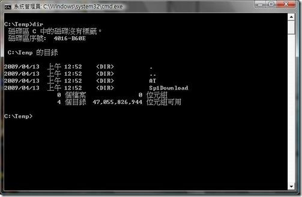](https://dotblogsfile.blob.core.windows.net/user/nethawk/0911/TeamFoundation2008SP1_14EA6/149f14e2d7ea5d_2.jpg)

3) 開啟[命令提示字元]視窗   
    C:\>cd temp\Sp1Download   
    C:\Temp\Sp1Download>TFS90SP1-KB949786-CHT /extract:C:\Temp\Sp1Extract   
   執行後會在C:\Temp之下產生一個Sp1Extract的資料夾。

[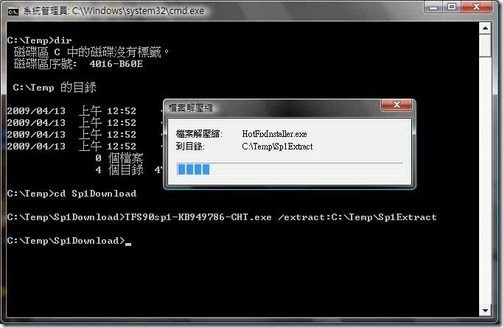](https://dotblogsfile.blob.core.windows.net/user/nethawk/0911/TeamFoundation2008SP1_14EA6/2_2.jpg)

[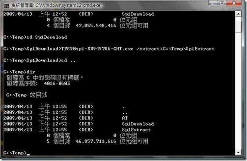](https://dotblogsfile.blob.core.windows.net/user/nethawk/0911/TeamFoundation2008SP1_14EA6/3_2.jpg)

4) 產生要合併SP1與DVD檔案的資料夾   
   C:\Temp>msiexec /a C:\Temp\AT\vs\_setup.msi /p C:\Temp\Sp1Extract\TFS90sp1-KB949786.msp TARGETDIR=C:\Temp\MergeFolder   
   執行在C:\Temp之下產生一個**MergeFolder**的資料夾﹐這個就是後面我們實際要拿來安裝的SP1檔案。

[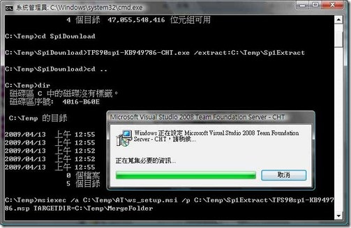](https://dotblogsfile.blob.core.windows.net/user/nethawk/0911/TeamFoundation2008SP1_14EA6/4_2.jpg)

**安裝作業需要的帳戶**   
在安裝TFS之前需要先建立好一些必要的帳戶﹐這些都可以從安裝指引中找到。

|  |  |
| --- | --- |
| 使用者登入名稱 | 用途 |
| **TFSSETUP** |  |
- 用於安裝 Team Foundation Server。   
  **這個帳戶必須是 Team Foundation Server 電腦的系統管理員**。這個帳戶與下列兩個帳戶必須是相同網域的成員。例如，您不能在某個網域上擁有這兩個帳戶，但卻使用本機帳戶安裝 Team Foundation Server。
- 如果安裝的是 Team Foundation Server Workgroup Edition，這個帳戶會加入至 [Team Foundation Licensed Users] 群組，而這個群組包含的使用者最多不能超過五個。因此，您應該使用自己的使用者帳戶安裝 Team Foundation Server。

  [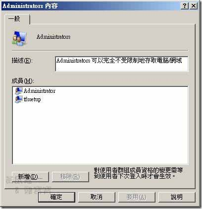](https://dotblogsfile.blob.core.windows.net/user/nethawk/0911/TeamFoundation2008SP1_14EA6/5_2.jpg)
| **TFSSERVICE** | * 供 Windows 服務用來做為 Team Foundation Server 的服務帳戶。 * 做為 Microsoft Team Foundation Server 應用程式集區的識別 (Identity)。 * **必須具有 [以服務方式登入] 使用權限**。 為達最佳安全性，這個服務帳戶：   + 不能是執行 Team Foundation Server 元件之伺服器的系統管理員。   + 應選取網域上 Active Directory 的 [這是機密帳戶，無法委派] 核取方塊。  如需此帳戶的詳細資訊，請參閱指定 Team Foundation 的服務帳戶。  [6](https://dotblogsfile.blob.core.windows.net/user/nethawk/0911/TeamFoundation2008SP1_14EA6/6_2.jpg)  [7](https://dotblogsfile.blob.core.windows.net/user/nethawk/0911/TeamFoundation2008SP1_14EA6/7_2.jpg) |
| **WSSSERVICE** | * 提供 SharePoint 管理中心應用程式集區的識別。 * 做為 Windows SharePoint Services Timer 服務的服務帳戶。  如需此帳戶的詳細資訊，請參閱指定 SharePoint 產品和技術的服務帳戶。 |
| **TFSREPORTS** | * 供 SQL Server Reporting Services 用來做為資料來源的帳戶。 * **必須具有[允許本機登入] 使用權限**。 這個帳戶不能擁有執行 Team Foundation Server 元件之伺服器上的系統管理權限。  您可以使用用於 TFSSERVICE 的帳戶做為 TFSREPORTS 的帳戶。這兩個帳戶可以是不同的帳戶。  如需此帳戶的詳細資訊，請參閱指定 SQL Server Reporting Services 的服務帳戶。  [8](https://dotblogsfile.blob.core.windows.net/user/nethawk/0911/TeamFoundation2008SP1_14EA6/8_2.jpg) |
| **TFSPROXY** |  |
- 供 Team Foundation Server Proxy 用來做為服務帳戶。
- 在 Proxy 所要存取的每一部應用程式層伺服器上，您必須建立 Team Foundation Server 的伺服器層級群組，然後再將此帳戶加入至該群組。執行這個步驟，即可讓遠端 Proxy 存取及快取原始檔控制檔案。

**安裝作業需要的通訊埠**

  
**SQL Server 必要的通訊埠**

| 伺服器或應用程式內容 | TCP 通訊埠 |
| --- | --- |
| SQL Service | 14331 |
| SQL Browser Service | 1434 |
| SQL Monitoring | 1444 |
| SQL Server Analysis Service Redirector | 2382 |
| SQL Server Analysis Service | 2383 |
| SQL Server Reporting Service | 80 |

**SharePoint必要通訊埠**   

| 伺服器或應用程式內容 | TCP 通訊埠 |
| --- | --- |
| 預設網站 | 80 |
| SharePoint 管理中心 | 17012 |

**Team Foundation Server 的必要通訊埠**   

| 伺服器或應用程式內容 | TCP 通訊埠 |
| --- | --- |
| Team Foundation Server | 8080 |
| Team Foundation Server Proxy | 8081 |
| Team Foundation Build 遠端處理 | 9191 |

設定Windows 2008的防火牆開通必要的port

[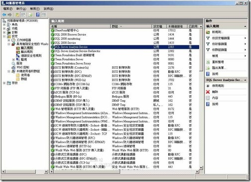](https://dotblogsfile.blob.core.windows.net/user/nethawk/0911/TeamFoundation2008SP1_14EA6/9_2.jpg)

**正式安裝Team Foundation 2008**   
上述的準備工作設定完畢後﹐在正式安裝之前記得要先安裝好SQL Server 2008（安裝過程參考[Microsoft SQL 2008 安裝篇](http://blog.yam.com/nethawk/article/20211745))。 另外因為這次的安裝是使用Team Foundation 2008 SP1﹐這當中已包含了SharePoint 3.0的SP1可以直接在Windows 2008 Server上安裝﹐所以不需先行另外安裝SharePoint 3.0。

在前面的準備事項中一開始我們做了[Team Foundation Server 與 Service Pack 1的整合](http://adminblog.yam.com/fckeditor2008/editor/fckeditor.html?InstanceName=body_text&Toolbar=MyToolbar#Team Foundation Server 與 Service Pack 1的整合)在C:\Temp下產生了一個**MergeFolder**的資料夾﹐一切就從這裏開始﹐執行C:\Temp\MergeFolder\setup.exe。另外﹐若依照Team Foundation的安裝指南﹐應該是使用TFSSETUP這個帳號登入再安裝﹐但我是直接使用administrator﹐反正TFSSETUP也必須是系統管理員的身份﹐所以沒什麼差。

1) 一開始先是歡迎的畫面

[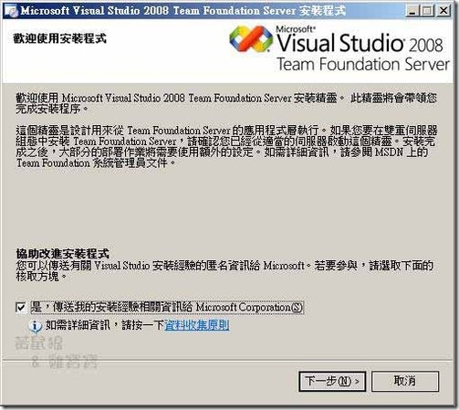](https://dotblogsfile.blob.core.windows.net/user/nethawk/0911/TeamFoundation2008SP1_14EA6/10_2.jpg)

2) 選定要安裝的位置

[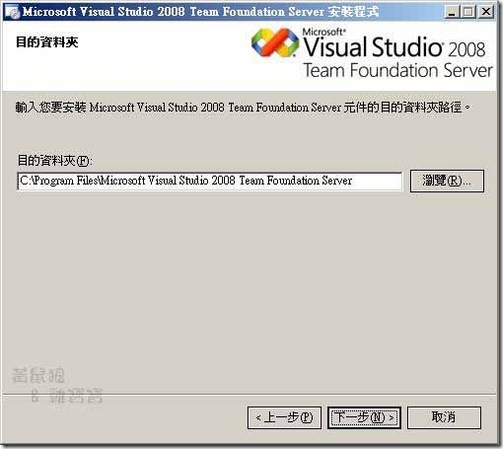](https://dotblogsfile.blob.core.windows.net/user/nethawk/0911/TeamFoundation2008SP1_14EA6/11_2.jpg)

3) 輸入Team Foundation 資料庫伺服器﹐也就是SQL 2008所安裝的位置﹐因為是以單一伺服器的方式安裝﹐所以就直接輸入本機的名稱就是了。畫面中有提示﹐如果有多個Instance則要以指定的格式輸入。

[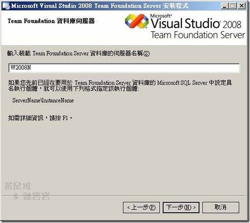](https://dotblogsfile.blob.core.windows.net/user/nethawk/0911/TeamFoundation2008SP1_14EA6/12_2.jpg)

4) 安裝程式檢查系統中是否有造成安裝失敗的因素存在

[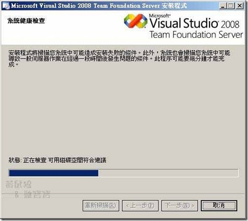](https://dotblogsfile.blob.core.windows.net/user/nethawk/0911/TeamFoundation2008SP1_14EA6/13_2.jpg)

5) 在上述的建康度檢查若不通過﹐畫面上會要你檢視是那裏出了問題﹐可以點選畫面中間的**這裏**來看系統有什麼地方是會影響安裝。

[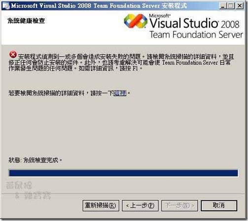](https://dotblogsfile.blob.core.windows.net/user/nethawk/0911/TeamFoundation2008SP1_14EA6/14_2.jpg)

6) 根據所列出的問題﹐一一解決後才能繼續安裝﹐由其是出現紅色叉叉﹐不解決是無法繼續的。

[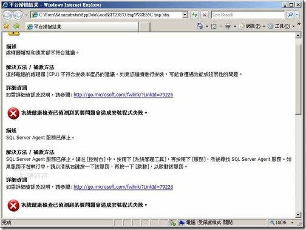](https://dotblogsfile.blob.core.windows.net/user/nethawk/0911/TeamFoundation2008SP1_14EA6/15_2.jpg)

7) 接下來﹐是指定Team Foundation Server的服務帳戶﹐畫面上點選**指定帳戶**﹐並在帳戶名稱中輸入先前所建立的TFSSERVICE這個帳戶。

[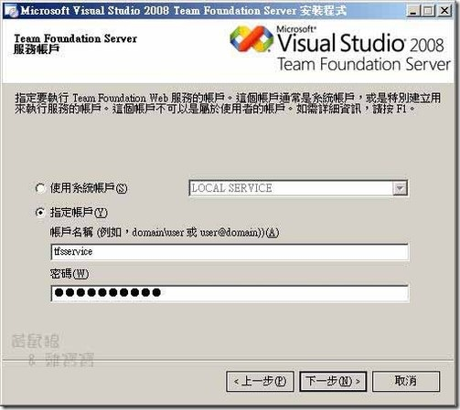](https://dotblogsfile.blob.core.windows.net/user/nethawk/0911/TeamFoundation2008SP1_14EA6/16_2.jpg)

8) 指定Reporting Services資料來源帳戶

[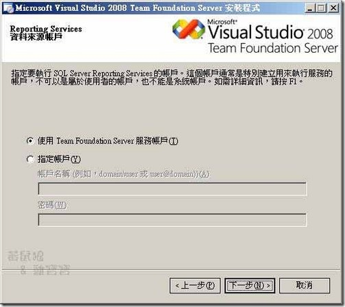](https://dotblogsfile.blob.core.windows.net/user/nethawk/0911/TeamFoundation2008SP1_14EA6/17_2.jpg)

9) Windows SharePoint Services﹐之前如果有在Widows 2008 Server上安裝Team Foundation 2008﹐是看不到這個畫面﹐這是在前面說過﹐之前的Team Foundation版本內含的是SharePoint 3.0﹐這是沒辦法在Win 2008 Server上安裝﹐而Team Foundation SP1 所含的是SharePoint 3.0 sp1﹐因此在這裏就允許直接在安裝Team Foundation過程中一起安裝SharePoint了。

[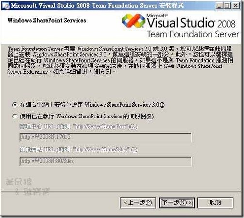](https://dotblogsfile.blob.core.windows.net/user/nethawk/0911/TeamFoundation2008SP1_14EA6/18_2.jpg)

10) Windows SharePoint Services 服務帳戶﹐這是定要以那個帳戶來啟動SharePoint﹐可以使用先前預先建立的WSSSERVICE。

[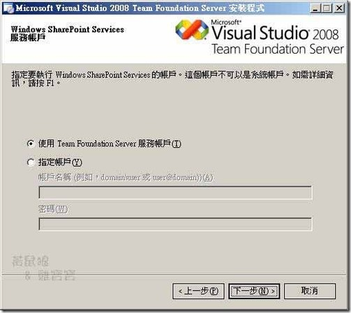](https://dotblogsfile.blob.core.windows.net/user/nethawk/0911/TeamFoundation2008SP1_14EA6/19_2.jpg)

11) 指定警示設定

[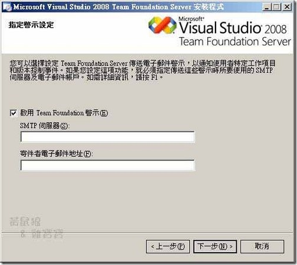](https://dotblogsfile.blob.core.windows.net/user/nethawk/0911/TeamFoundation2008SP1_14EA6/20_2.jpg)

12) 已完成安裝準備工作

[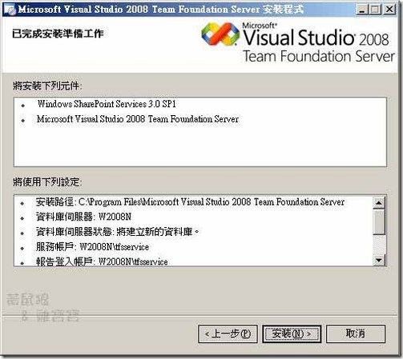](https://dotblogsfile.blob.core.windows.net/user/nethawk/0911/TeamFoundation2008SP1_14EA6/21_2.jpg)

13) 安裝中

[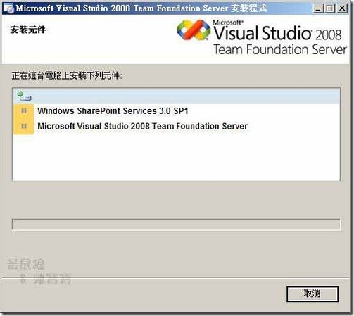](https://dotblogsfile.blob.core.windows.net/user/nethawk/0911/TeamFoundation2008SP1_14EA6/22_2.jpg)

14) 安裝完成

[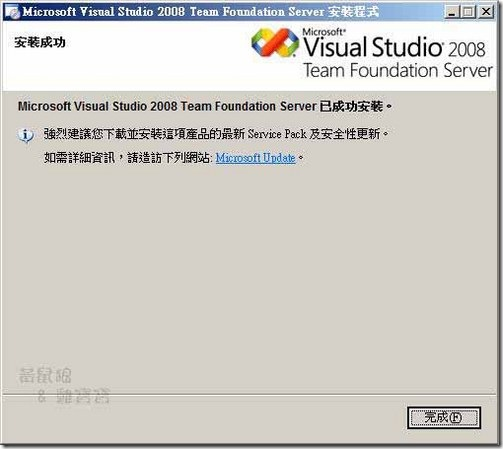](https://dotblogsfile.blob.core.windows.net/user/nethawk/0911/TeamFoundation2008SP1_14EA6/23_2.jpg)

到這兒初步的Team Foundation Server算是安裝完成了﹐但這樣就能用了嗎？當然不是。Team Foundation 可是還結合了 SharePoint 和 Reporting Service﹐如何才能真正的使用﹐下一篇再來寫。
