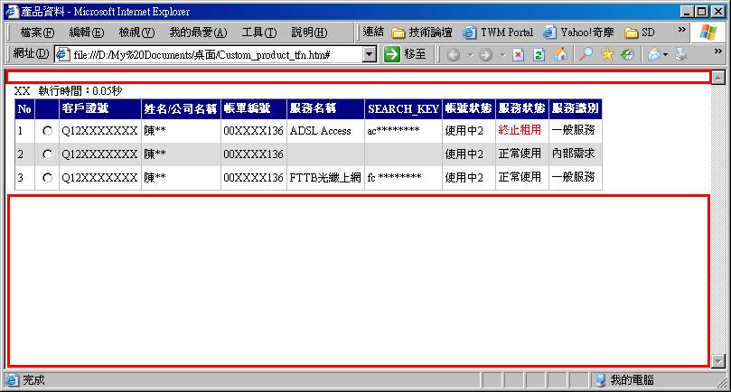

最近工作上User提出了要在頁面上有防止右鍵選單的功能。我不是很想做這個﹐  
因為這是防君子不防小人﹐網路上一堆教人如何破解的文章﹐感覺做了就是白努力定律。  
不過User最大﹐由其前幾個月某個有力的User太閒沒事幹﹐跑去跟老大唉﹐唉說IT都不配  
合﹐IT給的系統難用...﹐間接的就這樣我受了無妄之災﹐如今上班的地點由15分鐘變成  
了50分鐘。

好﹐上面一堆廢話不重要﹐重點是為了這個右鍵功能﹐實際做了之後﹐衍生發現一些問題  
但網路上沒有找到資料﹐就自己整理一下。

一開始這個防右鍵的功能最簡單的寫法﹐應該就是直接在body標籤中加入oncontextmenu="return false"。  
當我這麼做之後﹐正洋洋得意這麼簡單的需求真容易應付時﹐突然發現一件事﹐當一個頁面的資料太少時﹐  
在圖中紅色框的位置竟然沒有鎖到右鍵的功能。  
使用<body oncontextmenu="return false">  
  
  
  
研究了許久發現問題在於DOCTYPE。我的程式是以VS 2005開發﹐VS default所帶的DOCTYPE是如下  
<!DOCTYPE html PUBLIC "-//W3C//DTD XHTML 1.0 Transitional//EN" "[http://www.w3.org/TR/xhtml1/DTD/xhtml1-transitional.dtd](<http://www.w3.org/TR/xhtml1/DTD/xhtml1-transitional.dtd>)">  
若把DOCTYPE移除﹐或者改為  
<!DOCTYPE HTML PUBLIC "-//W3C//DTD HTML 4.01 Transitional//EN">  
這樣就不會發生上述的事情。

不過﹐網路上為什麼我沒遇到這樣的狀況呢？經過一陣子的嘗試﹐發現就是不要直接在body上寫這個功能﹐  
而是要寫在javascript或css之中。  
**1.CSS**  
寫在css之中﹐只要被引用這個css就有防右鍵的功能﹐很方便

1 

  
用CSS Expression很方便﹐可以對CSS做很多的擴充﹐是一項很好的功能﹐可惜....不應該用這個功能。  
第一﹐這不是標準的W3C規格﹐只能用於IE  
第二﹐CSS Expression很耗資源﹐頁面的滾動﹑滑鼠的移動﹑頁面放大﹑縮小...﹐都會做頁面的更新。  
第三﹐微軟已經宣佈IE8的標準模式已經不再支援這個功能。

**2.Javascript**  
使用Javascript的寫法應該算是最好的方式了﹐如下  

1 