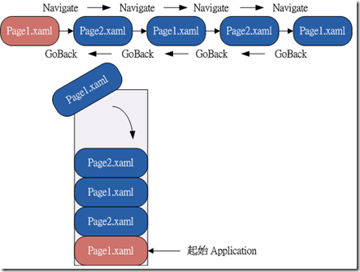
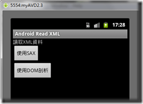

在現代技術中不論使用何種語言﹐解析XML文件資料已是很常見的方法﹐XML比起過去的INI格式更有彈性更能描述豐富的資料﹐且做為一種共同性的文件格式更能讓大家有同樣的規範遵詢﹐不會因為獨樹一格的格式使得使用技巧變得多樣而複雜。

在 Android 中解析XML的方式有三種DOM﹑SAX及PULL﹐這些使用的差異性在網路上已有多篇文章介紹﹐範例也有許多。然而凡事總要自己親自嘗試過才能知其中的奧妙。因此自己自訂了一個XML格式分別使用DOM及SAX方式來讀取做相同的事﹐親自感受當中有何不同。

**__XML檔(Books.xml)__**

```xml
<?xml version="1.0" encoding="UTF-8"?>
<books>
	<book id="P631" name="Android 2.X 應用程式開發實戰" publishers="碁峯" price="580">
		<auther name="林城"/>
	</book>
	<book id="P697" name="深入淺出 Android 遊戲程式開發範例大全" publishers="博碩文化" price="620">
		<auther name="吳亞峰"/>
		<auther name="蘇亞光"/>
	</book> 
	<book id="XP6037" name="Silverlight 4 商業級應用程式開發" publishers="悅知文化" price="590">
		<auther name="Frank LaVigne. Cameron Albert"/>
	</book>
</books>
```

將Books.xml 這個檔案放在 src 之下﹐如下圖所示

[](<https://dotblogsfile.blob.core.windows.net/user/nethawk/1105/8c010a33c027_E81D/xml_point_6.png>)

**__主畫面 Layout(main.xml)__**

```xml
<?xml version="1.0" encoding="utf-8"?>
<LinearLayout xmlns:android="http://schemas.android.com/apk/res/android"
    android:orientation="vertical"
    android:layout_width="fill_parent"
    android:layout_height="fill_parent"
    >
	<TextView  
    	android:layout_width="fill_parent" 
    	android:layout_height="wrap_content" 
    	android:text="讀取XML資料"/>
	<Button android:layout_width="wrap_content" 
		android:layout_height="wrap_content" 
		android:text="使用SAX" 
		android:id="@+id/saxbtn"/>
	<Button android:layout_width="wrap_content" 
		android:layout_height="wrap_content" 
		android:text="使用DOM剖析" 
		android:id="@+id/dombtn"/>
</LinearLayout>
```

主畫面很簡單就只有兩個Button﹐分別表示將使用SAX方式與DOM方式來解析XML資料檔。

[](<https://dotblogsfile.blob.core.windows.net/user/nethawk/1105/8c010a33c027_E81D/mail_layout2_2.png>)

接下來將分別使用SAX與DOM的方式讀取Books.xml然後以ListView元件呈現資料﹐而這裏要做的是用不同的技術分別呈現﹐使用的Layout都一樣﹐這裏會建立一個主要呈現的Layout檔booklist.xml

**__booklist.xml__**

```xml
<?xml version="1.0" encoding="utf-8"?>
<LinearLayout
  xmlns:android="http://schemas.android.com/apk/res/android"
  android:layout_width="match_parent"
  android:layout_height="match_parent" android:orientation="vertical">
    <TextView android:id="@+id/list_title" 
    	android:layout_width="wrap_content" 
    	android:layout_height="wrap_content" 
    	android:text="書籍列表" 
    	android:layout_gravity="center"/>
    <ListView android:id="@+id/bookListView" 
    	android:layout_width="fill_parent" 
    	android:layout_height="fill_parent"/>
</LinearLayout>

```

這個layout很簡單﹐只有一個TextView當Title﹐還有一個ListView﹐這個ListView就是要用來顯示解析Books.xml的資料。為了這個ListView﹐需要再建一個layout檔book_data.xml﹐這個book_data.xml用來表示在ListView中的每一筆資料呈現方式。

__**book_data.xml**__

```xml
<?xml version="1.0" encoding="utf-8"?>
<LinearLayout
  xmlns:android="http://schemas.android.com/apk/res/android"
  android:layout_height="match_parent" 
  android:orientation="vertical" 
  android:layout_width="fill_parent">
    <LinearLayout android:id="@+id/linearLayout1" 
    	android:orientation="horizontal" 
    	android:layout_height="wrap_content" 
    	android:layout_width="fill_parent">
        <TextView android:text="TextView" 
        	android:layout_width="wrap_content" 
        	android:layout_height="wrap_content" 
        	android:id="@+id/bookNameTxt" 
        	android:textColor="@color/yellow"/>
    </LinearLayout>
    <LinearLayout android:id="@+id/linearLayout2" 
    	android:orientation="horizontal" 
    	android:layout_height="wrap_content" 
    	android:layout_width="fill_parent">
        <TextView android:text="TextView" 
        	android:textColor="@color/white" 
        	android:gravity="left" 
        	android:id="@+id/publishersTxt" 
        	android:layout_width="wrap_content" 
        	android:layout_height="wrap_content"></TextView>
        <TextView android:text="TextView" 
        	android:textColor="@color/green" 
        	android:gravity="right" 
        	android:id="@+id/priceTxt" 
        	android:layout_height="wrap_content" 
        	android:layout_width="match_parent"></TextView>
    </LinearLayout>
</LinearLayout>

```

Layout還是以圖形來看比較容易看得懂﹐在book_data.xml的排版中每一筆資料的呈現方式第一列為書名(黃色的TextView)﹐第二列則有出版社(白色的TextView)及價錢(綠色的TextView)。

[](<https://dotblogsfile.blob.core.windows.net/user/nethawk/1105/8c010a33c027_E81D/book_data_layout_2.png>)

根據 Books.xml的資料我們知道至少有id(書籍編號)﹑name(書名)﹑publishers(出版社)﹑price(價錢)...這些屬性值﹐而從我們想要顯示的資料來看至少也要有name(書名)﹑publishers(出版社)﹑price(價錢)這三個欄位﹐我們可以定義一個class檔(Book.java)來表示一本書籍的基本資料。

**__Book.java__**

```java
package com.sample.AndroidUseXML;
public class Book {
	public String id;
	public String name;
	public String publishers;
	public String price;
	
	public Book(){}
	
	public Book(String id, String name, String publishers, String price){
		this.id=id;
		this.name=name;
		this.publishers=publishers;
		this.price=price;
	}
	public String getId() {
		return id;
	}
	public void setId(String id) {
		this.id = id;
	}
	public String getName() {
		return name;
	}
	public void setName(String name) {
		this.name = name;
	}
	public String getPublishers() {
		return publishers;
	}
	public void setPublishers(String publishers) {
		this.publishers = publishers;
	}
	public String getPrice() {
		return price;
	}
	public void setPrice(String price) {
		this.price = price;
	}
	
}

```

在這個專案一開始create的Activity是UseXML﹐這裏就是單純的去觸發兩個button的動作而已。

**__UseXML.java__**

```java
package com.sample.AndroidUseXML;
import android.app.Activity;
import android.content.Intent;
import android.os.Bundle;
import android.view.View;
import android.widget.Button;
public class UseXML extends Activity {
    Button saxbtn;
    Button dombtn;
    String list_title;
    
    @Override
    public void onCreate(Bundle savedInstanceState) {
        super.onCreate(savedInstanceState);
        setContentView(R.layout.main);
        
        findView();
        setListener();
    }
    
    private void findView(){
    	saxbtn=(Button)findViewById(R.id.saxbtn);
    	dombtn=(Button)findViewById(R.id.dombtn);
    }
    
    private void setListener(){
    	saxbtn.setOnClickListener(saxbtnls);
    	dombtn.setOnClickListener(dombtnls);
    }
    
    private Button.OnClickListener saxbtnls=new Button.OnClickListener(){
		@Override
		public void onClick(View arg0) {
			Intent intent=new Intent();
	    	intent.setClass(UseXML.this, UseSaxParse.class);
	    	
	    	//傳遞資料給Activity-------------
	    	Bundle bundle = new Bundle();
	    	list_title="使用SAX解析";
	    	bundle.putString("list_title", list_title);
	    	intent.putExtras(bundle);
	    	
	    	startActivity(intent);
		}
    };
    
    private Button.OnClickListener dombtnls=new Button.OnClickListener(){
		@Override
		public void onClick(View v) {
			Intent intent=new Intent();
	    	intent.setClass(UseXML.this, UseDomParse.class);
	    	
	    	//傳遞資料給Activity-------------
	    	Bundle bundle = new Bundle();
	    	list_title="使用DOM解析";
	    	bundle.putString("list_title", list_title);
	    	intent.putExtras(bundle);
	    	
	    	startActivity(intent);
		}
    };
    
}
```

**DOM篇**

由UseXML中第53行﹐我們知道要使用DOM的方式我們呼叫了UseDomParse的Activity

**__UseDomParse.java__**

```java
package com.sample.AndroidUseXML;
import java.io.InputStream;
import java.util.ArrayList;
import java.util.List;
import android.app.Activity;
import android.os.Bundle;
import android.util.Log;
import android.widget.ListView;
import android.widget.TextView;
public class UseDomParse extends Activity {
	String TAG="UseDomParse";
	TextView list_title;
	ListView bookList;
	
	@Override
	protected void onCreate(Bundle savedInstanceState) {
		super.onCreate(savedInstanceState);
		setContentView(R.layout.booklist);
		
		findView();
		ShowXMLData();		
	}
	
	private void findView(){
		list_title=(TextView)findViewById(R.id.list_title);
		bookList=(ListView)findViewById(R.id.bookListView);
	}
	
	private void ShowXMLData(){
		Bundle bundle=this.getIntent().getExtras();
		list_title.setText("書籍列表("+bundle.getString("list_title")+")");
		
		List<Book> books=new ArrayList<Book>();
		books=getXMLData();
		
		bookList.setAdapter(new BookAdapter(this,books));
	}
	private List<Book> getXMLData() {
		List<Book> books = new ArrayList<Book>();
		try {
			InputStream inStream = UseDomParse.class.getClassLoader()
					.getResourceAsStream("Books.xml");  //讀取檔案
//			InputStream inStream = UseDomParse.class.getClassLoader()
//			.getResourceAsStream("com/sample/AndroidUseXML/Books2.xml");  //讀取檔案
			
			books = DomParseXML.ReadBookXML(inStream);
		} catch (Exception er) {
			Log.e(TAG, er.getMessage());
		}
		return books;
	}
}

```

第21行指明了要用booklist.xml的layout。

第32行的ShowXMLData()是用來顯示資料。

第37行的books=getXMLData();是用來取得以DOM解析資料後得到的List物件。

第39行的bookList這一個ListView將使用自定的DataAdapter做為資料來源。

第45行的位置是讀取檔案﹐因為檔案是直接放在src之下。如果檔案是放在com.sample.AndroidUseXML之下﹐那麼就必須加上路徑﹐如48行。

在第48行books = DomParseXML.ReadBookXML(inStream); 這裏是我們主要用DOM去解析方法。

**__DomParseXML.java__**

```java
package com.sample.AndroidUseXML;
import java.io.InputStream;
import java.util.ArrayList;
import java.util.List;
import javax.xml.parsers.DocumentBuilder;
import javax.xml.parsers.DocumentBuilderFactory;
import org.w3c.dom.Document;
import org.w3c.dom.Element;
import org.w3c.dom.NodeList;
/**
 * 使用Dom讀取Books.xml的資料
 * @author Kevin Chen
 *InputStream可以是網路也可以是文件
 */
public class DomParseXML {
	public static List<Book> ReadBookXML(InputStream inStream) throws Exception{
		List<Book> books=new ArrayList<Book>();
		DocumentBuilderFactory factory=DocumentBuilderFactory.newInstance();
		DocumentBuilder builder=factory.newDocumentBuilder();
		Document document=builder.parse(inStream);  //以樹狀格式存於記憶體中﹐比較耗記憶體
		Element root=document.getDocumentElement();
		NodeList nodes=root.getElementsByTagName("book");
		
		for(int i=0;i<nodes.getLength();i++){
			Element bookElement=(Element)nodes.item(i);
			Book book=new Book();
			book.setId(bookElement.getAttribute("id"));
			book.setName(bookElement.getAttribute("name"));
			book.setPublishers(bookElement.getAttribute("publishers"));
			book.setPrice(bookElement.getAttribute("price"));
			
			books.add(book);
		}
		
		return books;
	}
}

```

**__BookAdapter.java__**

```java
package com.sample.AndroidUseXML;
import java.util.List;
import android.content.Context;
import android.view.LayoutInflater;
import android.view.View;
import android.view.ViewGroup;
import android.widget.BaseAdapter;
import android.widget.TextView;
public class BookAdapter extends BaseAdapter {
	private LayoutInflater inflater;
	List<Book> books=null;
	
	public BookAdapter(Context context,List<Book> books){
		inflater=LayoutInflater.from(context);
		this.books=books;
	}
	@Override
	public int getCount() {
		return books.size();
	}
	@Override
	public Object getItem(int arg0) {
		return arg0;
	}
	@Override
	public long getItemId(int arg0) {
		return arg0;
	}
	@Override
	public View getView(int arg0, View arg1, ViewGroup arg2) {
		ViewHolder viewHolder;
		if(arg1==null){
			arg1=inflater.inflate(R.layout.book_data, null);
			viewHolder=new ViewHolder();
			viewHolder.bookNameTxt=(TextView)arg1.findViewById(R.id.bookNameTxt);
			viewHolder.publishersTxt=(TextView)arg1.findViewById(R.id.publishersTxt);
			viewHolder.priceTxt=(TextView)arg1.findViewById(R.id.priceTxt);
			arg1.setTag(viewHolder);
		}else{
			viewHolder=(ViewHolder)arg1.getTag();
		}
//		String name1="";
//		String publ1="";
//		String price1="";
//		name1=books.get(arg0).name;
//		publ1=books.get(arg0).publishers;
//		price1=books.get(arg0).price;
		
		viewHolder.bookNameTxt.setText(books.get(arg0).name);
		viewHolder.publishersTxt.setText(books.get(arg0).publishers);
		viewHolder.priceTxt.setText("NT."+books.get(arg0).price+" 元");
		
		return arg1;
	}
	
	private class ViewHolder{
		TextView bookNameTxt;
		TextView publishersTxt;
		TextView priceTxt;
	}
}

```

SAX篇

以DOM的方式﹐可以看得出寫的程式並不多﹐如果改以SAX就不大一樣了。

由UseXML中第37行﹐我們知道要使用SAX的方式我們呼叫了UseSaxParse的Activity。

**__UseSaxParse.java__**

```java
package com.sample.AndroidUseXML;
import java.io.InputStream;
import java.util.ArrayList;
import java.util.List;
import android.app.Activity;
import android.os.Bundle;
import android.util.Log;
import android.widget.ListView;
import android.widget.TextView;
public class UseSaxParse extends Activity {
	String TAG="UseSAX";
	TextView list_title;
	ListView bookList;
	
	@Override
	protected void onCreate(Bundle savedInstanceState) {
		super.onCreate(savedInstanceState);
		setContentView(R.layout.booklist);
		
		findView();
		ShowXMLData();
	}
	private void findView(){
		list_title=(TextView)findViewById(R.id.list_title);
		bookList=(ListView)findViewById(R.id.bookListView);
	}
	
	private void ShowXMLData(){
		Bundle bundle=this.getIntent().getExtras();
		list_title.setText("書籍列表("+bundle.getString("list_title")+")");
		
		List<Book> books=new ArrayList<Book>();
		books=getXMLData();
		
		bookList.setAdapter(new BookAdapter(this,books));
	}
	
	private List<Book> getXMLData(){
		List<Book> books=new ArrayList<Book>();
		try{
			InputStream inStream=UseSaxParse.class.getClassLoader().getResourceAsStream("Books.xml");
			books = SAXParseXML.readXML(inStream);
		}catch(Exception er){
			Log.e(TAG, er.getMessage());
		}
		
		return books;
	}
}

```

第46行的SAXParseXML

**__SAXParseXML.java__**

```java
package com.sample.AndroidUseXML;
import java.io.InputStream;
import java.util.List;
import javax.xml.parsers.SAXParser;
import javax.xml.parsers.SAXParserFactory;
public class SAXParseXML {
	public static List<Book> readXML(InputStream inStream) throws Exception{
		SAXParserFactory factory=SAXParserFactory.newInstance();
		SAXParser saxParse=factory.newSAXParser();  //建立解析器
		
		SAXContentHandler handler=new SAXContentHandler();
		saxParse.parse(inStream, handler);
		inStream.close();
		
		return handler.getBooks();
	}
}

```

第14行的SAXContentHandler是關鍵﹐必須建立一個class繼承自DefaultHandler﹐並且在這當中去實作以下以個方法

startDocument()

characters(char[] ch, int start, int length)

startElement(String uri, String localName, String qName, Attributes attributes)

public void endElement(String uri, String localName, String qName)

**__SAXContentHandler.java__**

```java
package com.sample.AndroidUseXML;
import java.util.ArrayList;
import java.util.List;
import org.xml.sax.Attributes;
import org.xml.sax.SAXException;
import org.xml.sax.helpers.DefaultHandler;
public class SAXContentHandler extends DefaultHandler {
	private List<Book> books;
	private Book book;
	private String preTag;
	
	public List<Book> getBooks(){
		return books;
	}
	/**
	 * 接收文件的開始
	 */
	@Override
	public void startDocument() throws SAXException {
		books = new ArrayList<Book>();
	}
	/**
	 * 接收字元資料的通知
	 */
	@Override
	public void characters(char[] ch, int start, int length)
			throws SAXException {
	}
	/**
	 * 接收元素開始的通知
	 */
	@Override
	public void startElement(String uri, String localName, String qName,
			Attributes attributes) throws SAXException {
		if("book".equals(localName)){
			book=new Book();
			book.setId(attributes.getValue("","id"));
			book.setName(attributes.getValue("", "name"));
			book.setPublishers(attributes.getValue("publishers"));
			book.setPrice(attributes.getValue("price"));
		}
		preTag=localName;
	}
	/**
	 * 接收元素結尾的通知
	 */
	@Override
	public void endElement(String uri, String localName, String qName)
			throws SAXException {
		if("book".equals(localName) && book!=null){
			books.add(book);
			book=null;
		}
		preTag=null;
	}
	
	
}

```

實際的執行結果

[](<https://dotblogsfile.blob.core.windows.net/user/nethawk/1105/8c010a33c027_E81D/result_2.png>)