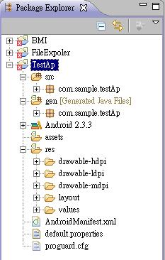
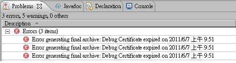
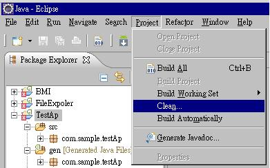

在研究Android一段時間之後﹐在Eclipse的開發環境上碰到了兩個問題
  
Android requires compiler compliance level 5.0. Please fix project properties.
  
Error generating final archive: Debug Certificate expired on....
  
這兩個問題非關技術﹐但未來可能會再遇上﹐避免自己忘了﹐就此做個記錄。

前幾個星期開啟Eclipse(3.5)後幾個之前的測試專案﹐在Package Explorer 中幾個專案的前面出現了紅色叉叉﹐一開始沒看出是什麼問題﹐以為是Eclipse 3.5的環境被我搞亂了﹐於是想乾脆換Eclipse 3.6 Helios。在家裏的Win 7 上用Eclipse 3.6 玩Android程式也有幾個月了﹐在公司的XP上可能也沒問題吧。

**Android requires compiler compliance level 5.0. Please fix project properties.**

弄了一陣子﹐把Helios版本裝上後也把ADT安裝了﹐滿懷高興的匯入一個先前的專案。但匯入後卻出現了**Android requires compiler compliance level 5.0. Please fix project properties.** 這樣的錯誤。好在這個錯誤在網路上立刻找到了許多解決方法。

主要是Java Compiler被設置為1.5﹐只要改成1.6即可。

這在 **Project  --> Properties --> 左邊選擇Java Compiler**

將右邊 **Compiler compliance level** 改為1.6即可。

**Error generating final archive: Debug Certificate expired on…**

在上述的問題解決後﹐並沒有如預計的可順利執行專案﹐在每個專案的前面都還是出現一個紅色的叉。但檢視專案中的程式碼或資源檔卻沒見到有警告錯誤的地方。這就跟我原本用Eclipse 3.5版時的情況一樣。

仔細的檢查後﹐在Problems視窗中見到了以下的錯誤﹐**Error generating final archive: Debug Certificate expired on 2011/6/7 上午9:51**

在網路上搜尋後找到了原因﹐在Google Android官網中Troubleshooting Tips中有提到﹐造成這一個**原因是debug key已經過期了﹐解決的方法是刪除debug.keystore**。可是官網說的不清不楚﹐還是網友解決的清楚。<http://www.cnblogs.com/yyangblog/archive/2011/01/07/1929657.html>

主要是android要求所有的app必須有簽名﹐否則就不能被安裝。在開發過程中﹐ADT使用debug.keystore這個檔案來做簽名。而這個**檔案的有效期只有一年**﹐所以一年前所寫的程式因為debug.keystore檔案的過期﹐而會驗証失敗導致無法產生apk檔案。這時只要刪除debug.keystore這個檔案就行﹐**系統之後會自動在產生**一個為期一年有效的debug.keystore。

debug.keystore的檔案位置﹐可以由Window --> Preferences --> Android --> Build 下找到。

Default 的位置

On Linux/Mac OSX, the file is stored in `~/.android`.

On Windows XP, the file is stored in `C:\Documents and Settings\<user>\.android`.

On Windows Vista, the file is stored in `C:\Users\<user>\.android`

將路徑下的debug.keystore 及ddms.cfg 刪除即可﹐ 重新開啟Eclipse。  
若重新開啟Eclipse之後仍是見到每個專案前都還是紅色叉叉﹐ 此時可以由功能表的 Project --> Clean 選擇 Clean all projects 即可解決。

