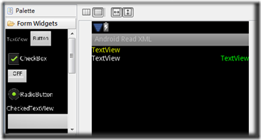
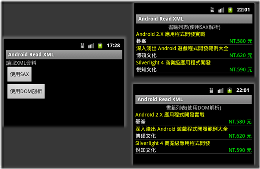
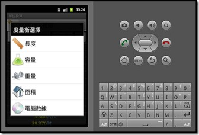
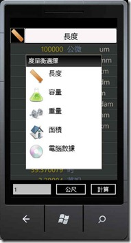
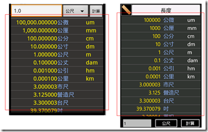
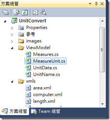
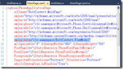
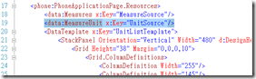
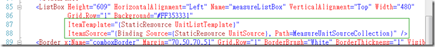

為了實際感受開發 Android 和 Windows Phone 7 有什麼不同的感受﹐兩者各寫了同樣的 App— 單位換算。這個 App 都是以XML格式儲存各度量衡的資料﹐可切換不同的度量衡﹑切換不同的單位做計算﹐兩者撰寫時儘量介面相同。

measures.xml 記載有那一些度量衡﹐長度﹑容量﹑重量...

area.xml﹑computer.xml﹑length.xml﹑measures.xml﹑volumn.xml﹑weight.xml 每一種度量衡對應的單位資料

Android 版畫面 |  Windows Phone 7 版畫面  
---|---  
[](<https://dotblogsfile.blob.core.windows.net/user/nethawk/1109/8b732000d7f6_D866/length_4.jpg>) |  [](<https://dotblogsfile.blob.core.windows.net/user/nethawk/1109/8b732000d7f6_D866/Wp7_1_4.jpg>)  
  
就兩者開發上﹐個人感受上不同之處做一個比較。

**一﹑XML 檔案放置的位置**

在 Android 和 WP7 放置XML 有些不同﹐android中一些資源檔可以放在 res 之下﹐而自定的 XML 資料也可以規劃放在src 之下﹐

[](<https://dotblogsfile.blob.core.windows.net/user/nethawk/1109/8b732000d7f6_D866/android_xml_2.png>)

而在 WP7 放置的檔案﹐還必須設定『建置動作』為『Resource』。

[](<https://dotblogsfile.blob.core.windows.net/user/nethawk/1109/8b732000d7f6_D866/wp7_xml_2.png>)

**二﹑讀取 XML 的方法**

Android 在解析 XML 有DOM﹑SAX及PULL方法﹐Android 可以參考 [Android 解析XML](<http://www.dotblogs.com.tw/nethawk/archive/2011/05/02/24047.aspx>)這一篇﹐在WP7 一樣可以使用DOM的方式﹐另外也可以使用LINQ

```cpp
/// <summary>
/// 由measures.xml讀出資料轉成List﹐做為Measure選單的資料來源
/// </summary>
/// <returns></returns>
public List<Measures> getMeasures() {
    XDocument xd = XDocument.Load("/UnitConvert;component/xmls/measures.xml");  //必須將檔案的"建置動作"設定為"Resource"
    //使用Linq語法解析XML並使用匿名方式建立物件
    var query = from o in xd.Descendants("measures")
                       select new Measures {
                           Name = (string)o.Attribute("name"),
                            Des = (string)o.Attribute("des"),
                            ImageUrl = "../images/" + (string)o.Attribute("name")+".png"
                        };
     MeasuresCollection = query.ToList();
     return MeasuresCollection;
}
```

相比起來在WP7用LINQ簡潔了許多。

**三﹑製作彈跳式選單**

在Android有Spinner元件﹐功能類似Windows AP 上的下拉式選單(ComoBox)﹐在WP7中卻找不到類似的元件。WP7 也不是完全沒有﹐可以下載 [Silverlight for Windows Phone Toolkit](<http://silverlight.codeplex.com/>)﹐安裝後有一組ListPicker元件這可以達到想要的功能﹐只是我不是很喜歡那樣的畫面﹐反而喜歡Android Spinner呈現的方式﹐所以就必須自行手工製作。

**_Android Spinner_**

製作 Spinner﹐在Layout的xml中必須有Spinner元件的描述 <Spinner android:layout_width="wrap_content" android:id="@+id/measureSpinner" android:layout_height="match_parent"></Spinner>﹐

在程式碼中則要宣告一個Spinner元件﹐並透過findViewById將XML中所描述的spinner與程式碼宣告的spinner變數做一個連結﹐之後才能在程式中控制。

```java
private Spinner measureSpinner; // Measure Spinner 控制項
.....
measureSpinner = (Spinner) findViewById(R.id.measureSpinner);
......
//建立MeasureSpinner
MeasureItemAdapter spiAdapter=new MeasureItemAdapter(this, getMeasuresData());  //measureSpinner 資料來源
measureSpinner.setPrompt("度量衡選擇");  //設定點選後選單的Title
measureSpinner.setAdapter(spiAdapter);  //將資料付予measureSpinner 控制項
measureSpinner.setOnItemSelectedListener(measureSpinner_click);
```

[](<https://dotblogsfile.blob.core.windows.net/user/nethawk/1109/8b732000d7f6_D866/measure_2.jpg>)

**_WP7 自製Comobox_**

為了在WP7中有類似的效果﹐主要是使用一個ListBox加上其它的組合﹐先將其隱藏﹐在需要的時候才將於顯示並設定其 ItemsSource﹐另外再設定其SelectionChanged 事件。

```xml
        <Border x:Name="comboxBorder" Margin="70,50,70,51" Grid.Row="1" BorderBrush="White" BorderThickness="1" Visibility="Collapsed">
        	<StackPanel>
        		<StackPanel Height="52">
        			<StackPanel.Background>
        				<LinearGradientBrush EndPoint="0.5,1" MappingMode="RelativeToBoundingBox" StartPoint="0.5,0">
        					<GradientStop Color="Black"/>
        					<GradientStop Color="#FF414040" Offset="1"/>
        				</LinearGradientBrush>
        			</StackPanel.Background>
        			<TextBlock x:Name="comboxTitle" Height="46" Text="度量衡選擇" Foreground="White" FontSize="26.667" Margin="10,5,0,0"/>
        		</StackPanel>
        		<ListBox x:Name="comboxList" Height="456" Background="White" 
                         ItemTemplate="{StaticResource MeasuresTemplate}" 
                         ItemsSource="{Binding Source={StaticResource MeasureSource}, Path=MeasuresCollection.Capacity}" SelectionChanged="comboxList_SelectionChanged" />
        	</StackPanel>
        </Border>
```

這樣子的代碼要純手工去寫簡直是要人命﹐幸好﹐微軟還體貼開發者﹐另外提供了Expression Blend 4 來輔助開發者做 UI 的設計﹐因此﹐自製上算還好﹐不致於太麻煩。

[](<https://dotblogsfile.blob.core.windows.net/user/nethawk/1109/8b732000d7f6_D866/wp7_2_2.jpg>)

**四﹑資料繫結(Data Binding)**

以顯示資料的部分來做比較

[](<https://dotblogsfile.blob.core.windows.net/user/nethawk/1109/8b732000d7f6_D866/ListView_2.png>)

**_Android ListView DataBindign_**

  1. 在Layout 中宣告 <ListView android:id="@+id/measureList" android:layout_height="wrap_content" android:layout_width="match_parent"></ListView>這樣的描述。
  2. 撰寫一個自定的Adapter class  


```java
package com.hawk.UnitConvert;
import java.util.List;
import android.content.Context;
import android.view.LayoutInflater;
import android.view.View;
import android.view.ViewGroup;
import android.widget.BaseAdapter;
import android.widget.TextView;
public class MeasureUnitAdapter extends BaseAdapter {
	private LayoutInflater mInflater;
	private Context context;
	private List<MeasureUnit> unitList=null;
	java.text.DecimalFormat nf = new java.text.DecimalFormat("###,##0.000000");  //設定double值要顯示的格式
	public MeasureUnitAdapter(Context context,List<MeasureUnit> unitList){
		this.context = context;
		this.unitList = unitList;
		mInflater = LayoutInflater.from(context);
	}
.....略
	@Override
	public View getView(int arg0, View arg1, ViewGroup arg2) {
		ViewHolder holder;
		if(arg1==null){
			arg1=mInflater.inflate(R.layout.unit_display, null);
			holder=new ViewHolder();
			holder.unitValue=(TextView)arg1.findViewById(R.id.unitValue);
			holder.unitName=(TextView)arg1.findViewById(R.id.unitName);
			holder.unitSample=(TextView)arg1.findViewById(R.id.unitSample);
			
			arg1.setTag(holder);
		}else{
			holder=(ViewHolder)arg1.getTag();
		}
		
		holder.unitValue.setText(nf.format(unitList.get(arg0).value));
		holder.unitName.setText(unitList.get(arg0).name);
		holder.unitSample.setText(unitList.get(arg0).sample);
		
		return arg1;
	}
	public class ViewHolder{
		public TextView unitValue;
		public TextView unitName;
		public TextView unitSample;
		
	}
}

```

  3. 主程式中  
宣告 private ListView measureList; // 顯示資料的ListView 控制項  
將Adapter 資料指定給ListView  
MeasureUnitAdapter muAdapter = new MeasureUnitAdapter(this, MeasureCalculatorAfterList);  
measureList.setAdapter(muAdapter);


_**WP7 ListBox DataBinding**_

  1. 撰寫Data Model  
[](<https://dotblogsfile.blob.core.windows.net/user/nethawk/1109/8b732000d7f6_D866/ViewModel_2.png>)

  
* 先建立一個ViewModel資料夾。  
* 撰寫讀取資料來源的Class。

  2. 在XAML上描述要引用的資料 

在XML檔 <phone:PhoneApplicationPage/>標籤中新增命名空間** xmlns:data="clr-namespace:UnitConvert.ViewModel"**  
[](<https://dotblogsfile.blob.core.windows.net/user/nethawk/1109/8b732000d7f6_D866/PhoneApplicationPage_2.png>)

  3. 在XAML上建立資源名稱 

在**< phone:PhoneApplicationPage.Resources>**標籤中新增一個資源標籤 **< data:MeasureUnit x:Key="UnitSource"/>**  
[](<https://dotblogsfile.blob.core.windows.net/user/nethawk/1109/8b732000d7f6_D866/MeasureUnit_2.png>)

  4. 建立資料顯示樣版(DataTemplate) 

為了讓資料依需要的格式顯示﹐需要建立一個 DataTemplate ﹐這個Template可以寫在ListBox之中﹐也可以建置在**< phone:PhoneApplicationPage.Resources>**之中。  
如果要讓顯示上更美觀也可以在這個 DataTemplate 上做變化。

```xml
        <DataTemplate x:Key="UnitListTemplate">
        	<StackPanel Orientation="Vertical" Width="480" d:DesignHeight="52">
        		<Grid Height="38" Margin="0,0,0,10">
        			<Grid.ColumnDefinitions>
        				<ColumnDefinition Width="255"/>
        				<ColumnDefinition Width="145"/>
        				<ColumnDefinition Width="80"/>
        			</Grid.ColumnDefinitions>
        			<TextBlock Grid.Column="2" Margin="0" TextWrapping="Wrap" Text="{Binding Sample}" FontSize="32" DataContext="{Binding}" />
        			<TextBlock Grid.Column="1" TextWrapping="Wrap" Text="{Binding Name}" FontSize="32" Foreground="#FF88AFEF"/>
        			<TextBlock Margin="8,0,18,0" TextWrapping="Wrap" Text="{Binding Value}" FontSize="32" TextAlignment="Right" Foreground="#FFFFEA00"/>
        		</Grid>
        		<Path Data="M0,47 L480,47" Fill="#FFF4F4F5" Height="1" Margin="0,0,-1,0" Stretch="Fill" Stroke="#FF909090" UseLayoutRounding="False"/>
        	</StackPanel>
        </DataTemplate>
```

  5. ListBox上設定資料繫結和顯示樣版 

最後將 ListBox 設定資料來源和顯示的樣版﹐就大功告成了。  
[](<https://dotblogsfile.blob.core.windows.net/user/nethawk/1109/8b732000d7f6_D866/MeasureList_2.png>)


整體上的感覺來說﹐Android 的開發比較像一般撰寫AP的感覺﹐對於原本Java AP 就熟悉的人而言應該是很好入手的。而WP7 則應是對於熟悉 Silverlight 或 XNA 的人比較能駕輕就熟﹐對於熟悉 .Net 而過去只開發WinForm 或 Web Form的人而言﹐仍會有個過渡期。再以Android 和 WP7 的開發感受而言﹐目前Android 在網路上的資源較多﹐遇到問題比較好找解決的辦法﹐也比較有人可以回答﹐但開發工具上就沒有微軟提供的那麼好。WP7 現在開發的人不夠多﹐網路資源也相對少﹐遇到問題要找解決比較難﹐但是開發工具的整合很不錯﹐Visual Studio + Expression Blend 算是彌補了 UI 設計上的時間。

兩者開發上各有利弊﹐只能說開發者要上天堂﹐就看誰能猜中未來市場誰就有機會贏。