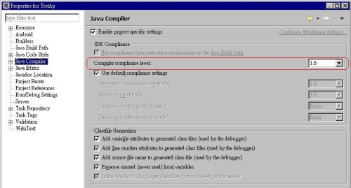

前一陣子上線的一支WinForm 的 Gateway 程式﹐在正式環境執行時出現0x8007000B錯誤﹐在反覆檢查之後發現﹐原因是64位元OS執行了32位元的元件或程式所引發的﹐這個問題在WebForm 也同樣會引發相同的錯誤。

作業系統：Windows 2008 R2 64 位元﹐這裏區分為 IIS 7.x 與 WinFrom 的解決方法。

**一﹑IIS 7.x**

如果ASP.NET有引用到32位元的元件﹐例如所安裝的Oracle client為32位元﹐或者有載入其它第三方元件且為32位元﹐則必須在 IIS 中特別設定。

> 1.要先確定網站的**應用程式集區** 是那一個。

> 2.在IIS中點選應用程式集區﹐選擇要設定的集區 >> 進階設定 >> 啟用32位元應用程式

> 

**二﹑WinForm 程式**

這裏所指的 WinForm 是以 Visual Studio 2005/2008 所開發的程式。 WinForm 程式如果有引用到第三方元件且該元件為 32位元﹐若WinForm程式在32位元OS執行是不會有問題﹐但若在64位元OS執行﹐當程式引用到32位元的元件同樣會有0x8007000B的錯誤。

WinForm程式並沒有像IIS 7.x可以直接做設定﹐其解決的方式是使用Visual Studio開啟該WinForm程式﹐**將平台目標改為****x86****重新****Compiler****即可** 。這裏的平台目標 Default 為 Any CPU﹐若使用 Any CPU 其意義為﹐當程式在64位元OS執行﹐就以64位元模式執行該程式﹐同樣的在32位元OS就會以32位元模式執行﹐這樣讓程式運行有比較好的效能。不過﹐因為所引用的元件是32位元的﹐因此若設定為 Any CPU﹐則在64 bit OS 運行時會強制都使用 64 bit 模式反而出錯了﹐所以要強制告訴 OS﹐這個WinForm不管如何都要以 32位元模式運行。

> 1\. 開啟該專案的屬性頁籤

> [![clip_image002\[10\]](images/002.jpg)](<https://dotblogsfile.blob.core.windows.net/user/nethawk/1110/ef176f19c078_739/clip_image002%5B10%5D.jpg>)

> 2\. 選擇平台目標為**x86** 。

> [![clip_image002\[12\]](images/003.jpg)](<https://dotblogsfile.blob.core.windows.net/user/nethawk/1110/ef176f19c078_739/clip_image002%5B12%5D.jpg>)

> 3\. 重新建置程式。