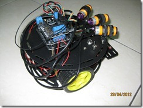

我的新玩具~~

一次偶然的機會在某人的blog上看到使用WP7+Arduino控制電器開關﹐讓我對Arduino有了初步的認識﹐也開始有了興趣。不過﹐隔行如隔山﹐從知道arduino開始﹐還是過了兩年多才終於下定決心買了些套件來研究。想利用arduino來做些什麼？其實還沒有什麼想法﹐但小時候對機器人一直是很喜歡的﹐未來如果有能力的話倒是想自己做個二足機器人。不過現實點﹐還是從基礎開始吧。

最近買了組3PA的小車套件﹐這組套件現在是我的新玩具﹐可以做出避障﹑循跡﹑防跌落的功能﹐另外我還加買了張藍芽模組﹐預計做個android 手機透過藍牙控制小車。

雖然寫了多年的程式﹐而且arduino也有許多的擴展板﹐但這還是牽涉到一些電子的東西﹐一開始雖然依著套件上的範例實作﹐但在避障﹑循跡上卻一直不順利。在多次的測試﹐及網路上善心人士的解說下﹐有些眉角一點一滴的了解﹐漸漸的有些明朗。在避障﹑循跡的功能我還沒能完全掌控好時﹐我卻迫不及待的想來試試藍牙的功能。

最近三個星期以來總算是有了些突破﹐接下來做些筆記﹐也好日後參考。

3PA小車套件﹐是[德源科技](http://twarm.com/commerce/index.php?sid=9aa931febeee0458784e37bec2c4674b)購買的。這組包含了Arduino 328的控制板﹑Xbee傳感器擴展板V5﹑L293 Motor Shield....對我而言應該夠了吧(其實我也不知道總共該買那些東西﹐只是四處比較後﹐覺得這組應該是適合我吧。)

這張Bluetooth Bee V2 功能還不錯﹐具有主從模式﹐可以透過AT指令來修改﹐只是一開始不熟悉的情況下﹐差點被搞死~~~
