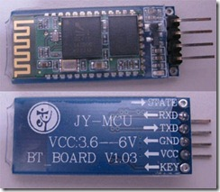
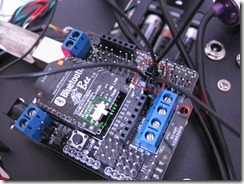
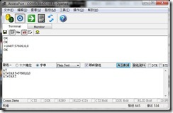

用 Android 手機透過藍牙與 Arduino 溝通

之前曾在YouTuBe上看過影片﹐有人用android手機搖控小車﹐因此也一直在找這方面的資料﹐直到有次看到[[Arduino]\_用Android手機經Bluetooth遙控Arduino小車](http://thkaw.pixnet.net/blog/post/85537018-%5Barduino%5D_%E7%94%A8android%E6%89%8B%E6%A9%9F%E7%B6%93bluetooth%E9%81%99%E6%8E%A7arduino%E5%B0%8F%E8%BB%8A(20) 這篇文章﹐才知道原來早就有sample可用。透過[MULTI COLOR LAMP USING AMARINO, ANDROID AND ARDUINO](http://www.buildcircuit.com/multi-color-lamp-using-amarino-android-and-arduino/)這個範例﹐可以輕鬆的做到用Android和Arduino透過bluetooth來溝通。雖是如此我還是碰到了一些障礙﹐幸好網路上總是有高手可以幫忙。

在 [MULTI COLOR LAMP USING AMARINO, ANDROID AND ARDUINO](http://www.buildcircuit.com/multi-color-lamp-using-amarino-android-and-arduino/) 這篇文章已經很詳細的說明了整個步驟與所需要的軟體﹐或者也可以參考 [Cooper](http://coopermaa2nd.blogspot.tw/2012_06_01_archive.html) 的文章中文的比較容易了解。

上述的文章都已有做法了﹐不再累述﹐在這僅整理我所遇到的問題。

**1. Android App程式 Multicolor Lamp**

Multicolor Lamp App 將透過藍牙控制連接在Arduino上的三個燈號改變亮度。 Multicolor Lamp 不需要改變任何程式碼﹐唯一要改的是bluetooth 的 MAC address﹐上述的網站都有詳細的描述。編譯好程式後就可以將apk程式放到手機上執行即可。不過﹐我在這裏卡關了一陣子。這個App程式在我的桌機上以模擬器執行每次都異常終止﹐我想可能是桌機沒有藍芽設備的關係﹐每次都是在onCreate中的Amarino.connect(this, DEVICE\_ADDRESS); 死掉﹐而把App放到手機上﹐還是一樣一執行就出現異常終止。

後來在Eclipse上執行直接選擇以實機做連接不透過模擬器﹐竟然成功的執行一次﹐但之後就又不行。之後我改使用一台NB﹐剛開始的情況和桌機相同﹐但以NB和手機做實機連線執行﹐倒是每次都可以。然後在不知什麼原因之下﹐在NB上用模擬器執行Multicolor Lamp也可以了。網路上沒找到有人跟我相同的狀況。

桌機和NB主要的不同﹐桌機OS是Win7 x64 ﹐NB OS是Win7 x86﹐另一個是Eclipse同樣是x64與x86的不同﹐猜測在程式中引用的AmarinoLibrary\_v0\_55.jar 可能在64位元之下比較不相同吧﹐這是純猜測還沒深究。

**2.Baud rate的設定**

我所使用的Bluetooth模組是XBee型式﹐網路上的範例都不是使用這種﹐這點又讓我卡了很久。但﹐不管用那一種﹐正確的設定baud rate都是必須的。因為原本的Bluetooth Bee v2一直搞不定﹐看到網路上另一個模組不到三百元﹐所以又買了另一張

不論使用那一種﹐都必須先設定好 baud rate﹐以此例而言﹐設定為57600是比較適合的﹐設定的方式可以參考 [Motoduino 上修改藍芽模組Baud Rate](http://sinocgtchen.blogspot.tw/2011/12/motoduino-baud-rate.html) ﹐其中腳位的接法

|  |  |  |
| --- | --- | --- |
| Bluetooth |  | Arduino |
| TX | - | RX |
| RX | - | TX |
| GND | - | GND |
| VCC | - | 3.3V |

使用上述文章中的方式就可以修改baud rate 了。

而我原本使用的Bluetooth Bee V2 一張可要近千元﹐怎麼可以棄而不用呢？如果要修改根據手冊是要搭配一張XBee USB Adapter ﹐不過這又要花錢﹐ 幸好sinocgt 的文章幫了大忙 [DFRduino (Arduino): changes the baud rate of Bluetooth Bee v2 on the IO Expansion Shield V5](http://sinocgtchen.blogspot.tw/2011/05/dfrduino-arduino-changes-baud-rate-of.html) 省了一筆錢又有DIY的精神。

1.拔除ATMEGA328 IC。

2.擴展板V5 上的 RS232/RS385 Jump 拔起﹐並用杜邦線跳線﹐如圖上紅色框處。

3.將Bluetooth Bee V2 的switch 撥到 AT mode 並插到擴展板上﹐如圖上綠色框處。

4.將USB 接到Arduino上。

5.在電腦上執行SSCOM3.2或AccessPort之類的軟體。(SSCOM3.2蠻多人用的﹐但在我的電腦執行後所有的文字都是亂碼﹐所以改用AccessPort)

6.在AccessPort 上加AT指令。以此張Bluetooth bee v2 所要下的指令為 AT+UART=57600,0,0

   執行了AccessPort﹐第一件事先設定使用的COM Port是那一個。

   先下AT﹐正確的話會回應 OK

   然後再下AT+UART=57600,0,0

   送出後﹐正確的話會回應 OK

    這時可以下 AT+UART﹐如果回應是 +UART:57600,0,0 那麼就代表已經修改好了。

到此﹐Bluetooth 的baud rate 都已修改好﹐接下來就是將sketch的程式和 Led 燈接上就差不多了﹐下一篇再說了。
