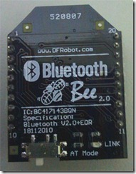

在上一篇已經準備好了 Android App 程式(MultiColor Lamp)﹐並且把 Bluetooth 模組的 Baud rate 也設置好了﹐接下來我們要把各項組合起來﹐這裏我使用的 bluetooth 模組是用 XBee 型式的。

在開始之前要先把 sketch 程式寫到 arduino ATmega 328 中(sketch 在所下載的 [MultiColorLamp.zip](<http://code.google.com/p/amarino/downloads/detail?name=MultiColorLamp.zip&can=2&q=>) 之中)﹐在寫入之前最好將arduino 板子上的東西都先移除﹐才不會出現干擾。

接下來就要開始將必要的線路全部接上

由上圖﹐在麵包板上插上三個 Led 燈﹐紅﹑綠﹑黃﹐並分別將三個 Led的正極接腳接到Xbee 傳感器擴展板V5的 9,10,11 腳位﹐負極則接到 GND 的位置﹐這樣就一切就緒了。

現在一切都俱備﹐只要將 Arduino 接上USB就可以了﹐在影片上可以看到當 arduino 接上USB 之後﹐過一會三個燈會全部亮起來﹐這是因為在 sketch 中 setup() 時把腳位都設為 HIGH﹐所以一開始三顆燈都亮了。而在手機的藍牙連線上後可能會全部熄滅(因為在 Android App 程式的 OnStart 中會先讀取在上一次App程式離開前所儲存的數值)﹐接著就可以用手機來控制燈號。

根據上述的程式﹐只要把 sketch 程式稍微修改﹐再搭配電機﹑馬達就可以遙控小車了。這裏把原本做避障的小車稍微修改原本的 sketch 程式就能遙控了﹐不過這是拿原本的 sketch 程式修改搭配原本的 App程式﹐操控上不是很好﹐不過現在只是先讓藍牙溝通沒問題﹐下次再找時間好好的根據所要的性能來撰寫程式了。