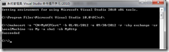
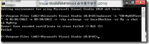
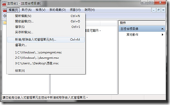
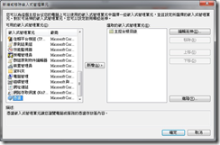
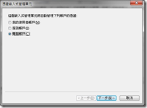
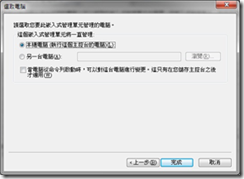
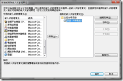
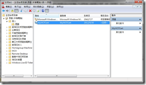

建立X.509憑證

目錄：[WCF 自訂使用者帳號/密碼篇](http://www.dotblogs.com.tw/nethawk/archive/2012/12/23/85885.aspx)

首先請以**系統管理員的身份**開啟Visual Studio 2010所提供的命令提示工具(程式集 Microsoft Visual Studio 2010/Visual Studio Tools/ Visual Studio 命令提示字元 (2010))﹐輸入以下指令

**makecert -n "CN=MyWCFCert" -r -sky exchange -sr LocalMachine -ss My -a sha1 -sk MyHttp -pe**

**加上-pe的指令才可以在匯出時一同匯出私密金鑰。**

Makecert.exe憑證建立工具請參考<http://msdn.microsoft.com/zh-tw/library/bfsktky3(v=vs.80).aspx>說明。

Ps.如果不是以系統管理員身份開啟Visual Studio 命令提示字元﹐而執行上述製作憑證的指令﹐那麼可能會得到以下的錯誤畫面。

Error: Save encoded certificate to store failed => 0x5 (5) Failed

憑證建立後要如何檢視呢？請在命令提示字元中執行mmc﹐並且在開啟的mmc視窗下選擇 檔案》新增/移除嵌入式管理單元。

在新增或移除嵌入式管理單元畫面的左方將捲軸拉至最下方選擇憑證﹐按下中間的【新增】鈕。

接著選擇[電腦帳戶]﹐下一步之後再選擇[本機電腦]﹐再按下【完成】鍵。

畫面回到新增或移除嵌入式管理單元﹐可以看到右側的主控台根目錄下多了一個憑證(本機電腦)﹐按下【確定】鍵回到主控台。

在主控台的左側展開憑證(本機電腦)/個人/憑證﹐可以在畫面中間看到所建立的MyWCFCert憑證。如果在 makecert 指令中的 -ss 參數是用ROOT﹐則憑證會放在受信任的根憑證授權單位。

