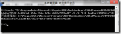
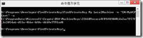

對憑證檔賦予讀取權限

目錄：[WCF 自訂使用者帳號/密碼篇](http://www.dotblogs.com.tw/nethawk/archive/2012/12/23/85885.aspx)

使用IIS做為WCF載具時﹐IIS所預設的帳戶對於憑證檔是沒有讀取的權限。Windows XP的IIS預設帳戶為ASPNET﹐Windows 2003 的IIS 6預設帳戶為NETWORK SERVICE﹐到了Widnows Vista/7/8/2008之後也就是IIS 7.x開始﹐預設帳戶是同應用程式集區名稱的虛擬帳戶 IIS AppPool\應用程式集區名稱。這裏要用到二個工具來協助我們完成設定﹐FindPrivateKey 和 cacls。

**cacls.exe**

cacls.exe 是windows 系統內建的指令﹐可以用來對指定的檔案設定使用者權限。

開啟命令提示字元﹐執行以下指令

cacls "C:\ProgramData\Microsoft\Crypto\RSA\MachineKeys\336609acaca4f89d4f0d01da2ac7f57f\_5c2854a6-d53a-456e-bf8c-d6b9e7792ad8" /E /G "IIS AppPool\WCFSample":R

cacls 的第一個參數是一個檔名﹐也就是憑證檔的檔名﹐但是這個檔名很難辨認﹐因此必須借助工具才行﹐這個就要利用 FindPrivateKey 這個小工具了。

指令中其他的參數

**/E** 編輯ACL而不是取代ACL。

**/G**後面所接的是要授與權限的user﹐因為使用的是IIS 7.x﹐因此是將權限授與該網站所使用的**集用程式集區的名稱**﹐格式是"**IIS AppPool\****應用程式集區名稱"**﹐而最後的**:R**表示要授與讀取的權限。

cacls.exe 是已過時的指令﹐新版的為 icacls.exe 參數用法有些不同﹐不過cacls.exe仍是可以繼續沿用。

**FindPrivateKey.exe**

尋找憑證存放區中特定X.509證書關聯的私密金鑰檔的位置和名稱並不容易﹐這時可以利用FindPrivateKey.exe指令。可是FindPrivateKey並不是windows內建的指令﹐微軟提供了工具﹐不過要自行下載並編輯才能使用。請到<http://msdn.microsoft.com/en-us/library/dd483375(VS.100).aspx> 下載WF\_WCF\_Samples.exe。將檔案執行後會解壓縮﹐FindPrivateKey位於WF\_WCF\_Samples\WCF\Setup\FindPrivateKey﹐自行編譯之後就能使用。

FindPrivateKey的使用方式

|  |
| --- |
| FindPrivateKey <storeName> <storeLocation> [{ {-n <subjectName>} | {-t <thumbprint>} } [-f | -d | -a]] |

相關使用方式還可以參考 <http://msdn.microsoft.com/zh-tw/library/vstudio/aa717039(v=vs.90).aspx> 的說明。

例如在命令提示字元下執行以下指令

**FindPrivateKey My LocalMachine -n "CN=MyWCFCert" -a**

