目錄：[WCF 自訂使用者帳號/密碼篇](<http://www.dotblogs.com.tw/nethawk/archive/2012/12/23/85885.aspx>)

**1\. wsHttpUserAuth.filehost 專案—檔案模式**

在方案中加入一個新網站﹐選用** _檔案系統_** 來建罝這個專案﹐將vs自動產生的Service.svc﹑Service.cs﹑IService.cs全部刪除﹐然後參考4.3.1所建立的MyProducts.lib.dll。然後在這個專案下新增一個文字檔﹐將檔名改為MyProducts.**svc** 。整個檔案結構看起來應該如下。

[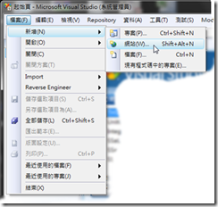](<https://dotblogsfile.blob.core.windows.net/user/nethawk/1212/WCFwsHttpBinding_13D7D/image_2.png>)

接著修改WCF的組態檔﹐也就是修改Web.config。可以在Web.config檔案上按下滑鼠右鍵選擇「編輯WCF組態」﹐使用GUI介面來編輯﹐當然也是可以直接開啟Web.config自行編修﹐如果各項設定真的很熟的話…。這裏直接看編輯好的Web.config

[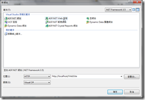](<https://dotblogsfile.blob.core.windows.net/user/nethawk/1212/WCFwsHttpBinding_13D7D/image_4.png>)

目前這組態檔還很陽春﹐在整個WCF中的設定主要是在system.serviceModel下分為services﹑bindings和behaviors三個段落﹐services是包含所有由應用程式裝載的服務規格。bindings則包含通訊繫結的規格﹐這裏有定義的規格在services之下就可使用。Behaviors﹐提供服務的行為﹐透過name的屬性和service做繫結。可以參考 <http://msdn.microsoft.com/zh-tw/library/ms733932.aspx> 有比較詳細的描述。

**< service>**

behaviorConfiguration：設定這個服務行為﹐在<behaviors>中設定﹐這裏只是參考名稱。

name：這裏所填的規則為”**namespace.class** ”也就是”**命名空間****.****類別名稱** ”。這裏現在參考了4.3.1的MyProduct.lib.dll﹐由程式碼可以看到namespace為MyProducts.lib而Class的名稱為ProductService。

**< endpoint>**

binding：這個屬性值表示要使用那一種繫結模式﹐這裏用的是wsHttpBinding。

contract：這一項的規則為”**namespace.service interface** ”。由所參考的MyProducts.lib的程式碼可以看出namespace是MyProducts.lib﹐而service interface是IProductService﹐故組合起來為MyProducts.lib.IProductService。

**< behavior>**

name：這個名稱可以自行定義﹐在<service>標籤中的behaviorConfiguation就是參考這個名稱。

<serviceMetadata>：因為這個WCF要能透過http模式發佈﹐因此httpGetEnabled必須要是true。

上述的Web.config初步設定後﹐接著開啟MyProducts.svc﹐在內容中填入以下這一行文字

<%@ ServiceHost Language="C#" Debug="false" Service="MyProducts.lib.ProductService"%>

當中的Service的規則為”**namespace.class** ”。

完成上述的步驟後﹐以瀏灠器開啟MyProducts.svc﹐應該會有如下的畫面。

[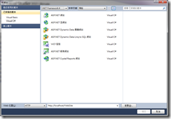](<https://dotblogsfile.blob.core.windows.net/user/nethawk/1212/WCFwsHttpBinding_13D7D/image_6.png>)

[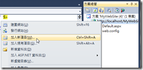](<https://dotblogsfile.blob.core.windows.net/user/nethawk/1212/WCFwsHttpBinding_13D7D/image_8.png>)

這個WCF服務已可使用且還未加入認證的部分﹐到此先建一個測試程式﹐請參考下方 1.2.1 的測試。

**1.1. 加入使用者帳號密碼認證功能**

**1.1.1. 建立憑證**

WCF要利用使用者帳號/密碼認證必須要先建立X.509的憑證﹐X.509憑證可以向CA認證中心申請﹐如果公司內部有自行架設認證中心﹐亦可由公司內部發行憑證檔。開發時期則可以使用微軟的makecert指令建立自主憑證檔﹐請參考[建立X.509憑證](<http://www.dotblogs.com.tw/nethawk/archive/2012/12/24/85895.aspx>)。

現在先製作一個測試用的憑證

**makecert -sk MyHttpSvr -n "CN=MyWCFCert" -pe -sr LocalMachine -ss My -a sha1 -r -sky exchange**

****1.1.2. 修改web.config 組態檔****

**在修改之前﹐必須要先參考**UserAuthorization.lib.dll** ﹐這是前面[使用者認證的WCF服務—範例服務程式庫(WCF Library)](<http://www.dotblogs.com.tw/nethawk/archive/2012/12/23/85889.aspx>)所準備好的一個組件檔﹐也是要做自訂使用者帳號密碼認證必要的。**

**編輯之後的web.config如下﹐增加了些東西。在WCF中的安全性等級分為訊息層(Message)和傳輸層(Transport)﹐這裏使用的是Message訊息層加密方式﹐這個原本就是wsHttpBinding所預設的方式﹐因為要加入一些設定﹐故必須要寫出來﹐如果使用了工具「編輯WCF組態」存檔後﹐也同樣會在組態中顯示出來。**

**[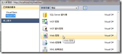](<https://dotblogsfile.blob.core.windows.net/user/nethawk/1212/WCFwsHttpBinding_13D7D/image_10.png>)**

****bindings****

**這個範例主要示範wsHttpbinding的做法﹐因此在bindings中增加了 <wsHttpBinding>﹐而因為使用訊息(Message)加密的方式﹐故需要在security加入mode=”Message”。並且要以使用者帳號/密碼做驗證﹐故還需要加入clientCredentialType=”UserName”。**

****behaviors****

**在行為中主要 增加了憑證的設定﹐增加了serviceCredentials中的相關設定。**

**在serviceCredential中的findVale﹑storeLocation﹑storeName﹑x509FindType就分別設定了憑證相關資訊。**

**另外還需要設定userNameAuthentication﹐userNamePasswordValidationMode要改為Custom﹐customUserNamePasswordValidatorType則指定要做使用者驗證的類別﹐格式為**”namespace.class,namespace”** ﹐在這個例子使用者驗證是參考了UserAuthorization.lib.dll﹐這個例子中的namespace為UserAuthorization.lib而class為UserValidator﹐故這裏要設定為” UserAuthorization.lib.UserValidator,UserAuthorization.lib”。**

****service****

**在endpoint下增加了identity的設定。**

****

**WCF設定完後先開啟瀏灠器執行 http://localhost:56622/wsHttpUserAuth.filehost/MyProducts.svc 測試是否沒有問題﹐若沒問題則可以先參考 以下1.2.2 在client端要如何調用。**

****

****1.2. wsWinClientForUserValidator Client 測試程式****

**測試程式的畫面﹐並且加入服務參考<http://localhost:56622/wsHttpUserAuth.filehost/MyProducts.svc>﹐這是上面一開始所建的WCF 服務。**

**[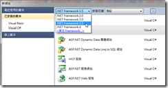](<https://dotblogsfile.blob.core.windows.net/user/nethawk/1212/WCFwsHttpBinding_13D7D/image_12.png>)**

****1.2.1. 無認證的測試****

**檢視目前的app.config﹐這個組態在visual studio加入服務參考後會自動產生一些基本的設定。因為現在這個WCF服務還很單純所產生的組態檔也相對簡單。**

****app.config****

```xml
<?xml version="1.0" encoding="utf-8" ?>
<configuration>
    <system.serviceModel>
        <bindings>
            <wsHttpBinding>
                <binding name="WSHttpBinding_IProductService" />
            </wsHttpBinding>
        </bindings>
        <client>
            <endpoint address="http://localhost:56622/wsHttpUserAuth.filehost/MyProducts.svc"
                      binding="wsHttpBinding" 
                      bindingConfiguration="WSHttpBinding_IProductService"
                      contract="ServiceHost.IProductService" 
                      name="WSHttpBinding_IProductService">
            </endpoint>
        </client>
    </system.serviceModel>
</configuration>
```

**在按鍵【Call SaySomething】加入的Click事件**

****btnSaySomething_Click****
    
    
    **1: private void btnSaySomething_Click(object sender, EventArgs e) {**
    
    
    **2:    txtException.Text = "";**
    
    
    **3:    txtOutput.Text = "";**
    
    
    **4: **
    
    
    **5:    ServiceHost.ProductServiceClient proxy = null;**
    
    
    **6:    try {**
    
    
    **7:        proxy = new ServiceHost.ProductServiceClient();**
    
    
    **8:        txtOutput.Text = proxy.SaySomething(txtInput.Text);**
    
    
    **9:    } catch (FaultException e1) {**
    
    
    **10:        txtException.Text = "Fault Exception:\r\n" + e1.Message;**
    
    
    **11:    } catch (Exception e2) {**
    
    
    **12:        txtException.Text = "Exception:\r\n" + e2.Message;**
    
    
    **13:    }**
    
    
    **14:}**

****

**執行之後應可以在畫面的輸出值正常的顯示回傳的值。**

****

****1.2.2. 加入憑證後測試****

**在上述 1.1.2 中加入憑證之後﹐將上面1.2.1 無認證的測試所參考的<http://localhost:56622/wsHttpUserAuth.filehost/MyProducts.svc>做更新服務參考。**

**app.config**

```xml
<?xml version="1.0" encoding="utf-8" ?>
<configuration>
    <system.serviceModel>
        <bindings>
            <wsHttpBinding>
                <binding name="WSHttpBinding_IProductService">
                    <security>
                        <message clientCredentialType="UserName" />
                    </security>
                </binding>
            </wsHttpBinding>
        </bindings>
        <client>
            <endpoint address="http://localhost:56622/wsHttpUserAuth.filehost/MyProducts.svc"
                binding="wsHttpBinding" bindingConfiguration="WSHttpBinding_IProductService"
                contract="ServiceHost.IProductService" name="WSHttpBinding_IProductService">
                <identity>
                    <dns value="localhost" />
                </identity>
            </endpoint>
        </client>
    </system.serviceModel>
</configuration>

```

**比對之前未加入憑證的組態檔可以看到增加了些東西﹐在binding中增加了security的設定﹐在endpoint下也增加了identity的設定。除了這些﹐在程式中也需要做些修改**

****btnSaySomething_Click****
    
    
    **1: private void btnSaySomething_Click(object sender, EventArgs e) {**
    
    
    **2:    txtException.Text = "";**
    
    
    **3:    txtOutput.Text = "";**
    
    
    **4: **
    
    
    **5:    ServiceHost.ProductServiceClient proxy = null;**
    
    
    **6:    try {**
    
    
    **7:      proxy = new ServiceHost.ProductServiceClient();**
    
    
    **8:      proxy.ClientCredentials.UserName.UserName = txtUid.Text;**
    
    
    **9:      proxy.ClientCredentials.UserName.Password = txtPwd.Text;**
    
    
    **10:      proxy.ClientCredentials.ServiceCertificate.Authentication.CertificateValidationMode = X509CertificateValidationMode.None;**
    
    
    **11: **
    
    
    **12:      txtOutput.Text = proxy.SaySomething(txtInput.Text);**
    
    
    **13:    } catch (FaultException e1) {**
    
    
    **14:      txtException.Text = "Fault Exception:\r\n" + e1.Message;**
    
    
    **15:    } catch (Exception e2) {**
    
    
    **16:      txtException.Text = "Exception:\r\n" + e2.Message;**
    
    
    **17:    }**
    
    
    **18:}**

****

**在原本的事件中增加了以下的程式碼**

****proxy.ClientCredentials.UserName.UserName** = txtUid.Text;**

****proxy.ClientCredentials.UserName.Password** = txtPwd.Text;**

****proxy.ClientCredentials.ServiceCertificate.Authentication.CertificateValidationMode = X509CertificateValidationMode.None;****

**將程式重新編輯後再執行**

**[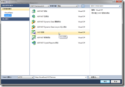](<https://dotblogsfile.blob.core.windows.net/user/nethawk/1212/WCFwsHttpBinding_13D7D/image_14.png>)**

**真糟~~出現了錯誤。**

**傳出訊息的身分識別檢查失敗。預期的遠端端點 DNS 身分識別為 'localhost'，但遠端端點提供的 DNS 宣告為 'MyWCFCert'。如果這是合法的遠端端點，只要在建立通道 Proxy 時，明確指定 DNS 身分識別 'MyWCFCert' 作為 EndpointAddress 的 Identity 屬性，即可解決此問題。**

**這是因為憑證檔驗證失敗﹐這裏必須更改client端endpint下的identity的dns設定﹐因為Server端的憑證檔為”CN=MyWCFCert”﹐這裏的設定要改為如下**

```xml
<endpoint address="http://localhost:56622/wsHttpUserAuth.filehost/MyProducts.svc"
      binding="wsHttpBinding" bindingConfiguration="WSHttpBinding_IProductService"
      contract="ServiceHost.IProductService" name="WSHttpBinding_IProductService">
      <identity>
          <dns value="MyWCFCert" />
      </identity>
</endpoint>

```

**< dns vlaue="MyWCFCert" /> 這裏需要設憑證的名稱。再重新將程式編譯﹐沒什麼意外的話應該是可以成功的。**

****

**2.WCF 佈署至 Server**

**將寫好的WCF佈署到一台Windows 2008 上並且以IIS 7.X做為WCF的載具﹐是不是如我們所願的可以執行呢？**

**將這個寫子的WCF複製到WIN 2008 Server上﹐假設路徑為 C:\Website\WCFSample\wsHttpUserAuth.webhot﹐在IIS上建立一個站台WCFSample指向C:\Website\WCFSample﹐port設定為85﹐IIS 7.X會自動幫這個站台建立一個 應用程式集區名稱為WCFSample。在這個站台之下建立一個應用程式名稱為wsHttpUserAuth.webhost﹐將路徑指向C:\Website\WCFSample\wsHttpUserAuth.webhot。**

**[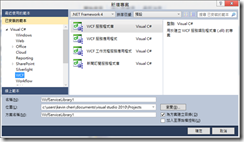](<https://dotblogsfile.blob.core.windows.net/user/nethawk/1212/WCFwsHttpBinding_13D7D/image_16.png>)**

**接著必須憑證檔安裝至Server上。可以將本機上建立的測試用憑證檔匯出﹐然後在Server上做匯入﹐不過為了做一些識別﹐我另外在Win2008上建立一個新的憑證檔﹐該憑證的主體為”CN=WINSvrCert”。**

**[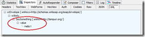](<https://dotblogsfile.blob.core.windows.net/user/nethawk/1212/WCFwsHttpBinding_13D7D/image_18.png>)**

**因為憑證檔不同﹐故web.config檔需要做一下修改﹐這裏修改了serviceCertificate中的findValue的值。**

```xml
<behaviors>
  <serviceBehaviors>
   <behavior name="Product.Behavior">
        <serviceMetadata httpGetEnabled="true" />
        <serviceDebug includeExceptionDetailInFaults="false" />
        <serviceCredentials>
          <serviceCertificate findValue="WINSvrCert" 
                           storeLocation="LocalMachine"
                           storeName="My" 
                          x509FindType="FindBySubjectName" />
        <userNameAuthentication userNamePasswordValidationMode="Custom"
          customUserNamePasswordValidatorType="UserAuthorization.lib.UserValidator,UserAuthorization.lib" />
          </serviceCredentials>
     </behavior>
  </serviceBehaviors>
</behaviors>

```

**開啟瀏灠器執行Windows Server上的WCF<http://xxx.xxx.xxx.xxx:85/wsHttpUserAuth.webhost/MyProducts.mvc> 這時得到的是一個錯誤的畫面。**

**[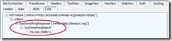](<https://dotblogsfile.blob.core.windows.net/user/nethawk/1212/WCFwsHttpBinding_13D7D/image_20.png>)**

**注意到畫面有一行文字**

**[ArgumentException: It is likely that certificate 'CN=WINSvrCert' may not have a private key that is capable of key exchange or the process may not have access rights for the private key. Please see inner exception for detail.]**

**如果是中文版的OS應該見到的是如下**

**[ArgumentException: 可能是憑證 'CN= WINSvrCert ' 的私密金鑰沒有金鑰交換的能力，或是處理序對該私密金鑰不具有存取權限。如需詳細資訊，請參閱內部例外狀況。]**

**字面的意思就是對於憑證 'CN= WINSvrCert ' 無法使用﹐這是使用IIS做為WCF載具時﹐IIS帳戶對於憑證檔沒有讀取的權限。現在所使用的作業系統環境為Windows 7/8/2008﹐IIS 為7.X和8.0﹐**因此必須對於該網站的應用程式集區名稱賦予憑證檔的讀取權限** 。這裏需要用到二個工具﹐FindPrivateKey和cacls。主要是由cacls指令來達成要求﹐cacls是Widnows內建的指令﹐可以用來對指定的檔案設定使用者權限。請參考[對憑證檔賦予讀取權限](<http://www.dotblogs.com.tw/nethawk/archive/2012/12/24/85896.aspx>)檢視用法。因此這裏執行了以下的指令後﹐這個WCF便可以使用了。**

**cacls "C:\ProgramData\Microsoft\Crypto\RSA\MachineKeys\dd2cd8ee1b210ad4267511e7e5c4e1cf_c45cfae7-08e7-43f7-bb26-808f90f05df6" /E /G "IIS AppPool\WCFSample":R**

****

**這裏特別說這一段﹐是因為自從Visual Studio 2005推出時為了體恤開發人員﹐在本機沒有安裝IIS時也可以開發web程式而加入了檔案系統模式。這確實是一個好東西﹐開發過程如果需要執行﹐會有一個ASP.NET程式開發伺服器模擬IIS的行為。不過這個畢竟不是真正的IIS﹐因此與真正的IIS行為有些出入﹐由其是權限﹐因為開發人員使用檔案系統模式時﹐開發人員本身的本機帳戶權限通常都很大﹐但實際IIS上用的帳戶是被限縮了許多。通常以檔案系統開發好後佈署到Server時卻常得到一些奇怪的訊息﹐有些就是權限不足﹐可是訊息通常不是那麼明確﹐常會讓人誤以為出錯是別的原因。**

**使用前面1.2.2有認證的測試程式﹐拿來測試這個佈署到Server的WCF程式﹐只需要修改app.config中的endpoint 下的address URL及dns的value改為Server上的憑證即可。**

```xml
<endpoint address="http://xxx.xxx.xxx.xxx:85/wsHttpUserAuth.webhost/MyProducts.svc"
     binding="wsHttpBinding" bindingConfiguration="WSHttpBinding_IProductService"
     contract="ServiceHost.IProductService" name="WSHttpBinding_IProductService">
     <identity>
         <dns value="WINSvrCert" />
     </identity>
</endpoint>

```

**3.抓取使用者帳號密碼錯誤的excepiton**

**在[使用者認證的WCF服務—範例服務程式庫(WCF Library)](<http://www.dotblogs.com.tw/nethawk/archive/2012/12/23/85889.aspx>)的UserValidator.cs中判斷如果輸入的帳號/密碼錯誤會丟出fault Exception所自訂的錯誤訊息﹐在上面 1.2.2 的client程式中也有使用try{}catch{}補捉exception﹐那麼是不是能如我們所意得到想要的結果呢？**

**[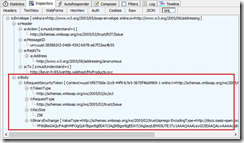](<https://dotblogsfile.blob.core.windows.net/user/nethawk/1212/WCFwsHttpBinding_13D7D/image_22.png>)**

**測試之後發現﹐和想像中的不相同﹐沒有得到確定的錯誤﹐對於後續問題的處理會很頭痛。那麼該如何做呢？只要在Client 端的Exception 中改為以下的寫法即可。**

**try {**

**proxy = new ServiceHost.ProductServiceClient();**

**proxy.ClientCredentials.UserName.UserName = txtUid.Text;**

**proxy.ClientCredentials.UserName.Password = txtPwd.Text;**

**proxy.ClientCredentials.ServiceCertificate.Authentication.CertificateValidationMode = X509CertificateValidationMode.None;**

**txtOutput.Text = proxy.SaySomething(txtInput.Text);**

**} catch (FaultException e1) {**

**txtException.Text = "Fault Exception:\r\n" + e1.Message;**

**} catch (Exception e2) {**

**txtException.Text = "Exception:\r\n" + **e2.****InnerException****.Message ;****

**}**

**重新執行之後﹐可以發現的確取得了所自訂的錯誤訊息。**

**[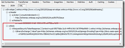](<https://dotblogsfile.blob.core.windows.net/user/nethawk/1212/WCFwsHttpBinding_13D7D/image_24.png>)**

****

**完成之後﹐WCF是要拿來用的﹐除了.Net本身自已的調用之外﹐下篇將示範 Java 如何調用 這個具身份認證的 WCF 。**