目錄：[WCF 自訂使用者帳號/密碼篇](<http://www.dotblogs.com.tw/nethawk/archive/2012/12/23/85885.aspx>)

過去微軟.NET的ASMX Web Service已被大家廣泛應用﹐但在資訊安全日愈重視之下﹐微軟有意以WCF取代原有的 ASMX Web Service。WCF 具有許多先進的技術﹐而跨平台作業已是現在不可避免的問題﹐同樣是微軟的 Solution之下如何使用WCF應該不是什麼問題﹐但在不同的平台上是否有那麼容易呢？因此這裏以 Java 實作如何來調用具有使用身份驗證的 WCF﹐並以WCF 預設的wsHttpBinding 及一般常使用的 basicHttpBinding 的繫結方式實作。

我本身並非專研 Java﹐但既然日後使用了 WCF 也勢必面臨 Java 或其它平台的呼叫﹐Java 是Open Source 具有多種 Framework﹐且有多種開發工具﹐參考了網路上許多範例與討論﹐Java 對於WCF比較常用的是 ASIX 和 Metro 套件﹐因此這裏主要使用 NetBeans IDE 搭配 Metro﹐eclipse 搭配asix 這兩種﹐不過因為不是專研 Java﹐故仍有些地方不是實作的很完全﹐這裏就抛磚引玉﹐期待高手來解惑了。

這裏使用的 NetBeans 版本為 NetBeans IDE 7.2 (Build 201207301726)﹐JDK 是1.6.0_37。NetBeans可至Oracle官網(<http://netbeans.org/downloads/index.html>)下載。

在 Viusal Studio 上建立WCF 專案時﹐預設所產生的就是使用 **wsHttpBinding** 的繫結。wsHttpBinding 預設的安全性模式為 **Message(訊息模式加密)** ﹐在 WCF 中也是普遍的被使用。當我想以 Java 調用時卻發現在網路上有許多人詢問﹐但很少看到一個完整的範例。同時所看到的討論回覆都很片斷﹐因此實作過程並不容易。在這裏分別以 Java Application 與 Web應用程式當Client程式調用WCF為範例。

這一篇是搭配[使用者認證的WCF服務—wsHttpBinding繫結](<http://www.dotblogs.com.tw/nethawk/archive/2012/12/24/85924.aspx>)所建置的WCF 服務。

**1\. 自訂使用者帳號/密碼﹐Java Application client 不以Glassfish為container**

**1.1. 匯入憑證檔**

因為WCF自訂使用者帳號/密碼認證是需要X.509憑證﹐因此在開始之前必須先取得憑證放置到Java可以讀取的位置。

這裏的憑證繼續延用[使用者認證的WCF服務—wsHttpBinding繫結](<http://www.dotblogs.com.tw/nethawk/archive/2012/12/24/85924.aspx>)這一篇中的憑證﹐其憑證主體為 MyWCFCert。首先使用windows憑證管理將之前製作WCF時所製作的憑證先匯出。

[](<https://dotblogsfile.blob.core.windows.net/user/nethawk/1212/2556e9e6a4b5_13CAA/image_2.png>)

將匯出的憑證檔檔名命名為 MyWCFCert.cer﹐接著使用 JDK 所提供的工具 **keytool** 指令建立放置憑證的 keystore 或匯入已存在的 keystore(金鑰庫)。Keytool.exe是java的憑證管理工具。

指令：

把一個憑證檔導入到指定的keystore

**keytool -import -file MyWCFCert.cer -keystore my.TrustStore -alias wcfsvrkey**

**用-keystore 參數指定 keystore 檔案﹐ my.TrustStore 是我自己建立的 keystore﹐如果不存在﹐會自動建立同時會詢問keystore的密碼。**

**-alias則是為這個匯入的憑證建立一個別名。**

****

**匯入成功後應該做一下檢查﹐同樣使用keytool指令**

**指令：**

**列出keystore中的內容資訊**

****keytool -list -v -keystore my.TrustStore****

****執行之後可以檢視這個keystore所有的憑證檔。****

****[](<https://dotblogsfile.blob.core.windows.net/user/nethawk/1212/2556e9e6a4b5_13CAA/image_4.png>)****

****如果有刪除憑證的需要時同樣使用keytool****

****指令：****

****刪除指定的keystore中的憑證****

******keytool -delete -alias wcfsvrkey -keystore my.TrustStore******

********

******1.2. 下載 METRO 2.2.1******

****我由Oracle 官網下載使用的NetBeans IDE是7.2 版﹐內附 METRO 是 2.0 版﹐對於要使用具有使用者帳號密碼認證的WCF服務在國外論壇上有不少﹐有許多人都說必須將Metro更新到2.0版才行﹐不過經過我實測後發現必須使用 2.2.1版才行。****

****Metro 2.2.1 版可至<http://metro.java.net/2.2.1/> 此處下載。將下載的metro-standalone-2.2.1.zip檔案解壓至自訂的路徑之下﹐例如以我個人放置到D:\Java\metro-2_2_1。然後開啟NetBeans﹐到工具/程式庫將 METRO 2.2.1 加入程式庫。****

****[](<https://dotblogsfile.blob.core.windows.net/user/nethawk/1212/2556e9e6a4b5_13CAA/image_6.png>)****

****在程式庫管理器中﹐按下[加入JAR/資料夾]指向Metor 2.2.1的位置﹐之後在NetBeans 中就可以直接選擇了。****

****[](<https://dotblogsfile.blob.core.windows.net/user/nethawk/1212/2556e9e6a4b5_13CAA/image_8.png>)****

********

******1.3. 建立專案******

****開啟NetBeans新增專案﹐左側選擇Java﹐右側選擇Java Application﹐[下一步]繼續。****

****[](<https://dotblogsfile.blob.core.windows.net/user/nethawk/1212/2556e9e6a4b5_13CAA/image_10.png>)****

****輸入專案名稱﹑專案位置﹑Class檔等各項資訊﹐按下[完成]。****

****[](<https://dotblogsfile.blob.core.windows.net/user/nethawk/1212/2556e9e6a4b5_13CAA/image_12.png>)****

****專案名稱：wsHttpClient****

****Class名稱：JavaClient****

********

******1.4. 加入 Web Service Client******

****專案建立後﹐在該專案的名稱上以滑鼠右鍵選擇 New/Web Service Client。****

****[](<https://dotblogsfile.blob.core.windows.net/user/nethawk/1212/2556e9e6a4b5_13CAA/image_14.png>)****

****在Web Service Client的設定頁面上輸入WCF的URL。****

****WSDL URL：http://10.0.100.101:85/wsHttpUserAuth.webhost/MyProducts.svc?wsdl****

****[](<https://dotblogsfile.blob.core.windows.net/user/nethawk/1212/2556e9e6a4b5_13CAA/image_16.png>)****

****完成後回到NetBeans IDE介面等一下﹐NetBeans正在產生WSDL檔及自動產生一些相關的設定檔和程式碼。NetBeans跑完後大約如下圖。****

****[](<https://dotblogsfile.blob.core.windows.net/user/nethawk/1212/2556e9e6a4b5_13CAA/image_18.png>)****

********

******1.5. 檔案轉換為 UT-8 格式******

****檢視專案之下有個Generated Source﹐將其展開後會如下﹐在Generated Source是NetBeans依WSDL所自動產生的class檔。****

****[](<https://dotblogsfile.blob.core.windows.net/user/nethawk/1212/2556e9e6a4b5_13CAA/image_20.png>)****

****點選開啟 GetProduct.java﹐畫面會出現警告﹐這是因為NetBeans自動Generated的檔案為ANSI格式﹐但這個檔案中有中文﹐而NetBeans要讀取的檔案為UTF-8﹐故這裏NetBeans跳出了警告。****

****[](<https://dotblogsfile.blob.core.windows.net/user/nethawk/1212/2556e9e6a4b5_13CAA/image_22.png>)****

****因為檔案帶有中文字﹐因此必須要先將檔案改存為UTF-8才行﹐不然後續做 Builde Project 時是會出錯的。可以用記事本開啟檔案﹐再以另存新檔方式變更格式再回存。不過因為檔案不只一個﹐這樣改比較慢﹐可以去網路找一個老牌的工具 ConverZ 做批次轉換。****

********

******1.6. 編輯 Web 服務屬性******

****接著在**Web服務參照** 下的**MyProducts** 按下滑鼠右鍵﹐選擇[編輯Web服務屬性]。****

****[](<https://dotblogsfile.blob.core.windows.net/user/nethawk/1212/2556e9e6a4b5_13CAA/image_24.png>)****

****開出的是Web服務屬性的畫面﹐這裏我們只要設定Quality Of Service頁籤下關於**安全** 的部分。****

****[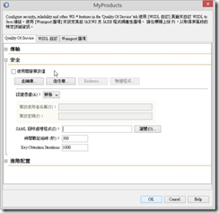](<https://dotblogsfile.blob.core.windows.net/user/nethawk/1212/2556e9e6a4b5_13CAA/image_26.png>)****

****在編輯Web服務屬性的設定畫面上有一個**[使用開發預設值]** 的核取方塊﹐點擊一下﹐畫面會跳出一些訊息。****

****[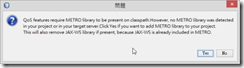](<https://dotblogsfile.blob.core.windows.net/user/nethawk/1212/2556e9e6a4b5_13CAA/image_28.png>)****

****這個訊息是詢問我們,是否使用METRO Library﹐如果要使用則會移除JAX-WS library﹐因為JAX-WS已被包含於METRO之中。按下Yes則NetBeans會幫我們專案加上METRO。如下圖﹐回到Project中展開程式庫﹐就可以看到METRO 2.0已被加入。****

****[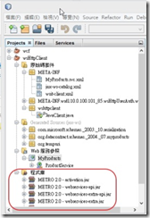](<https://dotblogsfile.blob.core.windows.net/user/nethawk/1212/2556e9e6a4b5_13CAA/image_30.png>)****

****再回到編輯Web服務屬性設定畫面﹐剛剛所點擊的**[使用開發預設值]** 的核取方塊如果已經有被勾選了﹐請將勾選取消。然後先離開編輯Web服務屬性設定畫面。****

********

******1.7. 加入CallbackHandler 檔案******

****這裏需要加入一個繼承CallbackHandler的檔案****

****TrustStoreCallbackHandler.java****

```java

public class TrustStoreCallbackHandler implements CallbackHandler {
KeyStore keyStore = null;  
String password = "123456";  // keystore的密碼
public TrustStoreCallbackHandler() {  
    System.out.println("Truststore CBH.CTOR Called..........");  
    InputStream is = null;  
    try {  
       keyStore = KeyStore.getInstance("JKS");  
       String keystoreURL = "C:\\Java\\Certificate\\myTrustStore"; //放置憑證檔的keystore
       is = new FileInputStream(keystoreURL);  
       keyStore.load(is, password.toCharArray());  
    } catch (IOException ex) {  
        Logger.getLogger(TrustStoreCallbackHandler.class.getName()).log(Level.SEVERE, null, ex);  
        throw new RuntimeException(ex);  
    } catch (NoSuchAlgorithmException ex) {  
        Logger.getLogger(TrustStoreCallbackHandler.class.getName()).log(Level.SEVERE, null, ex);  
        throw new RuntimeException(ex);  
    } catch (CertificateException ex) {  
        Logger.getLogger(TrustStoreCallbackHandler.class.getName()).log(Level.SEVERE, null, ex);  
        throw new RuntimeException(ex);  
    } catch (KeyStoreException ex) {  
        Logger.getLogger(TrustStoreCallbackHandler.class.getName()).log(Level.SEVERE, null, ex);  
        throw new RuntimeException(ex);  
    } finally {  
        try {  
           is.close();  
        } catch (IOException ex) {  
           Logger.getLogger(TrustStoreCallbackHandler.class.getName()).log(Level.SEVERE, null, ex);  
        }  
    }  
}
    
public void handle(Callback[] callbacks) throws IOException, UnsupportedCallbackException {  
   System.out.println("Truststore CBH.handle() Called..........");  
   for (int i = 0; i < callbacks.length; i++) {
      if (callbacks[i] instanceof KeyStoreCallback) {  
           KeyStoreCallback cb = (KeyStoreCallback) callbacks[i];  
           print(cb.getRuntimeProperties());  
           cb.setKeystore(keyStore);  
       } else {  
           throw new UnsupportedCallbackException(callbacks[i]);  
       }  
   }  
}
private void print(Map context) {  
   Iterator it = context.keySet().iterator();  
   while (it.hasNext()) {  
      System.out.println("Prop " + it.next());  
   }  
}
}

```

********

******1.8. 重回編輯 Web 服務屬性******

****重新開啟 編輯Web服務屬性****

****[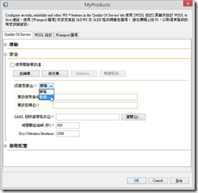](<https://dotblogsfile.blob.core.windows.net/user/nethawk/1212/2556e9e6a4b5_13CAA/image_32.png>)****

****將**[認證憑證]** 選擇**動態** 。變更完後畫面會改變。****

****[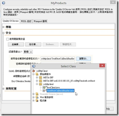](<https://dotblogsfile.blob.core.windows.net/user/nethawk/1212/2556e9e6a4b5_13CAA/image_34.png>)****

****在**[****使用者名稱回呼處理程式****]** 及**[****密碼回呼處理程式****]** 後方的瀏覽鍵按下後選擇剛剛所建立的CallbackHandler檔案TrustStoreCallbackHandler.java。****

****接下來點選畫面上的**[信任庫]** 按鍵。****

****[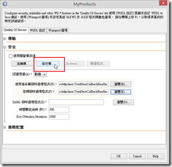](<https://dotblogsfile.blob.core.windows.net/user/nethawk/1212/2556e9e6a4b5_13CAA/image_36.png>)****

****畫面將出現**信任庫配置** 的畫面。****

****[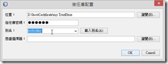](<https://dotblogsfile.blob.core.windows.net/user/nethawk/1212/2556e9e6a4b5_13CAA/image_38.png>)****

****位置請選擇憑證檔所在的keystor﹐同時在信任庫密碼輸入keystore的密碼。這時候如果要去選擇別名是選不到的﹐請先按下「OK」鍵﹐並離開編輯Web服務屬性的畫面回到NetBeans IDE畫面。****

****觀察Project之下在原始碼套件/META-INF之下多了兩個檔案﹐MyProducts.svc.xml及wsit-client.xml﹐這是剛剛的設定之後產生的。****

****[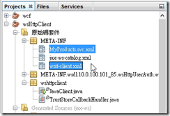](<https://dotblogsfile.blob.core.windows.net/user/nethawk/1212/2556e9e6a4b5_13CAA/image_40.png>)****

****現在必須先開啟MyProducts.svc.xml做些修改。修改 <sc:TrustStore>下的type屬性﹐**type 必須改為 JKS** 。****

****MyProducts.svc.xml 取需要修改的部分****

```xml

<wsp1:Policy wsu:Id="WSHttpBinding_IProductServicePolicy">
  <wsp1:ExactlyOne>
    <wsp1:All>
  <sc:TrustStore wspp:visibility="private" type="JKS" storepass="123456" location="C:\Java\Certificate\myTrustStore" />
  <sc:CallbackHandlerConfiguration wspp:visibility="private">
      <sc:CallbackHandler name="usernameHandler" classname="wshttpclient.TrustStoreCallbackHandler"/>
      <sc:CallbackHandler name="passwordHandler" classname="wshttpclient.TrustStoreCallbackHandler"/>
  </sc:CallbackHandlerConfiguration>
</wsp1:All>
  </wsp1:ExactlyOne>
</wsp1:Policy>

```

****上述修改之後﹐再次回到Web服務屬性編輯畫面並點選信任庫﹐這時再去拉選別名﹐就可以選擇到憑證檔的別名了﹐按下OK後並離開Web服務屬性編輯畫面﹐再次檢視剛剛剛的MyProducts.svc.xml可以發現設定多了peeralais的設定。****

****< sc:TrustStore wspp:visibility="private" type="JKS" storepass="123456" ****

****location="C:\Java\Certificate\myTrustStore"**peeralias="win7svrkey"** />****

********

******1.9. 撰寫 Client 程式******

****前面的設定已完成了工作中的大部分﹐剩下client程式。****

****wcfClient.java****

```xml

public class wcfClient {
public static void main(String[] args) {
org.tempuri.ProductService client;
org.tempuri.IProductService port;
        
Product product;
try{
  client=new org.tempuri.ProductService();
  port=client.getWSHttpBindingIProductService();
            
  //設定呼叫WCF的使用者帳號/密碼
  ((BindingProvider)port).getRequestContext().put(BindingProvider.USERNAME_PROPERTY, "testman");
  ((BindingProvider)port).getRequestContext().put(BindingProvider.PASSWORD_PROPERTY, "a0987");
            
  String result= port.saySomething("Hello~~");
  System.out.println(result);
  System.out.println();
            
  product=port.getProduct("P-001");
  System.out.println("產品編號："+product.getNo().getValue());
  System.out.println("產品名稱："+product.getName().getValue());
  System.out.println("單價："+product.getPrice());
  System.out.println("數量："+product.getQuantity());
}catch(Exception er){
  System.out.println(er.getMessage());
}
}
}

```

******1.10. 測試程式******

****執行Build Project﹐如果沒有任何錯誤﹐那麼就直接執行程式。結果﹐失敗~~****

********

```java

java.util.logging.ErrorManager: 5
java.lang.NullPointerException
	at java.util.PropertyResourceBundle.handleGetObject(PropertyResourceBundle.java:136)
	at java.util.ResourceBundle.getObject(ResourceBundle.java:368)
	at java.util.ResourceBundle.getString(ResourceBundle.java:334)
	at java.util.logging.Formatter.formatMessage(Formatter.java:108)
	at java.util.logging.SimpleFormatter.format(SimpleFormatter.java:63)
	at java.util.logging.StreamHandler.publish(StreamHandler.java:177)
	at java.util.logging.ConsoleHandler.publish(ConsoleHandler.java:88)
	at java.util.logging.Logger.log(Logger.java:478)
	at java.util.logging.Logger.doLog(Logger.java:500)
	at java.util.logging.Logger.log(Logger.java:589)
	at com.sun.xml.ws.security.impl.policy.CertificateRetriever.digestBST(CertificateRetriever.java:136)
	at com.sun.xml.wss.jaxws.impl.SecurityClientTube.processRequest(SecurityClientTube.java:211)
	at com.sun.xml.ws.api.pipe.Fiber.__doRun(Fiber.java:629)
	at com.sun.xml.ws.api.pipe.Fiber._doRun(Fiber.java:588)
	at com.sun.xml.ws.api.pipe.Fiber.doRun(Fiber.java:573)
com.sun.org.apache.xml.internal.security.exceptions.Base64DecodingException: It should be divisible by four
	at com.sun.xml.ws.api.pipe.Fiber.runSync(Fiber.java:470)
	at com.sun.xml.ws.client.Stub.process(Stub.java:319)
	at com.sun.xml.ws.client.sei.SEIStub.doProcess(SEIStub.java:157)
	at com.sun.xml.ws.client.sei.SyncMethodHandler.invoke(SyncMethodHandler.java:109)
	at com.sun.xml.ws.client.sei.SyncMethodHandler.invoke(SyncMethodHandler.java:89)
	at com.sun.xml.ws.client.sei.SEIStub.invoke(SEIStub.java:140)
	at $Proxy43.saySomething(Unknown Source)
	at wshttpclient.wcfClient.main(wcfClient.java:31)
成功建置 (總時間：1 秒)

```

****這裏必須將METRO 2.0更換為之前所下載的METRO 2.2.1版。在NetBeans左側這個專案之下有個程式庫﹐展開後可以看見目前是METRO 2.0﹐以滑鼠在隨便一項上點右鍵選擇Remove﹐就會移除METRO 2.0。****

****[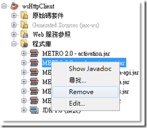](<https://dotblogsfile.blob.core.windows.net/user/nethawk/1212/2556e9e6a4b5_13CAA/image_42.png>)****

****接著在[程式庫]上按滑鼠右鍵選擇[Add Library…]﹐點選之前所加入的Metro 2.2.1按下[加入程式庫]就可以了。****

****[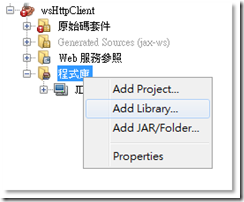](<https://dotblogsfile.blob.core.windows.net/user/nethawk/1212/2556e9e6a4b5_13CAA/image_44.png>)****

****[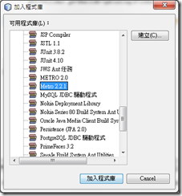](<https://dotblogsfile.blob.core.windows.net/user/nethawk/1212/2556e9e6a4b5_13CAA/image_46.png>)****

****[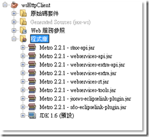](<https://dotblogsfile.blob.core.windows.net/user/nethawk/1212/2556e9e6a4b5_13CAA/image_48.png>)****

****重新再Build一次程式後﹐再一次執行。結果﹐再次失敗~~~****

****錯誤的訊息****

```java

2012/12/22 上午 10:44:09 [com.sun.xml.ws.policy.parser.PolicyConfigParser]  parse
資訊: WSP5018: 已從檔案 file:/D:/MyProject/WCF/WCFSite/WCFSolution/Java/NetBeansProjects/wsHttpClient/build/classes/META-INF/wsit-client.xml 載入 WSIT 組態.
Truststore CBH.CTOR Called..........
Truststore CBH.CTOR Called..........
2012/12/22 上午 10:44:12 com.sun.xml.wss.jaxws.impl.SecurityClientTube processClientResponsePacket
嚴重的: WSSTUBE0025: 驗證輸入訊息中的安全性時發生錯誤.
com.sun.xml.wss.impl.PolicyViolationException: ERROR: No security header found in the message
at com.sun.xml.wss.impl.policy.verifier.MessagePolicyVerifier.verifyPolicy(MessagePolicyVerifier.java:138)
at com.sun.xml.ws.security.opt.impl.incoming.SecurityRecipient.createMessage(SecurityRecipient.java:1016)
at com.sun.xml.ws.security.opt.impl.incoming.SecurityRecipient.validateMessage(SecurityRecipient.java:252)
at com.sun.xml.wss.jaxws.impl.SecurityTubeBase.verifyInboundMessage(SecurityTubeBase.java:455)
at com.sun.xml.wss.jaxws.impl.SecurityClientTube.processClientResponsePacket(SecurityClientTube.java:434)
at com.sun.xml.wss.jaxws.impl.SecurityClientTube.processResponse(SecurityClientTube.java:362)
at com.sun.xml.ws.api.pipe.Fiber.__doRun(Fiber.java:1074)
at com.sun.xml.ws.api.pipe.Fiber._doRun(Fiber.java:979)
at com.sun.xml.ws.api.pipe.Fiber.doRun(Fiber.java:950)
at com.sun.xml.ws.api.pipe.Fiber.runSync(Fiber.java:825)
at com.sun.xml.ws.client.Stub.process(Stub.java:443)
at com.sun.xml.ws.client.sei.SEIStub.doProcess(SEIStub.java:174)
at com.sun.xml.ws.client.sei.SyncMethodHandler.invoke(SyncMethodHandler.java:119)
at com.sun.xml.ws.client.sei.SyncMethodHandler.invoke(SyncMethodHandler.java:102)
WSSTUBE0025: 驗證輸入訊息中的安全性時發生錯誤.
at com.sun.xml.ws.client.sei.SEIStub.invoke(SEIStub.java:154)
at $Proxy41.saySomething(Unknown Source)
at wshttpclient.wcfClient.main(wcfClient.java:31)
成功建置 (總時間：3 秒)

```

****失敗的原因是什麼呢？這裏必須回到 WCF 的設定﹐檢視 WCF 下的 wcf.config 中的 Binding 設定****

****修改前****
    
    
    ****1: <bindings>****
    
    
    ****2:   <wsHttpBinding>****
    
    
    ****3:        <binding name="Product.wsHttpBinding">****
    
    
    ****4:          <security>****
    
    
    ****5:            <message clientCredentialType="UserName" />****
    
    
    ****6:          </security>****
    
    
    ****7:        </binding>****
    
    
    ****8:  </wsHttpBinding>****
    
    
    ****9: </bindings>****

********

****修改後****
    
    
    ****1: <bindings>****
    
    
    ****2:   <wsHttpBinding>****
    
    
    ****3:      <binding name="Product.wsHttpBinding">****
    
    
    ****4:          <security>****
    
    
    ****5:            <message clientCredentialType="UserName" ****
    
    
    ****6:                     negotiateServiceCredential="false"****
    
    
    ****7:                     algorithmSuite="Basic128" ****
    
    
    ****8:                     establishSecurityContext="false" />****
    
    
    ****9:          </security>****
    
    
    ****10:      </binding>****
    
    
    ****11:  </wsHttpBinding>****
    
    
    ****12: </bindings>****

********

****在message標籤中**negotiateServiceCredential** 預設是true﹐這個屬性和Windows認證有關﹐可以參考MSDN的文章<http://msdn.microsoft.com/zh-tw/library/system.servicemodel.messagesecurityoverhttp.negotiateservicecredential.aspx> 及 <http://paper.dic123.com/lunwen_234540427/> ﹐不是很好了解﹐這裏Java要呼叫必須將 negotiateServiceCredential 設為 false。****

****另外**algorithmSuite** 原本預設值為Basic256必須要修改為Basic128﹐理由是什麼…我記得曾在一篇國外討論區看到說Java不支援到256的長度﹐文章已遺落在茫茫網海中﹐這給Java高手去回答吧。**establishSecurityContext** 預設值為true也必須改為false。****

****注意﹐WCF的web.config一旦有改變﹐原本呼叫此WCF的Client程式必須跟著修改設定。****

****之後重新執行Build Project﹐那麼就直接執行程式。結果﹐這次總算成功~~****

****[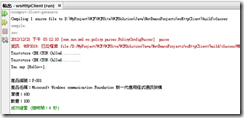](<https://dotblogsfile.blob.core.windows.net/user/nethawk/1212/2556e9e6a4b5_13CAA/image_50.png>)****

************

****

**網路上有許多人詢問Java可否調用wsHttpBinding的WCF呢？國內外許多論壇討論串中發現很多人說不行﹐而是必須改用basicHttpBinding。根據實作後的經驗﹐當然是可以﹐不過為什麼會有人有疑惑？我想有些人是因為在visual studio建立一個wsHttpBinding之初沒有加入任何的東西時﹐連binding都沒設定﹐再使用vs撰寫一個簡單的Console或WinForm做測試是簡單就可以完成調用無誤(像是在[使用者認證的WCF服務—wsHttpBinding繫結](<http://www.dotblogs.com.tw/nethawk/archive/2012/12/24/85924.aspx>)中的1.2.1的無認證測試)﹐可是用Java 卻不是想像中的美好。首先﹐WCF具有多項認証技術﹐例如Windows認證﹑SQL Membership﹑使用者帳號密碼…等。在wsHttpBinding其預設是使用Windows認證﹐這在微軟各項Solution中不會有什麼太大的問題﹐因為大多預設就是Windows認證﹐但是Java就不是了。**

**在binding下的security組態中﹐MessageClientCredentialType中可以選擇 None﹑Windows﹑UserName﹑Certificate 或 Issued Token。每一種都有其對應的認證方式﹐以此例而言採用UserName﹐那麼就必須搭配X.509憑證﹐但還必須修改**negotiateServiceCredential** 這個屬性為false。**

************

********2\. 自訂使用者帳號/密碼﹐Java Client 以Glassfish為container********

********2.1. 建立專案********

******檔案/New Project/Java Web/Web應用程式﹐建立一個Web應用程式。這次就不再示範無認證的WCF﹐直接跑有認證的WCF。專案名稱：wsHttpWebAppUseAuth******

******[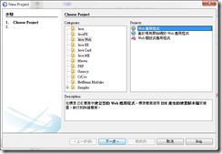](<https://dotblogsfile.blob.core.windows.net/user/nethawk/1212/2556e9e6a4b5_13CAA/image_52.png>)******

******[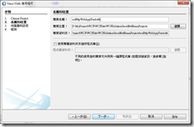](<https://dotblogsfile.blob.core.windows.net/user/nethawk/1212/2556e9e6a4b5_13CAA/image_54.png>)******

******下一步之後這裏要選擇所使用的容器﹐這裏選擇的是GlassFish Server 3.1.2。******

******[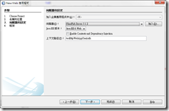](<https://dotblogsfile.blob.core.windows.net/user/nethawk/1212/2556e9e6a4b5_13CAA/image_56.png>)******

******按下[完成]後﹐可以看到所產生的專案架構。******

******[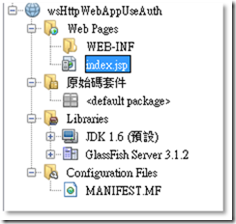](<https://dotblogsfile.blob.core.windows.net/user/nethawk/1212/2556e9e6a4b5_13CAA/image_58.png>)******

************

********2.2. 加入 Web Service Client********

******在專案名稱上滑鼠右鍵選擇New/Web Service Client。******

******[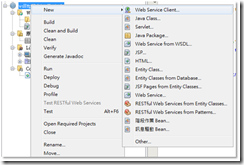](<https://dotblogsfile.blob.core.windows.net/user/nethawk/1212/2556e9e6a4b5_13CAA/image_60.png>)******

******選擇WSDL URL並輸入具有認證的WCF URL。******

******WSDL URL：http://10.0.100.101:85/wsHttpUserAuth.webhost/MyProducts.svc?wsdl******

******[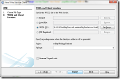](<https://dotblogsfile.blob.core.windows.net/user/nethawk/1212/2556e9e6a4b5_13CAA/image_62.png>)******

******[完成]之後在專案中可以看到同樣產生了Generated Sources還有服務參照。請記得Generated出來的class檔帶有中文﹐要先將檔案格式轉換成UTF-8﹐不然在最後做builder時會失敗。******

******[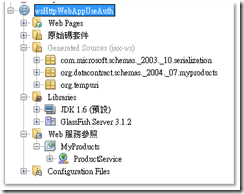](<https://dotblogsfile.blob.core.windows.net/user/nethawk/1212/2556e9e6a4b5_13CAA/image_64.png>)******

************

******2.3. 編輯 Web 服務屬性******

******在Web服務參照之下的MyProducts按下滑鼠右鍵選擇[編輯Web服務屬性]。******

******[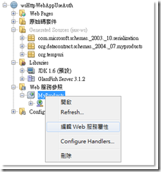](<https://dotblogsfile.blob.core.windows.net/user/nethawk/1212/2556e9e6a4b5_13CAA/image_66.png>)******

******到此和之前的Java Application的做法都相同﹐但這次是搭配GlassFish做container﹐因此不需要METRO﹐故接下來直接點[信任庫]設定keystore就可以。******

******[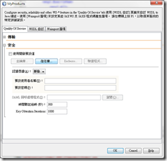](<https://dotblogsfile.blob.core.windows.net/user/nethawk/1212/2556e9e6a4b5_13CAA/image_68.png>)******

******將位置改選擇放置憑證的keystore檔案﹐並輸入keystore的密碼。同樣的現在是選不到別名的。請按下[OK]回到前一個畫面後也按下[OK]離開Web服務屬性的編輯。******

******[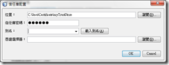](<https://dotblogsfile.blob.core.windows.net/user/nethawk/1212/2556e9e6a4b5_13CAA/image_70.png>)******

******重新檢視專案﹐在原始碼套件/META-INF之下多了MyProducts.svc.xml檔案。******

******[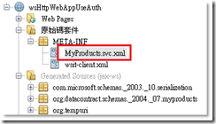](<https://dotblogsfile.blob.core.windows.net/user/nethawk/1212/2556e9e6a4b5_13CAA/image_72.png>)******

******開啟MyProducts.svc.dml﹐並修改 <sc:TrustStrore>下的Type屬性改為**JKS** 。******

******修改後******
    
    
    ******1: <wsp1:Policy wsu:Id="WSHttpBinding_IProductServicePolicy">******
    
    
    ******2:  <wsp1:ExactlyOne>******
    
    
    ******3:    <wsp1:All>******
    
    
    ******4:      <sc:TrustStore wspp:visibility="private" storepass="123456" type="JKS" location="C:\Java\Certificate\myTrustStore"/>******
    
    
    ******5:    </wsp1:All>******
    
    
    ******6:  </wsp1:ExactlyOne>******
    
    
    ******7: </wsp1:Policy>******

************

**********再重新回到之前的Web服務屬性的編輯並進入信任庫中﹐這時就已經可以選擇別名了。指定別名後回頭看MyProducts.svc.xml的設定就會發現已有修改。如果指令很熟悉的人就不需要這麼麻煩了﹐直接編寫設定檔即可。**********

********************

**********2.4. 建立 Servlet**********

**********在原始碼套件上以滑鼠右鍵﹐選擇New/Servlet﹐然後輸入ClassName和Package﹐按下[完成]。**********

**********[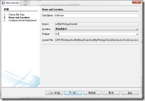](<https://dotblogsfile.blob.core.windows.net/user/nethawk/1212/2556e9e6a4b5_13CAA/image_74.png>)**********

**********然後在所產生的wsService.java中輸入以下程式碼**********

**********wsService.java**********

```java

@WebServlet(name = "wsService", urlPatterns = {"/wsService"})
public class wsService extends HttpServlet {
  /**
   * Processes requests for both HTTP
   * <code>GET</code> and
   * <code>POST</code> methods.
   *
   * @param request servlet request
   * @param response servlet response
   * @throws ServletException if a servlet-specific error occurs
   * @throws IOException if an I/O error occurs
   */
   protected void processRequest(HttpServletRequest request, HttpServletResponse response)
throws ServletException, IOException {
response.setContentType("text/html;charset=UTF-8");
PrintWriter out = response.getWriter();
org.tempuri.ProductService client=null;
org.tempuri.IProductService port=null;
Product product;
try {
   client=new org.tempuri.ProductService();
   port=client.getWSHttpBindingIProductService();
   BindingProvider bp=(BindingProvider)port;
   bp.getRequestContext().put(BindingProvider.USERNAME_PROPERTY, "testman");
   bp.getRequestContext().put(BindingProvider.PASSWORD_PROPERTY, "a0987");
            
   out.println("<html>");
   out.println("<head>");
   out.println("<title>Servlet wsService</title>");            
   out.println("</head>");
   out.println("<body>");
   String result=port.saySomething("Hello~~");
   out.println("<h1>Servlet wsService at " + result + "</h1>");
   out.println("<br/>");
   
   product=port.getProduct("P-001");
   out.println("產品編號："+product.getNo().getValue()+"<br>");
   out.println("產品名稱："+product.getName().getValue()+"<br>");
   out.println("單價："+product.getPrice()+"<br>");
   out.println("數量："+product.getQuantity()+"<br>");
   
   out.println("</body>");
   out.println("</html>");
 } finally {            
   out.close();
 }
   }
}

```

**********將專案builder之後執行應該可以得到如下的結果。**********

**********[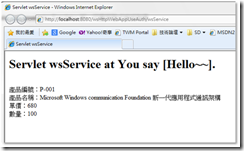](<https://dotblogsfile.blob.core.windows.net/user/nethawk/1212/2556e9e6a4b5_13CAA/image_76.png>)**********

********************

**********在撰寫過程﹐花了最多時間是在Java Application 如何調用WCF 的部分﹐目前我所成功的就是 NetBeans + Metro 及 GlassFish﹐至於使用ASIX 2 還沒成功過﹐不過如果是 basicHttpBinding 以 Transport 方式加密﹐使用 ASIX 倒是可以﹐這留待下一篇再繼續了。**********

********************

**********參考資料**********

**********<http://blog.csdn.net/marvion/article/details/4015785>**********

**********<http://kaochiuan.blogspot.tw/2012/03/java-call-wcf-service-over-ssl-with.html>**********

**********<http://blog.csdn.net/cch5487614/article/category/672173>**********

**********<http://www.mkyong.com/webservices/jax-ws/java-security-cert-certificateexception-no-name-matching-localhost-found/>**********