之前分享過WCF 自訂使用者帳號/密碼認證的技巧﹐在文章中示範了wsHttpBinding和basicHttpBinding兩種繫結模式下如何使用﹐以及 Java 搭配 METRO 如何呼叫 WCF。兩種繫結模式在自訂使用者帳號/密碼認證下都必須使用到**數位憑證** ﹐當初的初衷是在公司內部網站提供給其它單位使用時能加入認證功能﹐不過搞到數位憑證﹐真的有點拿牛刀殺雞了。

為了能夠方便的認證又能提供給.Net solution以外的語言調用﹐最後還是決定使用 SoapHeader 的方式﹐SoapHeader確實不夠安全又比較容易受竄改﹐不過用在於公司內部應該是足夠了﹐比較可惜的是wsHttpBinding就不適合使用了。所以以下的示範是採用**basicHttpBinding** 的繫結模式。在接下來的示範中取用之前所分享的[**WCF 自訂使用者帳號/密碼篇**](<http://www.dotblogs.com.tw/nethawk/archive/2012/12/23/85885.aspx>)中範例服務程式庫 MyProducts。以下將 step by step逐一製作﹐同時會搭配Java與Android的呼叫範例。

**1\. 環境準備**

一開始先建立一個以IIS為載具的基本的WCF(basciHttpBinding)﹐同時也建置一個client程式做為後續測試使用。

**1.1 建立方案**

首先建立一個空方案﹐方案名稱為**WCFSoapHeaderSample** ﹐為了分類方便我在方案中建了三個方案資料夾client﹑wcf.lib﹑wcf.service﹐然後再將之前的MyProducts的範例服務程式庫專案先拉進來。

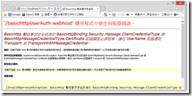

**1.2 建立以 IIS 為載具的 WCF Service**

這裏建立一個basicHttpSoapHeader.host的WCF網站﹐首先參考MyProducts.lib.dll﹐並建立MyProducts.svc﹐同時也設定好web.config﹐這些步驟都在之前的分享做過了﹐也就不再重覆敍述。

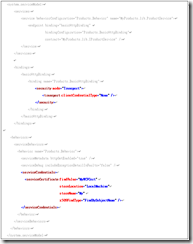

web.config

```xml
<system.serviceModel>
    <bindings>
      <basicHttpBinding>
        <binding name="basicHttp.Binding"/> 
      </basicHttpBinding>    
    </bindings>    
       
    <services>    
      <service behaviorConfiguration="Products.Behavior" name="MyProducts.lib.ProductService">   
         <endpoint binding="basicHttpBinding" bindingConfiguration="basicHttp.Binding" contract="MyProducts.lib.IProductService"/>   
       </service>   
     </services>   
       
     <behaviors>   
       <serviceBehaviors>   
         <behavior name="Products.Behavior">   
           <serviceMetadata httpGetEnabled="true" httpsGetEnabled="true"/>   
           <serviceDebug includeExceptionDetailInFaults="false"/>   
         </behavior>   
       </serviceBehaviors>   
     </behaviors>   
 </system.serviceModel>
```

建立好上述的作業﹐開啟IE執行http://localhost:905/basicHttpSoapHeader.host/MyProducts.svc?wsdl﹐順利的話﹐就可以看到如下的畫面。

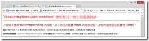

到此一個基本的WCF已經完成﹐接著再做一個Client程式﹐做為測試。

**1.3 WinForm Client**

現在先建立一個WinForm Client程式做為測試用﹐這個專案命名為WinUserValidatorForSoapHeader。

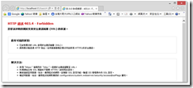

將上述的WCF加入服務參考後﹐加入以下的程式碼﹐就完成了基本的WCF測試程式。

Form1.cs

```cs
private void btnCallSaySomething_Click(object sender, EventArgs e) {    
    wcfHost.ProductServiceClient proxy = null;    
    try {    
         proxy = new wcfHost.ProductServiceClient();    
         txtOutputValue.Text = proxy.SaySomething(txtInputValue.Text);    
    } catch (Exception er) {    
         if (er.InnerException != null) {    
             txtSaySomethingMsg.Text = "InnerException error:" + er.InnerException.Message;    
         } else {   
              txtSaySomethingMsg.Text = "Exception error:" + er.Message;   
         }   
    }   
 }   
     
 private void btnCallProduct_Click(object sender, EventArgs e) {   
     wcfHost.ProductServiceClient proxy = null;   
     wcfHost.Product product = new wcfHost.Product();   
     try {   
          proxy = new wcfHost.ProductServiceClient();   
          product = proxy.GetProduct(txtPno.Text);   
          StringBuilder str = new StringBuilder();   
          str.Append("NO：" + product.No + Environment.NewLine);   
          str.Append("Name：" + product.Name + Environment.NewLine);   
          str.Append("Price：" + product.Price + Environment.NewLine);   
          str.Append("Quantity：" + product.Quantity + Environment.NewLine);   
     
          txtProductResult.Text = str.ToString();   
     } catch (Exception er) {   
          txtProductMsg.Text = er.Message;   
    }   
}
```

在還未開始加入SoapHeader之前﹐開啟Fiddler並執行client程式觀察送出的Request資料是什麼樣的型式。這將做為後續加入SoapHeader機制後的比對。

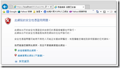

**2\. WCF實作 SoapHeader 認證**

在SoapHeader中預計將要加入如下的Header資訊做為使用者帳號/密碼的資訊。

```xml
<soapenv:Header>    
    <UserAccount xmlns="http://tempuri.org">testman</UserAccount>    
    <UserPassword xmlns="http://tempuri.org">a123456</UserPassword>    
</soapenv:Header>
```

**2.1 Client 程式加入 Header**

在上述WinUserValidatorForSoapHeader 的client程式將要加入SoapHeader﹐這有以下幾個工作

(1) 增加一個類別庫專案﹐繼承IClientMessageInspector, IDispatchMessageInspector, IEndpointBehavior,BehaviorExtensionElement﹐並實作介面。

(2) 修改app.config

2.1.1 **新增ClientHeader類別庫專案**

在這個類別裏﹐新增兩個Class﹐分別為 _CustomHeader.cs_ 和 _CustomBehaviorElement.cs_ 。

CustomHeader.cs 需要繼承 IClientMessageInspector, IDispatchMessageInspector, IEndpointBehavior。

CustomBehaviorElement.cs 需要繼承 BehaviorExtensionElement。

**CustomHeader.cs**

```cs
namespace ClientHeader {    
    public class CustomHeader : IClientMessageInspector, IDispatchMessageInspector, IEndpointBehavior {    
        //由Client的app.config or wcf.config中讀取設定的帳號密碼    
        private static string username = System.Configuration.ConfigurationManager.AppSettings["username"].ToString();    
        private static string pwd = System.Configuration.ConfigurationManager.AppSettings["pwd"].ToString();    
     
        #region 實作IClientMessageInspector 介面    
        public void AfterReceiveReply(ref System.ServiceModel.Channels.Message reply, object correlationState) { }    
    
        public object BeforeSendRequest(ref System.ServiceModel.Channels.Message request, System.ServiceModel.IClientChannel channel) {   
             MessageHeader userNameHeader = MessageHeader.CreateHeader("UserAccount", "http://tempuri.org", username, false, "");   
             request.Headers.Add(userNameHeader);   
             MessageHeader pwdNameHeader = MessageHeader.CreateHeader("UserPassword", "http://tempuri.org", pwd, false, "");   
             request.Headers.Add(pwdNameHeader);   
             Console.WriteLine(request);   
             return null;   
        }   
        #endregion   
     
        #region 實作IDispatchMessageInspector 介面   
        public object AfterReceiveRequest(ref System.ServiceModel.Channels.Message request, System.ServiceModel.IClientChannel channel, System.ServiceModel.InstanceContext instanceContext) {   
             return null;   
        }   
     
        public void BeforeSendReply(ref System.ServiceModel.Channels.Message reply, object correlationState) { }   
        #endregion   
     
        #region 實作IEndpointBehavior 介面   
        public void AddBindingParameters(ServiceEndpoint endpoint, System.ServiceModel.Channels.BindingParameterCollection bindingParameters) { }   
     
        public void ApplyClientBehavior(ServiceEndpoint endpoint, ClientRuntime clientRuntime) {   
             clientRuntime.MessageInspectors.Add(new CustomHeader());   
        }   
     
        public void ApplyDispatchBehavior(ServiceEndpoint endpoint, EndpointDispatcher endpointDispatcher) {   
             endpointDispatcher.DispatchRuntime.MessageInspectors.Add(new CustomHeader());   
        }   
           
         public void Validate(ServiceEndpoint endpoint) { }   
        #endregion   
    }   
}
```

其中在行10~17 實作 IClientMessageInspector 介面 BeforeSendRequest 就是要產生 SoapHeader 的部分﹐而在一開始所宣告的兩個變數 username 和 pwd 則可以設計成讀取client程式的config。

**CustomBehaviorElement.cs**

```cs
namespace ClientHeader {    
    public class CustomBehaviorElement : BehaviorExtensionElement {    
        #region 實作抽象類別    
        public override Type BehaviorType {    
            get { return typeof(CustomHeader); }    
        }    
     
        protected override object CreateBehavior() {    
            return new CustomHeader();   
        }   
        #endregion   
    }   
}
```

2.1.2 **修改****Client程式中的組態設定**

**(1) 首先Client程式先將上述的ClientHeader.dll參考進來。**

**(2) 接著﹐以WCF組態編輯器開啟WinUserValidatorForSoapHeader的aspp.config﹐並將組態中的樹狀結構打開至 進階/延伸/行為項目延伸 的地方。**

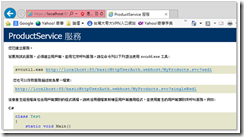

**(3) 在行為項目延伸點【新增】**

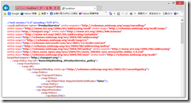

**在Type之處點選後﹐選擇加入的ClientHeader.dll﹐選擇型別名稱ClientHeader.CustomBehaviorElement。**

**在Name之處輸入一個自訂可以識別的名稱﹐這裏輸入ClientHeader。**

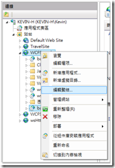

**回到WCF編輯器可以在行為項目延伸中找到剛剛加入的項目。**

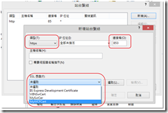

**這時開啟app.config來觀察也可以看到在 <system.serviceModel>中多了<extensions>的設定**

```xml
<system.serviceModel>
    <extensions>
        <behaviorExtensions>
		    <add name="ClientHeader" type="ClientHeader.CustomBehaviorElement, ClientHeader, Version=1.0.0.0, Culture=neutral, PublicKeyToken=null" />
		</behaviorExtensions>
    </extensions>
    .....
    ..... 
</system.serviceModel>
```

**(4) 新增端點行為**

**在進階下的端點行為增加一個端點行為﹐命名為ClientHeader.Behavior﹐按下【新增】後選擇ClientHeader(這一個就是上面行為項目延伸所增加的項目。**

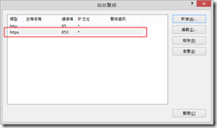

**(5) 在端點中加入端點行為**

**接著在用戶端下的端點設定BehaviorConfiguration﹐選擇上面的端點行為。**

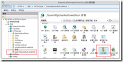

**經過上述的設定﹐再觀察app.config中有什麼改變。**

**app.config**

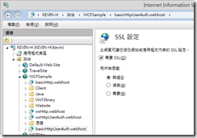

**Client加入SoapHeader的工作到此差不多結束﹐現在將程式重新建置後再執行﹐同時透過Fiddler再次觀察cleint所送出的Request有什麼不同。**

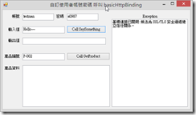

**現在送出的Request 已經包含了Header﹐不過WCF端還不能做解析﹐所以Response是失敗的。**

**2.2 WCF 實作 Header 解析**

**WCF必須要能解析上述的Header資訊﹐接下來將建立一個類別庫專案用來解析Header﹐但不用動到原本的WCF程式碼。**

**2.2.1****建立UserValidatorMessageHeader專案**

**WCF必須要能解析上述的Header資訊﹐現在新增一個類別庫的專案用來做Header的解析﹐專案命名為UserValidatorMessageHeader。在這個專案中將加入以下幾個類別檔**

**AuthorizationPolicy.cs**

**CustomIdentity.cs**

**CustomBehaviorExtensionElement.cs**

**CustomPrincipal.cs**

**UserValidator.cs**

**2.2.1.1 UserValidator.cs**

**UserValidator.cs﹐這個類別需要繼承****Attribute, IClientMessageInspector, IDispatchMessageInspector, IEndpointBehavior****﹐同時實作相關的介面。要繼承上述幾個類別需要加入System.ServiceModel的參考。**

```cs
using System;    
using System.Collections.Generic;    
using System.Linq;    
using System.ServiceModel;    
using System.ServiceModel.Description;    
using System.ServiceModel.Dispatcher;    
using System.Text;    
     
namespace UserValidatorMessageHeader {   
     [AttributeUsage(AttributeTargets.Class)]   
     public class UserValidator : Attribute, IClientMessageInspector, IDispatchMessageInspector, IEndpointBehavior {   
     
         public UserValidator() { }   
     
         #region IClientMessageInspector 成員   
         public void AfterReceiveReply(ref System.ServiceModel.Channels.Message reply, object correlationState) { }   
     
         public object BeforeSendRequest(ref System.ServiceModel.Channels.Message request, System.ServiceModel.IClientChannel channel) {   
             return null;   
         }   
         #endregion   
     
         #region IDispatchMessageInspector 成員   
         public string GetHeaderValue(string key) {   
             int index = OperationContext.Current.IncomingMessageHeaders.FindHeader(key, "http://tempuri.org");   
             if (index >= 0) {   
                 return OperationContext.Current.IncomingMessageHeaders.GetHeader<string>(index).ToString();   
             }   
             return null;   
         }   
     
         public object AfterReceiveRequest(ref System.ServiceModel.Channels.Message request, System.ServiceModel.IClientChannel channel, System.ServiceModel.InstanceContext instanceContext) {   
             Console.WriteLine(request);   
             string username = GetHeaderValue("UserAccount"); //讀取Header中的名稱為UserAccount的tag   
             string pwd = GetHeaderValue("UserPassword");     //讀取Header中的名稱為UserPassword的tag   
             if (username == "testman" && pwd == "a123456") {   
             } else {   
                 throw new FaultException ("使用者帳號/密碼不正確!");   
             }   
     
             return null;   
         }   
     
         public void BeforeSendReply(ref System.ServiceModel.Channels.Message reply, object correlationState) { }   
         #endregion   
     
     
         #region IEndpointBehavior 成員   
         public void AddBindingParameters(ServiceEndpoint endpoint, System.ServiceModel.Channels.BindingParameterCollection bindingParameters) { }   
     
         public void ApplyClientBehavior(ServiceEndpoint endpoint, ClientRuntime clientRuntime) {   
             clientRuntime.MessageInspectors.Add(new UserValidator());   
         }   
     
         public void ApplyDispatchBehavior(ServiceEndpoint endpoint, EndpointDispatcher endpointDispatcher) {   
             endpointDispatcher.DispatchRuntime.MessageInspectors.Add(new UserValidator());   
         }   
     
         public void Validate(ServiceEndpoint endpoint) { }   
         #endregion   
     }   
}
```

**在AfterReceiveRequest中判斷傳入的帳號密碼﹐與前面2.1.1是相同的﹐實務的做法當然是把這帳號/密碼做在設定檔中或資料庫中﹐這裏直接在程式中寫固定的值只是為了要測試用。**

**2.2.1.2****CustomBehaviorExtensionElement.cs**

**CustomBehaviorExtensionElement.cs﹐這個類別必須繼承BehaviorExtensionElement﹐同時實作抽象類別。**

```cs
using System;    
using System.Collections.Generic;    
using System.Linq;    
using System.ServiceModel.Configuration;    
using System.Text;    
     
namespace UserValidatorMessageHeader {    
    public class CustomBehaviorExtensionElement : BehaviorExtensionElement {    
        public override Type BehaviorType {   
             get { return typeof(UserValidator); }   
         }   
         protected override object CreateBehavior() {   
             return new UserValidator();   
         }   
    }   
 }
```

**2.2.1.3 CustomIdentity.cs**

**CustomIdentity.cs﹐這個類別繼承IIdentity。**

```cs
using System;    
using System.Collections.Generic;    
using System.Linq;    
using System.Security.Principal;    
using System.Text;    
     
namespace UserValidatorMessageHeader {    
    class CustomIdentity : IIdentity {    
        string name = "";   
     
         public CustomIdentity() {   
             UserValidator uv = new UserValidator();   
             this.name = uv.GetHeaderValue("UserAccount");   
         }   
     
         #region IIdentity 成員   
         public string AuthenticationType {   
             get { return "Custom"; }   
         }   
     
         public bool IsAuthenticated {   
             get { return true; }   
         }   
     
         public string Name {   
             get { return this.name; }   
         }   
     
         #endregion   
    }   
}
```

**2.2.1.4 CustomPrincipal.cs**

**CustomPrincipal.cs﹐這個類別需要繼承IPrincipal。**

```cs
using System;    
using System.Collections.Generic;    
using System.Linq;    
using System.Security.Principal;    
using System.Text;    
     
namespace UserValidatorMessageHeader {    
    class CustomPrincipal : IPrincipal {    
        string[] _roles;   
     
         private CustomIdentity identity;   
     
         public CustomPrincipal(CustomIdentity identity) {   
             this.identity = identity;   
        }   
     
         public IIdentity Identity {   
             get {   
                 return identity;   
             }   
        }   
     
         // IPrincipal role check   
         public bool IsInRole(string role) {   
             UserRoles();   
     
             return _roles.Contains(role);   
        }   
     
         // read Role of user from database   
         //依Login 的username 在此取得role   
         protected virtual void UserRoles() {   
             if (identity.Name == "testAdmin")   
                 _roles = new string[1] { "ADMIN" };   
             else   
                 _roles = new string[1] { "USER" };   
     
             if (_roles == null)   
                 throw new FaultException("AP 帳號查無對應的角色可執行服務");   
        }   
     
    }   
}
```

**2.2.1.5 AuthorizationPolicy.cs**

**AuthorizationPolicy.cs﹐這個類別則需要繼承IAuthorizationPolicy。**

```cs
using System;    
using System.Collections.Generic;    
using System.IdentityModel.Claims;    
using System.IdentityModel.Policy;    
using System.Linq;    
using System.Security.Principal;    
using System.Text;    
     
namespace UserValidatorMessageHeader {   
     class AuthorizationPolicy : IAuthorizationPolicy {   
         Guid gid = Guid.NewGuid();   
     
         public bool Evaluate(EvaluationContext evaluationContext, ref object state) {   
             CustomIdentity client = new CustomIdentity();   
             evaluationContext.Properties["Principal"] = new CustomPrincipal(client);   
     
             return true;   
         }   
     
         private IIdentity GetClientIdentity(EvaluationContext evaluationContext) {   
             object obj;   
             if (!evaluationContext.Properties.TryGetValue("Identities", out obj))   
                 throw new Exception("No Identity found");   
     
             IList<IIdentity> identities = obj as IList<IIdentity>;   
             if (identities == null || identities.Count <= 0)   
                 throw new Exception("No Identity found");   
     
             return identities[0];   
         }   
     
         public System.IdentityModel.Claims.ClaimSet Issuer {   
             get { return ClaimSet.System; }   
         }   
     
         public string Id {   
             get { return gid.ToString(); }   
         }   
     
    }   
}
```

**將UserValidatorMessageHeader建置﹐產生****UserValidatorMessageHeader.dll****。**

**2.2.2 WCF****的組態設定**

**在前面所建立的basicHttpSoapHeader.host WCF網站﹐將上述所建置的UserValidatorMessageHeader.dll引用。接著編輯WCF組態。這裏將採用視覺化的設定。**

**以WCF編輯器開啟之後﹐將左側樹狀結構點開到以下位置****進階-- >延伸-->行為項目延伸****。**


**點擊右側行為項目延伸畫面下方的【新增】鍵﹐會開啟一個延伸組態項目編輯器畫面。**

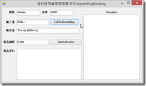

**在延伸組態項目編輯器中有Type和Name。**

**點擊Type最右方的[…]按鍵﹐選擇 UserValidatorMessageHeader.dll 的型別名稱UserValidatorMessageHeader.CustomBehaviorExtensionElement。**

**Name則輸入一個可識別的名稱﹐這個例子輸入的名稱為UserValidatorMessageHeader。**

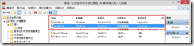

**按下【確定】後回到行為項目延伸畫面﹐應該可以找到剛剛所加入的新項目。**

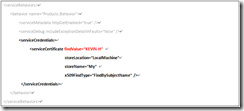

**接著打開wcf.config﹐可以觀察到在 <system.serviceModel>中增加了<extensions>的設定**

```xml
<system.serviceModel>
    <extensions>
	  <behaviorExtensions>
	     <add name="UserValidatorMessageHeader" type="UserValidatorMessageHeader.CustomBehaviorExtensionElement, UserValidatorMessageHeader, Version=1.0.0.0, Culture=neutral, PublicKeyToken=null" />
	  </behaviorExtensions>
    </extensions>
    …………
    ………… 
</system.serviceModel>
```

**下一步﹐需要在行為中加入一些東西並在service下的endpoint也加入設定。**

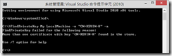

**下一步﹐回到組態編輯器﹐新增服務行為的行為項目延伸**

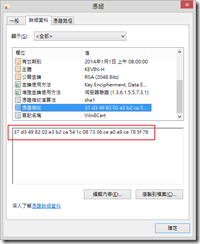

**點選「serviceAuthorization」**

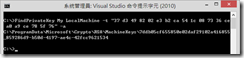

**在serviceAuthorization下的PrincipalPermissionMode改為Custom。**

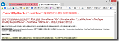

**切換到serviceAuthorization下的授權原則﹐並按下「新增」﹐在授權原則類型項目編輯器中的PolicyType選擇Bin之下的UserValidatorMessageHeader.dll﹐可以選擇授權原則類型UserValidatorMessageHeader.AuthorizationPolicy。**

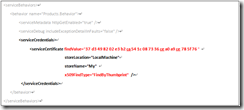

**經過上述的設定﹐檢視wcf.config增加了那些設定﹐讓我們明白這些繁複的手續是要做了那些事。**

```xml
<behaviors>    
    <endpointBehaviors>    
        <behavior name="UserValidator.Behavior">    
            <UserValidatorMessageHeader/>    
        </behavior>    
    </endpointBehaviors>    
    <serviceBehaviors>    
        <behavior name="Products.Behavior">    
            <serviceMetadata httpGetEnabled="true"/>   
             <serviceDebug includeExceptionDetailInFaults="true"/>   
             <serviceAuthorization principalPermissionMode="Custom">   
             <authorizationPolicies>   
                 <add policyType="UserValidatorMessageHeader.AuthorizationPolicy, UserValidatorMessageHeader, Version=1.0.0.0, Culture=neutral, PublicKeyToken=null"/>   
             </authorizationPolicies>   
             </serviceAuthorization>   
         </behavior>   
     </serviceBehaviors>   
 </behaviors>
```

**2.2.3 測試與驗證****SoapHeader功能**

**現在WCF和client程式都完成﹐開啟Fiddler測試並觀察。**

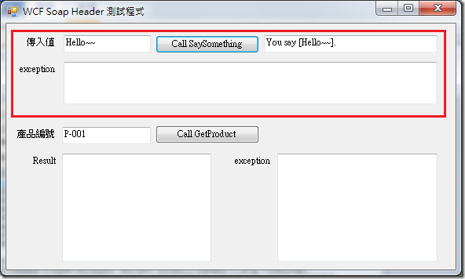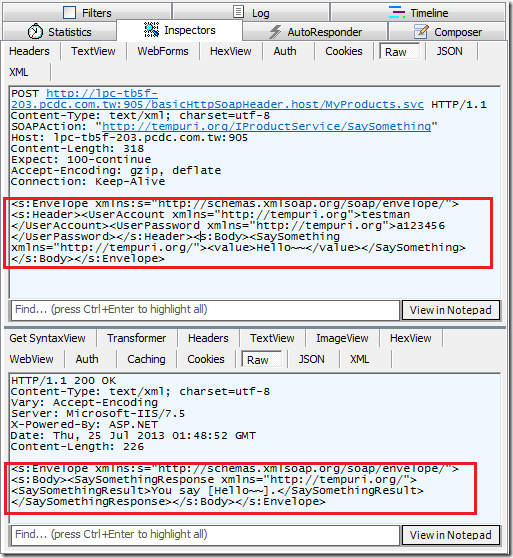

**由Client送出的資料確實已包含了我們所相要的SoapHeader資訊。**

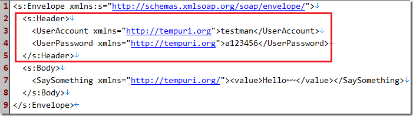

**而WCF也成功的回應資料。**

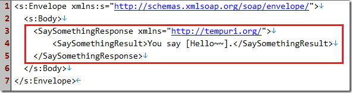

**若將Client程式app.config設定的密碼故意輸入錯的﹐則無法執行﹐到此WCF以SoapHeader做認證的功能已可運作。**

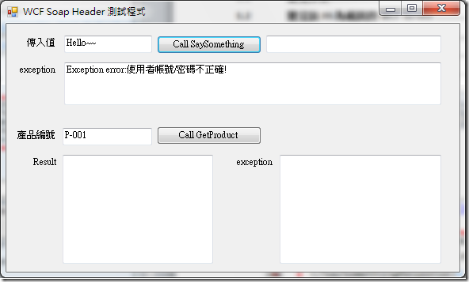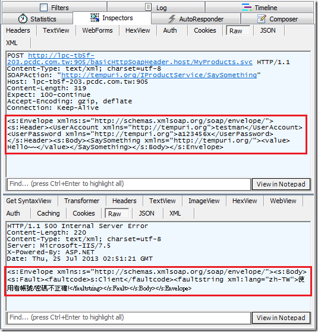

**3 增加角色判斷**

**使用者帳號/密碼讓WCF有了基本的認證功能﹐藉此判斷服務可否合法提供使用﹐但在實務上這不夠彈性﹐如果服務是有區別的﹐並不是所有通過認證的人都可以使用﹐那麼將服務加入角色判斷就有必要了。在前述建立UserValidatorMessageHeader專案所加入的類別檔中﹐其中CustomPrincipal.cs就是要處理角色的判斷。**

**在****CustomPrincipal.cs****中的UserRoles()方法中﹐判斷如果使用者帳號為testAdmin﹐則角色為ADMIN否則為角色為USER。**

```xml
protected virtual void UserRoles() {    
     if (identity.Name == "testAdmin")    
          _roles = new string[1] { "ADMIN" };    
     else    
          _roles = new string[1] { "USER" };    
     
     if (_roles == null)    
          throw new FaultException("AP 帳號查無對應的角色可執行服務");    
}
```

**現在必須為服務定義什麼樣的角色才可以執行﹐開啟MyProducts.lib專案下的ProductService幫服務加上角色的設定。**

```cs
[PrincipalPermission(SecurityAction.Demand, Role = "ADMIN")]    
public string SaySomething(string value) {    
    return "You say [" + value + "].";    
}    
     
public Product GetProduct(string productNo) {    
    MakeProductData();    
     
    Product product = new Product();   
     try {   
          var result = from p in ProductList   
                        where p.No == productNo   
                        select p;   
           foreach (Product p in result) {   
               product.No = p.No;   
               product.Name = p.Name;   
               product.Price = p.Price;   
               product.Quantity = p.Quantity;   
           }   
     } catch (Exception er) {   
           throw new FaultException(er.Message);   
     }   
     return product;   
 }
```

**這裏有兩個方法﹐分別為SaySomething和GetProduct﹐現在只為SaySomething的方法加上角色定義的標籤**

**[PrincipalPermission(SecurityAction.Demand, Role = "ADMIN")]**

**為了測試將 UserValidator.cs 中的 AfterReceiveReques t做一下修改**

```cs
public object AfterReceiveRequest(ref System.ServiceModel.Channels.Message request, System.ServiceModel.IClientChannel channel, System.ServiceModel.InstanceContext instanceContext) {    
  Console.WriteLine(request);    
  string username = GetHeaderValue("UserAccount"); //讀取Header中的名稱為UserAccount的tag    
  string pwd = GetHeaderValue("UserPassword");     //讀取Header中的名稱為UserPassword的tag    
  if ((username == "testman" && pwd == "a123456") || (username == "testAdmin" && pwd == "a777")) {    
  } else {    
     throw new FaultException("使用者帳號/密碼不正確!");    
  }    
  return null;   
 }
```

**現在有兩個合法的帳號testman和testAdmin可以呼叫服務﹐而在服務中SaySomething限定只有角色ADMIN才可以使用﹐將程式編譯後﹐執行測試。**

**首先﹐使用testman的帳號﹐呼叫SaySomething方法出現存取被拒的錯誤﹐而呼叫GetProduct則沒問題。**

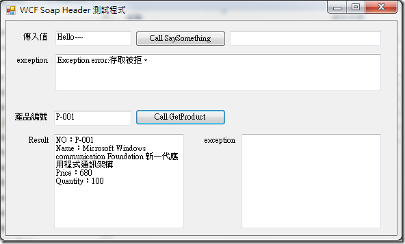

**接著使用testAdmin帳號測試﹐兩個方法都可以使用。**

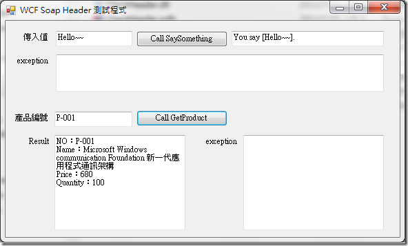

**WCF 使用 SoapHeader 做安全性的認證做法到這裏已經完成﹐下一篇則是要以Http Request 的方式來呼叫 具有 SoapHeader 認證的WCF ﹐並以 .Net﹑Java 及 Android 來做示範。**