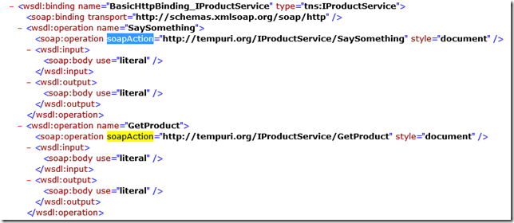
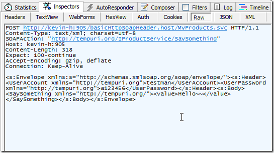
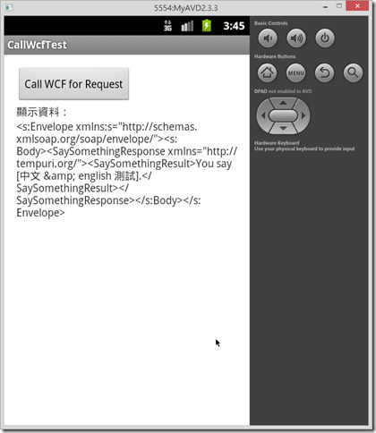

WCF安全性認證：SoapHeader(二)使用HTTP Request呼叫

在前面第一篇介紹的WinFrom Client 端程式為了送出request時要產生SoapHeader﹐而另外撰寫了一個ClientHeader類別庫﹐並且必須在組態加入對應的設定﹐手續看起來有些複雜。實務上﹐有時會希望是以WebRequest的原生方式自行組合Soap 格式資料來進行資料的交換。

在開始之前需要先知道一些資料的規則﹐首先由wsdl規格中可以找到**SOAPAction**。



前面的介紹過程中在使用Fiddler觀察資料時﹐可以看到送出的標準Soap資料格式﹐這是現在在程式中要自行組合的字串﹐其中包含了SoapHeader﹐要呼叫的方法與傳遞的參數。



```
<soapenv:Envelope xmlns:soapenv=\"http://schemas.xmlsoap.org/soap/envelope/\" xmlns:tem=\"http://tempuri.org/\">    
<soapenv:Header>    
    <UserAccount xmlns=\"http://tempuri.org\">帳號</UserAccount>    
    <UserPassword xmlns=\"http://tempuri.org\">密碼</UserPassword>    
  </soapenv:Header>    
  <soapenv:Body>    
    <tem:SaySomething>    
      <tem:value>test</tem:value>    
    </tem:SaySomething>   
   </soapenv:Body>   
 </soapenv:Envelope>
```

有了SoapAction和Soap資料的格式﹐接下來就使用三種平台的方式來撰寫。

1. .Net 的呼叫方式

```
string wsdlUri = "http://kevin-h:905/basicHttpSoapHeader.host/MyProducts.svc?singleWsdl";    
string username = System.Configuration.ConfigurationManager.AppSettings["username"].ToString();    
string pwd = System.Configuration.ConfigurationManager.AppSettings["pwd"].ToString();    
     
private void btnCallSaySomething_Click(object sender, EventArgs e) {    
    try {    
        HttpWebRequest webRequest = (HttpWebRequest)WebRequest.Create(wsdlUri);    
        webRequest.Method = "POST";    
        webRequest.ContentType = "text/xml;charset=UTF-8";   
                 webRequest.Headers.Add("SOAPAction:\"http://tempuri.org/IProductService/SaySomething\"");  //<--SOAPAction 別忘了   
         StringBuilder soapStr = new StringBuilder(Environment.NewLine);   
         soapStr.Append("<soapenv:Envelope xmlns:soapenv=\"http://schemas.xmlsoap.org/soap/envelope/\" xmlns:tem=\"http://tempuri.org/\">" + Environment.NewLine);   
         soapStr.Append("  <soapenv:Header>" + Environment.NewLine);   
         soapStr.Append("    <UserAccount xmlns=\"http://tempuri.org\">"+username+"</UserAccount>" + Environment.NewLine);   
         soapStr.Append("    <UserPassword xmlns=\"http://tempuri.org\">"+pwd+"</UserPassword>" + Environment.NewLine);   
         soapStr.Append("  </soapenv:Header>" + Environment.NewLine);   
         soapStr.Append("  <soapenv:Body>" + Environment.NewLine);   
         soapStr.Append("    <tem:SaySomething>" + Environment.NewLine);   
         soapStr.Append("      <tem:value>test</tem:value>" + Environment.NewLine);   
         soapStr.Append("    </tem:SaySomething>" + Environment.NewLine);   
         soapStr.Append("  </soapenv:Body>" + Environment.NewLine);   
         soapStr.Append("</soapenv:Envelope>" + Environment.NewLine);   
     
         byte[] buffer = Encoding.UTF8.GetBytes(soapStr.ToString());   
         webRequest.ContentLength = buffer.Length;   
         Stream post = webRequest.GetRequestStream();   
         post.Write(buffer, 0, buffer.Length);   
         post.Close();   
     
         HttpWebResponse response;   
         response = (HttpWebResponse)webRequest.GetResponse();   
         Stream respostData = response.GetResponseStream();   
         StreamReader sr = new StreamReader(respostData);   
         string strResponseXml = sr.ReadToEnd();   
     
         txtOutputValue.Text = strResponseXml;   
     } catch (Exception er) {   
         if (er.InnerException != null) {   
             txtSaySomethingMsg.Text = "InnerException:" + er.InnerException.Message;   
         } else {   
             txtSaySomethingMsg.Text = "Exception:" + er.Message;   
         }   
     }   
 }
```

上述的程式執行之後所得到的結果為以下的XML格式資料﹐只要Parse這個資料就可以得到想要的東西。

```
<s:Envelope xmlns:s="http://schemas.xmlsoap.org/soap/envelope/">    
<s:Body>    
    <SaySomethingResponse xmlns="http://tempuri.org/">    
        <SaySomethingResult>You say [test].</SaySomethingResult>    
    </SaySomethingResponse>    
</s:Body>    
</s:Envelope>
```

2. Java 的呼叫方式

```
package wcf.com;    
     
import java.io.BufferedReader;    
import java.io.ByteArrayOutputStream;    
import java.io.InputStreamReader;    
import java.io.OutputStream;    
import java.net.HttpURLConnection;    
import java.net.URL;    
import java.net.URLConnection;   
     
 public class wcfClient {   
     public static void main(String[] args) {   
         String responseString = "";   
         String outputString = "";   
         String wsURL = "http://kevin-h:905/basicHttpSoapHeader.host/MyProducts.svc?wsdl";   
     
         try{   
             URL url = new URL(wsURL);   
             URLConnection connection = url.openConnection();   
             HttpURLConnection httpConn = (HttpURLConnection)connection;   
             ByteArrayOutputStream bout = new ByteArrayOutputStream();   
               
             StringBuilder xmlInput=new StringBuilder();   
             xmlInput.append("<soapenv:Envelope xmlns:soapenv=\"http://schemas.xmlsoap.org/soap/envelope/\" xmlns:tem=\"http://tempuri.org/\">\n");   
             xmlInput.append("  <soapenv:Header>\n");   
             xmlInput.append("    <UserAccount xmlns=\"http://tempuri.org\">testman</UserAccount>\n");   
             xmlInput.append("    <UserPassword xmlns=\"http://tempuri.org\">a123456</UserPassword>\n");   
             xmlInput.append("  </soapenv:Header>\n");   
             xmlInput.append("  <soapenv:Body>\n");   
             xmlInput.append("    <tem:SaySomething>\n");   
             xmlInput.append("      <tem:value>中文字測試</tem:value>\n");   
             xmlInput.append("    </tem:SaySomething>\n");   
             xmlInput.append("  </soapenv:Body>\n");   
             xmlInput.append("</soapenv:Envelope>\n");   
               
             byte[] buffer=new String(xmlInput).getBytes();   
             bout.write(buffer);   
             byte[] b = bout.toByteArray();   
             String SOAPAction ="http://tempuri.org/IProductService/SaySomething";   
               
             //設定適當的Http參數   
             httpConn.setRequestProperty("Content-Length",String.valueOf(b.length));   
             httpConn.setRequestProperty("Content-Type", "text/xml; charset=utf-8");   
             httpConn.setRequestProperty("SOAPAction", SOAPAction);   
             httpConn.setRequestMethod("POST");   
             httpConn.setDoOutput(true);   
             httpConn.setDoInput(true);   
             OutputStream out = httpConn.getOutputStream();   
             out.write(b);   
             out.close();   
     
             InputStreamReader isr = new InputStreamReader(httpConn.getInputStream());   
             BufferedReader in = new BufferedReader(isr);   
            
             while ((responseString = in.readLine()) != null) {   
                 outputString = outputString + responseString;   
             }   
     
               
             System.out.println(outputString);   
         }catch(Exception er){   
             er.printStackTrace();   
         }   
     }   
 }
```

執行後可以看到輸出的結果和前面.Net得到的結果相同﹐接下就要自行parse XML了。

Ps.在使用eclipse撰寫時﹐送出request並能正確的接回資料﹐但後來在傳遞的值改為中文後就一直失敗。直覺是編碼出了問題﹐查了許久才發現﹐eclipse在windows時檔案存檔時預設檔案格式編碼為MS950﹐如果將檔案改存為UTF-8則傳遞中文的問題就解決了。

3. Android 的呼叫方式

時下最流行的行動裝置﹐當然也必須要能呼叫WCF才行﹐以下的示範是以Android 4.2.2版本為例。

在Android 3.0之後在主執行緒上不能直接進行網路活動﹐否則將會得到NetworkOnMainThreadException錯誤訊息。因此在這裏先建立一個SoapObjec的class﹐在主執行緒上再以另一個Thread來執行。

SoapObject.java

```
package com.example.callwcftest;    
     
import java.io.IOException;    
     
import org.apache.http.HttpEntity;    
import org.apache.http.HttpResponse;    
import org.apache.http.client.ClientProtocolException;    
import org.apache.http.client.ResponseHandler;    
import org.apache.http.client.methods.HttpPost;   
 import org.apache.http.entity.ByteArrayEntity;   
 import org.apache.http.impl.client.DefaultHttpClient;   
 import org.apache.http.params.HttpConnectionParams;   
 import org.apache.http.params.HttpParams;   
 import org.apache.http.params.HttpProtocolParams;   
 import org.apache.http.util.EntityUtils;   
     
 import android.util.Log;   
     
 public class SoapObject {   
     private String wsURL="";   
     private String soapAction="";   
     private String soapBody="";   
       
     public void setWsURL(String wsURL){   
         this.wsURL=wsURL;   
     }   
       
     public void setSoapAction(String soapAction){   
         this.soapAction=soapAction;   
     }   
       
     public void setSoapBody(String soapBody){   
         this.soapBody=soapBody;   
     }   
     
     public String sendRequest(){   
         String responseString="";   
         final DefaultHttpClient httpClient=new DefaultHttpClient();   
         // request 參數   
           HttpParams params = httpClient.getParams();   
           HttpConnectionParams.setConnectionTimeout(params, 10000);   
           HttpConnectionParams.setSoTimeout(params, 15000);   
         // set parameter   
           HttpProtocolParams.setUseExpectContinue(httpClient.getParams(), true);   
     
           // POST the envelope   
           HttpPost httppost = new HttpPost(this.wsURL);   
           // add headers   
           httppost.setHeader("soapaction", this.soapAction);   
           httppost.setHeader("Content-Type", "text/xml; charset=utf-8");   
             
         try {   
             // the entity holds the request   
             // HttpEntity entity = new StringEntity(envelope);   
             HttpEntity entity = new ByteArrayEntity(this.soapBody.getBytes("UTF-8"));   
             httppost.setEntity(entity);   
     
             // Response handler   
             ResponseHandler<String> rh = new ResponseHandler<String>() {   
                 // invoked when client receives response   
                 public String handleResponse(HttpResponse response)   
                         throws ClientProtocolException, IOException {   
                     // get response entity   
                     HttpEntity entity = response.getEntity();   
     
                     // read the response as byte array   
                     StringBuffer out = new StringBuffer();   
                     byte[] b = EntityUtils.toByteArray(entity);   
     
                     // write the response byte array to a string buffer   
                     out.append(new String(b, 0, b.length));   
                     return out.toString();   
                 }   
             };   
     
             responseString = httpClient.execute(httppost, rh);   
         } catch (Exception e) {   
             Log.v("exception", e.toString());   
         }   
     
         // close the connection   
         httpClient.getConnectionManager().shutdown();   
           
         return responseString;   
     }   
 }
```

接著撰寫主執行緒的部分

```
package com.example.callwcftest;    
     
import android.app.Activity;    
import android.os.Bundle;    
import android.util.Log;    
import android.view.Menu;    
import android.view.View;    
import android.widget.Button;    
import android.widget.TextView;   
     
 public class MainActivity extends Activity {   
     
     Button btnCallWcf;   
     TextView txtMsg;   
     @Override   
     protected void onCreate(Bundle savedInstanceState) {   
         super.onCreate(savedInstanceState);   
         setContentView(R.layout.activity_main);   
           
         btnCallWcf=(Button)this.findViewById(R.id.btnCallWcf);   
         txtMsg=(TextView)this.findViewById(R.id.txtMsg);   
           
         btnCallWcf.setOnClickListener(WcfCall);   
     }   
       
     private Button.OnClickListener WcfCall=new Button.OnClickListener(){   
     
         @Override   
         public void onClick(View arg0) {   
             runOnUiThread(new Runnable() {   
                 @Override   
                 public void run() {   
                     try{   
                         String wsURL="http://xxx.xxx.xxx.xxx:905/basicHttpSoapHeader.host/MyProducts.svc?singleWsdl";   
                         String soapAction="http://tempuri.org/IProductService/SaySomething";   
                         StringBuilder soapBody=new StringBuilder();   
                         soapBody.append("<soapenv:Envelope xmlns:soapenv=\"http://schemas.xmlsoap.org/soap/envelope/\" xmlns:tem=\"http://tempuri.org/\">\n");   
                         soapBody.append("  <soapenv:Header>\n");   
                         soapBody.append("    <UserAccount xmlns=\"http://tempuri.org\">testman</UserAccount>\n");   
                         soapBody.append("    <UserPassword xmlns=\"http://tempuri.org\">a123456</UserPassword>\n");   
                         soapBody.append("  </soapenv:Header>\n");   
                         soapBody.append("  <soapenv:Body>\n");   
                         soapBody.append("    <tem:SaySomething>\n");   
                         soapBody.append("      <tem:value>中文 &amp; english 測試</tem:value>\n");   
                         soapBody.append("    </tem:SaySomething>\n");   
                         soapBody.append("  </soapenv:Body>\n");   
                         soapBody.append("</soapenv:Envelope>\n");   
                           
                         SoapObject client=new SoapObject();   
                         client.setWsURL(wsURL);   
                         client.setSoapAction(soapAction);   
                         client.setSoapBody(soapBody.toString());   
                           
                         txtMsg.setText(client.sendRequest());   
                         Log.v("success", txtMsg.getText().toString());   
                         }catch(Exception er){   
                             Log.d("MAIN err", er.getMessage());   
                         }   
                       
                 }   
             });   
               
         }   
           
     };   
     
 }
```

執行的結果



有了這些做法﹐應該可以應付很多狀況了。
