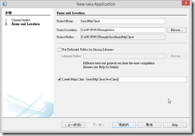
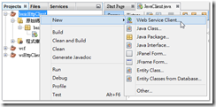
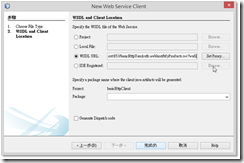
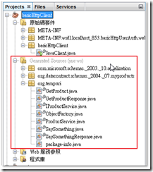
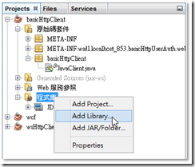
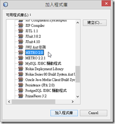
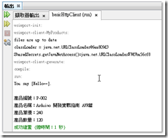
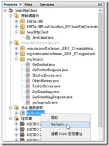

WCF繫結模式 — basicHttpBinding 之 Java(Netbeans + METRO) 調用

目錄：[WCF 自訂使用者帳號/密碼篇](http://www.dotblogs.com.tw/nethawk/archive/2012/12/23/85885.aspx)

這一篇將要實作 Java Client 如何調用具有使用者帳號密碼認證的 basicHttpBinding 繫結模式的 WCF 服務。原本這一篇是要使用 Eclipse + AXIS2 的﹐不過碰到了一些問題﹐暫時還沒找到解決方法﹐因此仍然是使用 NetBeans IDE + METRO 來介紹。

透過 NetBeans 來調用 basicHttpBinding 模式的 WCF 服務﹐在做法上有一部分和另一篇[WCF 繫結模式–wsHttpBinding 之 Java (NetBeans + METRO) 調用](http://www.dotblogs.com.tw/nethawk/archive/2012/12/25/85979.aspx)的做法有些不同﹐比較起來是簡單多了。在一開始建立專案到轉換檔案格式﹐這都和上一篇wsHttpBinding相同。

**建立專案**

在NetBeans中新增一個Java Application的新專案﹐專案名稱為basicHttpClient﹐Main Class為JavaClient。

[](https://dotblogsfile.blob.core.windows.net/user/nethawk/1301/WCF--basicHttpBinding-_1506F/image_2.png)

**加入Web Service Client**

[](https://dotblogsfile.blob.core.windows.net/user/nethawk/1301/WCF--basicHttpBinding-_1506F/image_4.png)

[](https://dotblogsfile.blob.core.windows.net/user/nethawk/1301/WCF--basicHttpBinding-_1506F/image_6.png)

**轉換檔案格式**

同樣的必須將NetBeans自動產生的class檔做轉換為UTF-8﹐請參考另一篇的做法。

[](https://dotblogsfile.blob.core.windows.net/user/nethawk/1301/WCF--basicHttpBinding-_1506F/image_8.png)

**加入METRO Library**

接著需要手動加入 METRO 2.0﹐這裏並不需要用到METRO 2.2.1。步驟上和調用 wsHttpBinding 就有點不同了﹐這裏在程式庫上右鍵選擇Add Library﹐選擇 METRO 2.0 加入就可了。

[](https://dotblogsfile.blob.core.windows.net/user/nethawk/1301/WCF--basicHttpBinding-_1506F/image_10.png)

[](https://dotblogsfile.blob.core.windows.net/user/nethawk/1301/WCF--basicHttpBinding-_1506F/image_12.png)

**撰寫 Client 程式**

JavaClient.java

```

   1:  package basicHttpClient;
```

```

   2:  import com.sun.xml.ws.developer.WSBindingProvider;
```

```

   3:  import org.datacontract.schemas._2004._07.myproducts.Product;
```

```

   4:
```

```

   5:  public class JavaClient {
```

```

   6:      public static void main(String[] args) {
```

```

   7:          //.keystore位置
```

```

   8:          System.setProperty("javax.net.ssl.trustStore", "D:\\Java\\Certificate\\my.TrustStore");
```

```

   9:          System.setProperty("javax.net.ssl.keyStore", "D:\\Java\\Certificate\\my.TrustStore");
```

```

  10:          //.keystore密碼
```

```

  11:          System.setProperty("javax.net.ssl.trustStorePassword", "123456");
```

```

  12:          System.setProperty("javax.net.ssl.keyStorePassword", "123456");
```

```

  13:
```

```

  14:          org.tempuri.ProductService service=null;
```

```

  15:          org.tempuri.IProductService port=null;
```

```

  16:          Product product=null;
```

```

  17:          try{
```

```

  18:              service=new org.tempuri.ProductService();
```

```

  19:              port=service.getBasicHttpBindingIProductService();
```

```

  20:
```

```

  21:              System.out.println(port.saySomething("Hello~~"));
```

```

  22:              System.out.println();
```

```

  23:
```

```

  24:              product=port.getProduct("P-002");
```

```

  25:              System.out.println("產品編號："+product.getNo().getValue());
```

```

  26:              System.out.println("產品名稱："+product.getName().getValue());
```

```

  27:              System.out.println("產品單價："+product.getPrice());
```

```

  28:              System.out.println("產品數量："+product.getQuantity());
```

```

  29:          }catch(Exception er){
```

```

  30:              er.printStackTrace();
```

```

  31:          }
```

```

  32:      }
```

```

  33:  }
```

<![CDATA[
.csharpcode, .csharpcode pre
{
font-size: small;
color: black;
font-family: consolas, "Courier New", courier, monospace;
background-color: #ffffff;
/\*white-space: pre;\*/
}
.csharpcode pre { margin: 0em; }
.csharpcode .rem { color: #008000; }
.csharpcode .kwrd { color: #0000ff; }
.csharpcode .str { color: #006080; }
.csharpcode .op { color: #0000c0; }
.csharpcode .preproc { color: #cc6633; }
.csharpcode .asp { background-color: #ffff00; }
.csharpcode .html { color: #800000; }
.csharpcode .attr { color: #ff0000; }
.csharpcode .alt
{
background-color: #f4f4f4;
width: 100%;
margin: 0em;
}
.csharpcode .lnum { color: #606060; }]]>

將上述的程式做編譯後執行看看是不是符合我們要的結果。

|  |
| --- |
| Compiling 1 source file to E:\aWCF\WCFSample\Java\basicHttpClient\build\classes  compile:  run:  com.sun.xml.ws.client.ClientTransportException: HTTP transport error: javax.net.ssl.SSLHandshakeException: java.security.cert.CertificateException: **No name matching localhost found**  at com.sun.xml.ws.transport.http.client.HttpClientTransport.getOutput(HttpClientTransport.java:133)  at com.sun.xml.ws.transport.http.client.HttpTransportPipe.process(HttpTransportPipe.java:153)  at com.sun.xml.ws.transport.http.client.HttpTransportPipe.processRequest(HttpTransportPipe.java:93)  at com.sun.xml.ws.transport.DeferredTransportPipe.processRequest(DeferredTransportPipe.java:105)  at com.sun.xml.ws.api.pipe.Fiber.\_\_doRun(Fiber.java:629)  at com.sun.xml.ws.api.pipe.Fiber.\_doRun(Fiber.java:588)  at com.sun.xml.ws.api.pipe.Fiber.doRun(Fiber.java:573)  at com.sun.xml.ws.api.pipe.Fiber.runSync(Fiber.java:470)  at com.sun.xml.ws.client.Stub.process(Stub.java:319)  at com.sun.xml.ws.client.sei.SEIStub.doProcess(SEIStub.java:157)  at com.sun.xml.ws.client.sei.SyncMethodHandler.invoke(SyncMethodHandler.java:109)  at com.sun.xml.ws.client.sei.SyncMethodHandler.invoke(SyncMethodHandler.java:89)  at com.sun.xml.ws.client.sei.SEIStub.invoke(SEIStub.java:140)  at $Proxy43.saySomething(Unknown Source)  at basicHttpClient.JavaClient.main(JavaClient.java:50)  Caused by: javax.net.ssl.SSLHandshakeException: java.security.cert.CertificateException: No name matching localhost found  at com.sun.net.ssl.internal.ssl.Alerts.getSSLException(Alerts.java:174)  at com.sun.net.ssl.internal.ssl.SSLSocketImpl.fatal(SSLSocketImpl.java:1764)  at com.sun.net.ssl.internal.ssl.Handshaker.fatalSE(Handshaker.java:241)  at com.sun.net.ssl.internal.ssl.Handshaker.fatalSE(Handshaker.java:235)  at com.sun.net.ssl.internal.ssl.ClientHandshaker.serverCertificate(ClientHandshaker.java:1206)  at com.sun.net.ssl.internal.ssl.ClientHandshaker.processMessage(ClientHandshaker.java:136)  at com.sun.net.ssl.internal.ssl.Handshaker.processLoop(Handshaker.java:593)  at com.sun.net.ssl.internal.ssl.Handshaker.process\_record(Handshaker.java:529)  at com.sun.net.ssl.internal.ssl.SSLSocketImpl.readRecord(SSLSocketImpl.java:958)  at com.sun.net.ssl.internal.ssl.SSLSocketImpl.performInitialHandshake(SSLSocketImpl.java:1203)  at com.sun.net.ssl.internal.ssl.SSLSocketImpl.startHandshake(SSLSocketImpl.java:1230)  at com.sun.net.ssl.internal.ssl.SSLSocketImpl.startHandshake(SSLSocketImpl.java:1214)  at sun.net.www.protocol.https.HttpsClient.afterConnect(HttpsClient.java:434)  at sun.net.www.protocol.https.AbstractDelegateHttpsURLConnection.connect(AbstractDelegateHttpsURLConnection.java:166)  at sun.net.www.protocol.http.HttpURLConnection.getOutputStream(HttpURLConnection.java:1014)  at sun.net.www.protocol.https.HttpsURLConnectionImpl.getOutputStream(HttpsURLConnectionImpl.java:230)  at com.sun.xml.ws.transport.http.client.HttpClientTransport.getOutput(HttpClientTransport.java:121)  ... 14 more  Caused by: java.security.cert.CertificateException: No name matching localhost found  at sun.security.util.HostnameChecker.matchDNS(HostnameChecker.java:210)  at sun.security.util.HostnameChecker.match(HostnameChecker.java:77)  at com.sun.net.ssl.internal.ssl.X509TrustManagerImpl.checkIdentity(X509TrustManagerImpl.java:264)  at com.sun.net.ssl.internal.ssl.X509TrustManagerImpl.checkServerTrusted(X509TrustManagerImpl.java:250)  at com.sun.net.ssl.internal.ssl.ClientHandshaker.serverCertificate(ClientHandshaker.java:1185)  ... 26 more  成功建置 (總時間：2 秒) |

看起來並不妙﹐這當中出現了一個錯誤訊息﹐No name matching localhost found 。這一段錯誤應該是SSL憑證不被認為是被信任所造成的﹐這可以如下解決。在第 7 行 if(hostname.equals(“localhost”)) 這裏試著用 locahost 或者本機主機名稱試試。

```

   1:  public class JavaClient {
```

```

   2:      static {
```

```

   3:          //for localhost testing only
```

```

   4:          javax.net.ssl.HttpsURLConnection.setDefaultHostnameVerifier(
```

```

   5:                  new javax.net.ssl.HostnameVerifier() {
```

```

   6:                      public boolean verify(String hostname, javax.net.ssl.SSLSession sslSession) {
```

```

   7:                          if (hostname.equals("localhost")) {
```

```

   8:                              return true;
```

```

   9:                          }
```

```

  10:                          return false;
```

```

  11:                      }
```

```

  12:                  });
```

```

  13:      }
```

```

  14:
```

```

  15:      public static void main(String[] args) {
```

```

  16:          ………
```

```

  17:      }
```

```

  18:  }
```

<![CDATA[
.csharpcode, .csharpcode pre
{
font-size: small;
color: black;
font-family: consolas, "Courier New", courier, monospace;
background-color: #ffffff;
/\*white-space: pre;\*/
}
.csharpcode pre { margin: 0em; }
.csharpcode .rem { color: #008000; }
.csharpcode .kwrd { color: #0000ff; }
.csharpcode .str { color: #006080; }
.csharpcode .op { color: #0000c0; }
.csharpcode .preproc { color: #cc6633; }
.csharpcode .asp { background-color: #ffff00; }
.csharpcode .html { color: #800000; }
.csharpcode .attr { color: #ff0000; }
.csharpcode .alt
{
background-color: #f4f4f4;
width: 100%;
margin: 0em;
}
.csharpcode .lnum { color: #606060; }]]>

再重新執行程式。

[](https://dotblogsfile.blob.core.windows.net/user/nethawk/1301/WCF--basicHttpBinding-_1506F/image_14.png)

輸出的結果﹐看起來是沒有錯﹐但是這裏並沒有做到使用者帳號密碼認證。

**修改 WCF 組態設定**

打開 WCF 的 web.config 檔案﹐檢視 binding的部分

|  |
| --- |
| 修改前  <basicHttpBinding>      <binding name="Products.BasicHttpBindig">          <security mode="**Transport**">              <transport clientCredentialType="**None**" />              <message clientCredentialType="UserName" />          </security>      </binding>  </basicHttpBinding> |
| 修改後  <basicHttpBinding>      <binding name="Products.BasicHttpBindig">          <security mode="**TransportWithMessageCredential**">              <transport clientCredentialType="**Certificate**" />              <message clientCredentialType="UserName" />          </security>      </binding>  </basicHttpBinding> |

將設定前後比對﹐主要是security的mode改為TransportWithMessageCredential的混合模式﹐同時也將transport的clientCredentialType改為Certificate。

修改完畢後記得開啟瀏覽器執行wsdl試試是否正常。

**編修 Java 程式**

WCF組態變更之後重回NetBeans必須將原本參考的WCF服務重新Refresh﹐Refresh會將之前generated程式重新再generated一次﹐所以必須再將所產生的程式再做一次的檔案格式轉換才可以。

[](https://dotblogsfile.blob.core.windows.net/user/nethawk/1301/WCF--basicHttpBinding-_1506F/image_16.png)

這時再執行程式應該會有新的錯誤產生

|  |
| --- |
| run:  2013/1/6 下午 03:04:21 com.sun.xml.wss.impl.misc.DefaultCallbackHandler handleUsernameCallback  嚴重的: WSS1500: Username Handler Not Configured properly using Callback and is null. (not cofigured)  2013/1/6 下午 03:04:21 com.sun.xml.wss.impl.misc.DefaultSecurityEnvironmentImpl getUsername  嚴重的: WSS0216: An Error occurred using Callback Handler for : UsernameCallback  2013/1/6 下午 03:04:21 com.sun.xml.wss.impl.misc.DefaultSecurityEnvironmentImpl getUsername  嚴重的: WSS0217: An Error occurred using Callback Handler handle() Method.  javax.security.auth.callback.UnsupportedCallbackException: Username Handler Not Configured  at com.sun.xml.wss.impl.misc.DefaultCallbackHandler.handleUsernameCallback(DefaultCallbackHandler.java:385)  at com.sun.xml.wss.impl.misc.DefaultCallbackHandler.handle(DefaultCallbackHandler.java:482)  at com.sun.xml.wss.impl.misc.DefaultSecurityEnvironmentImpl.getUsername(DefaultSecurityEnvironmentImpl.java:1118)  at com.sun.xml.wss.impl.filter.AuthenticationTokenFilter.resolveUserNameTokenData(AuthenticationTokenFilter.java:383)  at com.sun.xml.wss.impl.filter.AuthenticationTokenFilter.addUserNameTokenToMessage(AuthenticationTokenFilter.java:466)  at com.sun.xml.wss.impl.filter.AuthenticationTokenFilter.processUserNameToken(AuthenticationTokenFilter.java:113)  at com.sun.xml.wss.impl.HarnessUtil.processWSSPolicy(HarnessUtil.java:108)  at com.sun.xml.wss.impl.HarnessUtil.processDeep(HarnessUtil.java:272)  at com.sun.xml.wss.impl.SecurityAnnotator.processMessagePolicy(SecurityAnnotator.java:189)  at com.sun.xml.wss.impl.SecurityAnnotator.secureMessage(SecurityAnnotator.java:150)  at com.sun.xml.wss.jaxws.impl.SecurityTubeBase.secureOutboundMessage(SecurityTubeBase.java:397)  at com.sun.xml.wss.jaxws.impl.SecurityClientTube.processClientRequestPacket(SecurityClientTube.java:311)  ……….  ……… |

因此需要再程式中加人實際要驗證的帳號密碼

JavaClient.java

```

   1:  package basicHttpClient;
```

```

   2:
```

```

   3:  import com.sun.xml.ws.developer.WSBindingProvider;
```

```

   4:  import org.datacontract.schemas._2004._07.myproducts.Product;
```

```

   5:
```

```

   6:  public class JavaClient {
```

```

   7:      static {
```

```

   8:          //for localhost testing only
```

```

   9:          javax.net.ssl.HttpsURLConnection.setDefaultHostnameVerifier(
```

```

  10:                  new javax.net.ssl.HostnameVerifier() {
```

```

  11:                      public boolean verify(String hostname, javax.net.ssl.SSLSession sslSession) {
```

```

  12:                          if (hostname.equals("localhost")) {
```

```

  13:                              return true;
```

```

  14:                          }
```

```

  15:                          return false;
```

```

  16:                      }
```

```

  17:                  });
```

```

  18:      }
```

```

  19:
```

```

  20:      public static void main(String[] args) {
```

```

  21:          //.keystore位置
```

```

  22:          System.setProperty("javax.net.ssl.trustStore", "D:\\Java\\Certificate\\my.TrustStore");
```

```

  23:          System.setProperty("javax.net.ssl.keyStore", "D:\\Java\\Certificate\\my.TrustStore");
```

```

  24:          //.keystore密碼
```

```

  25:          System.setProperty("javax.net.ssl.trustStorePassword", "123456");
```

```

  26:          System.setProperty("javax.net.ssl.keyStorePassword", "123456");
```

```

  27:
```

```

  28:          org.tempuri.ProductService service=null;
```

```

  29:          org.tempuri.IProductService port=null;
```

```

  30:          Product product=null;
```

```

  31:          try{
```

```

  32:              service=new org.tempuri.ProductService();
```

```

  33:              port=service.getBasicHttpBindingIProductService();
```

```

  34:
```

```

  35:              WSBindingProvider bp = (WSBindingProvider) port;
```

```

  36:              bp.getRequestContext().put(WSBindingProvider.USERNAME_PROPERTY, "testman");
```

```

  37:              bp.getRequestContext().put(WSBindingProvider.PASSWORD_PROPERTY, "a0987");
```

```

  38:
```

```

  39:              System.out.println(port.saySomething("Hello~~"));
```

```

  40:              System.out.println();
```

```

  41:
```

```

  42:              product=port.getProduct("P-002");
```

```

  43:              System.out.println("產品編號："+product.getNo().getValue());
```

```

  44:              System.out.println("產品名稱："+product.getName().getValue());
```

```

  45:              System.out.println("產品單價："+product.getPrice());
```

```

  46:              System.out.println("產品數量："+product.getQuantity());
```

```

  47:          }catch(Exception er){
```

```

  48:              er.printStackTrace();
```

```

  49:          }
```

```

  50:      }
```

```

  51:  }
```

<![CDATA[
.csharpcode, .csharpcode pre
{
font-size: small;
color: black;
font-family: consolas, "Courier New", courier, monospace;
background-color: #ffffff;
/\*white-space: pre;\*/
}
.csharpcode pre { margin: 0em; }
.csharpcode .rem { color: #008000; }
.csharpcode .kwrd { color: #0000ff; }
.csharpcode .str { color: #006080; }
.csharpcode .op { color: #0000c0; }
.csharpcode .preproc { color: #cc6633; }
.csharpcode .asp { background-color: #ffff00; }
.csharpcode .html { color: #800000; }
.csharpcode .attr { color: #ff0000; }
.csharpcode .alt
{
background-color: #f4f4f4;
width: 100%;
margin: 0em;
}
.csharpcode .lnum { color: #606060; }]]>

到此執行之後應該就順利成功了。

參考資料

<http://blog.csdn.net/marvion/article/details/4015785>

<http://kaochiuan.blogspot.tw/2012/03/java-call-wcf-service-over-ssl-with.html>

<http://blog.csdn.net/cch5487614/article/category/672173>

<http://www.mkyong.com/webservices/jax-ws/java-security-cert-certificateexception-no-name-matching-localhost-found/>
