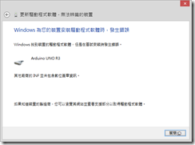
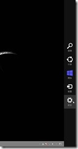
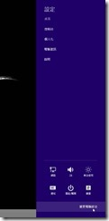
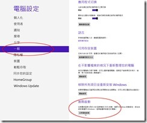
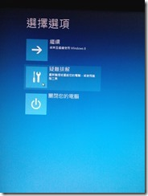
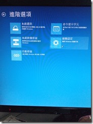
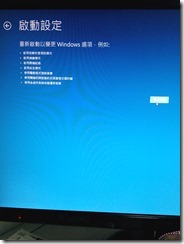
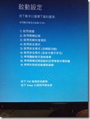
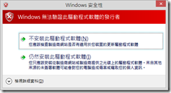
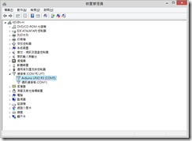

Arduino UNO for Windows 8 64位元 driver

荒廢了幾個月的arduino﹐最近趁著剛研究完WCF 再來重新復習一下。

前幾天從露天買了些套件回來﹐將Arduino UNO R3 接上USB 並指定了driver路徑後﹐在windows 8 之下安裝driver 竟然出現了錯誤﹐驚~~~。

錯誤是因為沒有簽章而無法安裝﹐上網查了一下﹐這個在windows 8 32 位元下不會有這個問題﹐在64位元之下會﹐不過不是沒有解決的辦法。

1.將滑鼠移到右上或右下角﹐出現WIN 8特有的功能列﹐以滑鼠點選最下方的【設定】。

2.右方的功能列變更為【設定】的選項﹐再點選最下方的【變更電腦設定】。

3.畫面切換為【電腦設定】﹐先點選左方的【一般】﹐再點選右方畫面最下方的【立即重新啟動】。

4.畫面會先路一陣子﹐再出現【選擇選項】後﹐以滑鼠點選【疑難排解】﹐然後再點選【進階選項】。

5.在【進階選項】中再點選【啟動設定】

6.在啟動設定畫面﹐直接按下【重新啟動】

7.接著電腦會重新開機﹐畫面會出現【啟動設定】﹐在這按下數字鍵 **7** **停用驅動程式強制簽章**

8.電腦重新開後﹐就可以再連接Arduino UNO 安裝驅動程式。安裝過程會出現「Windows 無法驗證此驅動程式軟體的發行者」﹐點擊「仍然安裝此驅動程式軟體」即可安裝好驅動程式。

