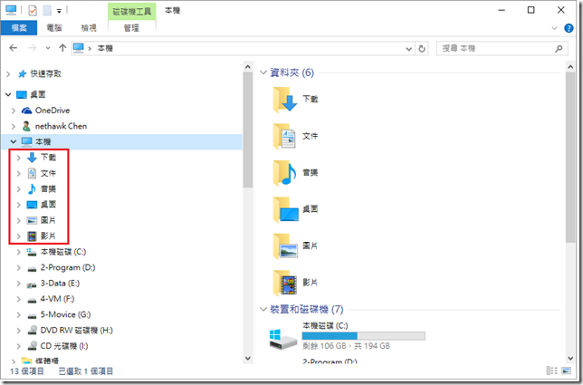

從 Windows 8.1 開始﹐開啟檔案總管在 **本機** 下多了幾個特殊的資料夾﹐但這些特殊的資料夾在媒體櫃或使用者之下就都有了﹐實在想不透為什麼在本機下要多這些特殊的資料夾。參加 Windows 10 Preview inside 時也建議過希望能這些資料夾移除﹐但不知道為什麼 Windows 10 還是延續了 Windows 8.1 的方式﹐外國人的思考比較特別嗎？ 還是真有人喜歡在本機之下多這些特殊的資料夾？

不管如何﹐還是有人不喜歡﹐所以在網路上早就有教學如何去除﹐執行regedit﹐尋找以下兩個位置的機碼

HKEY_LOCAL_MACHINE\SOFTWARE\Microsoft\Winodows\CurrentVersion\Explorer\MyComputer\NameSpace  
HKEY_LOCAL_MACHINE\SOFTWARE\Wow6432Node\Microsoft\Winodows\CurrentVersion\Explorer\MyComputer\NameSpace

在這兩個位置之下有以下的機碼

{088e3905-0323-4b02-9826-5d99428e115f}  
{1CF1260C-4DD0-4ebb-811F-33C572699FDE}  
{24ad3ad4-a569-4530-98e1-ab02f9417aa8}  
{374DE290-123F-4565-9164-39C4925E467B}  
{3ADD1653-EB32-4cb0-BBD7-DFA0ABB5ACCA}  
{3dfdf296-dbec-4fb4-81d1-6a3438bcf4de}  
{A0953C92-50DC-43bf-BE83-3742FED03C9C}  
{A8CDFF1C-4878-43be-B5FD-F8091C1C60D0}  
{B4BFCC3A-DB2C-424C-B029-7FE99A87C641}  
{d3162b92-9365-467a-956b-92703aca08af}  
{f86fa3ab-70d2-4fc7-9c99-fcbf05467f3a}

將上述的機碼刪除﹐那麼在檔案總管的本機及選擇檔案時的對話方框中這些特殊資料夾就不見了。

在 Windows 8.1 時我個人都是這麼做﹐手動刪除﹐不過到了 Windows 10 實在是懶了﹐因為刪除之後﹐在某些系統安全性更新完又會被還原﹐所以還是巴結點來寫支程式吧。對於 Registry 中的機碼讀取﹑寫入﹑刪除﹐在網路上已有許多分享的文章﹐在這裏就不多說了﹐但如果說寫的程式就是指向上述的兩個機碼路徑去刪除﹐那麼這就錯了。

首先必須要知道的﹐現在很多人是使用 Windows 64 位元版本﹐在64位元版本中登錄檔區分為32和64位元的機碼。如果直接執行 regedit.exe 是可以同時檢視 32 和 64 位元的機碼。其中 32 位元的機碼是顯示於 **HKEY_LOCAL_MACHINE\Software\WOW6432Node** 此處。也就是說 WOW6432Node 是映射 32 位元的機碼﹐我們可以開啟 32位元的 regedit.exe 來觀看 32位元的機碼。**%systemroot%\syswow64\regedit.exe** 開啟的就是檢視﹑編輯 32 位元的機碼。原則上 64位元和32位元的 regedit.exe 不能同時開啟﹐除非其中有一個執行時加上參數**–m** 。

說了這麼多﹐意思是要刪除特殊資料夾的機碼是需要刪除 64 和 32位元的機碼。

首先註冊機碼的路徑

string keyPath = @"SOFTWARE\Microsoft\Windows\CurrentVersion\Explorer\MyComputer\NameSpace";

分別宣告32位元和64位元

var regX86View = RegistryKey.OpenBaseKey(RegistryHive.LocalMachine, RegistryView.Registry32);

var regX68Key = regX86View.OpenSubKey(keyPath,true);

var regX64View = RegistryKey.OpenBaseKey(RegistryHive.LocalMachine, RegistryView.Registry64);

var regX64Key = regX86View.OpenSubKey(keyPath,true);

兩者都刪除才是真的刪除。

以下就不再囉嗦那麼多﹐必竟也只是個小程式﹐就提供個程式碼﹐當日後參考用。  
  
[deleteSpecialFolder_src.zip](<https://dotblogsfile.blob.core.windows.net/user/nethawk/1508/201582105442251.zip>)

[deleteSpecialFolder.zip](<https://dotblogsfile.blob.core.windows.net/user/nethawk/1508/201582105511783.zip>)