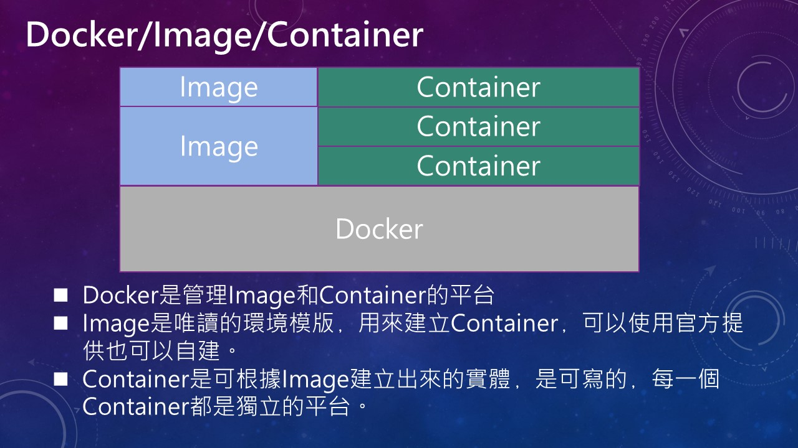

去年公司換了一位年輕有為的總經理﹐新的總經理指示﹐現在雲端是趨勢﹐公司的系統應該逐步的雲端化。 於是各部門主官們終於開始積極的了解什麼是雲端﹐要我們這些IT老人去思考手上十幾年的老系統如何雲端化。  

談雲端免不了談到 docker﹐免不了要和 VM 做個比較﹐最免不了的是要讓自己的老闆知道 docke r和 VM 有什麼不同﹐然後上雲有什麼需要注意和考量；不然那些東西該雲端化那些不應該做﹐老闆弄不清楚被老闆的老闆K﹐那麼我們這些底下的IT人員又要被罵了。一開始﹐從網路上找了一些 docker 和 VM 的比較資料﹐同時也寫了些程式做好 docker 部署的腳本﹐心想會議上把比較資料介紹完﹐演練一下 docker 指令和部署﹐大家都IT人應該就都了解 docker 和 VM 有什麼不同了﹐參加一般的 seminar 不都這樣嗎?  但開場不到 10 分鐘﹐老闆說話了﹐我不要聽技術的東西﹐你就告訴我到底那裏不一樣﹐我們的系統到底能不能上雲端﹐你去給我好好想想....好了﹐於是寫了這篇文章﹐儘量不談技術﹐希望老闆能了解。

檢視網路上的 docker 和 VM 各式的比較資料﹐對於很久沒接觸技術的長官們或許不是那麼容易了解﹐我想換個方式來說明﹐分為以下三個 Topic

- 系統架構的演變
- Container容器相對VM的特點
- AWS簡介

**系統架構的演變** 為什麼 docker 成為現在大家注目的焦點﹐docker 有什麼優勢？ docker 可以取代 VM 嗎？為什麼大家都要拿這兩者做比較呢？首先 docker 和 VM 都是虛擬化技術的產品但做法角度不同﹐VM 是作業系統的虛擬化﹐而docker container(容器)則是應用程式虛擬化﹐兩者間在應用上能否取代有什麼不同﹐我先從系統架構的演變來談。 一般的系統架構﹐拿單純的 AP Server 加上資料庫說起﹐就過去而言 **AP Server** 和 **資料庫**都是**實體主機**。 docker-aws-01

當系統有一定的重要性或使用者達到一定規模時﹐AP Server 和資料庫就會擴充﹐AP Server 擴充就會有數台的主機﹐做 Load Balance 做備援﹐同樣資料庫也需要備援。AP server 或資料庫的擴充都是實體主機﹐每台主機都需要 OS License﹐資料庫也需要有資料庫的 Lincense ﹐主機要成本﹐軟體 License 也是成本﹐主機越多成本越高。而且主機多﹐維護的成本就跟著高。 docker-aws-02

隨著系統的擴充﹐可能會把一些模組抽離出來成為服務放在不同的 AP server 上﹐方便後續的擴充和維護﹐而且也能提供不同系統的應用﹐而這也可能需要實體主機﹐可能也需要備援﹐主機越來多成本越來越高。 docker-aws-03

虛擬化的的技術出現並且成熟後﹐改變了一些狀況。可以買一台比較高檔的主機﹐CPU 強悍一些﹐記憶體和硬碟空間大一些﹐上面可以同時建置多個 VM﹐這樣一來主機的成本費用相對降低了些﹐而且只要將 VM 的映像檔備份好﹐一旦某一個 VM 出了問題或是主機出了問題﹐可以隨時卸載 VM 掛載新的﹐也可以快速的在另一部主機上掛載重建環境﹐快速恢復服務﹐和傳統的實體機比起來不管在維護上或災難回復上都快上了許多﹐雖然單一主機的價格比較貴﹐但主機數量少了﹐相對成本也少了些。 docker-aws-04

Docker Container(容器) 的出現讓虛擬化的做法有了一些不同﹐因為 container 就像一支作業系統上的應用程式﹐例如記事本﹐你可以隨時將執行中的記事本這個程式關閉再重啟而且很快速﹐是的 docker container 就類似這樣﹐所以當系統出了問題時﹐或者系統要更版時﹐可以把有問題的 container 關閉然後重啟﹐但這和 VM 重啟有什麼不同？ Container 是由 docker image 建置出來的一個實體﹐docker image 是一個應用程式的完整封裝﹐這個封裝中包含了應用程式和應用程式執行時所需要的成分﹐這包括了底層 OS 的 LIB﹑程式語言執行平台(.Net framework 或 Java JDK 之類的)和應用程式本身。 docker-aws-05

**docker / image / container 之間的關係**

- docker 是管理 image 和 container 的平台﹐在這平台中提供了許多相關的指令可對 image 和 container 做建置﹑部署﹑封裝﹑啟動﹑....各種動作。
- image 是一個唯讀的環境模板﹐用來建立 container﹐這個 image 模板可以是官方提供也可以是自建(可以用官方的 image 做為基底加上自己的應用程式建立出新的 image 模版)﹐ image 中包含了輕量的OS和程式語言執行平台﹐可能也包含了應用程式。一個 docker image 檔案相對 VM image 檔案小了許多﹐所以布署的速度相對快了許多。
- container 是根據 image 模板建立出來的實體﹐是一個可寫的(不過一旦 container 刪除﹐寫在裏面的東西也會隨著刪除)﹐每一個 container 都是一個獨立的平台。可以在 image 建立出 continer 後﹐手動下指令將應用程式放入 container 中﹐也可以先利用即有的 image 建立出包含應用程式的 image 檔﹐用這個已包含應用程式的 image 模板建立的 container 就不需要手動去加入應用程式。

**Container容器相對VM的特點** 這裏做一些 container 容器相對VM的特點描述

- docker image 檔案小﹐部署快。前面說過一個 image 包含了底層 OS﹐但這只是一個輕量級的 OS﹐主要是提供一些必要的元件給應用程式執行﹐因此它的檔案相對的小﹐所以由 docker image 去建置 container時就快﹐而 container 的啟動也很快﹐通常在幾秒內。 可以相像看一個 VM 的啟動像是一個 OS 重新開機到應用程式可以執行要花費多少時間﹐相比起來 docker 確時快了許多。
- docker 提供指令的方式讓部署的方式可以標準化和自動化﹐開發者將要部署的腳本檔寫好交給維運者﹐維運人員只要執行腳本檔就可以完成部署的工作﹐而且一切都指令化﹐維運人員還可以安排排程做自動化的部署﹐把一切工作標準化減少錯誤。
- 可攜性高﹐我們可以製作屬於自己的 docker image 當中已包含了應用程式﹐之後就能在不同的主機或環境移動。
- 雖然說每一個 container 都是獨立的平台﹐但是這和主機共用 Kernel﹐安全性和 VM 相比比較差﹐同時也不能在同一主機上使用不同的 Kernel OS 的容器﹐例如不能在 Linux 主機上執行 ASP.NET 程式的容器﹐畢竟 container 是共用主機的 Kernel。白話的說﹐一台實體主機(假設是Ｗindows server)上面可以同時安裝有 Windows 和 Linux 系統 VM﹐同時使用不會有任何問題﹐但是一台實體主機(假設是 Linux 系統)﹐那麼上面執行的 container 只能是 linux 的 container﹐不能用 windows 的 container。
- 隔離性差﹐一個 container 就像一支應用程式﹐一旦某一個 contianer 有問題﹐比如佔據過多的CPU或記憶體的資源﹐可能就影響到同一主機其它的 container 執行效率。

### docker-aws-07

**AWS簡介**

為什麼要用雲端？所有的雲端供應商大概都會講以下的廣告詞﹐但也是是實情 假設現在有一個新專案要進行  
        傳統來說﹐一個專案預測需要多少成本﹐就可能投入多少成本﹐但  
                預測時﹐常會高估或低估伺服器的等級﹑容量....。  
                後續把錢花費在運作和維護資料中心。  
        雲端的用法﹐**需要多少用量﹐付費多少就可以**。  
                因為可以隨需要擴展﹐所以一開始只要預估夠用的伺服器等級和容量﹐不夠時可以隨時擴展﹐不用花了錢買了硬體用不到或不夠用。  
                 不用花錢在硬體維護﹐而是專注在產品上。

一般談雲端指的是公有雲﹐目前主要的雲端平台是 Amazon Web Service（AWS）﹑ Microsoft Azure(Azure) 和 Google Cloud Platform（GCP）﹐Amazon 的 AWS 是最早創立(2006)﹐他的服務也是最完整﹐所以就以AWS 做為介紹。

**基礎設施**

- Regions(地理區域)
- Availability Zone(可用區域 AZ)
- Edge Location(Amazon CloudFront 一種 CDN 服務)

基礎設施可以參考 <https://aws.amazon.com/tw/about-aws/global-infrastructure/>  AWS 雲端遍及全球 22 個地理區域(Regions)內的 69 個可用區域(AZ)，而且已宣布計劃在開普敦、雅加達和米蘭增加 9 個可用區域和三個區域。 台灣沒有AZ﹐但是有 3 個 CloudFront。 為什麼要先知道地理區域？ 因為同樣的服務在不同的地理區域計價是不同的﹐每個地理區域提供的服務也不一定相同﹐通常最新的服務都是由歐美開始﹐而且通常效率的考量也是選越近的越好。 AWS 提供了許多服務﹐這裏提二個比較常見的 S3 和 EC2。

**Amazon S3 (Single Storage Service)**

- 存放 unstructrue data 無結構的資料。
- 無限制的儲存體﹐要存放多少多可以(但單一物件限制5TB)。
- 99.999999999% 11個 9 耐久性﹐上傳一個檔案﹐背後會自動複製到另二個AZ﹐所以總共會有3個AZ存放。
- Amazon S3 Glacier最便宜的儲存(磁帶) S3計價方式(<https://aws.amazon.com/s3/pricing/?nc1=h_ls>) 雲端的計價很多元﹐如何使用才會是最有利的必須要看仔細﹐而且在資料傳輸方面要特別注意﹐由 Internet 傳入雲端通常不計費﹐但由雲端傳出到 Internet 就要計費(以資料量計費)
- 提供Object Lifecycle﹐可以使用生命週期政策，定義物件存留期間 (例如，將物件轉換成另一個儲存體方案、封存物件，或在指定期限後刪除物件) 隨著時間將資料由 standar  自動搬移到 one zero 自動搬移到 glacier (<https://docs.aws.amazon.com/zh_tw/AmazonS3/latest/user-guide/create-lifecycle.html>)

申請 S3 基本就有靜態網頁的服務可以用﹐只要把靜態網頁的檔案上傳做些設定就能用了﹐不過要記得從雲端傳資料到 internet 是要計費的﹐所以如果用了靜態網頁﹐當有人執行網頁﹐由雲端 Response 資料出來就會算流量計費。

**Amazon EC2**

- EC2 就是個VM。
- EC2建置時就只有一個AZ。
- 要跨AZ(Auto scaling 自動動態擴展/縮減)必須另外勾選﹐要付費。
- 要搭配ELB(Elastic Load Balancing負載平衡)也要另外勾選﹐要付費。

[計價方式 https://aws.amazon.com/tw/ec2/pricing/reserved-instances/pricing/](https://aws.amazon.com/tw/ec2/pricing/reserved-instances/pricing/)  
[EC2執行個體類型 https://aws.amazon.com/tw/ec2/instance-types>](https://aws.amazon.com/tw/ec2/instance-types/)

