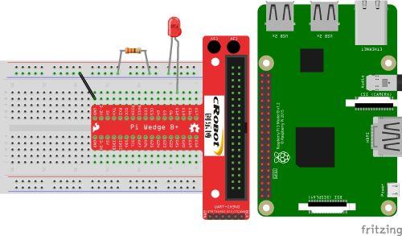

原來硬體的 PWM 和 軟體模擬差這麼多

之前玩 Rasperry pi 是跟著網路上的資料使用 python 撰寫﹐不過寫了多年的 C# 如果能夠直接拿來用的話那就太好了。 微軟在 Windows 10 就有推出 Raspberry pi 版本的 Windows 10 IoT OS﹐大約在 2018 年我曾經在 Raspberry pi 上安裝過﹐想著可以用熟悉的 C# 來進行實驗了﹐當時用 .Net Framework 寫 UWP﹐但是本身對於這種開發板的了解程度不深﹐而且 Win 10 for Raspberry pi  IoT在網路上幾乎找不到什麼資料﹐當時就根據著 python 語法的呼吸燈在 Win 10 下勉強寫了一個版本﹐但執行起來不順﹐在國外的MSDN發問也一直沒解決。

多年後寫網頁﹑寫後端程式寫的好煩﹐還是很想玩玩 Raspberry pi ﹐最近一次偶然情況看到一篇微軟 <https://github.com/dotnet/iot/blob/main/Documentation/raspi-pwm.md> 文章對於 Raspberry pi Hardware PWM 說明﹐而且 .Net Core 也已成熟﹐在文章中發現當初我的問題﹐於是把埋在箱子裏多年的 Raspberry pi 3B+ 的板子再度拿出來﹐這次使用 Raspberry Pi OS 在 Linux 環境下用 .Net 6 開發。

文章一開始有一個簡單的範例﹐依範例執行應該會出現錯誤﹐是的我照著做也出現了錯誤﹐錯誤主要的問題和文章說明的一樣

```
Unhandled exception. System.UnauthorizedAccessException: Access to the path '/sys/class/pwm/pwmchip0/export' is denied.
 ---> System.IO.IOException: Permission denied
```

這個需要去做一些設定將硬體的 PWM 打開(不過為什麼python 使用硬體PWM不需要這麼做？)﹐Raspberry pi 主板提供了單通道和雙通道兩種﹐原文中有列出每個PWM通道的可能選項﹐必須注意的是可以訪問的接腳只有 GPIO 12﹑18﹑13 和 19﹐其它 GPIO 不會公開。

我這裏使用單通道﹐那麼對於公開的 GPIO 接腳有 4 個選項

|  |  |  |  |  |
| --- | --- | --- | --- | --- |
| PWM | GPIO | Function | Alt | dtoverlay |
| PWM0 | 12 | 4 | Alt0 | dtoverlay=pwm,pin=12,func=4 |
| PWM0 | 18 | 2 | Alt5 | dtoverlay=pwm,pin=18,func=2 |
| PWM1 | 13 | 4 | Alt0 | dtoverlay=pwm,pin=13,func=4 |
| PWM1 | 19 | 2 | Alt5 | dtoverlay=pwm,pin=19,func=2 |

而這選項要在 /boot/config.txt 中設定

```
[all]
dtoverlay=w1-gpio
# pwm channel activating only 1
dtoverlay=pwm,pin=12,func=4
#dtoverlay=pwm,pin=18,func=2
#dtoverlay=pwm,pin=13,func=4
#dtoverlay=pwm,pin=19,func=2
```

這裏我犯了個錯誤﹐以為 4 個選項都要設定﹐結果一直不能正常運作﹐好在 Discord 上熱心的網友不斷的幫我確認才發現原來是只要設定一項才行。

程式很簡單﹐建立好專案後﹐先在 NuGet 安裝 Iot.Device.Bindings

```
Console.WriteLine("Hardware PWM Breathe Led Start.");
// chip 0, channel 0 -> GPIO 12
int pin = 0;
int channel = 0;
var pwm = PwmChannel.Create(pin, channel, 400, 1.0);
pwm.Start();

while (true)
{
  Console.WriteLine("逐漸變亮");
  for (double fill = 0.0; fill <= 1.0; fill += 0.01)
  {
    pwm.DutyCycle = fill;
    Thread.Sleep(10);
  }
  Thread.Sleep(1000);
  Console.WriteLine("逐漸變暗");
  for (double fill = 1.0; fill >= 0.0; fill -= 0.01)
  {
    pwm.DutyCycle = fill;
    Thread.Sleep(10);
  }
}
```



在影片中我還同時執行軟體模擬 PWM 做的呼吸燈﹐黃燈是 Hardware PWM﹐可以看到在明暗過程很順暢﹐綠燈則是 Software 模擬PWM 的結果﹐因為軟體模擬會因CPU需要處理別資源﹐所以在明暗過程不是很順﹐不是逐漸的變亮變暗﹐而是頓頓的﹐有時會突然亮或突然暗。

Git: <https://github.com/nethawkChen/hardware-pwm-breathe>
