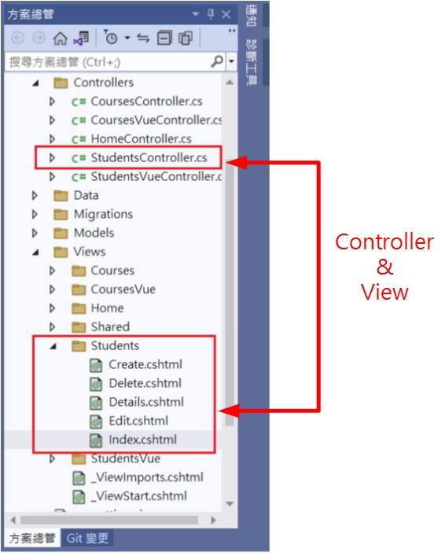
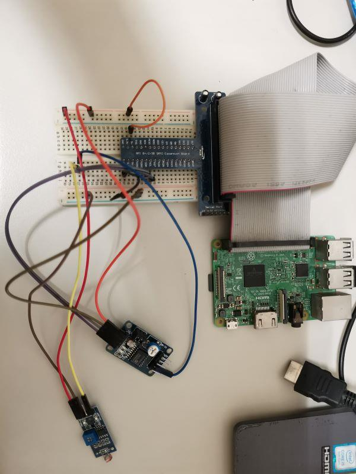

環境  
主板：Raspberry pi 3B+  
OS：Raspberry pi OS (linux)  
語言： .Net 6

樹莓派的接腳不支援類比訊號的讀取﹐所以需要藉由類比/數位轉換的元件﹐微軟有提供了一個範例 [從類比到數位轉換器讀取值 | Microsoft Learn](<https://learn.microsoft.com/zh-tw/dotnet/iot/tutorials/adc>) 用的是MCP3008﹐這一顆是SPI介面﹐手邊沒有這個而且查了價格好像也不便宜﹐翻找了一下之前淘寶買的元件中有一個 pcf8591t 也是同樣類比/數位轉換的功能﹐pcf8591t 是I2C的協定介面﹐這個元件有四個類比轉數位輸入通道和一個數位轉類比的輸出通道。這個元件還有一個可變電阻﹐一個光電阻和一個熱敏電阻。


翻找了 .Net IoT Libraries﹐糟糕﹐好像沒有對應的套件﹐難道沒辦法用 .Net 來撰寫嗎？不能這樣放棄﹐於是上Discord尋找協助﹐線上 Ellerbach 很快回覆了我﹐在 .Net IoT Libraries 中似乎是沒有這個﹐但可以試著用 Pcx857x 替代使用。既然如此就來試試看。雖然pcf8591t本身就有光敏電阻﹐不過我還是另外外接了一個光敏電阻。



```cs
using System.Device.I2c;
using Iot.Device.Pcx857x;
// PCF8591t default address 0x48
var connectionSettings = new I2cConnectionSettings(1, 0x48);
var i2cDevice = I2cDevice.Create(connectionSettings);
var pcf8591t = new Pcf8574(i2cDevice);  // 使用Pcf8574 driver
while(true){
  double value = pcf8591t.ReadByte();
  Console.WriteLine($"{value}%");
  Thread.Sleep(200);
}
```

沒想到一試成功﹐還真的OK﹐太棒了。

[GitHub](<https://github.com/nethawkChen/.net.iot.pcf8591t>)