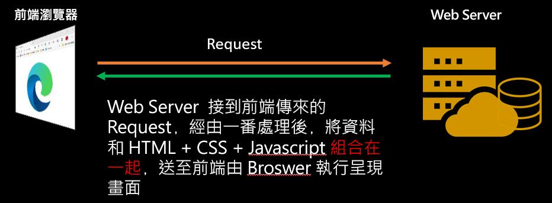
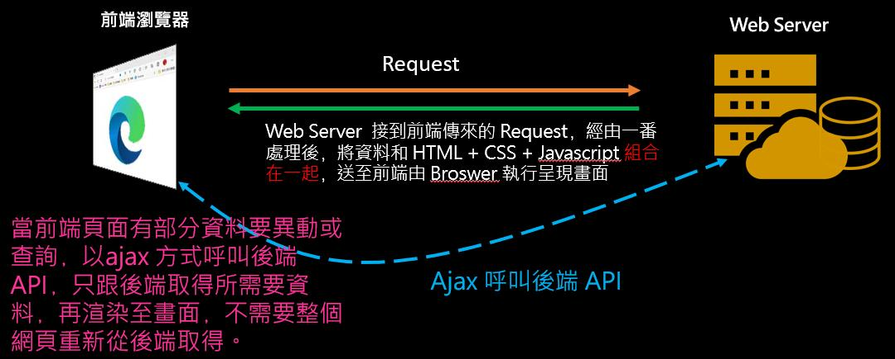
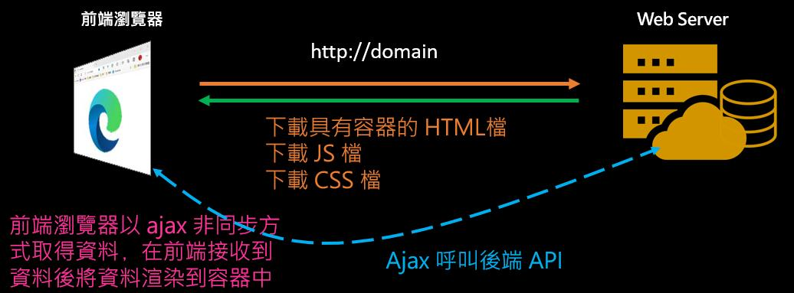

過去在職場上常聽到的是Internet 網頁程式設計師﹑Web應用工程師﹐但現在打開求職網站看到的則是徵求**前端工程師﹑後端工程師﹑全端工程師**﹐從名稱看前端工程師當然和前端框架有關﹐這幾年前端框架這名詞在Google一搜尋就會看不完的文章﹐那麼前端框架到底和過去的網頁應用程式開發有什麼不同呢？

前端框架目前最熱門的是React﹑Angular和Vue﹐如果要學習要如何著手呢？google之下有許多教學文章﹐但是我個人資質駑鈍﹐看了多篇文章總無法解決心中的疑問。許多文章一開始都教導要先安裝node.js﹐然後藉由npm套件管理安裝如Vue或React所需要的套件﹐然後開始建立專案﹐過程中可能會需要選擇webpack﹑babel…相關的東西﹐專案範本建立後就開始了框架的語法﹑架構…然後網頁開啟看結果….﹐唉﹐讓人想放棄了﹐這對於我原本的專案要如何套用改寫呢？在部署時又要怎麼做呢？也許有人和我有同樣的困擾。學習一個新的東西不單是未來新專案用新的方式撰寫﹐舊專案又該如何搭配或轉換呢？所以必須要了解到底前端框架的出現﹐和過去的系統開發有什麼不同。

不論是過去還是現的開發﹐**網頁系統的架構是不變的﹐一個網站的基本組成是 HTML +程式+ 後端資料庫**。  
HTML：包含了CSS﹑Javascript﹐這是由前端瀏覽器執行。  
程式：可以是.Net, Java, PHP, Javascript…各種語言﹐這是在後端 Web Server上運作執行的  
資料庫：存放資料的地方﹐當然有些系統的商業邏輯是寫在這裏。

大部分從事網頁設計的工程師應該都知道這個運作流程﹐不過在從事這工作三十幾年來﹐仍然還是發現有些人(不論資深資淺的工程師)沒有弄清楚前後端﹐常被問的問題是﹐為什麼Javascript連不上資料庫﹐或者Javascript呼叫不到他寫在cs檔上的一個方法(asp.net code behind)﹐或是中的變數為什麼 Javascript 讀不到…。總之﹐不要想那麼多﹐網頁系統的開發﹐前端只能執行前端的﹐後端只能執行後端的。

所以﹐在網頁系統架構不變﹐來看一下系統開發是從過去到現在前端框架的變化。

**傳統Web應用程式：**  
使用者在瀏覽器表單submit送出﹐後端Web Server收到前端的表單Request﹐將資料與HTML(包含了CSS和Javascript)做結合﹐一個完整的網頁送到前端﹐由瀏覽器把收到的完整網頁渲染到畫面。  
每一次的Request﹐都要整個回到後端﹐再把整個網頁重新組合好送到前端﹐一個網頁包含了許多的HTML標籤﹐代表每一次的封包都很龐大﹐每次往返前端與後端的時間會讓操作者感到停頓﹑等待。

**Ajax網頁：**  
在傳統的型式下﹐每一次往返當中有很多都是不必要的代碼﹐因為這當中有太多重覆的HTML標籤﹐這使得Web應用程式效率遠比不上本機應用程式。  
Ajax 應用改變了這一部分﹐它可以跟伺服器只要部分資料﹐不需要整個網頁往返﹐在2005年Google在Gmail﹑Google Map…大量利用ajax 技術後﹐讓大家驚豔﹐原本系統只要做一部分的調整就可以大幅度的提升效能﹐利用 ajax 跟後端要資料後﹐在前端利用Javascript 把資料渲染到畫面。

**前端框架：**  
講到前端框架﹐應該就會看到SPA(Sigle Page Application)一頁式網站設計的介紹﹐在Ajax 流行時就有人嚐試一頁式的網頁﹐不過到了前端框架後 SPA 才算是真正成熟和功能完善。所以前端框架和以前有什麼不一樣？

從圖來看和 Ajax 時的網頁很像﹐前端框架主要是第一次跟連線到網站﹐網站回應給前端瀏覽器時的 HTML + CSS + Javascript 這時是還沒有跟資料做結合﹐可以說只是一個具有容器的殼﹐一個準備要渲染畫面的殼(這時的殼是不包含實際要顯示的資料﹐所以這會牽涉到SEO Search Engine Optimization)﹐當前端接收到之後﹐接著因為我們在頁面上撰寫的前端框架的程式﹐利用非同步方式再跟後端取得資料﹐然後再渲染在畫面。ㄟˊ？那這和前面說的 ajax 網頁有什麼不一樣？前端框架當然是大量使用ajax ﹐但開發上是有很大的不同。

**前端框架的開發**  
一開始接觸前端框架﹐很多人都問前端框架和 jQuery 有什麼不同？簡單的來說﹐jQuery是一組龐大Library﹐引用jQuery系統架構不用重來﹐前端框架則是原本的系統要大幅度重寫了。  
jQuery 是一組龐大的 Library﹐當一個系統使用 jQuery﹐只要在<script>標籤 jQuery的js檔後﹐例如想要在輸入框輸入日期﹐要有個漂亮的 calendar元件讓使用者點選後選擇日期不需要輸入又能符合格式﹐原本的系統並不需要整個系統改寫﹐只要在要引用的部分做點小調整就好。但﹐前端框架也有類似的套件﹐可是前端框架有自己的語法﹐這不是單純的引用而己﹐原本的系統可以說需要大幅度的改寫甚至重寫。  
  
許多教學文章一開始介紹就是先安裝 node.js﹐主要是為了 npm﹐npm是個套件管理工具。有很多工具是協助我們開發﹐例如CSS預選器(SASS, LESS)﹑TypeScript﹑ES6轉譯﹑壓縮打包…﹐這當中有一些一開始不是標準 HTML 語法﹐需要經過轉換﹐當然我們可以手工打造﹐可是現在是強調快速開發﹐如果有現成的工具可以幫助我們節省時間而且減少錯誤﹐當然就要利用﹐所以開發時期安裝node.js以便我們可以使用 npm 就是一件必要的工作。node.js這個說的是在開發時期﹐且是開發 SPA 時使用﹐當系統要佈署到正式環境﹐note.js就不需要在正式環境中安裝(這裏的不需要是指專案中沒有使用note.js做為後端處理)﹐不過網路上教學文章大多著重在教如何撰寫前端框架﹐對於最後上線佈署提到的非常少﹐常會讓人誤解正式上線還是需要安裝note.js﹐但又不知道要做什麼。  
  
這篇文章寫的是 Vue.js 學習心得﹐為什麼會選擇 Vue？因為我不會Recat和Angular…﹐是的﹐不過應該說一開始為什麼要選擇Vue.js入手而不選其他的﹐主要是看上Vue相對於React和Angular在一開始只要有基本的HTML﹑CSS及Javascript的知識就可以很快上手﹐而且在沒使用過node.js﹐不知道npm和yarn是什麼的﹐都沒關係﹐可以先透過CDN引入 Vue.js 就可以開始上手﹐這對於一開始還不夠熟練且有一堆舊系統要準備改寫為前端框架來說﹐是一件很棒的事。  
  
十幾年的舊系統如果仍然運行的很好﹐當然可以不用更換﹐但是﹐現在資訊和網路快速發展﹐面臨需求快速開發﹑資安威脅﹐硬體﹑作業系統﹑開發工具…..各種升級週期越來越短﹐舊系統如果不跟著前進將會面臨許多的困難﹐但是採用新的技術對於原本系統進行改寫也是一項很大的工程﹐由其是後續的維護﹐前面開心的寫﹐上線後遭遇問題不知道如何解決﹐更是災難的開始。Vue.js可以在舊系統中先選定幾個頁面﹐像是使用jQuery一樣引入Vue.js﹐透過部分頁面改寫熟悉語法掌握特性後﹐就可以開始構思整個系統要引入前端框架需要有什麼樣的考量﹐需要什麼樣的架構﹐衝擊上應該會是比較小的。  
  
那麼是不是系統都應該改成前端框架呢？當然這就要視系統專案的實際需要了。不過﹐在學習 Vue.js 一段時間後﹐我個人覺得有一件不錯的事﹐在學習 MVC 時﹐常看到文章在解釋 Model﹑View﹑Controll 時常說關注點分離﹐是的其實在現在系統開發上都一直強調關注點分離。在 Asp.Net 開發時常看到很多人用 ClientScriptManager或 ScriptManager﹐這種在後端撰寫javascript ﹐執行時期才將javascript註冊在頁面﹐我個人非常不喜歡這種寫法﹐畢竟javascript 是瀏覽器端執行的而不是在後端﹐這種作法當有javascript的錯誤很難查覺﹐同時也很難在整個系統中知道有那些 javascript﹐因為被隱藏在後端程式碼中﹐更有些人會因此而將前後端搞混了。前端框架的寫法算是將前後端強制分離了﹐這也是一種關注點分離﹐撰寫後端的只要專注在資料的取得﹐不用去管前要如何呈現資料。

後續我將試著用一個 .Net MVC小專案﹐使用 Vue.js 3.x改寫﹐一開始並不會直接走SPA的方式﹐而是以<script> 引入 vue.js 的方式修改原有的專案﹐這是如同舊系統在轉換初期還不夠熟練時採用的方式；之後﹐會重新安裝 node.js 改以 SPA 模式撰寫﹐從這當中去了解開發有什麼不同的地方需要面對。
