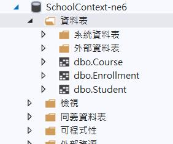
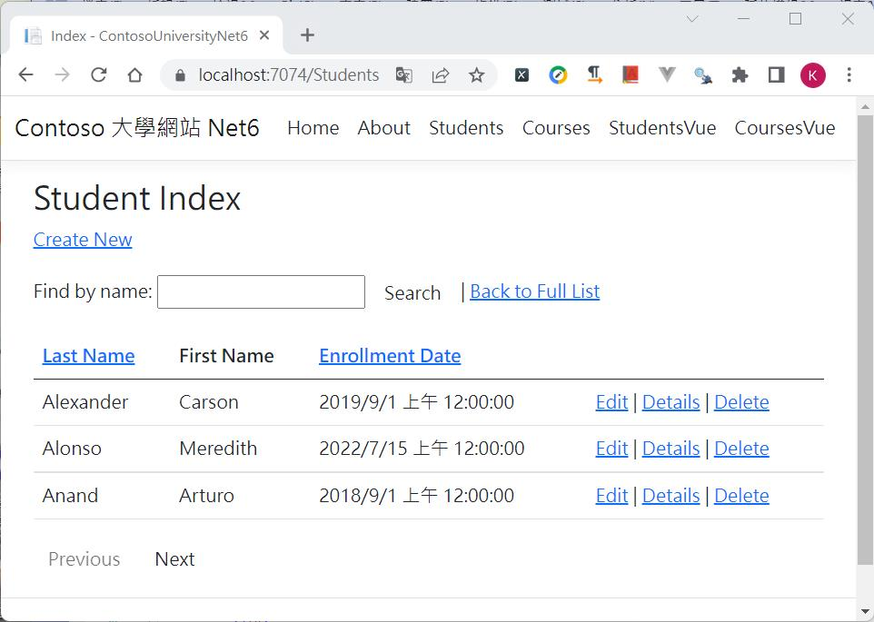
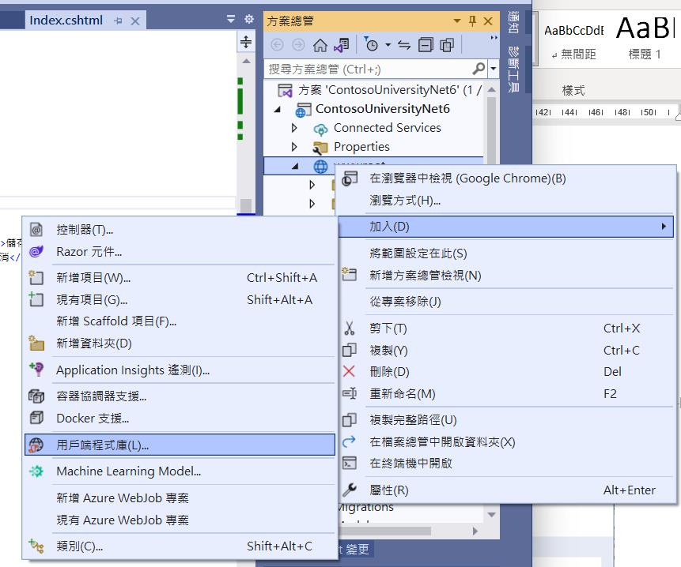
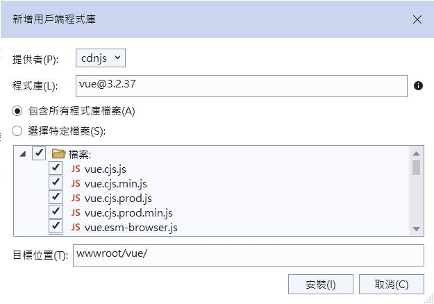
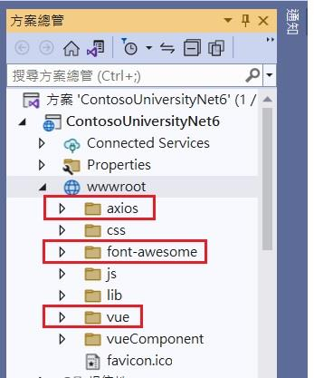
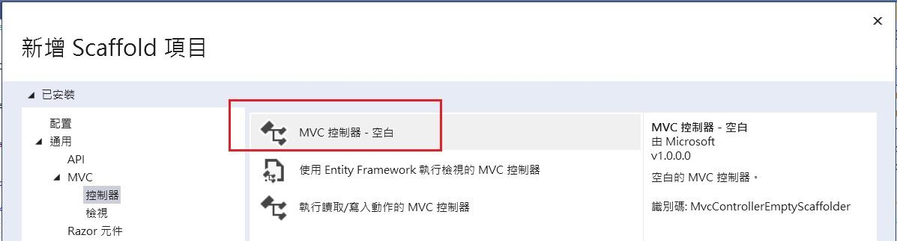
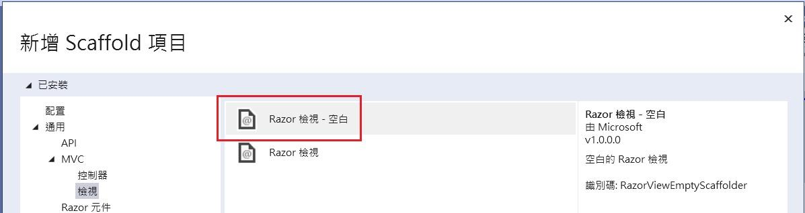
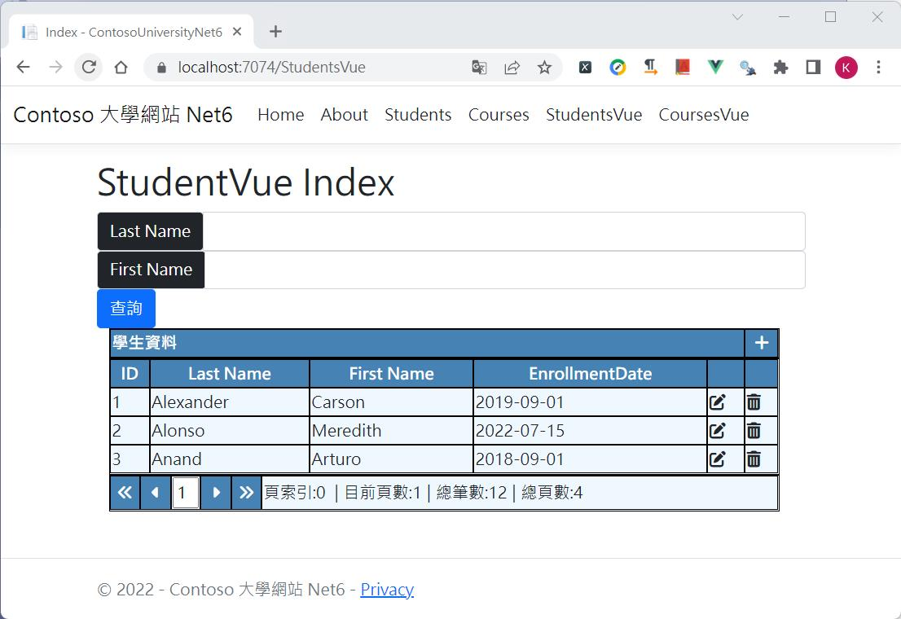
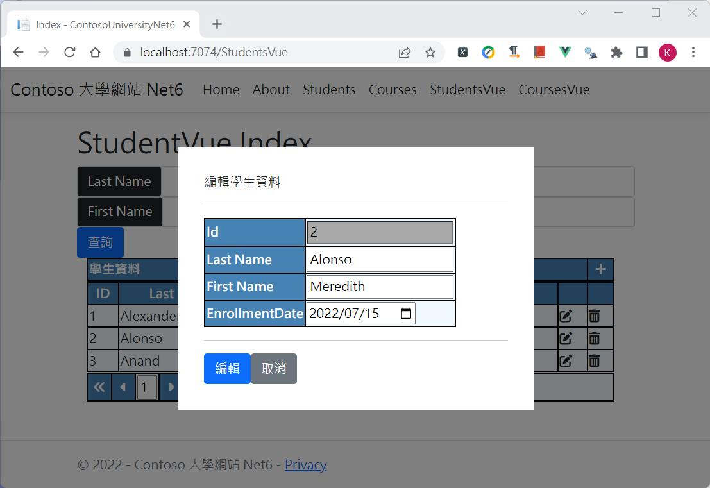

VueJs 的漸進式框架非常適合讓在還不是那麼熟悉前端框架﹐又被老闆逼著要使用前端框架﹐能夠邊做邊上手﹐時機成熟後要華麗轉身成為 SPA 也不致於做白工。

在程式開發上環境的建置很重要﹐環境沒有建好﹐程式無法跑﹐或者程式雖然可以執行了但結果和預期卻不一樣。我早期的寫作從ASP﹑Delphi到後來的ASP.NET﹑.Net Core﹐不論是桌面系統還是Web﹐九成九都是微軟平台﹐後來的工作都是公司內部系統﹐前端和使用者息息相關﹐但系統要求的是穩定﹐也不會特別用很花俏的方式﹐所以穩定﹑好維護是主要目標。在學習前端框架初期﹐各大前端框架怎麼大家一開始都說要安裝node.js 要 npm install﹐心好慌喔﹐倒也不是沒聽過這些東西﹐而是世界變的好複雜﹐IT 就是沒機會閑下來﹐有些東西你不想碰﹐它還是會找上門的。

既然和node.js 和 npm 有關﹐我就開始思考那麼既有的系統套用前端框架後﹐在系統部署時要如何部署？是否部置時也要連同node.js一併部置？網路上各大熱心的教學文章大都著重於教大家如何入門開發﹐對於實際上線就很少著墨﹐在努力的找尋資料後

* node.js安裝是為了開發時期
* 為了要使用npm install 安裝套件
* 為了在開發時期有一個web server可以進行debug
* 正式上線並不需要node.js﹐除非有其它用途
* 前端框架有自己的檔案格式﹐但真正的執行是已經被編譯成網頁可以認識的js檔﹐正式上線上的是已被編譯好的js檔﹐已經不需要node.js
* 如果正式環境也要以node.js做後端Web Server﹐或者像是Vue.js 使用 Nuxt來解決SEO﹐這在正式環境部署就需要node.js了

上述說了一些node.js的東西﹐這主要是為了開發 SPA﹐那麼問題來了﹐一個過去穩穩運作十幾年的網站﹐你要我直接改寫為SPA﹐啊這是瘋了嗎﹐改寫 SPA 就是架構要大改了甚至重構整個系統﹐所有的功能都要 user 重新配合測試﹐更別說前端框架係啥咪都還不熟悉﹐心臟在大顆也不是這麼搞的吧。研究現在流行的三大前端框架後﹐決定Vue.js 的漸近式比較符合現況﹐對還不是非常熟悉前端框架﹐既要練功又要改寫﹐又要能維護﹐採用Vue.js看來是比較適合的選擇﹐因為Vue.js一開始可以先不管node.js, npm 這些東西﹐可以像是 jQuery 般直接引入後就可以使用前端框架﹐這對既有已存在的系統改寫是非常棒的﹐初期可以先挑幾頁做改寫﹐練手感﹑練習異常時如何debug﹑熟悉部署到正式環境會遭遇什麼樣的狀況﹐對 user 也比較不會有衝擊﹐等到上手後﹐如果有必要變更為 SPA ﹐到時候可以駕輕就熟。

這篇文章是使用微軟EF Core 的 MVC 範例([ASP.NET Core MVC 與 EF Core - 教學課程系列 | Microsoft Docs](https://docs.microsoft.com/zh-tw/aspnet/core/data/ef-mvc/?view=aspnetcore-6.0))來改寫﹐這個範例很簡單依照官方上的說明建立了相關的Entity Model與資料庫和產生初始資料的一些代碼﹐其它的就Visual Studio 2022 建立 MVC Controller 時選擇「使用Entity Framework 執行檢視的MVC控制器」就可以自動快速的產生index﹑create﹑update﹑delete﹑detail的語法和頁面﹐另外再手動加入排序﹑分頁的代碼﹐自行coding 的部分不多﹐但一個基本的 .Net MVC 資料庫的應用CURD都有了﹐官方頁面上也有提供git hub 上的完整程式下載(不過現在已是.Net 6﹐但git hub 上卻還是.net core 2.1﹐微軟怎麼都不打算更新呢？)。

依照官網的步驟﹐至少會得到幾個基本資料表Course﹑Enrollment﹑Student



建立的controller 和 view 可以在方案總管中看到﹐view 產生的檔案當然是對應到controller中的action﹐這些是MVC上的架構﹐這裏就不討論了﹐


執行後點擊功能表上的Students ﹐可以看到基本的新增﹑刪除﹑修改﹑查詢﹑表格顯示﹑分頁功能都有了。



現在我打算將這樣基本操作的功能改為Vue.js﹐以前端框架的方式來修改﹐但我並不想動到主架構﹐所以這裏是採用<script>引入的方式並不是製作SPA﹐在新增﹑異動的介面希望別的頁面也能重複使用﹐所以會做為元件化。

* 以Vue 3.x 的 Composition API 撰寫﹐且使用ES Modules方式
* 將新增﹑異動的介面採用燈箱效果元件化
* 表格提供目前所在頁數﹑總筆數﹑總頁數和上下頁的分頁動作

在開始撰寫前我們還要先將Vue的程式庫下載﹐因為要模擬的是在公司內部的系統﹐所以不一定能直接上網﹐因此並不一定能使用cdn library；在檔案總管的 wwwroot右鍵選取[加入/用戶端程式庫]來下載VueJs



同時在專案中也會用到axios和font-awesome﹐所以下載vue套件之外也要另外下載這兩項



前置工作準備好後﹐現在要來改寫StudentsController ﹐但為了做比較﹐所以新增一個Controller做比較﹐在新增控制器時是選擇「MVC控制器 – 空白」﹐然後將Controller命名為 StudentsVueController。



剛建好的Controller只會有一個 Index 的Action﹐在這個 Index 按滑鼠右鍵「新增檢視」﹐這時選擇「Razor 檢視-空白」建立index.cshtml﹐這個index.cshtml 將會放置容器﹐我們不需要其它ctreate﹑edit….的cshtml view檔案﹐在index.cshtml中實現前端框架的做法。



剛建好的Views\StudentsVue\index.cshtml 是一個空白的檔案﹐這裏因為不是撰寫 SPA ﹐仍然是原本 .Net MVC的網站﹐所以還是可以使用 .Net 的ViewData ﹐我先在這個空白的檔案加一些代碼﹐這裏面還是有一些.Net 原本的東西  
***Views\StudentsVue\index.cshtml***

```
@inject Microsoft.AspNetCore.Antiforgery.IAntiforgery Antiforgery

@{
    ViewData["Title"] = "Index";
    var requestToken = Antiforgery.GetAndStoreTokens(Context).RequestToken;
}
@section styles{
    <link rel="stylesheet" href="~/css/tableStyle.css" />
}
<h1>StudentVue Index</h1>

<input id="RequestVerificationToken" type="hidden" value="@requestToken" />

<div id="app">
    <div class="panel">
    </div>

    <div class="container">
    </div>

</div>
```

這裏加入的是防止CSRF的攻擊﹐原本.Net MVC會幫我們處理的部分﹐因為採用了前端框架這部分要自行處理。這裏引入的tableStyle.css則包含了表格和燈箱效果要用的相關css設定。在這裏還有一段 <div id=”app”> ……</div> 這個id=”app” 就是我們的容器﹐前端框架渲染的資料就在這個容器裏。在容器裏<div class=”panel”>是用來放查詢條件﹐<div class=”container”>則是以表格方式呈現資料。

首先看一下<div class=”panel”>的內容﹐這當中會看到有 v-model 和 v-on:click ﹐這待會再回頭來說﹐這裏是查詢條件的畫面﹐分別有Last Name﹑First Name 為查詢條件﹐和一個查詢的按鈕。  
***Views\StudentsVue\index.cshtml***

```
    <div class="panel">
        <div class="panel-body">
            <div class="row">
                <div class="form-group input-group col-md-4">
                    <div class="input-group-prepend">
                        <span class="input-group-text bg-dark text-white">Last Name</span>
                    </div>
                    <input type="text" class="form-control" v-model="queryParam.lastName" />
                </div>
                <div class="form-group input-group col-md-4">
                    <div class="input-group-prepend">
                        <span class="input-group-text bg-dark text-white">First Name</span>
                    </div>
                    <input type="text" class="form-control" v-model="queryParam.firstName" />
                </div>
                <div class="form-group col-md-4">
                    <input type="button" v-on:click="btnQuery" value="查詢" class="btn btn-primary" />
                </div>
            </div>
        </div>
    </div>
```

我們先來看一下vue 結構的部分﹐在index.cshtml檔案末端加入以下程式  
***Views\StudentsVue\index.cshtml***

```
@section Scripts{
    <script src="./axios/axios.js"></script>
    <script type="module">
        import { createApp,ref,onMounted } from "./vue/vue.esm-browser.js"
        const app = createApp({
            setup() {

                return {
                }
            }
        });

        app.mount('#app');
    </script>
}
```

這是一個基本vue 3的 Composition API 結構﹐因為是採用 ES Modules 方式撰寫﹐所以在一開始<script type=”module”>必須加上type=”module”﹐之後是以import 語法將 vue.esm-browser.js 引入。

我們先來做個頁面一開啟就會先查詢並顯示資料﹐先處理後端的程式StudetnsVueController  
***StudentsVueController.cs***

```
using ContosoUniversityNet6.Data;
using ContosoUniversityNet6.Models;
using ContosoUniversityVue.Models;
using Dapper;
using Microsoft.AspNetCore.Mvc;
using Microsoft.Data.SqlClient;

namespace ContosoUniversityNet6.Controllers {
    public class StudentsVueController : Controller {
        private readonly IConfiguration _config;
        private readonly SchoolContext _context;

        public StudentsVueController(IConfiguration config, SchoolContext context) {
            _config = config;
            _context = context;
        }

        public IActionResult Index() {
            ViewData["defaultPageSize"] = _config["defaultPageSize"];
            return View();
        }

        [HttpPost, ActionName("Query")]
        [ValidateAntiForgeryToken]
        public async Task<JsonResult> QueryData([FromBody] TablePager tbPager) {
            int defaultPageSize = tbPager.PageSize;
            List<Student> studentLst = new List<Student>();

            try {
                var sql = @"select ID,LastName,FirstMidName,EnrollmentDate
                          from Student 
                          {0} {1}";
                List<string> sqlWhere = new List<string>();
                Dictionary<string, object> sqlParams = new Dictionary<string, object>();

                #region Where 條件
                if (!string.IsNullOrEmpty(tbPager.LastName)) {
                    sqlWhere.Add("LastName = @lastName");
                    sqlParams.Add("lastName", tbPager.LastName);
                }
                if (!string.IsNullOrEmpty(tbPager.FirstName)) {
                    sqlWhere.Add("FirstMidName = @firstName");
                    sqlParams.Add("firstName", tbPager.FirstName);
                }
                #endregion

                sql = string.Format(sql,
                    sqlWhere.Count > 0 ? " where " : "",
                    string.Join(" and ", sqlWhere.ToArray()));
                DynamicParameters dyParams = new DynamicParameters();
                foreach (var param in sqlParams) {
                    dyParams.Add(param.Key, param.Value);
                }

                int totalRows = 0;
                int totalPage = 0;
                var cnstr = _config.GetConnectionString("SchoolContext");
                using (var cn = new SqlConnection(cnstr)) {
                    var query = cn.Query<Student>(sql, dyParams);
                    totalRows = query.Count();
                    studentLst = tbPager.PageSize > 0 ? query.Skip(tbPager.StartIndex).Take(tbPager.PageSize).ToList()
                                         : query.ToList();
                }

                if (totalRows % defaultPageSize == 0) {
                    totalPage = totalRows / defaultPageSize;
                } else {
                    totalPage = (totalRows / defaultPageSize) + 1;
                }

                PagerData queryDatas = new PagerData() {
                    TotalRows = totalRows,
                    TotalPage = totalPage,
                    Data = studentLst
                };

                ResponseModel<PagerData> responseData = new ResponseModel<PagerData>(queryDatas);
                return Json(responseData);

            } catch (Exception er) {
                var errMsg = $"查詢學生資料異常!---[{er.Message}]";
                return Json(new ResponseModel<string>("99999", errMsg, ""));
            }
        }

        public class TablePager {
            /// <summary>
            /// FirstName
            /// </summary>
            public string FirstName { get; set; }
            /// <summary>
            /// LastName
            /// </summary>
            public string LastName { get; set; }
            /// <summary>
            /// 目前頁索引
            /// </summary>
            public int StartIndex { get; set; }
            /// <summary>
            /// 一頁筆數
            /// </summary>
            public int PageSize { get; set; }
            /// <summary>
            /// 排序
            /// </summary>
            public string Sorting { get; set; }
        }
    }
}
```

因為等一下在前端顯示資料還要做分頁﹐在appsettings.json中加了一個”defaultPageSize”:3 的設定﹐所以在 Index() 這個Action先讀取這個設定並寫入 ViewData[“defaultPageSize”]中﹐另外﹐因為要接收前端傳來的資料這裏建了一個TablePager 的 class﹐對應前端傳入的參數。

接著來看重點QueryData 這個function﹐這個function 上頭有兩個Attribuate標籤﹐[HttpPost, ActionName(“Query”)] 聲明這必須使用 Post﹐名稱是Query；另一個[ValidateAntiForgeryToken]這是CSRF防護﹐前端必須傳入一個驗證Token。function 中的內容就是一般查詢資料就不多做說明﹐主要是這裏有用到Dapper(好東西啊~~)﹐另外宣告一個PagerData類別﹐這是要存放總筆數﹑總頁數和查詢得到的資料集  
***Models\PagerData.cs***

```
namespace ContosoUniversityVue.Models {
    public class PagerData {
        /// <summary>
        /// 總筆數
        /// </summary>
        public int TotalRows { get; set; }
        /// <summary>
        /// 總頁數
        /// </summary>
        public int TotalPage { get; set; }
        /// <summary>
        /// 資料
        /// </summary>
        public Object Data { get; set; }
    }
}
```

而回傳的資料是自訂的ResponseModel<T> 的類別(參考自[閒聊 - Web API 是否一定要 RESTful?-黑暗執行緒 (darkthread.net)](https://blog.darkthread.net/blog/is-restful-required/))  
***Models\ResponseModel.cs***

```
namespace ContosoUniversityVue.Models {
    public class ResponseModel<T> {
        public string Code { get; set; } = "200";
        public string Message { get; set; } = "success";
        public DateTime DateTime { get; set; }
        /// <summary>
        /// 泛型資料
        /// </summary>
        public T Data { get; set; }
        /// <summary>
        /// 泛型資料容器
        /// </summary>
        public IEnumerable<T> Datas { get; set; }

        public ResponseModel() {

        }

        /// <summary>
        /// 成功時回傳
        /// </summary>
        /// <param name="data"></param>
        public ResponseModel(T data) {
            Code = "200";
            Message = "success";
            DateTime = DateTime.Now;
            Data = data;
        }

        /// <summary>
        /// 成功時回傳資料集
        /// </summary>
        /// <param name="datas"></param>
        public ResponseModel(IEnumerable<T> datas) {
            Code = "200";
            Message = "success";
            DateTime = DateTime.Now;
            Datas = datas;
        }

        /// <summary>
        /// 失敗時回傳
        /// </summary>
        /// <param name="code"></param>
        /// <param name="message"></param>
        /// <param name="data"></param>
        public ResponseModel(string code, string message, T data) {
            Code = code;
            Message = message;
            DateTime = DateTime.Now;
            Data = data;
        }
    }
}
```

後端主要是將查詢改寫為一支Web API﹐因為不是這篇文章的主角﹐所以就此帶過﹐回頭來看前端。  
***Views\StudentsVue\index.cshtml***

```
@section Scripts{
    <script src="./axios/axios.js"></script>
    <script type="module">
        import { createApp,ref,onMounted } from "./vue/vue.esm-browser.js"
        const app = createApp({
            setup() {
                const headers = {
                    'Content-Type': 'application/json',
                    RequestVerificationToken: document.getElementById("RequestVerificationToken").value
                }
                const studentsDataLst = ref(null);  //資料集(查詢結果)
                const lightboxShow = ref(false);    //是否顯示lightbox
                
                // Grid 頁的資訊
                const pagerInfo = ref({
                    Index: 0,                           // Grid 頁的索引
                    Size:@ViewData["defaultPageSize"],  //一頁的筆數
                    TotalRows: 0,                       //總筆數
                    TotalPages: 0,                      //總頁數
                    NowPage: 1                          //目前所在頁數﹐預設第一頁
                });
                //查詢參數
                const queryParam = ref({
                    lastName:'',     //Last Name
                    firstName:''     //First Name
                });

                //查詢
                function m_queryStudentData(pageIndex, pageSize) {
                    axios.post('@Url.Action("Query","StudentsVue")',
                        { LastName: queryParam.value.lastName, FirstName: queryParam.value.firstName, startIndex: pageIndex, PageSize: pageSize, Sorting: '' },
                        { headers: headers })
                        .then((resp) => {
                            console.log('resp', resp);
                            console.log('resp.data.Data', resp.data.data)

                            studentsDataLst.value = resp.data.data.data;
                            pagerInfo.value.TotalRows = resp.data.data.totalRows;
                            pagerInfo.value.TotalPages = resp.data.data.totalPage;

                        })
                        .catch((er) => {
                            console.log('查詢異常', er);
                        })
                }

                onMounted(() => {
                    m_queryStudentData(pagerInfo.value.Index, pagerInfo.value.Size);
                })

                //轉換日期格式
                const transDate = (a) => {
                    return dateISOFormat(a);
                }

                return {
                    pagerInfo,             // 查詢顯示表格的資訊
                    lightboxShow,          // 變數
                    handleHide,            // method: 元件內對外呼叫的事件
                    queryParam,            // 物件: 查詢條件參數
                    studentsDataLst,       // 物件: 查詢結果資料集
                    tbStudent,             // 物件: 新增﹑異動 對應的資料
                    m_queryStudentData,    // method: 查詢
                }
            }
        });

        app.mount('#app');
    </script>
}
```

我新增了一個method function m\_queryStudentData(pageIndex, pageSize) ﹐在這個method中使用axios.post呼叫了剛剛後端StudentsVueController中的Query API﹐這裏因為還要做CSRF防護﹐所以前面有先宣告一個headers 的物件

```
const headers = {
     'Content-Type': 'application/json',
     RequestVerificationToken: document.getElementById("RequestVerificationToken").value
}
```

axios呼叫時可以看到headers中有帶入這個驗證的Token﹐而then之中所回傳的資料填入到在vue中宣告的相關物件中﹐這時我們看一下HTML的部分要如何撰寫﹐前面說過<div class=”container”>是要放回傳的資料  
***Views\StudentsVue\index.cshtml***

```
    <div class="container">
        <div class="col-md-12">
            <div style="width: 98%;">
                <div id="css_table" style="background-color: dimgray;width:100%">
                    <div class="css_tr css_title">
                        <div class="css_td" style="width:95%">學生資料</div>
                        <div class="css_td myMOUSE" style="text-align: center;" title="新增">
                            <i class="fas fa-plus" v-on:click="curdAction('add')"></i>
                        </div>
                    </div>
                </div>

                <div id="css_table" style="width: 100%;">
                    <div class="css_tr css_td_title">
                        <div class="css_td">ID</div>
                        <div class="css_td">Last Name</div>
                        <div class="css_td">First Name</div>
                        <div class="css_td">EnrollmentDate</div>
                        <div class="css_td"></div>
                        <div class="css_td"></div>
                    </div>
                    <div class="css_tr" v-for="item in studentsDataLst" :key="item.ID">
                        <div class="css_td">{{ item.id }}</div>
                        <div class="css_td">{{ item.lastName }}</div>
                        <div class="css_td">{{ item.firstMidName }}</div>
                        <div class="css_td">{{ transDate(item.enrollmentDate) }}</div>
                        <div class="css_td"><i class="fas fa-edit" v-on:click="curdAction('edit',item.id,item.lastName,item.firstMidName,item.enrollmentDate)"></i></div>
                        <div class="css_td"><i class="fas fa-trash-alt" v-on:click="delRecord(item.id,item.lastName,item.firstMidName)"></i></div>
                    </div>
                </div>
                <div id="css_table" style="width: 100%;">
                    <div class="css_tr">
                        <div class="css_td css_pager" title="第一頁" v-on:click="btnGoFirst"><i class="fas fa-angle-double-left"></i></div>
                        <div class="css_td css_pager" title="上一頁" v-on:click="btnGoPrev"><i class="fas fa-caret-left"></i></div>
                        <div class="css_td" style="width:28px"><input type="text" v-model="pagerInfo.NowPage" style="width: 25px;"></div>
                        <div class="css_td css_pager" title="下一頁" v-on:click="btnGoNext"><i class="fas fa-caret-right"></i></div>
                        <div class="css_td css_pager" title="最後一頁" v-on:click="btnGoLast"><i class="fas fa-angle-double-right"></i></div>
                        <div class="css_td">
                            頁索引:{{ pagerInfo.Index }} &nbsp;|&nbsp;目前頁數:{{ pagerInfo.NowPage }}&nbsp;|&nbsp;總筆數:{{ pagerInfo.TotalRows }}&nbsp;|&nbsp;總頁數:{{ pagerInfo.TotalPages }}
                        </div>
                    </div>
                </div>
            </div>
        </div>
    </div>
```

上述程式中可以看到用了 **v-for 迴圈**的方式將studentsDataLst 一筆一筆讀出顯示出來﹐在表格的下方有頁索引﹑目前頁數之類的顯示。當我們的method m\_queryStudentData 被執行後﹐因為vue 的雙向資料綁定﹐當我們在vue 所宣告的 studentsDataLst﹑PagerInfo 資料有變化時﹐頁面上就會相對的做出反應。

表格上還要能首頁﹑上一頁﹑下一頁﹑最後一頁的功能﹐在 setup() 中加入對應的method btnGoFirst, btnGoPrev, btnGoNext, btnGoLast﹐記得在 return 中要加入對應的method name才能與頁面互動。

```
@section Scripts{
    <script src="./axios/axios.js"></script>
    <script type="module">
        import { createApp,ref,onMounted } from "./vue/vue.esm-browser.js"
        const app = createApp({
            setup() {
                …………………
                …………………
                //button:btnGoFirst  首頁
                function btnGoFirst() {
                    pagerInfo.value.NowPage = 1;
                    pagerInfo.value.Index = (pagerInfo.value.NowPage - 1) * pagerInfo.value.Size;
                    m_queryStudentData(pagerInfo.value.Index, pagerInfo.value.Size);
                }
                //button:btnGoPrev  上一頁
                function btnGoPrev() {
                    if (pagerInfo.value.NowPage == 1) {
                        return;
                    }
                    pagerInfo.value.NowPage--;
                    pagerInfo.value.Index = (pagerInfo.value.NowPage - 1) * pagerInfo.value.Size;
                    m_queryStudentData(pagerInfo.value.Index, pagerInfo.value.Size);
                }
                //button:btnGoNext  下一頁
                function btnGoNext() {
                    if (pagerInfo.value.NowPage == pagerInfo.value.TotalPages) {
                        return;
                    }
                    pagerInfo.value.NowPage++;
                    pagerInfo.value.Index = (pagerInfo.value.NowPage - 1) * pagerInfo.value.Size;
                    m_queryStudentData(pagerInfo.value.Index, pagerInfo.value.Size);
                }
                //button:btnGoLast  跳至最後一頁
                function btnGoLast() {
                    pagerInfo.value.NowPage = pagerInfo.value.TotalPages;
                    pagerInfo.value.Index = (pagerInfo.value.TotalPages - 1) * pagerInfo.value.Size;
                    m_queryStudentData(pagerInfo.value.Index, pagerInfo.value.Size);
                }
                ………………..
                ………………..
                return {
                    pagerInfo,             // 查詢顯示表格的資訊
                    lightboxShow,          // 變數
                    handleHide,            // method: 元件內對外呼叫的事件
                    queryParam,            // 物件: 查詢條件參數
                    studentsDataLst,       // 物件: 查詢結果資料集
                    saveIt,                // method: save
                    m_queryStudentData,    // method: 查詢
                    transDate,             // method: 轉換日期
                    btnQuery,              // method: button query
                    btnGoFirst,            // button Go First page
                    btnGoPrev,             // button Go Prev page
                    btnGoNext,             // button Go Next page
                    btnGoLast              // button Go Last page
                }
            }
        });

        app.mount('#app');
    </script>
}
```

接下來要做新增和異動的部分﹐同樣後端先做好要呼叫的API  
***StudentsVueController.cs***

```
        /// <summary>
        /// 新增紀錄
        /// </summary>
        /// <param name="student">Student object</param>
        /// <returns></returns>
        [HttpPost, ActionName("AddRecord")]
        [ValidateAntiForgeryToken]
        public async Task<JsonResult> AddRecord([FromBody] Student student) {
            try {
                if (_context.Students.Where((s1) => s1.LastName == student.LastName && s1.FirstMidName == student.FirstMidName).Count() > 0) {
                    return Json(new { Result = "Error", Message = "該學生已存在﹐請重新輸入資料." });
                }

                _context.Add(student);
                await _context.SaveChangesAsync();
                return Json(new { Result = "OK", Record = student });
            } catch (Exception er) {
                return Json(new { Result = "Error", Message = $"建立學生資料[{student.LastName} {student.FirstMidName}]時異常." + er.Message });
            }
        }
        /// <summary>
        /// 編輯
        /// </summary>
        /// <param name="student">Student object</param>
        /// <returns></returns>
        [HttpPost, ActionName("EditRecord")]
        [ValidateAntiForgeryToken]
        public async Task<JsonResult> EditRecord([FromBody] Student student) {
            try {
                _context.Students.Update(student);
                await _context.SaveChangesAsync();
                return Json(new { Result = "OK" });
            } catch (Exception er) {
                return Json(new { Result = "異動學生資料 Error exception", Message = er.Message });
            }
        }
```

在前端要使用燈箱效果開啟新增﹑異動的介面進行編輯﹐這裏的燈箱效果參考自[2-4 編譯作用域與 Slot 插槽 | 重新認識 Vue.js | Kuro Hsu](https://book.vue.tw/CH2/2-4-slots.html) 做改寫﹐同時將這個燈箱效果做成一個獨立的檔案﹐方便其它頁面使用；在wwwroot下新增一個資料夾vueComponent﹐在這之下新增一個檔案curdLightBoxComponent.js  
***wwwroot\vueComponent\curdLightBoxComponent.js***

```
import { ref, watch, computed } from "/vue/vue.esm-browser.js"

const curdLightBoxComponent = {
    props: {
        isdisplay: {          //接收外層傳入的旗標值(true:顯示, false:隱藏)
            type: Boolean,
            default: false
        }
    },
    setup(props, { emit }) {
        const isShow = ref(false);

        //監控 props.isdisply 的值有沒有變化來異動元件內的 isShow 的值
        watch(() => props.isdisplay, (newVal) => {
            isShow.value = newVal;
        })
        //用來顯示或隱藏 lightbox
        let modalStyle = computed(() => {
            return {
                'display': isShow.value ? '' : 'none'
            };
        })

        function toggleModal() {
            isShow.value = !isShow.value;
            closeDialog();
        };

        //關閉 lightbox 並回傳 lightbox 開關值給上層元件
        const closeDialog = () => {
            console.log('元件中 lcoseDialog 被觸發');
            emit('lightbox-Close', false);
        }

        return {
            isShow,
            modalStyle,
            toggleModal,
            //addRecord
        }
    },
    template: `
            <div class="lightbox">
                <teleport to="body">
                    <div class="modal-mask" v-bind:style="modalStyle">
                        <div class="modal-container" v-on:click.self="toggleModal">
                            <div class="modal-body">
                                <header>
                                    <slot name="header">Default Header</slot>
                                </header>
                                <hr>
                                <main>
                                    <slot>Default Body</slot>
                                </main>
                                <hr>
                                <footer>
                                    <slot name="footer">Default Footer</slot>
                                </footer>
                            </div>
                        </div>
                    </div>
                </teleport>
            </div>`
}

export default curdLightBoxComponent
```

在這個元件中的template 中可以看到還留了3個slot﹐這是因為在不同頁面要新增﹑異動的欄位並不相同﹐保留給各頁面自行去撰寫。

那麼回頭來看看現在前端頁面要加入什麼  
***Views\StudentsVue\index.cshtml***

```
<div id="app">
    <div class="panel">
    </div>

    <div class="container">
    </div>

    <curd-lightbox v-bind:isdisplay="lightboxShow" v-on:lightbox-Close="handleHide">
        <template v-slot:header>
            <span>{{actionObj.title}}</span>
        </template>

        <div id="css_table">
            <div class="css_tr">
                <div class="css_td css_title">Id</div>
                <div class="css_td"><input type="text" v-model="tbStudent.Id" readonly="readonly" style="background-color:darkgray" /></div>
            </div>
            <div class="css_tr">
                <div class="css_td css_title">Last Name</div>
                <div class="css_td"><input type="text" v-model="tbStudent.LastName" /></div>
            </div>
            <div class="css_tr">
                <div class="css_td css_title">First Name</div>
                <div class="css_td"><input type="text" v-model="tbStudent.FirstName" /></div>
            </div>
            <div class="css_tr">
                <div class="css_td css_title">EnrollmentDate</div>
                <div class="css_td"><input type="date" v-model="tbStudent.EnrollmentDate" /></div>
            </div>
        </div>

        <template v-slot:footer>
            <div>
                <button id="btnSave" class="btn btn-primary" v-on:Click="saveIt" v-text="actionObj.btnText">儲存</button>
                <button id="btnCancel" class="btn btn-secondary" v-on:Click="lightboxShow=!lightboxShow">取消</button>
            </div>
        </template>
    </curd-lightbox>

</div>

@section Scripts{
    <script src="./axios/axios.js"></script>
    <script type="module">
        import { createApp,ref,onMounted } from "./vue/vue.esm-browser.js"
        import curdLightBoxComponent from '@Url.Content("~/vueComponent/curdLightBoxComponent.js")'

        const app = createApp({
            setup() {
                …………….
                …………….
                //接收子元件回傳的 lightbox 開關的值
                const handleHide = i => {
                    console.log('handleHide', i);
                    lightboxShow.value = i;
                }
                //新增﹑異動 對應的資料
                const tbStudent = ref({
                    Id: null,
                    LastName: '',
                    FirstName: '',
                    EnrollmentDate: ''
                });
                //動作物件
                const actionObj = ref({
                    name: '',       //動作名稱(add, edit, del)
                    title: '',       //標題
                    btnText: '',     //button 顯示文字
                });
                //新增﹑異動儲存
                const saveIt = () => {
                    if (actionObj.value.name === "add") {
                        addRecord();
                    } else if (actionObj.value.name === "edit") {
                        editRecord();
                    }
                };
                // 新增, 異動
                const curdAction = (actionName, id, lastName, firstName, enrollmentDate) => {
                    lightboxShow.value = !lightboxShow.value;
                    actionObj.value.name = actionName;

                    if (actionName === 'add') {
                        //btnName.value = "儲存";
                        actionObj.value.title = '新增學生資料';
                        actionObj.value.btnText = "儲存";

                        tbStudent.value.Id = '';
                        tbStudent.value.LastName = '';
                        tbStudent.value.FirstName = '';
                        tbStudent.value.EnrollmentDate = '';

                        console.log('tbStudent', tbStudent)
                    } else if (actionName === 'edit') {
                        //btnName.value = '編輯';
                        actionObj.value.title = '編輯學生資料';
                        actionObj.value.btnText = "編輯";

                        tbStudent.value.Id = id;
                        tbStudent.value.LastName = lastName;
                        tbStudent.value.FirstName = firstName;
                        tbStudent.value.EnrollmentDate = dateISOFormat(enrollmentDate);

                        console.log('tbStudent', tbStudent)
                    }
                    console.log('actionObj', actionObj);
                    return lightboxShow.value;
                }
                //新增一筆記錄
                function addRecord() {
                    if (tbStudent.value.LastName === '') {
                        alert('Last Name 不可為空');
                        return false;
                    } else if (tbStudent.value.FirstName === '') {
                        alert('First Name 不可為空');
                        return false;
                    } else if (tbStudent.value.EnrollmentDate === '') {
                        alert('EnrollmentDate 不可為空');
                        return false;
                    }

                    axios.post('@Url.Action("AddRecord", "StudentsVue")',
                        { LastName: tbStudent.value.LastName, FirstMidName: tbStudent.value.FirstName, EnrollmentDate: tbStudent.value.EnrollmentDate },
                        { headers: headers })
                        .then((resp) => {
                            console.log('Add Record.', resp);
                            console.log('Add Record.', resp.data);

                            lightboxShow.value = false; //關閉燈箱
                            m_queryStudentData(pagerInfo.value.Index, pagerInfo.value.Size);
                        })
                        .catch((er) => {
                            console.log('新增資料失敗!', er);
                        });
                };
                //異動一筆記錄
                function editRecord() {
                    if (tbStudent.value.LastName === '') {
                        alert('Last Name 不可為空');
                        return false;
                    } else if (tbStudent.value.FirstName === '') {
                        alert('First Name 不可為空');
                        return false;
                    } else if (tbStudent.value.EnrollmentDate === '') {
                        alert('EnrollmentDate 不可為空');
                        return false;
                    }

                    axios.post('@Url.Action("editRecord", "StudentsVue")',
                        { Id: tbStudent.value.Id, LastName: tbStudent.value.LastName, FirstMidName: tbStudent.value.FirstName, EnrollmentDate: tbStudent.value.EnrollmentDate },
                        { headers: headers })
                        .then((resp) => {
                            console.log('edit Record.', resp);
                            console.log('edit Record.', resp.data);

                            lightboxShow.value = false; //關閉燈箱
                            m_queryStudentData(pagerInfo.value.Index, pagerInfo.value.Size);
                        })
                        .catch((er) => {
                            console.log('異動資料失敗!', er);
                        });
                };
                //刪除紀錄
                function delRecord(id, lastName,firstName) {
                    console.log('外層delRecord 被觸發');
                    if (!confirm('是否確定刪除[ID:' + id + '-' + lastName + ' ' + firstName + ']此筆紀錄 ? ')) {
                        return false;
                    }

                    axios.post('@Url.Action("delRecord", "StudentsVue")',
                        { Id: id },
                        { headers: headers })
                        .then((resp) => {
                            console.log('del Record.', resp);
                            console.log('del Record.', resp.data);

                            lightboxShow.value = false; //關閉燈箱
                            m_queryStudentData(pagerInfo.value.Index, pagerInfo.value.Size);
                        })
                        .catch((er) => {
                            console.log('刪除資料失敗!', er);
                        });
                }
                …………….
                …………….
                return {
                    pagerInfo,             // 查詢顯示表格的資訊
                    lightboxShow,          // 變數
                    handleHide,            // method: 元件內對外呼叫的事件
                    queryParam,            // 物件: 查詢條件參數
                    studentsDataLst,       // 物件: 查詢結果資料集
                    tbStudent,             // 物件: 新增﹑異動 對應的資料
                    actionObj,             // 物件: 動作物件
                    curdAction,            // method: 新增/異動 的動作切換
                    saveIt,                // method: save
                    m_queryStudentData,    // method: 查詢
                    delRecord,             // method: 刪除
                    transDate,             // method: 轉換日期
                    btnQuery,              // method: button query
                    btnGoFirst,            // button Go First page
                    btnGoPrev,             // button Go Prev page
                    btnGoNext,             // button Go Next page
                    btnGoLast              // button Go Last page
                }
            }
        });

        app.component('curd-lightbox', curdLightBoxComponent);

        app.mount('#app');
    </script>
}
```

在script中使用import 引入了~/vueComponent/curdLightBoxComponent.js自訂的元件﹐這是一個外部的元件﹐所以在setup()之外加上app.component('curd-lightbox', curdLightBoxComponent);﹐現在在<div id=”app”>容器中可以加入<curd-lightbox>自訂標籤﹐因為這個元件我們保留了3個slot 插槽﹐分別是要顯示功能Title﹐輸入的欄位和儲存的button﹐在上面的代碼中可以看到加入的元件部分。

完成後在SutdentVue 點擊後看到以下結果﹐畫面表格中顯示了資料筆數﹑頁數﹐還要上下頁的切換



對於新增和編輯呼叫元件的燈箱效果  
新增


編輯



實際作業下來對於後端和前端的切割後﹐個人感覺維護上有明顯的區分開﹐後端專注在取得資料的正確性和效能﹐Debug時只要看Response的資料和格式是否正確即可﹐而前端可以專注在於取得資料後如何對資料操作以符合頁面上的顯示效果﹐開發過程雙方談好資料格式分開開發不再是什麼問題。

參考資料

* [ASP.NET Core MVC 與 EF Core - 教學課程系列 | Microsoft Docs](https://docs.microsoft.com/zh-tw/aspnet/core/data/ef-mvc/?view=aspnetcore-6.0)
* [閒聊 - Web API 是否一定要 RESTful?-黑暗執行緒 (darkthread.net)](https://blog.darkthread.net/blog/is-restful-required/)
* [2-4 編譯作用域與 Slot 插槽 | 重新認識 Vue.js | Kuro Hsu](https://book.vue.tw/CH2/2-4-slots.html)

[程式碼範例](https://github.com/nethawkChen/ContosoUniversityNet6)
