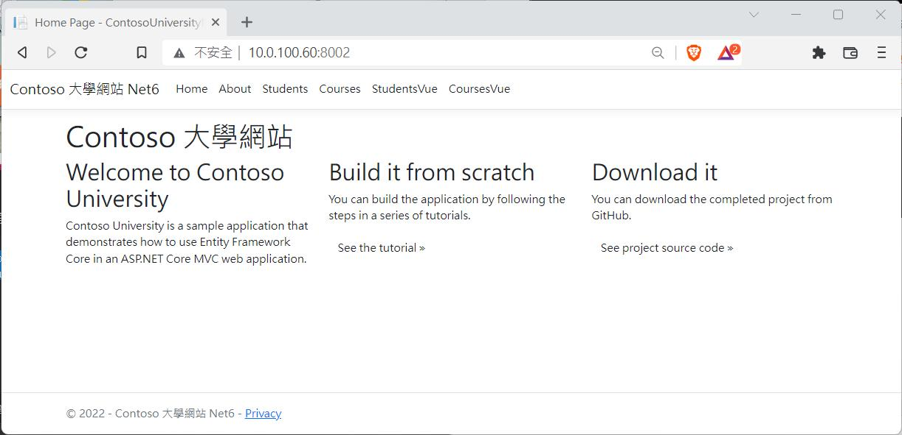
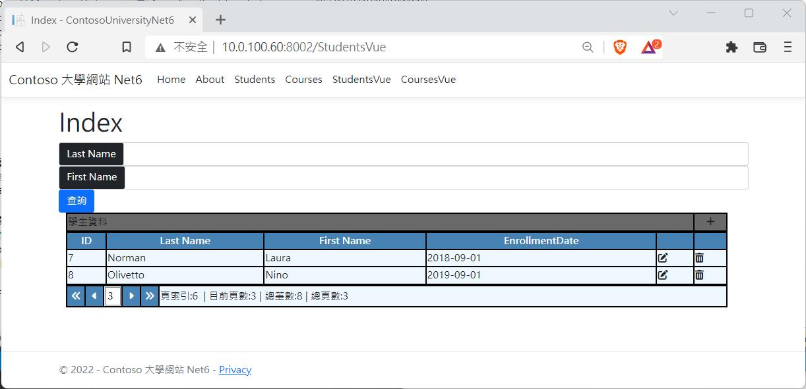

.Net 佈署到 Docker 的方式其實很簡單﹐不過有一些細節仍然需要注意﹐這裏要紀錄的是資料庫連線帳密的問題。首先先不管任何一切﹐先看一下程式和佈署的方式﹐示範的程式是使用 <https://github.com/nethawkChen/ContosoUniversityNet6> 之前在做Vue示範的範例程式。

佈署的環境是 Ubuntu Server 20.4﹐上面已安裝好 Docker﹐先看一下我們專案中的兩個檔案 appsettings.json 和 appsettings.Development.json﹐大家知道這分別是正式環境和開發環境使用的設定檔﹐一般資料庫連線的設定也寫在這裏面

appsettings.jsonappsettings.Development.json

現在在 appsettings.Development.json 中有 ConnectionStrings 的節段並有資料庫連線設定﹐而 appsettings.json 檔案中則沒有相關的設定﹐如果這裏寫了正式環境的資料庫連線﹐那麼在build image時就把這機密的部分一起包進去﹐這是危險的事。現在程式在本機執行時﹐會自動產生 localdb 的資料庫並且能執行﹐但如果直接放到正式環境會因為沒有資料庫連線而無法連線。

在專案程式中有個Dockerfile檔案﹐先看一下內容  
Dockerfile

```plaintext
#See https://aka.ms/containerfastmode to understand how Visual Studio uses this Dockerfile to build your images for faster debugging.
FROM mcr.microsoft.com/dotnet/aspnet:6.0 AS base
WORKDIR /app
EXPOSE 80
EXPOSE 443
FROM mcr.microsoft.com/dotnet/sdk:6.0 AS build
WORKDIR /src
COPY ["ContosoUniversityNet6.csproj", "."]
RUN dotnet restore "./ContosoUniversityNet6.csproj"
COPY . .
WORKDIR "/src/."
RUN dotnet build "ContosoUniversityNet6.csproj" -c Release -o /app/build
FROM build AS publish
RUN dotnet publish "ContosoUniversityNet6.csproj" -c Release -o /app/publish
FROM base AS final
WORKDIR /app
COPY --from=publish /app/publish .
ENTRYPOINT ["dotnet", "ContosoUniversityNet6.dll"]

```

我在另一台電腦上有個 SQL DB﹐佈置到 docker 後要讓程式連線到實際的資料庫而不是 LocalDB﹐為了能讓 container 的程式可以正確的連線到資料庫﹐但又不想在程式中直接曝露資料庫的連線資訊﹐在這個Dockerfile中加入一行 ENV 將資料庫資訊寫在這裏

```plaintext
#See https://aka.ms/containerfastmode to understand how Visual Studio uses this Dockerfile to build your images for faster debugging.
FROM mcr.microsoft.com/dotnet/aspnet:6.0 AS base
WORKDIR /app
EXPOSE 80
EXPOSE 443
ENV ConnectionStrings:SchoolContext="Data Source=10.0.100.241;Initial Catalog=SchoolContext-ne6;User ID=apSchool;Password=apSchool0935"
以下略
```

現在進行 build  
docker build . -t myap:0.0


build 完後﹐來試試看是否能正確連線到 DB  
docker run -itd -p 8002:80 --name=t0 myap:0.0

實際上操作是可以連線到 DB 的﹐但是…不對啊>__<﹐這樣 build 出來的 image 還是把正式環境的帳密也包進去了嗎？如果把這個image上傳了docker hub﹐就變成公開了。

所以正確的做法應該是在 docker run 時再給予資料庫連線﹐而且後續如果要變更帳號密碼甚至資料庫主機都可以隨時更換。

現在我們將原本寫在 Dockerfile 中 ENV 那一行刪除﹐回到原本沒有資料庫連線的Dockerfile﹐然後重新進行 build

docker build . -t myap:0.1

build 完成後﹐確認已經建立了 myap:0.1 這個 image


這時的 image 是不包含我們實際的資料庫連線﹐所以在docker run 時可以給予這個資料

docker run -itd -p 8002:80 **-e "ConnectionStrings:SchoolContext"="Data Source=10.0.100.241;Initial Catalog=SchoolContext-ne6;User ID=apSchool;Password=apSchool0935"** \--name=t1 myap:0.1


現在開啟瀏覽器來試一下  




實際操作上確實連上了資料庫﹐也避免了將資訊庫的資訊暴露在外。



參考資料

  * <https://learn.microsoft.com/en-us/archive/msdn-magazine/2019/may/data-points-ef-core-in-a-docker-containerized-app-part-2>
  * <https://stackoverflow.com/questions/56465059/asp-net-core-override-connection-strings-via-env-variables>