現在網路資源豐富﹐許多學習資源大多在網路上可以獲得﹐不過很多東西需要自行拼湊。在我學習Vue 的過程中﹐如何讓 Asp.net core web api 和 Vue 能互相搭配且開發順暢﹐著實在網路上研究了許久﹐這類整合開發的文章比較少﹐希望我這篇筆記能對大家有所助益。

首先這篇文章的靈感來自於 [Vue CLI 和 ASP.NET Core Web API 專案整合步驟 1 2 3 (poychang.net)](https://blog.poychang.net/vue-cli-with-dotnet-core-api/) 這篇文章﹐該篇內容描述前端使用Vue Cli 建置與 Visual Studio 2019 建立的 Asp.net Core Web Api 如何做整合﹐內容中對於 Visual studio Web Api 專案中如何設定及基本 Vue-Cli 專案的設定已很清楚﹐在按表操課後實際開發時又碰到不少問題﹐所以做下心得筆記給自己留下印記。

我個人在開發過程中遭遇的問題﹐其實大部分來自於對 Vue 的不夠熟悉﹐所以對於 Vue Cli 已經很熟的朋友可以直接跳過這篇文章。在這裏我將使用微軟官網EF Core MVC的範例程式([教學課程：在 ASP.NET MVC Web 應用程式中開始使用 EF Core | Microsoft Learn](https://learn.microsoft.com/zh-tw/aspnet/core/data/ef-mvc/intro?view=aspnetcore-7.0))﹐將原本的MVC 進行改寫﹐原本的架構是純MVC與DB

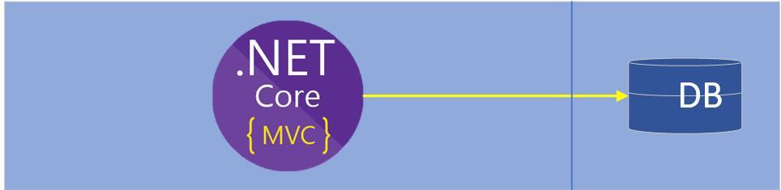

修改後會是將對資料庫的部分抽離另建一個Web Api 專案並且以 Repository patten 的方式建立﹐原本微軟的MVC 專案改為Web Api 專案並以 Vue-Cli 來建置前端。

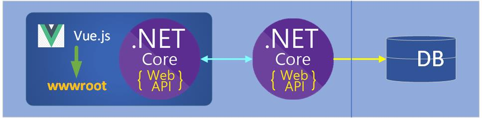

所以今天所要討論的主軸就是以下這一部分

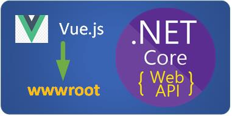

**環境與軟體**

在開始之前先將環境與相關軟體做個列表  
開發環境：Windows 10/11  
開發工具：Visual Studio 2022 & Visual Studio Code  
相關軟體  
nvm-windows：node.js 版本管理工具(建議﹐但非必要﹐請參考([在原生 Windows 上設定 NodeJS | Microsoft Learn](https://learn.microsoft.com/zh-tw/windows/dev-environment/javascript/nodejs-on-windows))  
node.js：開發 Vue.js 必要

**專案建置**

首先我建了一個方案 ContosoUniversity﹐當中方案資料夾Service下的部分是前面所提到把對 DB 的部分抽出並依 Repository patten 製作的﹐不過這不是這次討論的範圍﹐方案中有建置一個ContosoUniversityWebApiSPA 專案﹐這個專案才是根據[Vue CLI 和 ASP.NET Core Web API 專案整合步驟 1 2 3 (poychang.net)](https://blog.poychang.net/vue-cli-with-dotnet-core-api/) 文章建置﹐其中的ClientApp 就是 Vue-Cli 專案所在﹐Vie專案編譯後的檔案會輸出至 wwwroot﹐專案建置過程不再重複敘述。

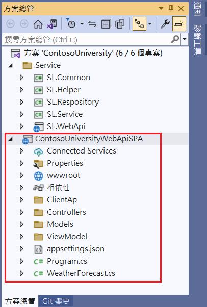

這個專案還未全部完成﹐但一些基本功能已經有了﹐對於專案開發過程會碰到的問題也大致都有了﹐所以先紀錄過程中一些問題如何解決。

**如何step by step Debug**

我設定的場情是全端工程師﹐同時要處理前後端程式(老闆真的只會讓你處理前端或後端嗎？)。根據之前web api 專案中 launchSettings.json 的設定及Program.cs的調整﹐現在執行F5 所看到的並不是 swagger 而是直接開啟網站畫面。在開發過程中對於 web api專案個人習慣還是使用swagger 介面﹐要進行整體的測試則改由VS Code 進行﹐所以我還原了 launchSettings.json原本設定﹐而Program.cs 不變但需要加入 CORS 的設定

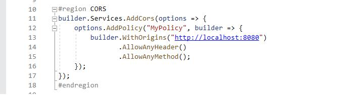

http://localhost:8080 這是Vue專案使用 npm run serve 時用的port 。在Web API 專案端的開發是屬後端跟平常都一樣﹐所以其它沒有什麼特別需要設定﹐但有一點要注意﹐後端要吐給前端資料的規格要先確定好﹐由其是全後端是分開由不同人作業﹐這樣才能後續作業一致。

**Vue 專案**

**安裝套件**

現在場景轉到 Vue-cli 專案﹐資料夾中的ClientApp 就是Vue 專案所在﹐請使用VS Code 開啟。在這個專案中會用到一些套件 axios, bootstrap, fontawesome﹐先安裝好以下套件  
npm install axios@1.4.0 --save  
npm install bootstrap@5.3.0  
npm install --save @popperjs/core  
npm install --save-dev @fortawesome/fontawesome-free

**設定 Debug launch.json**

在Debug 時會啟用瀏覽器﹐點擊vs code 左側的 Run and Debug 圖示﹐如果這個專案中還沒有 launch.json 檔案﹐應該會看到以下畫面

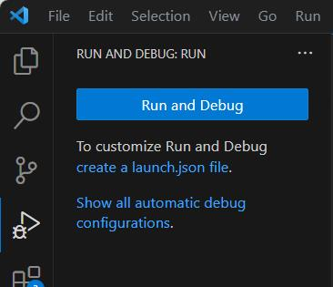

這表示還未設定 Debug 的環境﹐此時可以按下畫面上「Run and Debug」的按鍵﹐這時可以看到右側出現要我們選擇 debug用的瀏覽器

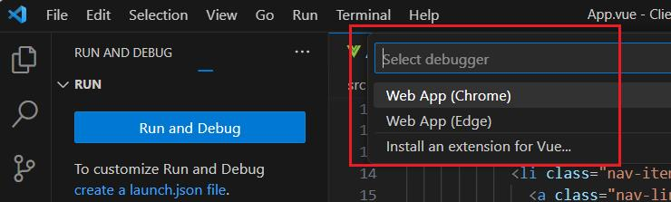

假如要選擇一般人常用的 Chrome﹐那麼就點選Web App (Chrome)﹐之後vs code 會產生launch.json 檔案﹐內容會是如下

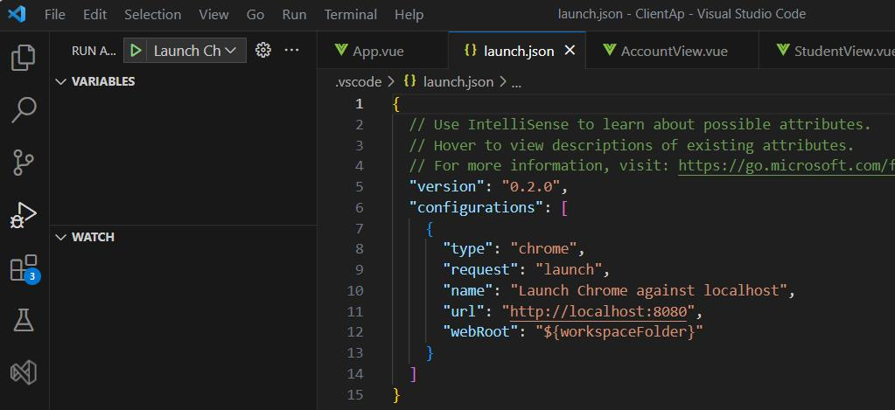

如果像我個人喜歡用 Edge 的﹐可以在目前上方的Launch Ch..點擊一下﹐在下拉的清單中選擇 Add Configuration…

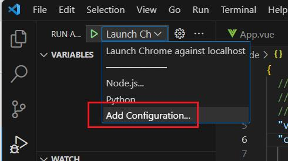

在 launch.json 的畫面上會出現下拉清單畫面讓你挑選想要加入的項目

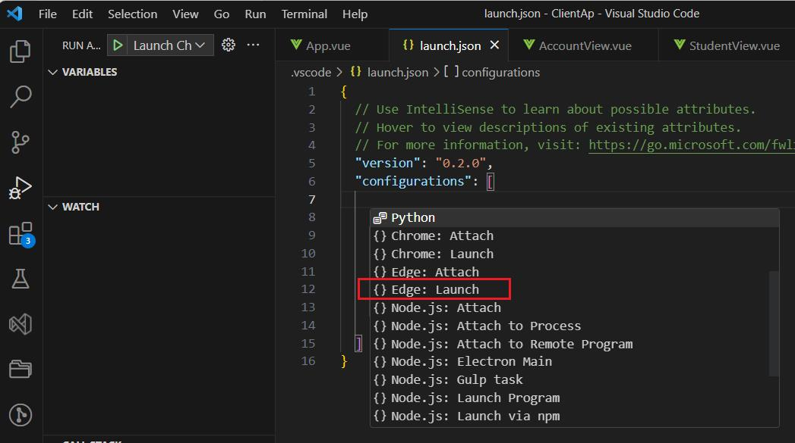

這裏要加入的是 Edge 瀏覽器﹐所以選擇了Edge: Launch﹐選擇後launch.json自動幫我們加上了Edge必要的設定

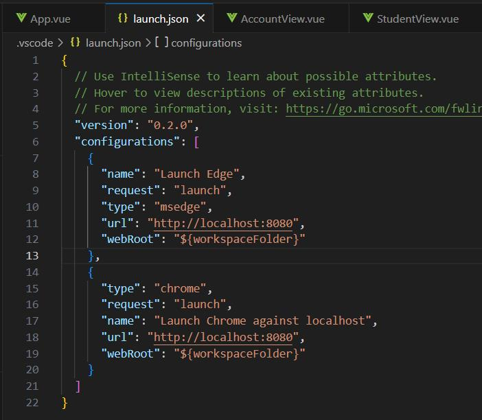

這時再回來看 Run and Debgu 上方的Launch Ch這個下拉選單﹐可以看到現在有 Launch Edge 和 Launch Chrome against localhost 兩項﹐如果想使用 Edge 進行Debug則是在這裏選擇 Launch Edge﹐然後點擊左側的綠色三角型(Start Debugging) 或者按下 F5 就會以Edge 開啟執行﹐如果要改用 Chrome﹐那麼改選擇Launch Chrome就可以了。

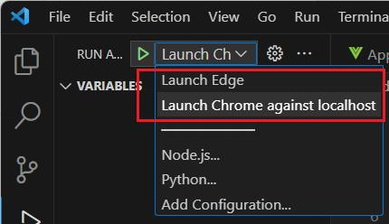

**Vue 的step by step**

Debug時如果可以step by step 那是最好的﹐上述launch.json 已設定完成﹐現在試試找一支Vue的程式在程式中設個中斷點﹐然後在 vs code 的 Terminal執行npm run serve 後﹐現在可以按下 F5 進入debug模式﹐在瀏覽器執行到有設定中斷點的程式﹐這時發現中斷點沒有起任何作用。

停止Debug模式﹐並停止vue程式的執行﹐打開 vue.config.js 加入以下的設定

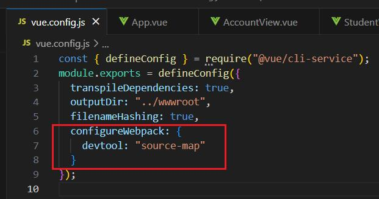

存檔後﹐現在重新執行 npm run serve 後再進入 Debug模式﹐這次執行就能正常停止在中斷點的位置。

**Web Api網址的設定**

在這個專案中﹐Vue的程式執行 npm run build 編譯後是輸出到wwwroot﹐這是 vue.config.js 中的設定﹐也就是說vue編譯後的程式和web api 專案是同一個專案中﹐發佈時是一起的

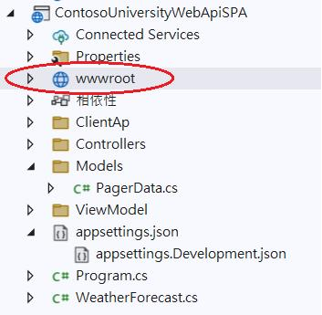

所以在Vue程式中呼叫到該專案中的web api 可以這麼寫 “api/Student/QueryData”

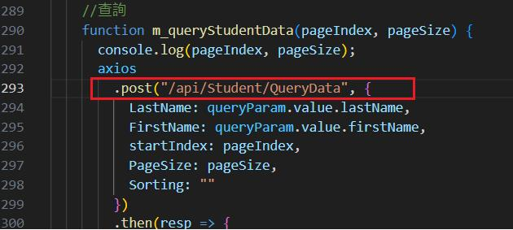

但是這樣是由 Web api 專案執行時沒有問題﹐現在改由 npm run serve 啟動vue的開發伺服器﹐這時是執行<http://localhost:8080> 進入前端的debug﹐這和web api 的網站不同﹐所以在web api Program.cs中必須加入CORS的設定﹐那麼Vue這一端該如何做呢？將網址改為web api 的網址？雖然這樣可以執行﹐但如果要將Vue程式做build打包到wwwroot﹐必須先將網址改回來才行﹐萬一呼叫的API很多﹐那應該會改到厭世也可能改錯吧。

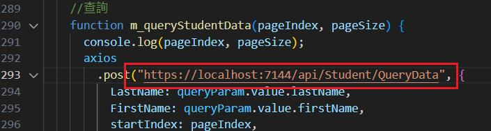

Asp.net core web api 專案有appsettings.json 和 appsettings.Development.json 環境之分的設定檔﹐Vue也有類似的。

系統在開發﹑測試到上線﹐正常會有許多環境﹐不同的環境會需要不同的參數值﹐例如開發﹑測試的環境連線的資料庫一定和正式環境的資料庫不同﹐所以連線字串就不同﹐又或者開發﹑測試呼叫的API會和正式環境的API來源不同﹐所以URL的設定也不同。如果在各個環境切換時都要改一次參數資料﹐那麼這個功就很無聊﹐很沒效率﹐而且頻繁的修改可能還會改錯。

在 Vue 中如何做才能省事呢？這就使用 .evn.\* 的檔案。例如 Vue 呼叫 Web API﹐開發環境和正式環境的 Web Api URL一定不同﹐我們不希望將網址寫死在代碼中﹐要不然每當要佈署時都要修改程式那可會是一個大工程﹐還可能會遺漏。這時可以建立環境變數﹐建立的方式是在根之下建立 .env 檔案

|  |  |
| --- | --- |
| 檔案名稱 | 說明 |
| .env | #在所有環境中被載入 |
| .env.自行定義名稱 | #定義中的環境載入 |

建立後還需要在 package.json 檔案中建立對應的模式

例如﹐現在有二個環境﹐開發環境﹐docker環境

|  |  |  |
| --- | --- | --- |
| 檔案名稱 | 說明 | 內容 |
| .env.local | #開發環境 | VUE\_APP\_API\_LOCAL = "https://localhost:7144/api" VUE\_APP\_PAGE\_SIZE = 3 |
| .env.docker | #docker環境 | VUE\_APP\_API\_LOCAL = "/api" VUE\_APP\_PAGE\_SIZE = 5 |

從內容看﹐這二個檔案中的內容 VUE\_APP\_API\_LOCAL 的變數值是不同的﹐環境變數名稱有個規則﹐變數名稱的開頭必須是**VUE\_APP\_**﹐這樣vue cli 才能抓到變數。

在Vue檔案中要使用環境變數的規則為 process.env.變數名稱

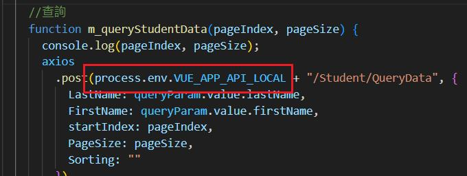

接著打開 package.json﹐檔案中可以找到以下的片段  
  "scripts": {  
    "serve": "vue-cli-service serve",  
    "build": "vue-cli-service build",  
    "lint": "vue-cli-service lint"  
  },

現在加入以下設定  
  "scripts": {  
    "serve": "vue-cli-service serve",  
    "build": "vue-cli-service build",  
    "serve:local": "vue-cli-service serve --mode local",  
    "build:local": "vue-cli-service build --mode local",  
    "serve:docker": "vue-cli-service serve --mode docker",  
    "build:docker": "vue-cli-service build --mode docker",  
    "lint": "vue-cli-service lint"  
  },

之後如果要使用的話﹐原本要build打包時的指令 **npm run build**可以改為如下  
**npm run build:local**        # build 開發環境  
**npm run build:docker**        # build docker 環境

若要進行debug﹐原本的 serve 指令 **npm run serve** 就改為以下指令  
**npm run serve:local**       # 執行開發環境

在完成上述的設定後﹐Asp.net core Web Api 專案按F5 進入debug 模式﹐Vue 專案下執行npm run serve:local ﹐在 vs code 按下F5 進入 Vue 的debug模式﹐現在在Vue程式中下中斷點可以在vue 程式 step by step 進行除錯﹐若Asp.net core web api 專案中也有下中斷點﹐同樣可以在 web api 專案中 step by step 進行除錯。

好了﹐其實不複雜﹐相關的設定都到位後﹐相信開發起來會更順手。
