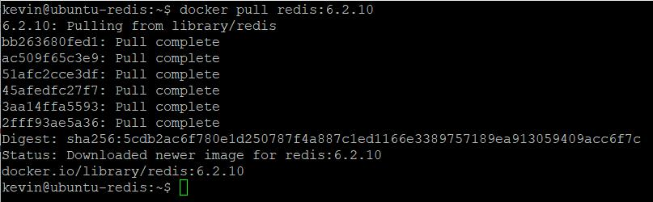
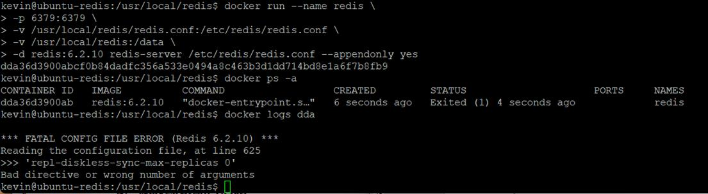
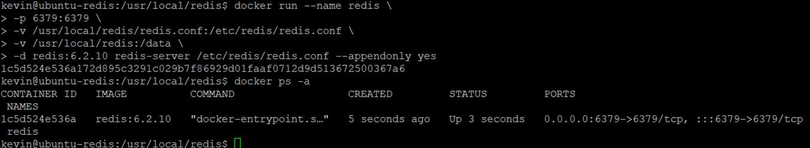
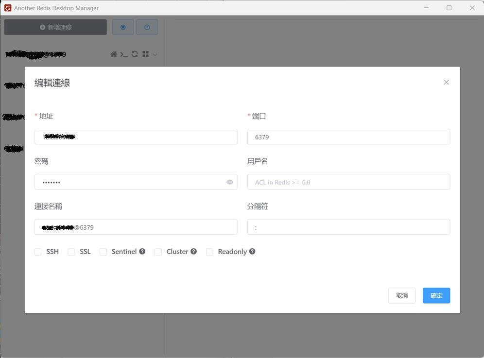
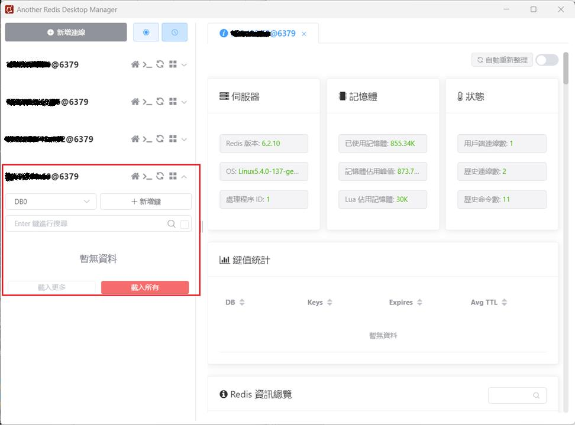

延續上一篇 [Redis Server 6.x for Ubuntu 20.04 Install](https://dotblogs.com.tw/nethawk/2023/03/04/linux-redis) 要談的是 Redis for Docker 的安裝﹐這也是我最後採用的方式﹐不得不說使用 docker 真的很方便。

我在我的本機以 VM 安裝了一個 ubuntu 20.04 Server 並安裝了 docker﹐現在在這個 VM 的 docker 進行 Redis 的安裝

* 拉取 redis docker image

第一步驟當然是要先拉取 redis image

```
$ docker pull redis
```

不過就上一篇說的﹐我要安裝的目標是 6.2.10 版﹐上述拉的版本會是最新的 7.x 版﹐所以必須要指定版號

```
$ docker pull redis:6.2.10
```



* 建立掛載的資料夾

docker container 並不是一個持久化的﹐一旦刪除就什麼都沒有了﹐所以 redis.conf 是採用外部掛載的方式﹐方便日後可以直接修改﹐然後重新 docker run 就可以讀取新的設定﹐我打算將位置建在 /usr/local 之下

```
$ cd /usr/local
$ sudo mkdir redis
$ cd redis
```

下載 redis.conf 設定檔文件

```
$ sudo wget http://download.redis.io/redis-stable/redis.conf
```

設定 redis.conf 權限

```
$ sudo chmod 777 redis.conf
```

修改 redis.conf 設定

|  |
| --- |
| `$ sudo nano redis.conf`  `# bind 127.0.0.1 -::1   # 註解此行﹐讓遠端電腦可以連線` `protected-mode no    # 預設yes, 如果設置為 yes,則只允許在本機的回環連接, 其它遠端電腦無法連接` `daemonize no            # 預設no 為不守護進程模式, docker部置不需要改yes, docker run -d 本身就是後台啟動, 不然會衝突` `requirepass 密碼        # 設定密碼` `appendonly yes         # 持久化` |

docker run 啟動 redis

```
$ docker run –name=redis \
-p 6379:6379 \
-v /usr/local/redis/redis.conf:/etc/redis/redis.conf \
-v /usr/local/redis:/data \
-d redis:6.2.10 redis-server /etc/redis/redis.conf --appendonly yes
```

說明：

1. -p 6379:6379: port的映射﹐前面是宿主主機﹐後面是容器
2. --name=redis: 指定容器的名稱為redis
3. -v 掛載文件或目錄: 前面是宿主主機﹐後面是容器  
   -v /usr/local/redis/redis.conf:/etc/redis/redis.conf 這裏指定容器中的redis.conf對應到宿主主機 /usr/local/redis/rdid.conf 檔案  
   -v /usr/local/redis:/data 容器中的持久化 data 對應到宿主主機的 /usr/local/redis 位置
4. -d redis:6.2.10 redis-server /etc/redis/redis.conf: 表示後台啟動 redis,使用配置文件啟動 redis, 加載容器內的conf文件
5. --appendonly yes: 開啟redis 持久化

這時如果啟動docker 會失敗﹐看看錯誤訊息 $ docker logs redis



失敗的原因是因為前面 $ sudo wget http://download.redis.io/redis-stable/redis.conf 下戴的設定檔版本與所安裝的 6.2.10 版本不同﹐上述的下載會是 laster 的版本(應該是目前的7.x﹐如果前面下載 image 是用docker pull reids 不指定版本﹐則可以搭配)﹐但因為前面拉 images 時指定了 6.2.10 版﹐所以必須下載 6.2.10 的 redis.conf﹐不過在官網一直沒找到 6.2.10 版的 redis.conf 下載點﹐所以只好從官網下載整個 redis-6.2.10 下來後解壓縮取得當中的 redis.conf 複製到 /usr/local/redis 之下再進行修改﹐然後重新執行﹐現在就能正常啟動了。



現在在本機對 VM 的 redis 進行連線測試﹐我使用 Another Redis Desktop Manager 做測試

因為 redis 設定為允許遠端連線﹐在 redis.conf 中有設密碼﹐所以本機新增連線也要設定密碼



確定後點選該筆就可以連線﹐畫面可以看到已經連線成功



到此 Redis 安裝告一段落﹐redis 還有許多設定﹐不過這次安裝 redis 是為了要測試 session 共享﹐所以其它的設定暫時先不管﹐接下來下一篇會撰寫一支實際的程式來驗證 session 的共享。  
下一篇 [Asp.Net Core 分散式Session – 使用 Redis](https://www.dotblogs.com.tw/nethawk/2023/03/08/net-redis-session)

參考資料  
[Docker安装Redis并配置文件启动-云社区-华为云 (huaweicloud.com)](https://bbs.huaweicloud.com/blogs/353173)
