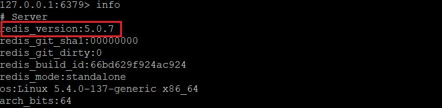
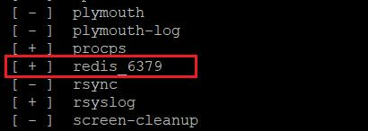

科技的演進﹐需求不斷擴張﹐使得系統架構越來越複雜﹐從早期的大型主機 Terminal方式﹑Client/Server﹑N-Tier﹐一路演進到分散式架構。早些年在分散式架構﹐透過 L4 Switch 和幾台 AP Server 就可以做出一個基本的分散式架構﹐對於 Session 的處理方式常會是以 L4 sticky 設定﹐讓 user 端黏在某台 AP Server﹐雖然有些失去  Load balance 的用意﹐但是是一個快速解決的方式。不過在容器化時代﹐這不是好的解決方案﹐為了能解決session 的共享﹐開始接觸了 Redis﹐工欲善其事﹐必先利其器﹐所以先將 Redis 環境架起來才能好好的研究。

因為之後開發的 .Net Core 程式要能發佈到 Linux Container ﹐所以 Redis 也打算採用 Linux 環境。

### 環境

OS:Ubuntu 20.04 Server  
Redis 目標版本：6.2.10

### 安裝

安裝方式大約可以分三種﹐第一種使用 apt 安裝﹐第二種使用官網下載編譯安裝﹐第三種採用 docker 方式。

#### apt 指令安裝

輸入以下指令進行安裝

```
$ sudo apt update && sudo apt upgrade -y
$ sudo apt install redis-server
```

安裝好後﹐可以用 $ service --status-all 指令檢查一下 redis 服務是不是已經安裝啟用了


安裝好後開啟 redis.conf 進行設定編輯

```
$ sudo nano /etc/redis/redis.conf
```

修改以下幾個設定

###### # 由 system 控制 Redis 服務 supervised system

將redis.conf 存檔離開後﹐重新啟動 redis 服務

```
$ sudo systemctl restart redis.service
```

在這裏我碰到了一個問題﹐網路上很多文章的安裝都是教大家使用apt 安裝後修改設定完執行上述指令進行重啟服務﹐但是當我執行時卻出現了以下的錯誤

###### Job for redis-server.service failed because the control process exited with error code. See "systemctl status redis-server.service" and "journalctl -xe" for details.

在前面使用過 service --status-all 檢視過服務中有一項 redis-server﹐但即使是將指令改為 sudo systemctl restart redis-server 還是同樣的錯誤。我個人對 linux 還不是那麼熟悉﹐最後只能重新開機讓新的設定套用。但之後修改設定要重啟服務還是會面臨這個問題﹐現在我並不想在這裏多花時間﹐因為這不是我之後要採用的方式。

apt 安裝是最方便快速﹐但通常不會是最新的版本﹐在redis-cli 中我們輸入Info 可以看到現在安裝的版本是5.0.7﹐文章撰寫時Redis 已是7.x版﹐網路上大部分的討論則是 6.x﹐所以 apt 安裝 5.x 太舊了。



參考資料：[Ubuntu Linux 安裝、設定 Redis 資料庫教學與範例 - Office 指南 (officeguide.cc)](https://officeguide.cc/ubuntu-linux-redis-database-installation-configuration-tutorial-examples/)

#### 官網下載編譯安裝

Redis 官網有提供 Linux 安裝方式([Install Redis on Linux | Redis](https://redis.io/docs/getting-started/installation/install-redis-on-linux/))﹐但是我對於 linux 不夠熟悉﹐使用官網上的安裝後﹐我找不到redis 被安裝於何處﹐所以我就放棄了。

* 下載與編譯

改用下載原始檔編譯安裝﹐雖然最新版是 7.x﹐但網路上文章還很少看到 7.x 的討論﹐所以決定下載 6.2.10 版本安裝。

先進入 /usr/local 建立一個 redis 資料夾

```
$ cd /usr/local
$ sudo mkdir redis
$ cd redis
```

在redis資料夾下下戴redis(這裏下載的是 redis-6.2.10 版本)﹐並解壓縮

```
$ sudo wget https://download.redis.io/releases/redis-6.2.10.tar.gz
$ sudo tar -zxvf redis-6.2.10.tar.gz
```


進入已解壓縮的資料夾 redis-6.2.10 開始進行編譯和安裝

```
$ cd redis-6.2.10
$ sudo make
```

在make時出現錯誤


根據提示是 ubuntu 沒有 make 套件﹐需要先做安裝﹐如果環境有中此套件﹐這步驟可以跳過

```
$ sudo apt install make
```

雖然已安裝了make套件﹐但是在在執行make 時還是出現了錯誤

kevin@ubuntu-redis:/usr/local/redis/redis-6.2.10$ make  
cd src && make all  
make[1]: Entering directory '/usr/local/redis/redis-6.2.10/src'  
touch: cannot touch 'release.h': Permission denied  
cat: release.h: No such file or directory  
./mkreleasehdr.sh: 11: cannot create release.h: Permission denied  
./mkreleasehdr.sh: 12: cannot create release.h: Permission denied  
./mkreleasehdr.sh: 13: cannot create release.h: Permission denied  
touch: cannot touch 'release.c': Permission denied  
sh: 1: cannot create foo.c: Permission denied  
rm: cannot remove 'foo.c': No such file or directory  
/bin/sh: 1: pkg-config: not found  
CC Makefile.dep  
/bin/sh: 1: cannot create Makefile.dep: Permission denied  
/bin/sh: 1: cc: not found  
rm -rf redis-server redis-sentinel redis-cli redis-benchmark redis-check-rdb redis-check-aof \*.o \*.gcda \*.gcno \*.gcov redis.info lcov-html Makefile.dep  
...  
...

這裏需要再安裝兩個套件

```
$ sudo apt install -y pkg-config
$ sudo apt install -y build-essential
```

在安裝 build-essential 時出現了錯誤

###### E: Failed to fetch http://tw.archive.ubuntu.com/ubuntu/pool/main/l/linux/linux-libc-dev\_5.4.0-137.154\_amd64.deb 404 Not Found [IP: 140.110.240.80 80] E: Unable to fetch some archives, maybe run apt-get update or try with –fix-missing?

字面的意思應該是連線到tw.archive.ubuntu.com有問題﹐同時也提示了試著重新更新資源庫或加上 --fix-missing 來解決

```
$ sudo apt-get update --fix-missing
```

更新後再重新執行 sudo apt install -y build-essential 就沒問題了﹐安裝後重新執行 sudo make (前述的錯誤還有權限不足﹐所以需要加上 sudo)﹐make 過程需要幾分鐘﹐若執行成功應該最後會有這樣的畫面


然後執行 make install

```
$ sudo make install
```


make install 因為沒有特別指定路徑﹐所以安裝後的 redis 會在 /usr/local/bin 之下


在這路徑下可以看到這裏面有 redis-cli, redis-server 的命令

啟動 redis﹐進入 /usr/local/bin 執行./redis-server


現在用 putty 開啟另一個畫面做redis的測試﹐執行redis-cli

```
$ redis-cli
127.0.0.1:6379> ping
PONG
127.0.0.1:6379>
```


或者輸入 nc localhost 6379 ﹐然後輸入 ping 會得到 +PONG


這都表示redis 已經正常啟動可以連線

* 安裝 redis 為 linux service

redis 有提供一個方便的安裝方式﹐採用問答的模式做一些基本設定﹐然後將redis安裝為 service﹐在前面下載解壓redis-6.2.10.tar.gz後的資料夾中會有一個utils 的資料夾﹐這之下有一個檔案 install\_server.sh 就是我們要執行的檔案。

```
$ cd /usr/local/redis/redis-6.2.10/utils
$ sudo ./install_server.sh
```

不過這時候可能會發現系統告訴你錯誤

###### Welcome to the redis service installer This script will help you easily set up a running redis server This systems seems to use system. Please take a look at the provided example service unit files in this directory, and adapt and install them. Sorry!

解決的辦法是要將install\_server.sh 腳本中的部分註解才行

```
$ sudo nano install_server.sh
```

將以下紅框這一部分都註解掉


重新執行 $ sudo ./install\_server.sh  這時就會開始進入詢問

|  |
| --- |
| Welcome to the redis service installer This script will help you easily set up a running redis server  Please select the redis port for this instance: [6379]  預設6379 port 不改 Selecting default: 6379 Please select the redis config file name [/etc/redis/6379.conf] /etc/redis/redis.conf  將預設的6379.conf 改為redis.conf Please select the redis log file\_name [/var/log/redis\_6379.log]  預設的記錄檔不變更 Selected default - /var/log/redis\_6379.log Please select the data directory for this instance [/var/lib/redis/6379]  預設 data 位置不變更 Selected default - /var/lib/redis/6379 Please select the redis executable path [/usr/local/bin/redis-server]  預設啟動程式的位置不變更 Selected config: Port : 6379 Config file   :  /etc/redis/redis.conf Log file      :  /var/log/redis\_6379.log Data dir      :  /var/lib/redis/6379 Executalbe   :  /user/local/bin/redis-server Cli Executable  :  /usr/local/bin/redis-cli Is this ok? Then press ENTER to go on or Ctrl-C to abort.   確認上述設定按Enter或 Ctrl-C 取消  Enter 之後  Copied /tmp/6379.conf => /etc/init.d/redis\_6379 Installing service… Success! Starting Redis server… Installation successful! |

到這裏﹐就是service 安裝好了﹐這時我們輸入 service --staus-all 可以看到所有運作中的service列表中有一項redis\_6379



後續如果有修改/etc/redis/redis.conf 中的設定﹐要進行重啟﹐可以輸入以下指令

```
$ sudo systemctl restart redis_6379
或者
$ service redis_6379 restart
```

* redis.conf 設定

在前面編譯安裝後﹐這時在 /etc 或  /etc/redis 都還沒有 redis.conf 這個檔案﹐在壓解縮的 redis-6.2.10 資料夾下才有﹐可以將 redis-6.2.10/redis.conf 複製到 /etc/redis 之下﹐但因為後續執行 install\_server.sh將redis安裝為 linux service﹐在設定過程就會指定並產生redis.conf﹐所以就不另外複製。

在前述的install\_server.sh 執行中有一行詢問

|  |
| --- |
| Please select the redis config file name [/etc/redis/6379.conf] /etc/redis/redis.conf  將預設的6379.conf 改為redis.conf |

這裏原本預設的設定檔檔名為6379.conf﹐在這我們已經將其改為 redis.conf

開啟redis.conf 進行設定

```
$ sudo nano /etc/redis/redis.conf
```

設定讓遠端電腦可以連線使用﹐將以下此行註解﹐預設只能本機連線﹐註解後遠端電腦才能使用

###### # bind 127.0.0.1 -::1

timeout 設定

###### # Close the connection after a client is idle for N seconds (0 to disable) timeout 0

這個設定以秒數計﹐如果client 在 idle 指定秒數後會被timeout﹐但設為0則關閉timeout

設定密碼

###### requirepass 密碼值

預設是沒有密碼﹐若將bind 註解後允許遠端電腦連線﹐則應該設置密碼加強安全性

參考資料

[(28条消息) ubuntu 20.04编译安装redis6.09\_一直向钱的博客-CSDN博客](https://blog.csdn.net/u013519290/article/details/122048197)  
[在 Linux 中將 Redis 安裝成 Service - 以 CentOS 7 為例 - Yowko's Notes](https://blog.yowko.com/centos7-redis-service/)

時間有點晚了﹐第三種 Docker 安裝在下一篇繼續 ([Redis Server 6.x for Ubuntu 20.04 Install--續](https://www.dotblogs.com.tw/nethawk/2023/03/05/linux-redis-docker))
