分散式環境多台應用程式主機﹐如何解決Session的方式有很多種﹐例如server之間session同步﹑使用者端儲存﹑使用資料庫儲存…﹐各種方式都已經行之有年﹐各有好壞﹐不是什麼絕對的方式﹐主要還是要取決系統的用途﹑架構﹑用戶流量﹑預算…各種原因來決定那一種方式是比較洽當的。這裏要討論的是在 .Net Core 及容器化之下透過 Redis 來達成 Session 共用的方式。

在開始之前﹐先看一下預期要做的目標

目標：  
一個 .Net Core 應用程式﹐在 loadbalancer 環境下多個 AP Server 的 Session 能互相共用﹐即使瀏覽器被導到不同的主機 session 仍然可以讀取的到而不致於中斷﹐這樣當某一台 AP Server 出問題時系統還是可以繼續運作。

架構：根據上述目標繪製出以下架構


這裏為了儘量和實際上線後的環境相同﹐建立兩個虛擬主機 A 和 B﹐並且都安裝了Docker以容器化來執行﹐主機 A 中安裝了Nginx container 做為 loadbalancer﹐另外將應.Net Core 應用程式建立 Image 後產生三個不同port的container 來模擬不同的AP Server﹐主機 B 則安裝了Redis container供主機A中的應用程式共享Session﹐Redis for Docker 如何安裝參考 Redis Server Install.docx文件中的描述。(做完後我才想起來﹐我用 docker 幹嘛這麼搞剛的多弄了一台虛擬主機呢…=__=!)

**應用程式準備**

在環境建置前﹐先準備應用程式﹐這是個簡單的MVC程式﹐有兩個頁面﹐內容相同﹐都是要顯示session的內容並顯示Server Host Name﹐這是為了要證明在第一個頁面送出Reauest切換到第二個頁面是不是同一個Server Response資料﹐而Session 的內容是否仍然還在。

這兩個頁面都有設置了[Authorize]﹐所以一開始未登入會被導到Login頁面。

現在建置這個程式﹐我不打算一步到位﹐我希望在既有程式有使用session的狀況下加入Redis時會有什麼樣的差別﹐所以先寫出只有Session的應用程式。

在Program.cs中加入session必要的部分

```cs
Program.cs
……
#region use session
builder.Services.AddSession(options => {
    options.Cookie.Name = ".dist.Session";
    options.IdleTimeout = TimeSpan.FromSeconds(300);     // 設定 Session 過期的時間, 300 sec
});
#endregion
……
var app = builder.Build();
……
app.UseSession();
……

```

新增 LoninController﹐在LoginController登入時將資料寫入 Session 後導至 HomeController的 Index 

```cs
LoginController.cs
public IActionResult Login() {
    string svrhost = utils.GetHostName();
    ViewData["SvrHost"] = svrhost;
    return View();
}
[HttpPost]
public async Task<IActionResult> Login(UserData userData) {
    userData.LoginTime = DateTime.Now;
    HttpContext.Session.Set<UserData>("User", userData);
    #region 不使用 ASP.NET Core Identity 的 Cookie 驗證
    var claims = new List<Claim> {
                new Claim(ClaimTypes.Name,userData.AgentId),  //登入者帳號
                new Claim("FullName",userData.AgentName),     //登入者姓名
                new Claim("LoginTime",userData.LoginTime.ToString()),  //登入時間
                new Claim(ClaimTypes.Role,userData.RoleID)
            };
    var claimsIdentity = new ClaimsIdentity(claims, CookieAuthenticationDefaults.AuthenticationScheme);
    var authProperties = new AuthenticationProperties {
    };
    //登入
    await HttpContext.SignInAsync(
        CookieAuthenticationDefaults.AuthenticationScheme,
        new ClaimsPrincipal(claimsIdentity),
        authProperties);
    #endregion
    return RedirectToAction("Index", "Home", null);
}

```

在HomeController的Index中取得Session並顯示Session的內容﹐頁面上也顯示Server的IP和Hostname﹐由此來觀察瀏覽器現在是由那一台主機Response資料

ps. Asp.net Core Session 存放物件必須自行撰寫序列化﹐因為不是這篇的重點﹐這裏就不詳述﹐請自行google或參考程式碼

```cs
HomeController.cs
public IActionResult Index() {
    UserData user = null;
    string svrip = utils.GetServerIP();
    string svrhost = utils.GetHostName();
    ViewData["SvrIp"] = svrip;
    ViewData["SvrHost"] = svrhost;
    if (HttpContext.Session.Get<UserData>("User") != null) {
        user = HttpContext.Session.Get<UserData>("User");
    }
    return View(user);
}

```

Home\Index View

```cs
Home Index.cshtml
@model DistSession.ViewModel.UserData
@{
    ViewData["Title"] = "Home Page";
}
<div>
    <h4>Home</h4>
    <dl class="row">
        <dt class="col-sm-2">Server IP</dt>
        <dd class="col-sm-3">@ViewData["SvrIp"]</dd>
        <dt class="col-sm-2">Host Name</dt>
        <dd class="col-sm-3">@ViewData["SvrHost"]</dd>
    </dl>
    <dl class="row">
        <dt class="col-sm-2">@Html.DisplayNameFor(model=>model.AgentId)</dt>
        <dd class="col-sm-9">@Html.DisplayFor(model=>model.AgentId)</dd>
        <dt class="col-sm-2">@Html.DisplayNameFor(model=>model.AgentName)</dt>
        <dd class="col-sm-9">@Html.DisplayFor(model=>model.AgentName)</dd>
        <dt class="col-sm-2">@Html.DisplayNameFor(model=>model.DeptID)</dt>
        <dd class="col-sm-9">@Html.DisplayFor(model=>model.DeptID)</dd>
        <dt class="col-sm-2">@Html.DisplayNameFor(model=>model.DeptName)</dt>
        <dd class="col-sm-9">@Html.DisplayFor(model=>model.DeptName)</dd>
        <dt class="col-sm-2">@Html.DisplayNameFor(model=>model.RoleID)</dt>
        <dd class="col-sm-9">@Html.DisplayFor(model=>model.RoleID)</dd>
        <dt class="col-sm-2">@Html.DisplayNameFor(model=>model.LoginTime)</dt>
        <dd class="col-sm-9">@Html.DisplayFor(model=>model.LoginTime)</dd>
    </dl>
</div>

```

Page2Controller 則和HomeController相同﹐是為了測試在分散式環境下切換不同頁面時資料是由那一台主機Response。

程式在本機執行沒有什麼問題﹐所以就不貼畫面﹐將程式進行發佈﹐因為後續程式是在Ubuntu的容器下執行﹐所以發佈的目標為Linux-64


接下來就準備將發佈的程式上傳到主機A﹐以Docker container方式執行﹐到此我們先去建立主機 A 和 B 的環境。

**環境架設**

**主機B** ：這裏安裝的是Redis 6.2.10﹐安裝與設定方式參考 [Redis Server 6.x for Ubuntu 20.04 Install--續](<https://www.dotblogs.com.tw/nethawk/2023/03/05/linux-redis-docker>)

**主機A**

安裝 Nginx﹐用來模擬loadbalancer

1\. 下載 nginx docker

$docker pull nginx

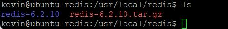

測試 nginx

$docker run –name nginx-test -d -p 8880:80 nginx:latest

剛安裝好的nginx ﹐啟動應該不會有什麼問題﹐所以應該可以開啟Browser進行測試nginx是否真的啟動成功

http://xxx.xxx.xxx.xxx:8880

2\. 上傳應用程式

在主機A 上建立要上傳的目的資料夾

$mkdir myapp

$mkdir dist

在本機開啟CMD視窗﹐以scp 指令上傳檔案至主機A上

scp -r  _本機資料夾_  _帳號@目的主機IP:目標路徑_

-r 表示包含資料夾下的子資料夾

3\. 編寫 Dockfile 檔案

```plaintext
FROM mcr.microsoft.com/dotnet/aspnet:6.0    # 使用 .Net 6 Runtime 的 image
RUN mkdir c:\app                            # 在容器中的 c 根下建立一個名稱為 app 的資料夾
COPY publish/ /app                          # 將地端 publish 資料夾下的東西 copy 到容器中的 app 之下
WORKDIR /app                                # 將容器中的工作目錄設為 app
ENTRYPOINT ["dotnet","DistSession.dll"]     # 以 dotnet 執行 DistSession.dll (以Ketral執行)

```

4\. 建立Image

$ docker build -t dist:1.0 .

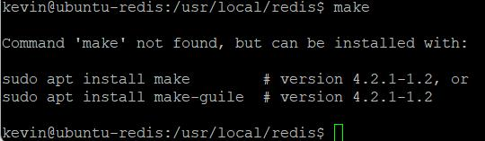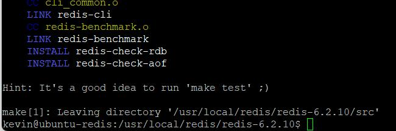

5\. 建立 Container

$ docker run -it -d -p 80:80 --name=dist dist:1.0

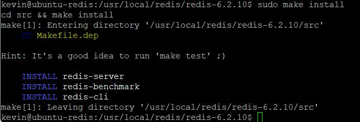

現在container 已啟動﹐可以先開browser測試﹐是否可以正常執行

6\. 執行程式

打開瀏灠器輸入網址 http://10.0.100.61

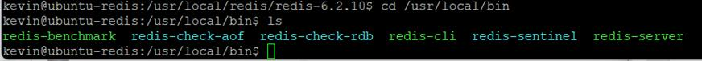

在登入頁先取得Server 的 Host name﹐因為是執行在Docker container 所以取得的是 Container ID

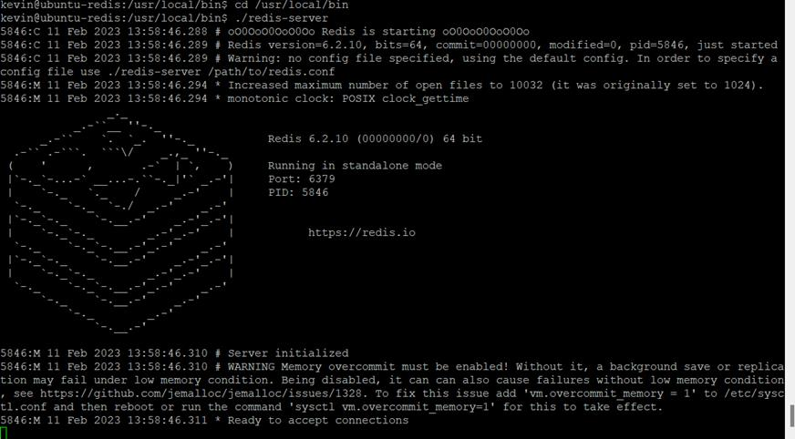

登入後被導至Home畫面﹐顯示的 Host name和 登入頁是相同的﹐而畫面的值是在登入時將值存入了 Session[“User”]﹐Home的畫面則將Session[“User”]值再取出顯示。

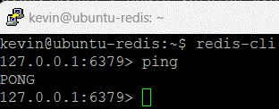

點擊上方Page2﹐切換到 Page2的畫面﹐可以看到資料和Home顯示的都相同﹐因為現在只有一個container﹐所以都在同一個container執行﹐取得的 Host name 也都相同。

現在將主機A上這個container刪除﹐我們改為三個container﹐並設定 Nginx 做Loadbalancer。

**設定 Loadbalance 環境**

1\. 建立容器群網路﹐網路內的容器可直接互連

$docker network create webtest

2\. 建立三個container

使用前面已經建好的image dist:1.0建立三個不同port的container

$docker run -d --name dist001 --network="webtest" -p 10001:80 dist:1.0  
$docker run -d --name dist002 --network="webtest" -p 10002:80 dist:1.0  
$docker run -d --name dist003 --network="webtest" -p 10003:80 dist:1.0

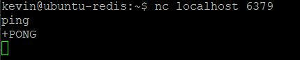

3\. 編寫 nginx.conf

```plaintext
http{
 upstream dist.localhost {
    server dist001:80;   # 這裏的80 port 指的是容器內的 port, 不是 expose 的10001 port
    server dist002:80;
    server dist003:80;
 }
 
 server {
   listen 10000;     # 監聽 10000
   #ssl_certificate /etc/nginx/certs/demo.pem;
   #ssl_certificate_key /etc/nginx/certs/demo.key;
   gzip_types text/plain text/css application/json application/x-javascript
              text/xml application/xml application/xml+rss text/javascript;
   server_name localhost;
   location / {
       proxy_pass http://dist.localhost;
   }
 }
}
 events {
   worker_connections  1024;  ## Default: 1024
 }

```

在主機 A上建立資料夾

$ mkdir nginx  
$ cd nginx  
$ mkdir conf.d

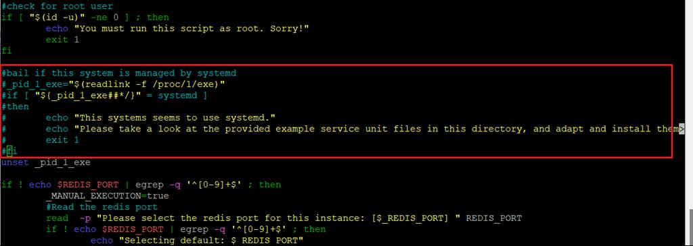

建立後像這樣

然後將nginx.conf 上傳到主機 A 的 ~/nginx/conf.d 之下

接著將原本已執行的nginx container 刪除﹐重新建立nginx 的container

$ docker run --name web-test-nginx \  
\--network="webtest" \  
-p 10000:10000 \  
-v /home/kevin/nginx/conf.d/nginx.conf:/etc/nginx/nginx.conf:ro \  
-itd nginx nginx-debug -g 'daemon off;'


4\. 執行程式測試

在執行程式前我們先觀察一下目前三個應用程式的container id﹐注意目前程式只有使用一般的session﹐還未做任何分散式的做法

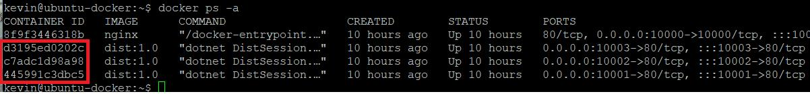

分別是**d3195ed0202c, c7adc1d98a98, 445991c3dbc5** 這三個﹐因為在Nginx 設定的監聽為10000 port﹐所以執行程式為 <http://10.0.100.61:10000>, 在按下登入前﹐畫面顯示的Host Name是**c7adc1d98a98**

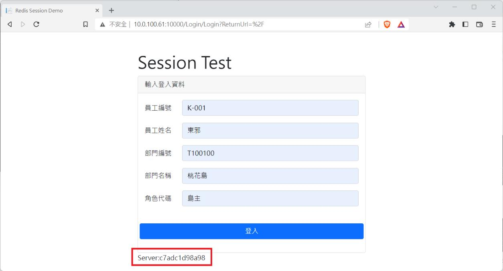

按下登入後並沒有進入系統而是又回到了登入頁﹐這時看到畫面的Host Name變成了**445991c3dbc5**

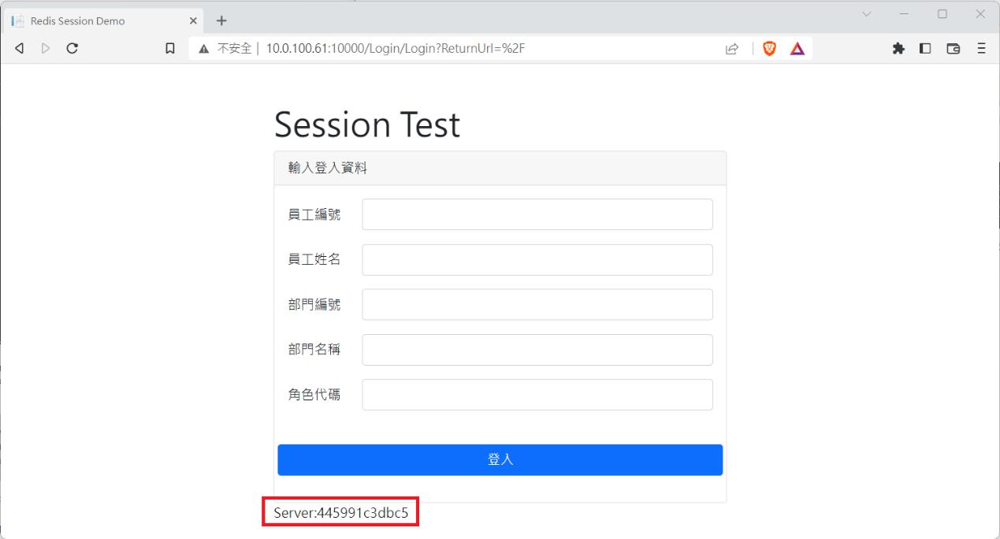

到主機A下指令檢查container 的Log

$ docker logs **c7adc1d98a98**

```plaintext
warn: Microsoft.AspNetCore.Session.SessionMiddleware[7]
      Error unprotecting the session cookie.
      System.Security.Cryptography.CryptographicException: The key {c92ec8a9-71a8-4e3a-b4fb-d3ff2f387e9c} was not found in the key ring. For more information go to http://aka.ms/dataprotectionwarning
         at Microsoft.AspNetCore.DataProtection.KeyManagement.KeyRingBasedDataProtector.UnprotectCore(Byte[] protectedData, Boolean allowOperationsOnRevokedKeys, UnprotectStatus& status)
         at Microsoft.AspNetCore.DataProtection.KeyManagement.KeyRingBasedDataProtector.Unprotect(Byte[] protectedData)
         at Microsoft.AspNetCore.Session.CookieProtection.Unprotect(IDataProtector protector, String protectedText, ILogger logger)
.....
```

檢視另外兩個 container log 都有類似的錯誤﹐這是因為經過 nginx 導流到不同台 server 找不到 session 的關係。

**加入Redis 做分散式Session**

主機B已經架設好Redis﹐這裏安裝了 Another Redis Desktop Manager做觀察﹐redis是安裝於10.0.100.61從畫面來看連線沒有問題

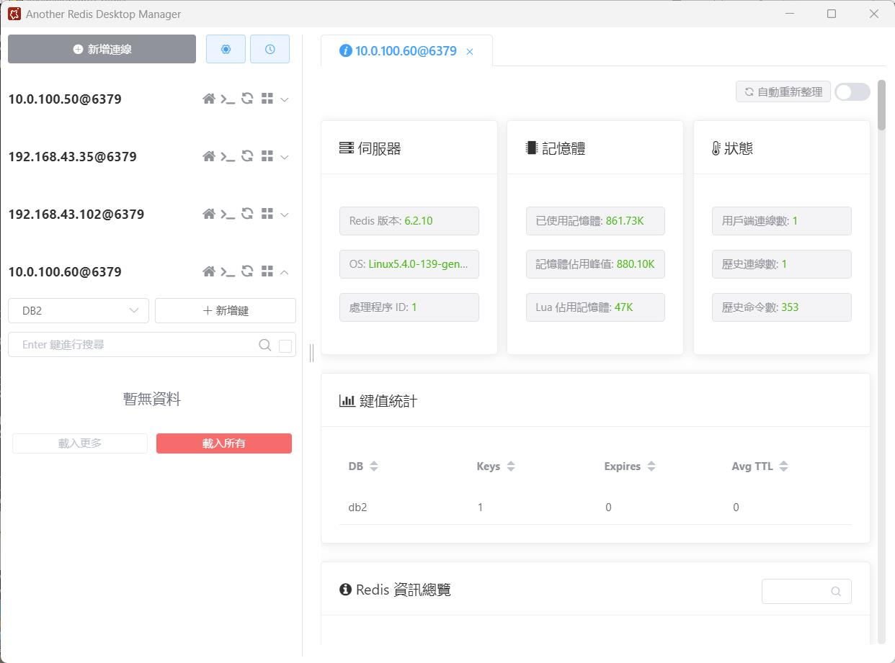

**應用程式加入Redis套件**

1\. 開啟NuGet安裝Microsoft.Extensions.Caching.StackExchangeRedis套件, 最新版是7.0.3支援.Net 7﹐不過專案是 .Net 6避免出現問題﹐改安裝6.0.14版

2\. 加入redis 連線字串

在appsettings.json中加入連線﹐這裏Redis設有密碼﹐並且指定第2個DB

```plaintext
"ConnectionStrings": {
    "RedisConnection": "10.0.100.60:6379,password=123456#,defaultDatabase=2"
  },

```

3\. Programs.cs 加入Redis

```cs
#region 加入 redis 作分散式
builder.Services.AddStackExchangeRedisCache(options => {
    options.Configuration = builder.Configuration.GetConnectionString("RedisConnection");  //redis 連線
    options.InstanceName = ".dist.Session";
});
#endregion
#region use session
builder.Services.AddSession(options => {
    options.Cookie.Name = ".dist.Session";
    options.IdleTimeout = TimeSpan.FromSeconds(300);     // 設定 Session 過期的時間, 300 sec
});
#endregion

```

4\. 重新發佈﹐重建image

將程式編譯後重新發佈﹐上傳至主機A﹐將原本的3個應用程式container及原本的image刪除﹐重建image﹐並重新建3個container﹐然後看一下現在3個新的container id

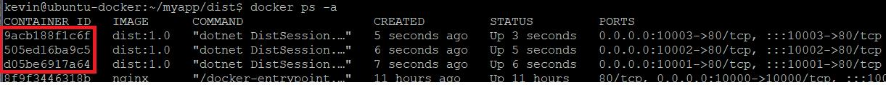

分別是9acb188f1c6f, 505ed16ba9c5, d05be6917a64﹐現在重新執行程式

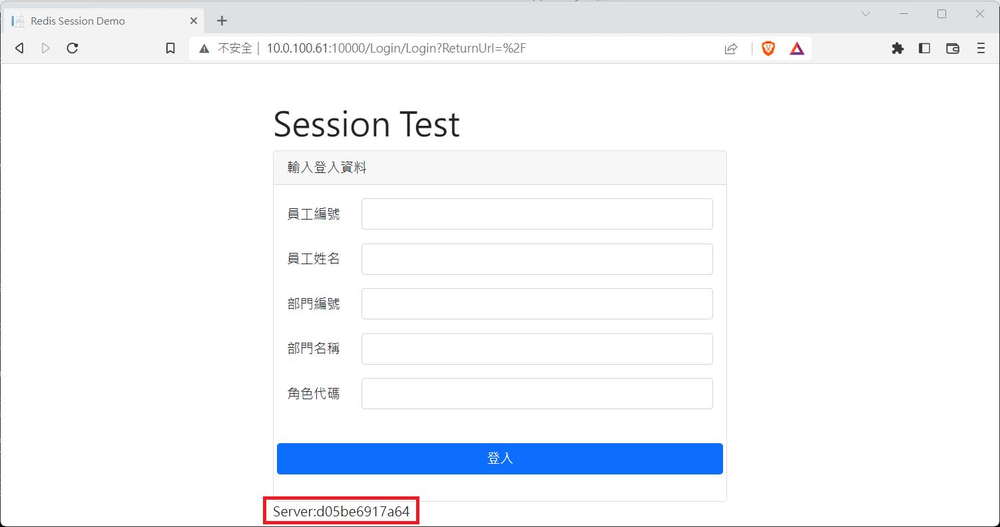

一開始的Host Name是d05be6917a64, 按下登入後畫面依舊是回到了登入頁﹐Host Name變為9acb188f1c6f

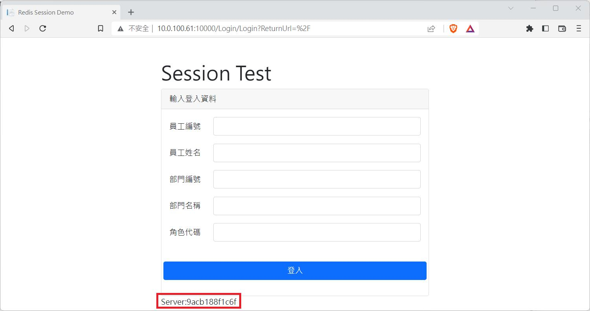

這和我們預期的不一樣﹐我們看一下Another Redis Desktop Manager

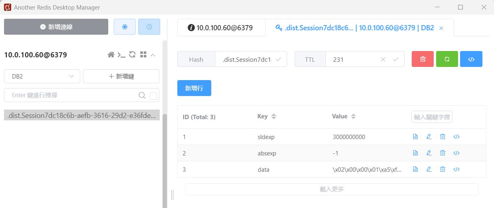

畫面上Redis確實有資料﹐在剛剛程式中Program.cs中加入的代碼﹐給的InstanceName是”.dist.Session”

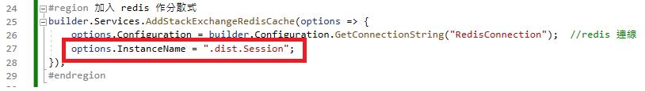

在Redis可以看到有個有一串很長的 ".dist.Session1206f240-7a9c-3686-9f34-2104840b3f5d"字串﹐開頭是”.dist.Session”就是我們程式所產生的Session﹐如果進入docker以redis-cli 查詢也可以看得到。

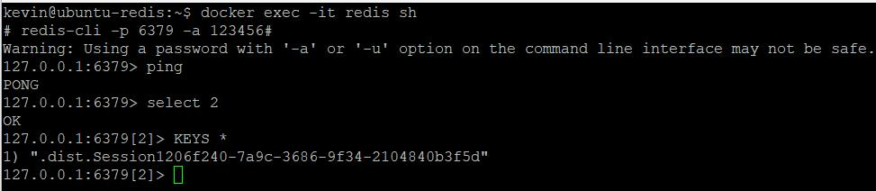

但程式並沒有登入畫面﹐這是為什麼？如果再去看看應用程式container的log會發現和先前的錯誤並沒有什麼兩樣﹐不過其實在之前的Log已經有線索了。

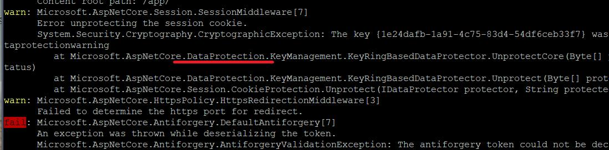

這裏提到一個東西DataProtection

5\. Data Protection 機制

關於.Net Data Protection可參考微軟 [ASP.NET Core資料保護概觀 | Microsoft Learn](<https://learn.microsoft.com/zh-tw/aspnet/core/security/data-protection/introduction?view=aspnetcore-7.0>) 文章﹐而這裏主要是在共享session時必須要有一致的Key來做加解密﹐當我們寫到Redis 的Session資料是被加密過的﹐如果沒有一致的私鑰那麼是無法正確的讀取共享的session。

開啟專案﹐再由Nuget找到Microsoft.AspNetCore.DataProtection.StackExchangeRedis 這個套件加入﹐這裏配合前面Microsoft.Extensions.Caching.StackExchangeRedis套件一樣案裝6.0.14版﹐接著開啟 Program.cs 加入DataProtection 相關的片斷程式

```cs
#region 將數據保護的秘鑰存儲為分布式
//安裝 Microsoft.AspNetCore.DataProtection.StackExchangeRedis
builder.Services.AddDataProtection()
    .PersistKeysToStackExchangeRedis(ConnectionMultiplexer.Connect(builder.Configuration.GetConnectionString("RedisConnection")), ".dist.Session");
#endregion
#region 加入 redis 作分散式
builder.Services.AddStackExchangeRedisCache(options => {
    options.Configuration = builder.Configuration.GetConnectionString("RedisConnection");  //redis 連線
    options.InstanceName = ".dist.Session";
});
#endregion
#region use session
builder.Services.AddSession(options => {
    options.Cookie.Name = ".dist.Session";
    options.IdleTimeout = TimeSpan.FromSeconds(300);     // 設定 Session 過期的時間, 300 sec
});
#endregion

```

重新發佈程式﹐並重新建立image和container

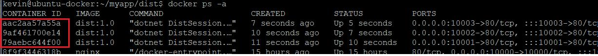

現在新的3個container id為**aac2aa57a55a, 9af461700e14, 79aebc644f00** ﹐然後再執行程式測試

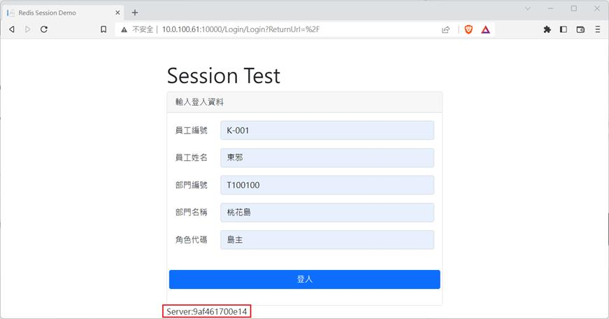

現在Host Name為9af461700e14﹐按下登入後這次順利登入了﹐在Home的頁面也帶出了Login時所寫入的Session的值﹐而畫面上這時出現的Host Name為79aebc644f00和登入頁是不同的

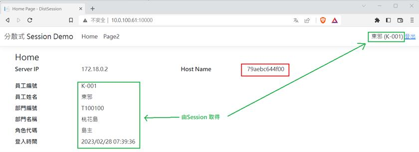

這時如果去點擊Page2﹐可以看到Host Name又不一樣了

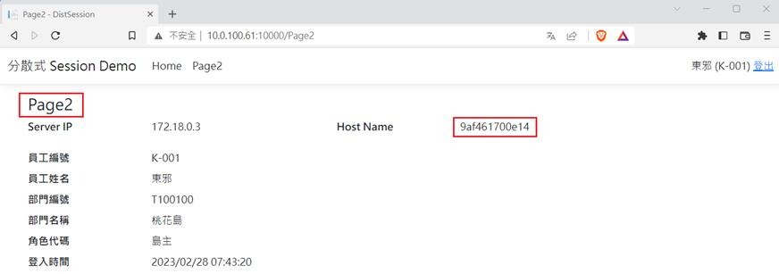

如果這時候故意去將某一個container 停止或刪除﹐並不會影響系統的運作﹐因為有3個container 做loadbalance和備援﹐而session又是存放於Redis共享﹐系統仍然能夠繼續運作。

結語

透過Redis確實解決了Session 共享的問題﹐同時在既有的程式上只有在Program.cs中添加相關Redis的代碼﹐對於原本的程式代碼都可以不用動就完成了分散式session的功能﹐確實是很不錯。不過Session 的使用仍然要很小心。

原始碼：[GitHub](<https://github.com/nethawkChen/.net6-distsession-redis>)

參考

[ASP.NET Core 中Session的分布式存储_FatTigerWang的博客-CSDN博客_core 存储session](<https://blog.csdn.net/FatTigerWang/article/details/120162415>)

[Nginx Proxy建立Load Balance分流機制 – Paul's Recipe Book (g) (paulfun.net)](<http://paulfun.net/wordpress/?p=645>)

[集群环境下，你不得不注意的ASP.NET Core Data Protection 机制_dotNET跨平台的博客-CSDN博客](<https://blog.csdn.net/sD7O95O/article/details/102546783>)

[ASP.NET Core資料保護概觀 | Microsoft Learn](<https://learn.microsoft.com/zh-tw/aspnet/core/security/data-protection/introduction?view=aspnetcore-7.0>)