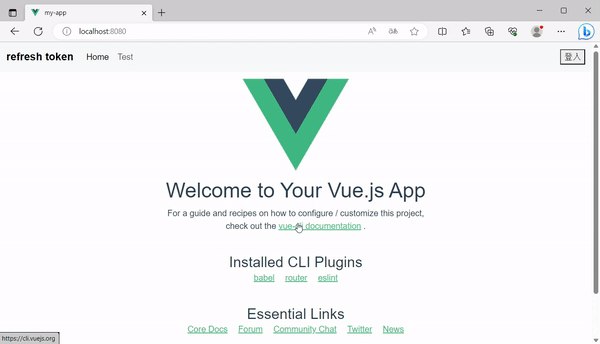
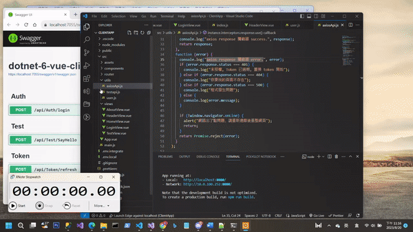
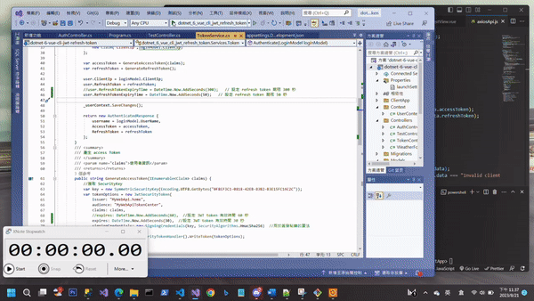

JWT(JSON Web Token) 是 Web Api 認證常使用的方式﹐但JWT token 一般儲存於用戶端的 Cookie 或 Web Storage﹐顧慮到token 可能被盜用﹐所以 token 的時效都設定不長﹐若因為這樣而使得使用者在剛登入後不久後又要再次登入﹐這樣user 鐵定抓狂﹐IT 人員很難混下去。

refresh token 的做法就是為了解決這個問題而產生﹐原理很簡單﹐在登入時產生2個 Token(accessToken & refreshToken)﹐一個是時效短用來認證的 accessToken (JWT) 儲存於用戶端﹐一個是比較長時效的 refreshToken紀錄於資料庫及用戶端﹐同時也儲存於用戶端；當用戶端呼叫API 時若 accessToken 已超過時效﹐則會取 refreshToken 檢查是否超過時效﹐若 refreshToken 還在時效內則重新產生一個新的 accessToken﹐自動以新的 accessToken 進行認證﹐讓使用者不會感覺到中斷﹐若refreshToken 已超過時效﹐則必須讓使用者重新登入。用說的都比較簡單﹐但要如何實作呢？這篇是希望前後端可以一起連貫的做一個介紹﹐讓大家能明暸前後端的作業是如何協同運作的。

首先大致說明一下做法﹐這一篇的後端是用 Asp.net Core Web Api 開發﹐前端使用 Vue.js 並使用了axios 套件呼叫 API；產生的accessToken 和 refreshToken 在用戶端都儲存於 sesssionStorage﹐這表示下一次開啟瀏覽器時需要重新登入；若想要下次開啟瀏覽器不用輸入帳密可以直接登入﹐那麼就要考量其它儲存方式﹐例如改用localStorage﹐要如何使用需依照系統的需求來設計。


我的範例程式是採用 Asp.Net Core Web Api + Vue-Cli 建置請參考[VS 2022 .Net Core Web Api & VS Core Vue-cli 整合開發與除錯 | OnClick - 點部落 (dotblogs.com.tw)](<https://www.dotblogs.com.tw/nethawk/2023/08/09/233209>)

**建立專案**

在開始介紹 refresh token 之前﹐我們先將範例專案的環境建置好﹐使用Visual Studio 2022 建立一個 ASP.NET Core Web API 專案﹐專案名稱為 **dotnet-6-vue-cli-jwt-refresh-token** 。這個使用了EF Core和 JWT 並使用SQL Server﹐先安裝必要的套件  
Install-Package Microsoft.AspNetCore.Authentication.JwtBearer -Version 6.0.20  
Install-Package Microsoft.EntityFrameworkCore -Version 6.0.20  
Install-Package Microsoft.EntityFrameworkCore.Design -Version 6.0.20  
Install-Package Microsoft.EntityFrameworkCore.Sqlite -Version 6.0.20  
Install-Package Microsoft.EntityFrameworkCore.SqlServer -Version 6.0.20  
Install-Package Microsoft.EntityFrameworkCore.Tools -Version 6.0.20

**建立Entities**

請在專案中建立一個Models資料夾﹐在Models之下再建立一個資料夾 Entities﹐在Entities下新增一個類別檔案 LoginModel.cs

```cs
namespace dotnet_6_vue_cli_jwt_refresh_token.Models.Entities {
    public class LoginModel {
        [Key]
        [DatabaseGenerated(DatabaseGeneratedOption.Identity)]
        public long? Id { get; set; }
        public string? UserName { get; set; }
        public string? Password { get; set; }
        public string? ClientIp { get; set; }
        public string? RefreshToken { get; set; }
        public DateTime? RefreshTokenExpiryTime { get; set; }
    }
}
```

**建立 DbContext**

在專案中建立一個Context名稱的資料夾﹐在資料夾下新增一個類別檔案 UserContext.cs﹐並新增以下的內容

```cs
using dotnet_6_vue_cli_jwt_refresh_token.Models.Entities;
using Microsoft.EntityFrameworkCore;
namespace dotnet_6_vue_cli_jwt_refresh_token.Context {
    public class UserContext: DbContext {
        public UserContext(DbContextOptions dbContextOptions)
            : base(dbContextOptions) { 
        }
        public DbSet<LoginModel>? LoginModels { get; set; }
        protected override void OnModelCreating(ModelBuilder modelBuilder) {
            modelBuilder.Entity<LoginModel>().HasData(new LoginModel {
                Id = 1,
                UserName = "testuser",
                Password = "123@456"
            });
        }
    }
}

```

開啟 appsettings.json 加入

```cs
  "ConnectionStrings": {
    "RefreshTokenSample": "server=.;database=RefreshTokenSample;Integrated Security=True"
  }

```

然後開啟Program.cs加入以下代碼

```cs
builder.Services.AddDbContext<UserContext>(opts =>
    opts.UseSqlServer(builder.Configuration["ConnectionStrings:RefreshTokenSample"]));

```

接著在套件管理器主控台執行以下指令

```cs
PM> Add-Migration InitialUserData
PM> Update-Database

```

順利的話應該在本機的 SQL Server 上建立一個名稱為 RefreshTokenSample的資料庫﹐並且當中有個LoginModel的資料表﹐應該也已經有一筆資料。

前面說過這個範例是Asp.net Core Web Api + Vue Cli組成﹐Vue Cli build 打包後會將檔案放置於wwwroot﹐網站進入點是Vue產生的靜態檔案﹐所以現在打開Program.cs做點設定搭配 Vue Cli。

```cs
#region 整合Vue cli
app.UseDefaultFiles();  //讓此web api專案能使用預設的檔案作為進入點
app.UseStaticFiles();   //並使其能使用靜態檔案作為網頁的資源
app.Use(async (context, next) => {
    await next();
    //判斷是否要存取網頁﹐而不是發送API需求
    if (context.Response.StatusCode == 404 &&                         // 資源不存在
      !System.IO.Path.HasExtension(context.Request.Path.Value) &&     // 網址最後沒有帶副檔名
      !context.Request.Path.Value.StartsWith("/api"))                 // 網址不是 /api 開始 (這是因為用的是 Web API 專案﹐預設路徑是 /api
    {
        context.Request.Path = "/index.html";                         // 將網址導向 /index.html (這是 Vue 的起始網頁)
        context.Response.StatusCode = 200;                            // 將 HTTP 狀態改為 200 成功
        await next();
    }
});
#endregion

```

另外﹐在進行 Debug時是由vs code 另外執行 Vue 並不是直接在 asp.net core web api 執行﹐所以會有跨網址 CORS的問題﹐這裏為了方便﹐所以在Program.cs 中設定允許所有網頁皆可呼叫﹐在系統真正要上線﹐這段應該取消或根據需求設限﹐這點要特別注意。

```cs
#region global cors policy 允許所有皆可以呼叫,測試用
app.UseCors(x => x
.SetIsOriginAllowed(origin => true)
.AllowAnyMethod()
.AllowAnyHeader()
.AllowCredentials());
#endregion

```

到此基本環境應該建置好了﹐接下來就要正式進入 JWT Token的部分﹐首先在 Program.cs 中設定 JWT 注入

```cs
#region JWT 注入
builder.Services.AddAuthentication(options => {
    //設罝預設使用JWT驗證方式
    options.DefaultAuthenticateScheme = JwtBearerDefaults.AuthenticationScheme;
    options.DefaultChallengeScheme = JwtBearerDefaults.AuthenticationScheme;
}).AddJwtBearer(options => {
    IConfigurationSection confSection = builder.Configuration.GetSection("JwtAuthentication");
    options.RequireHttpsMetadata = false;
    options.SaveToken = true;
    options.TokenValidationParameters = new TokenValidationParameters() {
        ValidateAudience = false,
        ValidateIssuer = true,
        ValidIssuer = "MyWebApi.home",
        ValidateLifetime = true,            //驗證過期時間
        ValidateIssuerSigningKey = false, 
        IssuerSigningKey = new SymmetricSecurityKey(Encoding.UTF8.GetBytes("0FBCF3C1-0818-42EB-83B2-B3E15FC16C2C")),
        ClockSkew = TimeSpan.Zero
    };
});
#endregion

```

在Models資料夾之下先新增一個類別檔案AuthenticatedResponse.cs﹐這個類別主要用途用來存放 accesToken 和 refreshToken。

```cs
public class AuthenticatedResponse {
        public string username { get; set; }
        /// <summary>
        /// access token
        /// </summary>
        public string? AccessToken { get; set; }
        /// <summary>
        /// refresh token
        /// </summary>
        public string? RefreshToken { get; set; }
    }

```

在專案中建立一個資料夾名稱為 Services﹐在之下建立一支interface檔案 ITokenService.cs﹐這支Interface 當中包含了4個方法。

```cs
    public interface ITokenService {
        //驗證登入者,並回傳accessToken & refreshToken
        AuthenticatedResponse Authenticate(LoginModel loginModel);
        //產生 access Token
        string GenerateAccessToken(IEnumerable<Claim> claims);
        //生成 refresh token
        string GenerateRefreshToken();
        //從過期的token中取得用戶主體
        ClaimsPrincipal GetPrincipalFromExpiredToken(string token);
    }

```

接著新增一支 TokenService.cs 繼承 ITokenService.cs 來實作方法

```cs
/// <summary>
/// 驗證登入者,並回傳accessToken & refreshToken
/// </summary>
/// <param name="loginModel"></param>
/// <returns></returns>
/// <exception cref="NotImplementedException"></exception>
public AuthenticatedResponse Authenticate(LoginModel loginModel) {
    //查詢使用者是否符合
    var user = _userContext.LoginModels.FirstOrDefault(u =>
        (u.UserName == loginModel.UserName) && (u.Password == loginModel.Password));
    if (user is null) {
        throw new Exception("未授權");
    }
    //建立使用者資料 Claim
    var claims = new List<Claim> {
        new Claim(ClaimTypes.Name, loginModel.UserName),
        new Claim(ClaimTypes.Role,"Manager"),
        new Claim("ClientIp",loginModel.ClientIp)
    };
    var accessToken = GenerateAccessToken(claims);
    var refreshToken = GenerateRefreshToken();
    user.ClientIp = loginModel.ClientIp;
    user.RefreshToken = refreshToken;
    user.RefreshTokenExpiryTime = DateTime.Now.AddSeconds(300);   // 設定 refresh token 期限 300 秒
    _userContext.SaveChanges();
    return new AuthenticatedResponse {
        username = loginModel.UserName,
        AccessToken = accessToken,
        RefreshToken = refreshToken
    };
}

```

Authenticate 這個方法用來驗證使用者的登入帳號密碼是否正確﹐若正確則會分別呼叫GeneraAccssToken產生accesToken和GenerateRefreshToken產生refreshToken﹐這裏為了測試refreshToken設定時效為 300秒(實際情況就依系統需求調整)﹐然後將refreshToken 更新到資料庫中。最後這個方法將 accessToken和refreshToken回傳給用戶端。

```cs
/// <summary>
/// 產生 access Token
/// </summary>
/// <param name="claims">使用者資訊</param>
/// <returns></returns>
public string GenerateAccessToken(IEnumerable<Claim> claims) {
    //獲取 SecurityKey
    var key = new SymmetricSecurityKey(Encoding.UTF8.GetBytes("0FBCF3C1-0818-42EB-83B2-B3E15FC16C2C"));
    var tokenOptions = new JwtSecurityToken(
        issuer: "MyWebApi.home",
        audience: "MyWebApiTokenCenter",
        claims: claims,
        expires: DateTime.Now.AddSeconds(60),  //設定 JWT token 有效時間 60 秒
        signingCredentials: new SigningCredentials(key, SecurityAlgorithms.HmacSha256)  //用於簽發秘鑰的算法
        );
    var tokenString = new JwtSecurityTokenHandler().WriteToken(tokenOptions);
    return tokenString;
}

```

GenerateAccessToken 方法是傳入使用者資訊然後產生 accessToken﹐這裏產生的 SecurityKey 記得要和 Program.cs一致﹐JWT Token 的有效期設為 60 秒(實際請依需求調整)。

```cs
/// <summary>
/// 生成 refresh token
/// </summary>
/// <returns></returns>
public string GenerateRefreshToken() {
    var randomNumber = new byte[32];
    using (var rng = RandomNumberGenerator.Create()) {
        rng.GetBytes(randomNumber);
        return Convert.ToBase64String(randomNumber);
    }
}

```

GenerateRefreshToken 方法產生refreshToken﹐這個比較單純﹐只是隨機產生一組byte資料做base64的編碼。

```cs
/// <summary>
/// 從過期的token中取得用戶主體
/// </summary>
/// <param name="token"></param>
/// <returns></returns>
public ClaimsPrincipal GetPrincipalFromExpiredToken(string token) {
    var tokenValidationParameters = new TokenValidationParameters() {
        ValidateAudience = false,
        ValidateIssuer = true,
        ValidIssuer = "MyWebApi.home",
        ValidateLifetime = false,
        ValidateIssuerSigningKey = false,
        IssuerSigningKey = new SymmetricSecurityKey(Encoding.UTF8.GetBytes("0FBCF3C1-0818-42EB-83B2-B3E15FC16C2C")),
        ClockSkew = TimeSpan.Zero
    };
    var tokenHandler = new JwtSecurityTokenHandler();
    SecurityToken securityToken;
    var principal = tokenHandler.ValidateToken(token, tokenValidationParameters, out securityToken);
    var jwtSecurityToken = securityToken as JwtSecurityToken;
    if (jwtSecurityToken == null
        || !jwtSecurityToken.Header.Alg.Equals(SecurityAlgorithms.HmacSha256, StringComparison.InvariantCultureIgnoreCase)) {
        throw new SecurityTokenException("Invalid token");
    }
    return principal;
}

```

GetPrincipalFromExpiredToken 方法是從過期的JWT中取得用戶資訊﹐因為原本的JWT過期要重新產生新的JWT﹐而原本的JWT就已經有用戶資訊﹐所以只要從過期的JWT中取得即可。

完成上述的方法後﹐我們在Program.cs 中注入方便之後的使用

```cs
builder.Services.AddTransient<ITokenService,TokenService>();
```

接著要來建置Controller﹐首先在Models 下先建一個類別檔案TokenApiModel.cs

```cs
public class TokenApiModel {
    public string? AccessToken { get; set; }
    public string? RefreshToken { get; set; }
}

```

然後新增一支TokenController.cs 的控制器

```cs
using dotnet_6_vue_cli_jwt_refresh_token.Context;
using dotnet_6_vue_cli_jwt_refresh_token.Models;
using dotnet_6_vue_cli_jwt_refresh_token.Services;
using Microsoft.AspNetCore.Authorization;
using Microsoft.AspNetCore.Mvc;
namespace dotnet_6_vue_cli_jwt_refresh_token.Controllers {
    [Route("api/[controller]")]
    [ApiController]
    public class TokenController : ControllerBase {
        private readonly UserContext _userContext;
        private readonly ITokenService _tokenService;
        public TokenController(UserContext userContext, ITokenService tokenService) {
            _userContext = userContext ?? throw new ArgumentNullException(nameof(userContext));
            _tokenService = tokenService ?? throw new ArgumentNullException(nameof(tokenService));
        }
        /// <summary>
        /// refresh token
        /// </summary>
        [HttpPost]
        [Route("refresh")]
        public IActionResult Refresh(TokenApiModel tokenApiModel) {
            if (tokenApiModel is null) {
                return BadRequest("Invalid client request");
            }
            string accessToken = tokenApiModel.AccessToken;
            string refreshToken = tokenApiModel.RefreshToken;
            var principal = _tokenService.GetPrincipalFromExpiredToken(accessToken); //由原本的accessToken 取得user
            var username = principal.Identity.Name;
            var user = _userContext.LoginModels.SingleOrDefault(u => u.UserName == username);
            if (user is null || user.RefreshToken != refreshToken || user.RefreshTokenExpiryTime <= DateTime.Now) {
                return BadRequest("Invalid client request");
            }
            var newAccessToken = _tokenService.GenerateAccessToken(principal.Claims);
            var newRefreshToken = _tokenService.GenerateRefreshToken();
            user.RefreshToken = newRefreshToken;
            _userContext.SaveChanges();
            return Ok(new AuthenticatedResponse() { AccessToken = newAccessToken, RefreshToken = newRefreshToken, });
        }
        /// <summary>
        /// remove token
        /// </summary>
        [HttpPost,Authorize]
        [Route("revoke")]
        public IActionResult Revoke() {
            var username = User.Identity.Name;
            var user = _userContext.LoginModels.SingleOrDefault(u => u.UserName == username);
            if (user == null) return BadRequest();
            user.RefreshToken = null;
            _userContext.SaveChanges();
            return NoContent();
        }
    }
}

```

這支Controller 有兩個方法﹐Refresh 方法就是用來做refresh token﹐它接收了前端傳來的accessToken和refreshToken﹐利用原本的accessToken取得用戶資訊產生新的JWT ﹐同時也判斷 refreshToken 是否有失效﹐如果沒有失效會重新產生一個refreshToken(**但原本一開始產的refreshToken效期不變**)﹐將新的refreshToken更新回資料庫回傳新的accessToken和refreshToken回用戶端。但若refreshToken也已過期﹐這裏就會回傳BadRequest(“Invalid client request”) 這時就不是401 的授權錯誤。

另外一個方法 Revoke則是當用戶端登出時將資料庫中RefreshToken欄位清空﹐所以會看到這個方法特別有 Authorize 的標籤。

再新增一支 AuthController的Controller﹐這支Controller 用來驗證使用並取得accessToken 和 refreshToken。

```cs
using dotnet_6_vue_cli_jwt_refresh_token.Models.Entities;
using dotnet_6_vue_cli_jwt_refresh_token.Services;
using Microsoft.AspNetCore.Mvc;
namespace dotnet_6_vue_cli_jwt_refresh_token.Controllers {
    [Route("api/[controller]")]
    [ApiController]
    public class AuthController : ControllerBase {
        private readonly ITokenService _tokenService;
        public AuthController(ITokenService tokenService) {
            _tokenService = tokenService ?? throw new ArgumentNullException(nameof(tokenService));
        }
        /// <summary>
        /// 登入
        /// </summary>
        /// <param name="loginModel"></param>
        /// <returns></returns>
        [HttpPost, Route("login")]
        public IActionResult Login([FromBody] LoginModel loginModel) {
            try {
                var response = _tokenService.Authenticate(loginModel);  //驗證使用者及取得token
                if (response == null) {
                    return Unauthorized();
                } else {
                    return Ok(response);
                }
            } catch (Exception er) {
                return Unauthorized();
            }
        }
    }
}

```

再新增一支TestController.cs﹐這支是等一下要用來做測試的API

```cs
using Microsoft.AspNetCore.Authorization;
using Microsoft.AspNetCore.Mvc;
namespace dotnet_6_vue_cli_jwt_refresh_token.Controllers {
    [Route("api/[controller]")]
    [ApiController]
    public class TestController : ControllerBase {
        [HttpPost, Route("SayHello")]
        [Authorize]
        public IActionResult SayHello([FromBody] ClientVale clientValue) {
            ResultData result = new ResultData() {
                Data = $"{clientValue.name} said {clientValue.msg}"
            };
            return Ok(result);
        }
    }
    public class ResultData {
        public string? Code { get; set; } = "200";
        public string? Data { get; set; }
    }
    public class ClientVale {
        public string? name { get; set; }
        public string? msg { get; set; }
    }
}

```

這裏為了測試我儘量從簡﹐純粹接收資料回傳資料。  
Web API 到此差不多告一段落﹐接著就進入前端Vue的部分﹐看看前端如何搭配把整個refresh token的機制做個完整。

**Vue-cli 專案**

Vue-cli 專案的建置請分別參考[Vue CLI 和 ASP.NET Core Web API 專案整合步驟 1 2 3 (poychang.net)](<https://blog.poychang.net/vue-cli-with-dotnet-core-api/>)及[VS 2022 .Net Core Web Api & VS Core Vue-cli 整合開發與除錯 | OnClick - 點部落 (dotblogs.com.tw)](<https://www.dotblogs.com.tw/nethawk/2023/08/09/233209>)細節就不再細述﹐假設vue cli 專案已建置好﹐先安裝一些會用到的套件  
npm install axios@1.4.0 --save  
npm install bootstrap@5.3.0  
npm install --save @popperjs/core  
npm install --save-dev @fortawesome/fontawesome-free

這裏頁面用到 bootstrap﹐所以在 main.js 中 import bootstrap

```javascript
import 'bootstrap/dist/css/bootstrap.min.css';
import 'bootstrap';

```

增加一支 .env.local 檔案內容為

```javascript
VUE_APP_API_LOCAL = "https://localhost:7055/api"
```

這個網址是 Web Api 在本機執行的網址

現在我想先將要做範例的一些頁面先做出來﹐後續逐步增加必要的程式代碼

先修改 src\App.vue 的內容

```html
<template>
  <router-view />
</template>
新增一支 src\views\HeaderView.vue
<template>
  <nav class="navbar navbar-expand-lg navbar-light bg-light">
    <div class="container-fluid">
      <a class="navbar-brand" href="#">refresh token</a>
      <button class="navbar-toggler" type="button" data-bs-toggle="collapse" data-bs-target="#navbarSupportedContent" aria-controls="navbarSupportedContent" aria-expanded="false" aria-label="Toggle navigation">
        <span class="navbar-toggler-icon"></span>
      </button>
      <div class="collapse navbar-collapse" id="navbarSupportedContent">
        <ul class="navbar-nav me-auto mb-2 mb-lg-0">
          <li class="nav-item">
            <a class="nav-link active" aria-current="page" href="#">Home</a>
          </li>
          <li class="nav-item">
            <router-link to="Test" class="nav-link">Test</router-link>
          </li>
        </ul>
        <button>登入</button>
      </div>
    </div>
  </nav>
</template>
<script></script>
<style></style>

```

修改一下vue專案產生的src\views\HomeView.vue中的 template 為以下內容

```html
<template>
  <div class="home">
    <router-view name="Header"></router-view>
    
    <HelloWorld msg="Welcome to Your Vue.js App" />
  </div>
</template>

```

增加一支src\views\LoginView.vue﹐這是登入的畫面﹐這裏因為後續要做測試﹐懶得每次都要輸入﹐所以直接把測試的帳號就寫在上面。

```javascript
<template>
  <br />
  <br />
  <div class="container">
    <div class="row">
      <div class="col-3"></div>
      <div class="col-6">
        <h1>refresh token service</h1>
        <div class="card">
          <div class="card-header">使用者認證</div>
          <div class="card-body">
            <div class="input-group mb-3">
              <span class="input-group-text">帳號</span>
              <input type="text" class="form-control" v-model="loginData.userName" placeholder="NT Account" aria-label="NT Account" />
            </div>
            <div class="input-group mb-3">
              <span class="input-group-text">密碼</span>
              <input type="Password" class="form-control" v-model="loginData.password" placeholder="Password" aria-label="Password" />
            </div>
            <div class="input-group mb-3">
              <input type="submit" value="登入" class="btn btn-primary offset-md-5" />
            </div>
          </div>
        </div>
      </div>
      <div class="col-3"></div>
    </div>
  </div>
</template>
<script>
import { ref } from "vue";
export default {
  setup() {
    // 輸入登入資料
    const loginData = ref({
      userName: "testuser",
      password: "123@456",
      clientip: "123.321.xx.xx"
    });
    return {
      loginData
    };
  }
};
</script>
<style></style>

```

再修改路由的部分 src\router\index.js

```javascript
import { createRouter, createWebHistory } from "vue-router";
import HomeView from "../views/HomeView.vue";
import HeaderView from "../views/HeaderView.vue";
import LoginView from "../views/LoginView.vue";
const routes = [
  {
    path: "/",
    name: "home",
    component: HomeView,
    children: [
      {
        path: "",
        components: {
          Header: HeaderView
        }
      }
    ]
  },
  {
    path: "/login",
    name: "login",
    component: LoginView
  },
  {
    path: "/about",
    name: "about",
    component: () => import(/* webpackChunkName: "about" */ "../views/AboutView.vue")
  }
];
const router = createRouter({
  history: createWebHistory(process.env.BASE_URL),
  routes
});
export default router;

```

現在在terminal中執行npm run serve 後執行 <http://localhost:8080>應該可以看到完成的頁面。



**axios instance**

範例中是使用axios來處理web api 的呼叫﹐同時也使用 axios instance 來管理 API﹐具體的做法請參考[用 Axios Instance 管理 API - iT 邦幫忙::一起幫忙解決難題，拯救 IT 人的一天 (ithome.com.tw)](<https://ithelp.ithome.com.tw/articles/10230336>)﹐所以在src下我建了一個utils的資料夾﹐在這裏建了一支 **axiosApi.js** ﹐現在先將框架寫起來﹐等一下會回來修改

```javascript
import axios from 'axios';
const instance = axios.create({
    baseURL: process.env.VUE_APP_API_LOCAL, // 由環境變數設定網址
    headers: { 'Content-Type': 'application/json' },
    timeout: 20000
});
//request攔截器
//  第一個函式會在request送出攔截到此次的config﹐可以做最後的處理
//  第二個函式可以在request發生錯誤時做一些額外的處理
instance.interceptors.request.use(
    function (config) {
        // to do
        return config;
    },
  function (error) {
        // to do
        return Promise.reject(error);
    }
);
//response擱截器
instance.interceptors.response.use(
    function (response) {
        // Do something with response data
        console.log('axios response 攔截器 success.', response);
        return response;
    },
    function (error) {
        console.log('axios response 攔截器 error.', error);
        if (error.response.status === 401) {
            console.log('未授權, Token 已過期, 置換 token 開始');
        } else if (error.response.status === 404) {
            console.log('你要找的頁面不存在');
        } else if (error.response.status === 500) {
            console.log('程式發生問題');
        } else {
            console.log(error.message);
        }
        if (!window.navigator.onLine) {
            alert('網路出了點問題﹐請重新連線後重整網頁');
            return;
        }
        return Promise.reject(error);
    }
);
export default function (method, url, data = null, config) {
    method = method.toLowerCase();
    switch (method) {
        case 'post':
            return instance.post(url, data, config);
        case 'get':
            return instance.get(url, { params: data });
        case 'delete':
            return instance.delete(url, { params: data });
        case 'put':
            return instance.put(url, data);
        case 'patch':
            return instance.patch(url, data);
        default:
            console.log(`未知的 method: ${method}`);
            return false;
    }
}

```

完成基本的作業後﹐現在要開始逐步將重點完成﹐首先先將登入的頁面做好﹐這裏將會取得accessToken和refreshToken﹐所以開啟LoginView.vue進行修改

```javascript
<template>
    ......
            <div class="input-group mb-3">
              <input type="submit" value="登入" v-on:click="uLogin" class="btn btn-primary offset-md-5" />
            </div>
    ......
</template>
<script>
import { ref } from 'vue';
import { userLogin } from '@/utils/user.js';
import { useRouter } from 'vue-router';
export default {
    setup() {
        const router = useRouter(); // 使用 useRouter 獲取路由的對象
        // 輸入登入資料
        const loginData = ref({
            userName: 'johndoe',
            password: 'def@123',
            clientip: '123.321.xx.xx'
        });
        function uLogin() {
            userLogin(loginData.value)
                .then(res => {
                    console.log('登入成功');
                    console.log('res:', res);
                    sessionStorage.setItem('accessToken', res.data.accessToken);
                    sessionStorage.setItem('refreshToken', res.data.refreshToken);
                    sessionStorage.setItem('userName', loginData.value.userName);
                    const redirectPath = sessionStorage.getItem('redirectPath');
                    if (redirectPath) {
                        router.push(redirectPath);
                        sessionStorage.removeItem('redirectPath'); //自動導航後清除 redirectPath
                    } else {
                        router.push({ name: 'Home' });
                    }
                })
                .catch(error => {
                    console.log('登入失敗');
                    console.log('error:', error);
                });
        }
        return {
            loginData,
            uLogin
        };
    }
};
</script>

```

在上述 function uLogin() 中呼叫的 userLogin() 當執行成功會將accessToken和refreshToken分別寫入sessionStorge(‘accessToken’)和sessionStorage(‘refreshToken’)之中﹐這裏還有一個sessionStorage(‘redirectPath’)代表的是原本轉進Login登入畫面的網址是那裏﹐這個資料是在router\index.js中取得的﹐後續再說明。另外﹐這裏的userLogin() 是寫在 src\utils\user.js 中﹐目前這裏面只有兩個方法分別是登入和登出

```javascript
import req from './axiosApi.js';
export const userLogin = loginData => {
    console.log('loginData:', loginData);
    return req('post', '/auth/login', loginData);
};
export const userLogOut = () => {
    return req('post', '/token/revoke');
};

```

然後在這裏多做一點事﹐根據路由的設定﹐現在網址根是導到 Home﹐我希望如果使用者還未登入﹐那麼在進入Home時會被自動導到登入畫面﹐登入成功後再進入Home﹐所以開啟router\index.js做一些調整。

```javascript
const routes = [
  {
    path: "/",
    name: "home",
    component: HomeView,
    meta: { requireAuth: true },
    children: [
      {
        path: "",
        components: {
          Header: HeaderView
        }
      }
    ]
  },
  .........
];
.........
router.beforeEach(async (to, from) => {
  console.log("to:", to);
  console.log("from:", from);
  if (to.meta.requireAuth) {
    const accessToken = sessionStorage.getItem("accessToken");
    const refreshToken = sessionStorage.getItem("refreshToken");
    console.log("accessToken=", accessToken);
    console.log("refreshToken=", refreshToken);
    if (accessToken === null && refreshToken === null) {
      sessionStorage.setItem("redirectPath", to.fullPath);
      return { name: "login" };
    }
  }
});

```

在原本 path: ‘/’ 節段中加入meta: {requireAuth: true } ﹐然後也加入 router.beforeEach﹐在這裏可以觀察網址的 to 和 from 分別為什麼﹐同時在這裏判斷來源如果有 meta.requireAuth 為 true 的設定就要判斷accessToken和 refreshToken是否為空﹐如果是空的就要被導至登入畫面﹐並紀錄前面說到的來源網址到sessionStorage(‘redirectPath’)；當然我現在這裏的判斷並不是很嚴謹﹐只是為了測試而已﹐真的要上到正式環境﹐請自行依需要做調整。

現在做一下初步測試﹐看能否正確的登入並取得accessToken和refreshToken﹐記得要把Web Api 先執行起來

從畫面上看到執行很順利也有取得accessToken和refreshToken﹐那麼接下來再完成一支測試Api 的頁面﹐在前面Web Api專案中已經有建立了一支TestController﹐當中有個SayHello的Api﹐現在做另一個頁面來執行。我先在src\utils下新增一支 testapi.js

```javascript
import req from './axiosApi.js';
export const SayHello = value => {
    console.log('SayHello value:', value);
    return req('post', '/test/SayHello', value);
};
新增一支TestView.vue
<template>
  <router-view name="Header"></router-view>
  <div>
    這是 Test page -
    <span style="font-weight: bold">要驗證</span>
    <br />
    name：
    <input type="text" v-model="params.name" />
    msg：
    <input type="text" v-model="params.msg" />
    <br />
    <button id="btn" @click="sayHelloApi">Call Jwt 驗證的 API</button>
    <br />
    {{ resData }}
  </div>
</template>
<script>
import { SayHello } from "@/utils/testapi";
import { ref } from "vue";
export default {
  setup() {
    const params = ref({
      name: "Tom",
      msg: "Come on"
    });
    const resData = ref("");
    const sayHelloApi = () => {
      return new Promise((resolve, reject) => {
        SayHello(params.value)
          .then(result => {
            console.log("result:", result);
            resData.value = result.data;
            resolve(result);
          })
          .catch(error => {
            console.log("error:", error);
            resData.value = "error:" + error.data;
            reject(error);
          });
      });
    };
    return {
      params,
      resData,
      sayHelloApi
    };
  }
};
</script>
<style></style>

```

再修改一下 router\index.js﹐加入以下節段

```javascript
  {
    path: "/test",
    name: "test",
    meta: { requireAuth: true },
    component: TestView,
    children: [
      {
        path: '',
        components: {
          Header:HeaderView
        }
      }
    ]
  }

```

在web api 專案中的SayHello 有加上**[Authorize]** 的標籤﹐所以必須要有JWT的認證授權﹐也就是呼叫API時在Header中的Authorization上必須帶上 Bearer + JWT﹐為了~~偷懶~~ 不想每次呼叫API都要寫一次或忘記﹐所以利用axios 攔截器幫我們在執行時自動加上Authorization必要的資料﹐打開axiosApi.js 做一些調整一下代碼

```javascript
instance.interceptors.request.use(
  function (config) {
    const token = sessionStorage.getItem('accessToken');
    config.headers.Authorization = 'Bearer ' + token; // 固定每次送出時都會加上這個 header
    return config;
  },
  function (error) {
    // to do
    return Promise.reject(error);
  }
);

```

在request.use的第一個function 先從sessionStorage取得accessToken﹐接著在header中的Authorization給予JWT﹐這樣每次呼叫Web Api 時就不怕會漏掉了。現在做個執行測試﹐同時在Web api 專案中設定 JWT 的有效時間為60 秒﹐這裏也一併看看當超過時效時會出現什麼錯誤。



很顯然當時效過了﹐再次呼叫會出現 401 錯誤﹐來看一下現在axiosApi.js 中 instance.interceptors.response.use 的第二個function

```javascript
function (error) {
console.log("axios response 攔截器 error.", error);
if (error.response.status === 401) {
    console.log("未授權, Token 已過期, 置換 token 開始");
} else if (error.response.status === 404) {
    console.log("你要找的頁面不存在");
} else if (error.response.status === 500) {
    console.log("程式發生問題");
} else {
    console.log(error.message);
}
if (!window.navigator.onLine) {
    alert("網路出了點問題﹐請重新連線後重整網頁");
    return;
}
return Promise.reject(error);
}

```

這裏定義了一些錯誤狀態的攔截﹐目前還沒有做什麼處理﹐所以在頁面上直接輸出了錯誤﹐現在要在401的錯誤來進行判斷做 refresh token的作業。

首先開啟 src\utils\user.js 這裏先加入一個 refreshLogin 的function﹐取得本機端sessionStorage中的accessToken和refreshToken呼叫Web api 上的 /api/token/refresh 做完比對後取得新的accessToken和refreshToken

```javascript
export const refreshLogin = () => {
    console.log('refreshLogin');
    const accessToken = sessionStorage.getItem('accessToken');
    const refreshToken = sessionStorage.getItem('refreshToken');
    const tokenApiModel = ref({
        accessToken: accessToken,
        refreshToken: refreshToken
    });
    console.log('refreshLogin:', tokenApiModel.value);
    return req('post', '/token/refresh', tokenApiModel.value);
};

```

再來開啟src\utils\axiosApi.js 修改instance.interceptors.response.use 的第二個function中處理401錯誤的部分﹐這裏會呼叫剛剛加入user.js 中的 refreshLogin﹐不過修改之前要先考慮一個問題﹐在取得新的accessToken 後不能中斷原本user 的操作﹐而是要直接完成user原本的操作﹐所以我在axiosApi.js 中加入一個 **retryOriginalRequest** 的 function目的是為了發起原始的請求﹐如果請求成功﹐就會調用resolve 把響應得到的數據回傳給 sayHelloApi；如果請求失敗了﹐就調用reject 傳回錯誤訊息。

```javascript
// 調用原本的 request
export function retryOriginalRequest(config) {
    console.log('retryOriginalRequest:', config);
    return new Promise((resolve, reject) => {
        const cancelToken = axios.CancelToken;
        const source = cancelToken.source();
        // set up a request to be canceled if it takes too long
        const timeout = setTimeout(() => {
            source.cancel();
            reject(new Error('retryOriginalRequest Request timed out'));
        }, 20000); // set your desired timeout value
        // make the original request
        instance({
            ...config,
            cancelToken: source.token
        })
            .then(response => {
                clearTimeout(timeout);
                resolve(response);
            })
            .catch(error => {
                clearTimeout(timeout);
                reject(error);
            });
    });
}

```

接著在axiosApi.js 引入 import { refreshLogin } from ‘./user’ ﹐跟著在處理401 錯誤的地方改為如下

```javascript
    if (error.response.status === 401) {
      console.log("未授權, Token 已過期, 置換 token 開始");
      return refreshLogin()
        .then(res => {
          console.log("axios 401 error res:", res);
          if (res.status === 200) {
            sessionStorage.setItem("accessToken", res.data.accessToken);
            sessionStorage.setItem("refreshToken", res.data.refreshToken);
            // Retry the original request
            return retryOriginalRequest(error.config);
          }
        })
        .catch(rep => {
          console.log("axios 401 error catch rep:", rep);
          console.log("rep.response.data:", rep.response.data);
          if (rep.response.status === 400 || rep.response.data === "Invalid client request") {
            console.log("refresh token 需要重新登入");
          }
          return Promise.reject(error);
        });
    } else if (error.response.status === 404) {
      console.log("你要找的頁面不存在");
    } else if (error.response.status === 500) {
      console.log("程式發生問題");
    } else {
      console.log(error.message);
    }

```

到這整個refresh token 大致完成了﹐現在再進行一次測試看結果。為了不要在測試時浪費太多生命﹐開始測試前我將web api 專案上 JWT 的時效改為30秒﹐refreshToken 時效改50秒。



在執行過程約34秒左右在log中出現了 401 的錯誤﹐log 中呈現了呼叫 refreshLogin 之後又呼叫了retryOriginalRequest﹐整個過程重置了 JWT﹐從畫面上可以看到在操作者感覺不到有什麼停頓﹐仍然完成了作業。


而在最後到了 refreshToken 的時效也到了之後﹐畫面出現錯誤﹐在Log中出現非 401 的錯誤﹐並出現了”需要重新登入”的文字。


這是因為在 axiosApi.js 中呼叫refreshLogin 時在web api端驗證refreshToken﹐發現已經逾期﹐所以拋出了BadRequest(“Invalid client request”) 然後在前端的refreshLogin的 catch 被補捉異常而呈現的。


這裏需要重新登入﹐我沒有再繼續處理﹐所以畫面出現了錯誤﹐因為主軸是 refreshToken﹐因此我偷懶一下就不再往下寫了﹐留給有需要的人自行設計完成。

文章開始就已說了﹐這個網站的設計是以 Asp.net core Web api + Vue-Clie 的方式做的﹐前面的一些測試為了方便都是分開來執行﹐最後要將 vue-cli 打包並將打包後的結果放入 web api 專案下的 wwwroot 資料夾下﹐相關的設定在最前面都已做好﹐所以現在只是下指令打包而已﹐只是打包前先新增一個檔案.env.integrate

```javascript
VUE_APP_API_LOCAL = "/api"
```

內容只有一行﹐和 .env.local 差別只在網址不同。

同時也修改 package.json﹐加入以下設定


現在可以到 terminal 下輸入以下指令npm run build:integreate 進行打包


我們回到 Web Api 專案上﹐wwwroot 下的資料是 vue-cli 打包後產生的﹐另外開啟 Properties\launchSettings.json 將launchUri 的值設定為空﹐因為現在要直接由Web Api 執行﹐在Program.cs先前已做好相關設定。


現在已經整合好﹐這次直接由 Web Api 執行來看最後結果。

JWT refresh token 前後端整合到此告一段落﹐希望對大家有所幫助﹐相關的程式會放在[GitHub](<https://github.com/nethawkChen/dotnet-6-vue-cli-jwt-refresh-token>)上﹐提供給大家參考。

參考

[Vue CLI 和 ASP.NET Core Web API 專案整合步驟 1 2 3 (poychang.net)](<https://blog.poychang.net/vue-cli-with-dotnet-core-api/>)  
[Using Refresh Tokens in ASP.NET Core Authentication - Code Maze (code-maze.com)](<https://code-maze.com/using-refresh-tokens-in-asp-net-core-authentication/>)  
[用 Axios Instance 管理 API - iT 邦幫忙::一起幫忙解決難題，拯救 IT 人的一天 (ithome.com.tw)](<https://ithelp.ithome.com.tw/articles/10230336>)