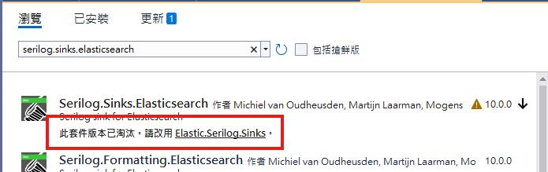
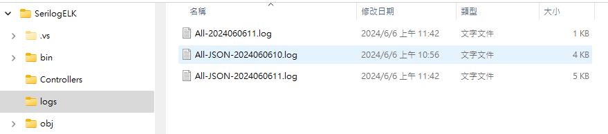
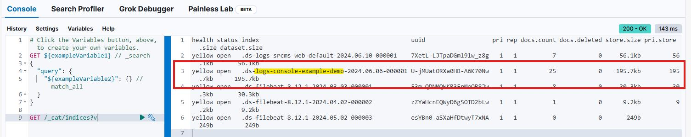
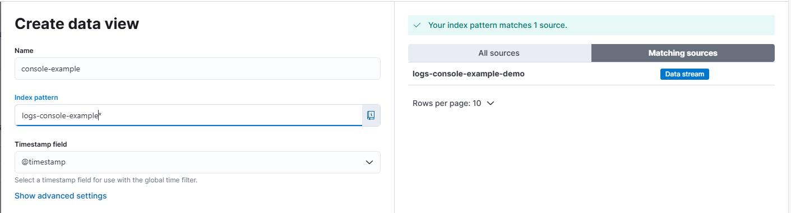
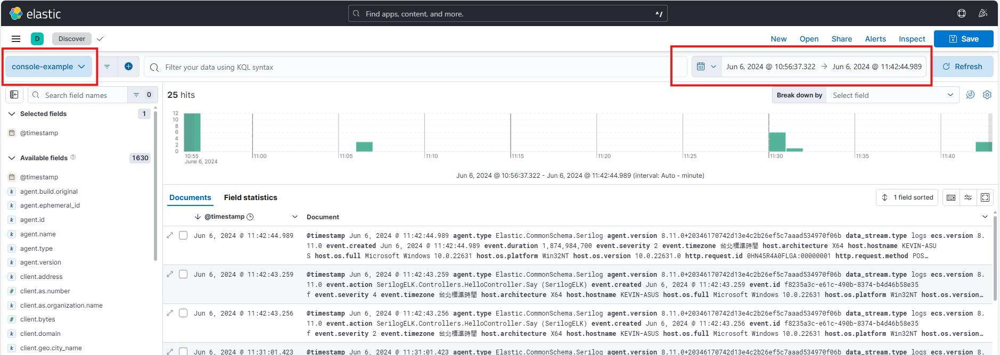
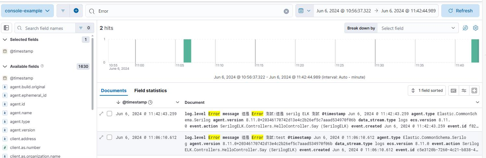
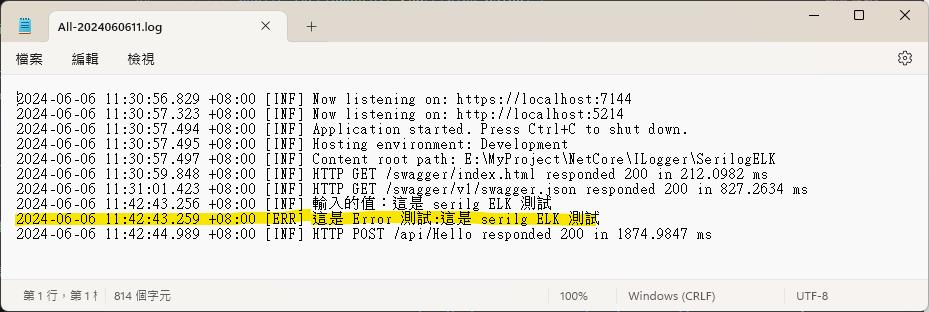
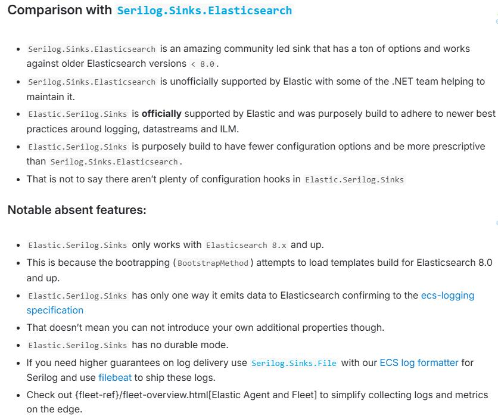
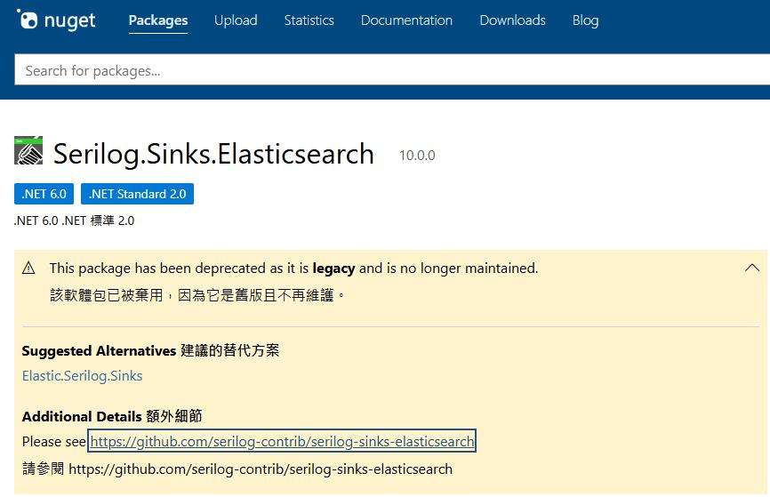

先前在將系統推到 K8s 將 Log 導入 ELK, 使用 filebeat 花費了一些工夫, 想說如果寫 Log 時能直接推送就方便許多, 後來查了一下網路果然 serilog 有這樣的功能, 趕緊用起來。

搜尋網路上有好幾篇文章介紹, 主要的套件是 Serilog.Sinks.Elasticsearch, 開了一個專案進行測試﹐但在 NuGet 要安裝這個套件卻看到顯示 Serilog.Sinks.Elasticsearch 已淘汰…



根據畫面的指示在 NuGet 改找了 Elastic.Serilog.Sinks 套件, 然後找到 [官網](https://www.elastic.co/guide/en/ecs-logging/dotnet/current/serilog-data-shipper.html#_comparison_with_serilog_sinks_elasticsearch) 上面也提供了範例, 直接依範例在 Program.cs 中 serilog 二階段初始化中加入代碼進行測試

```
    builder.Host.UseSerilog((context, services, configuration) => configuration
        .ReadFrom.Configuration(context.Configuration)
        .ReadFrom.Services(services)
        .Enrich.FromLogContext()
        .WriteTo.Elasticsearch(new[] { new Uri("http://ElasticHost:9200") }, opts => {
            opts.DataStream = new DataStreamName("logs", "console-example", "demo");
            opts.BootstrapMethod = BootstrapMethod.Failure;
            opts.ConfigureChannel = channelOpts => {
                channelOpts.BufferOptions = new BufferOptions {
                    //ConcurrentConsumers = 10
                };
            };
        })
    );
```

同時在 appsettings.json 中加入設定, 讓 serilog 也一併產出檔案來對照是不是有寫入 ELK 中

```
  "Serilog": {
    "MinimumLevel": {
      "Default": "Information",
      "Override": {
        "Microsoft.AspNetCore": "Warning"
      }
    },
    "WriteTo": [
      { "Name": "Console" },
      {
        "Name": "File",
        "Args": {
          "Path": "logs/All-.log",
          "rollingInterval": "Hour",
          "retainedFileCountLimit": 720
        }
      },
      {
        "Name": "File",
        "Args": {
          "Path": "logs/All-JSON-.log",
          "rollingInterval": "Hour",
          "retainedFileCountLimit": 720,
          "formatter": "Serilog.Formatting.Compact.CompactJsonFormatter, Serilog.Formatting.Compact"
        }
      }
    ]
  }
```

另外再建置一支簡單的 Api, 做為測試

```
namespace SerilogELK.Controllers {
    [Route("api/[controller]")]
    [ApiController]
    public class HelloController : ControllerBase {
        private readonly ILogger<HelloController> _logger;

        public HelloController(ILogger<HelloController> logger) {
            _logger = logger;
        }

        [HttpPost]
        public IActionResult Say(string value) {
            _logger.LogInformation($"輸入的值：{value}");
            _logger.LogError($"這是 Error 測試:{value}");
            return Ok(new {Id=1,Value=value});
        }
    }
}
```

將程式執行後在 swagger 中簡單的執行 API 後, 檢視檔案總管確實產出了 Log 檔



現在開啟 Kibana 並切換到 Managemnt/Dev Tools 中的 Console 下指令 **GET /\_cat/indices?v**



在畫面上可以看到有一行帶有 **logs-console-example-demo** 字樣, 這一行是在程式中**opts.DataStream = new DataStreamName(“logs”, “console-example”, “demo”);** 這一行指定的,據此在 kibana 建立一個 DataView, 取名 console-example, index pattern 根據上述指令中看到的設定為 logs-console-example



現在在 Kibana 中來檢視一下成果, 在左上選擇 console-example(這是剛建的 data view 名稱), 右上選擇 log 的日期時間, 可以看到底下有一堆的 log



在測試的 API 中有寫入兩行 Log, 其中一行中帶有 Error 字串, 就以這個字串搜尋一下, 看起來是寫入的 log 沒錯



開啟文字檔 log 對照, 時間和內容是一致的



官網上有對 Serilog.Sinks.Elasticsearch 和 Elastic.Serilog.Sinks 兩個套件做個比較和注意事項



**值得注意的重點﹐Elastic.Serilog.Sinks 只適用於 Elasticsearch 8.x 版本**﹐所以 Elasticsearch 版本不夠新的仍然還是要使用 Serilog.Sinks.Elasticsearch 套件, 但是這套件已經停止維護了, 所以使用上還是要注意。


