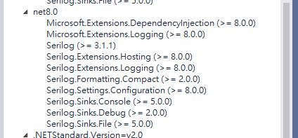
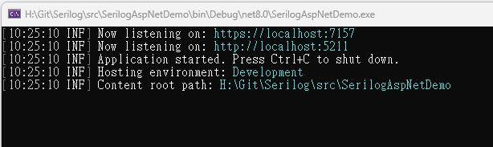
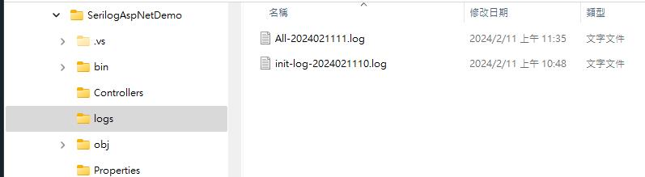
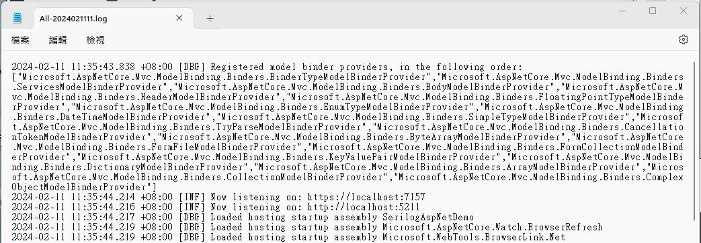
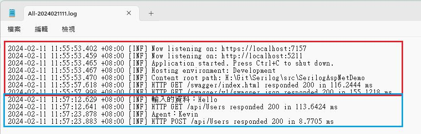
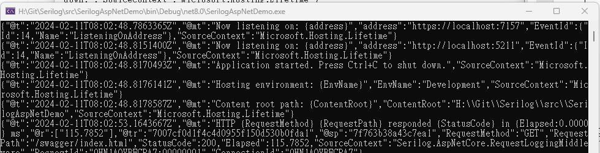
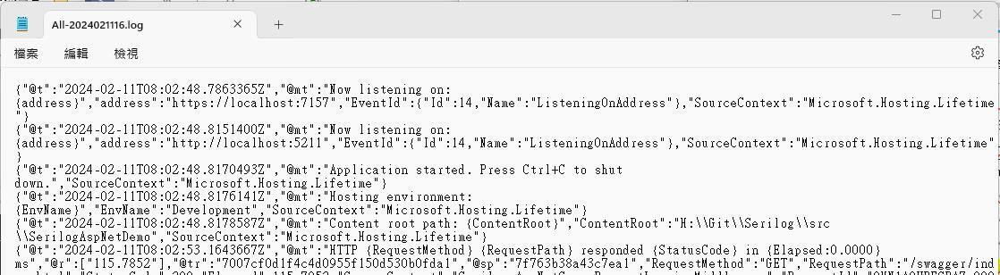

日期：2024/02/10  
環境：.Net 8/Visual Studio 2022

今天大年初一﹐最近對 Serilog 做了些小研究﹐整理一下筆記﹐也是為了之後的專案使用。主要根據官網 [GitHub - serilog/serilog-aspnetcore: Serilog integration for ASP.NET Core](https://github.com/serilog/serilog-aspnetcore) 進行測試和實作。Serilog有許多不錯的特點﹐例如﹐結構化的日誌﹑多種輸出的選擇(console, File…)﹑可在設定檔中配置…﹐在Asp.Net Core 算是居家出門備在身上的好良藥。

**一﹑建立專案**  
專案範本：ASP.NET Core Web API  
專案名稱：SerilogAspNetDemo  
Framework：.Net 8

**二﹑安裝套件**  
從 NuGet 安裝Serilog.AspNetCore 套件  
dotnet add package Serilog.AspNetCore

或者從VS 2022的介面安裝的話﹐挑選了最新版本8.0.1


在介面上可以看到安裝時的相依性包含了以下的套件﹐所以之後要將Log輸出到 Console或檔案﹐不用再安裝其它套件﹐安裝時已包含了Serilog.Sinks.Console, Serilog.Sinks.File….



**三﹑基本設定**

* **修改 Program.cs**  
  以下是專案範本一開始產生的 Program.cs 代碼

```
var builder = WebApplication.CreateBuilder(args);

// Add services to the container.

builder.Services.AddControllers();
// Learn more about configuring Swagger/OpenAPI at https://aka.ms/aspnetcore/swashbuckle
builder.Services.AddEndpointsApiExplorer();
builder.Services.AddSwaggerGen();

var app = builder.Build();

// Configure the HTTP request pipeline.
if (app.Environment.IsDevelopment()) {
    app.UseSwagger();
    app.UseSwaggerUI();
}

app.UseHttpsRedirection();

app.UseAuthorization();

app.MapControllers();

app.Run();
```

現在要先設定Serilog﹐在下方的代碼﹐反灰的部分(我的筆記中原本是有反灰的﹐但這裏顏色不受控﹐請自行和上面代碼的部分做比對﹐或者下載原始碼做比對)是原本範本代碼的部分﹐其它的都是為了Serilog 額外加上的設定﹐使用 try catch 將原本的代碼包起來可以將伺服器初始化有問題的例外一起補捉記錄。

builder.Host.UseSerilog()會透過Serilog pipeline 導向所有的日誌事件

```
using Serilog;
using Serilog.Events;

Log.Logger = new LoggerConfiguration()
    .MinimumLevel.Information()
    .MinimumLevel.Override("Microsoft.AspNetCore", LogEventLevel.Warning)
    .Enrich.FromLogContext()
    .WriteTo.Console()
    .WriteTo.File("logs/init-log-.log",
        rollingInterval: RollingInterval.Hour,  //每一小時重新產新新的檔案
        retainedFileCountLimit: 720             //Log保留時間(24 hr * 30 Day=720)
    )
    .CreateLogger();

try {
    var builder = WebApplication.CreateBuilder(args);

    // Add services to the container.

    builder.Services.AddControllers();
    // Learn more about configuring Swagger/OpenAPI at https://aka.ms/aspnetcore/swashbuckle
    builder.Services.AddEndpointsApiExplorer();
    builder.Services.AddSwaggerGen();

builder.Host.UseSerilog();

    var app = builder.Build();

    // Configure the HTTP request pipeline.
    if (app.Environment.IsDevelopment()) {
        app.UseSwagger();
        app.UseSwaggerUI();
    }

    app.UseHttpsRedirection();

    app.UseAuthorization();

    app.MapControllers();

    app.Run();
} catch(Exception er) {
    Log.Fatal(er, "Application terminated unexpectedly");
} finally {
    Log.CloseAndFlush();
}
```

* 修改 appsettings.json

開啟appsettings.json將原本預設的 Logging 節段刪除﹐這裏的配置可以由程式(Program.cs)中重新定義或者之後介紹的Serilog 配置檔定義。

```

{

  //刪除以下的配置
  "Logging": {
    "LogLevel": {
      "Default": "Information",
      "Microsoft.AspNetCore": "Warning"
    }
  }
}
```

**四﹑初步測試**

完成上述後﹐將專案執行觀察一下產生的Log情況  
在專案中會產生一個logs 資料夾﹐當中產生了一個檔案init-log-2024021110.log 檔名為 init-log-開頭﹐之後是年月日時(因為在程式中是設定每小時產生新的檔案)


檔案內容如下

|  |
| --- |
| 2024-02-11 10:25:10.089 +08:00 [INF] Now listening on: https://localhost:7157 2024-02-11 10:25:10.132 +08:00 [INF] Now listening on: http://localhost:5211 2024-02-11 10:25:10.136 +08:00 [INF] Application started. Press Ctrl+C to shut down. 2024-02-11 10:25:10.138 +08:00 [INF] Hosting environment: Development 2024-02-11 10:25:10.139 +08:00 [INF] Content root path: H:\Git\Serilog\src\SerilogAspNetDemo |

而Console 如下﹐兩者內容相同



實際上我們在觀察Log會需要Request的請求紀錄﹐在Serilog只要加入一行代碼就可以很輕鬆的得到﹐現在Program.cs中加入 app.UseSerilogRequestLoggin(); 就可以

|  |
| --- |
| var app = builder.Build();     app.UseSerilogRequestLogging();      // Configure the HTTP request pipeline.     if (app.Environment.IsDevelopment()) {          app.UseSwagger();          app.UseSwaggerUI();         }      app.UseHttpsRedirection(); |

再次執行檢查Log﹐可以看到比剛剛多了HTTP GET 的紀錄﹐因為專案中使用了swagger﹐所以在Debug模式下啟動 swagger 就會有Request行為而有了HTTP GET 的紀錄

|  |
| --- |
| 2024-02-11 10:48:32.670 +08:00 [INF] Now listening on: https://localhost:7157 2024-02-11 10:48:32.753 +08:00 [INF] Now listening on: http://localhost:5211 2024-02-11 10:48:32.757 +08:00 [INF] Application started. Press Ctrl+C to shut down. 2024-02-11 10:48:32.759 +08:00 [INF] Hosting environment: Development 2024-02-11 10:48:32.760 +08:00 [INF] Content root path: H:\Git\Serilog\src\SerilogAspNetDemo 2024-02-11 10:48:34.585 +08:00 [INF] HTTP GET /swagger/index.html responded 200 in 134.0189 ms 2024-02-11 10:48:35.075 +08:00 [INF] HTTP GET /swagger/v1/swagger.json responded 200 in 201.3387 ms |

**五﹑二段段初始化**

依官網說明﹐前面在應用程式啟動時立即設定 Serilog的好處是可以捕獲Asp.NetCore伺服器在一開始的例外狀況﹐但是缺點是這時一些服務還不能用例如appsettings.json或相依性注入﹐所以如果想要在appsettings.json 中做serilog配置這時是吃不到的﹐所以Serilog 支援二階段初始化。

二階段初始化做法

首先將原本的CreateLogger()改為CreateBootstrapLogger()

|  |
| --- |
| Log.Logger = new LoggerConfiguration()     .MinimumLevel.Information()     .MinimumLevel.Override("Microsoft.AspNetCore", LogEventLevel.Warning)     .Enrich.FromLogContext()     .WriteTo.Console()     .WriteTo.File("logs/init-log-.log",         //產生的log文字檔﹐檔名是init-log開頭         rollingInterval: RollingInterval.Hour,  //每一小時重新產新新的檔案         retainedFileCountLimit: 720             //Log保留時間(24 hr \* 30 Day=720)     )     .CreateBootstrapLogger(); |

接著修改原本的builder.Host.UserSerilog()﹐這裏將輸出的log檔案檔名設定為 All- 開頭﹐目的是要觀察和第一階段的初始化的比較。

|  |
| --- |
| //builder.Host.UseSerilog(); builder.Host.UseSerilog((context, services, configuration) => configuration     .ReadFrom.Configuration(context.Configuration)  //從設定檔中讀取     .ReadFrom.Services(services)     .Enrich.FromLogContext()     .WriteTo.Console()     .WriteTo.File("logs/All-.log",         rollingInterval: RollingInterval.Hour,         retainedFileCountLimit: 720) ); |

修改 appsettings.json

前面已介紹過將原本預設的 Loggin節段拿掉﹐現在加上Serilog節段﹐同時為了測試效果﹐將”Microsoft.AspNetCore”由Warning改為 Debug

|  |
| --- |
| {   //"Logging": {   //   "LogLevel": {   //     "Default": "Information",   //     "Microsoft.AspNetCore": "Warning"   //   }   //}   "Serilog": {     "MinimumLevel": {       "Default": "Information",       "Override": {         "Microsoft.AspNetCore": "Debug"       }     }   } } |

再次執行程式﹐可以看到現在多了一個All-開頭的log檔﹐不過檔案時間可以看到原本的init-log- 時間並沒有變化﹐這是因為在一開始啟動程式後被二階段的導向到之後的All- log 中﹐所以最前面第一階段的初始化其實可以做簡化。



打開 All-2024021111.log 這個檔案﹐可以看到紀錄的密密麻麻的﹐表示在appsettings.json 設定確實有用。



**六﹑在 Controller 中注入**

延續上述的代碼﹐現在新增一個UsersController進行測試﹐測試前先將appsettings.json中的”Microsoft.AspNetCore”層級改為Warning避免太多資訊干擾。

UsersController中加入兩個方法進行觀察

|  |
| --- |
| using Microsoft.AspNetCore.Mvc;  namespace SerilogAspNetDemo.Controllers {     [Route("api/[controller]")]     [ApiController]     public class UsersController : ControllerBase {         private readonly ILogger<UsersController> \_logger;         public UsersController(ILogger<UsersController> logger) {             \_logger = logger;         }          [HttpGet]         public IActionResult Say(string value) {             \_logger.LogInformation($"輸入的資料：{value}");             return Ok(new { Id = 1, Value = $"You say {value}" });         }          [HttpPost]         public IActionResult GetUser(string agentid) {             \_logger.LogInformation($"Agent：{agentid}");             return Ok(new { AgentId = agentid, Name = "Tester" });         }     } } |

執行程式後﹐在swagger中執行兩個Api來看Log 有什麼東西



從畫面的藍框看到執行的API 確實紀錄在其中。

Serilog有一項功能就是結構化的輸出﹐以JSON的樣式顯示﹐在官網上有介紹Console(), Debug()和File() 都包含了Serilog.Formatting.Compact 套件原生支援JSON格式的輸出﹐現在調整一下代碼

開啟 Program.cs 在builder.Host.UseSerilog 中的 WriteTo.Console及 WriteTo.File 做一下修改

|  |
| --- |
| builder.Host.UseSerilog((context, services, configuration) => configuration          .ReadFrom.Configuration(context.Configuration)  //從設定檔中讀取         .ReadFrom.Services(services)         .Enrich.FromLogContext()         .WriteTo.Console(new Serilog.Formatting.Compact.CompactJsonFormatter())         .WriteTo.File(new Serilog.Formatting.Compact.CompactJsonFormatter(), "logs/All-.log",             rollingInterval: RollingInterval.Hour,             retainedFileCountLimit: 720)     ); |

執行後看一下Console和檔案呈現的樣式



取當中幾段來看看

|  |
| --- |
| { "@t":"2024-02-11T08:02:48.7863365Z", "@mt":"Now listening on: {address}", "address":"https://localhost:7157", "EventId":{"Id":14,"Name":"ListeningOnAddress"}, "SourceContext":"Microsoft.Hosting.Lifetime" }  { "@t":"2024-02-11T08:03:07.1545229Z", "@mt":"輸入的資料：Hello", "@tr":"3bc3114734d75c5c62c87f487b984368", "@sp":"bcddf0c93609ac90", "SourceContext":"SerilogAspNetDemo.Controllers.UsersController", "ActionId":"e3f2537c-9492-46f7-8b8d-771e8cb7d2f5", "ActionName":"SerilogAspNetDemo.Controllers.UsersController.Say (SerilogAspNetDemo)", "RequestId":"0HN1AQVBECPA8:00000001", "RequestPath":"/api/Users", "ConnectionId":"0HN1AQVBECPA8" }  { "@t":"2024-02-11T08:03:07.1646600Z", "@mt":"HTTP {RequestMethod} {RequestPath} responded {StatusCode} in {Elapsed:0.0000} ms", "@r":["50.0727"], @tr":"3bc3114734d75c5c62c87f487b984368", "@sp":"bcddf0c93609ac90", "RequestMethod":"GET", "RequestPath":"/api/Users", "StatusCode":200, "Elapsed":50.0727, "SourceContext":"Serilog.AspNetCore.RequestLoggingMiddleware", "RequestId":"0HN1AQVBECPA8:00000001", "ConnectionId":"0HN1AQVBECPA8" } |

這裏面提供的資訊比之前更豐富﹐當中有幾個是@開頭的﹐代表的意義如下

|  |  |  |  |
| --- | --- | --- | --- |
| **Property** | **Name** | **Description** | **Required?** |
| **@t** | Timestamp | An ISO 8601 timestamp | Yes |
| **@m** | Message | A fully-rendered message describing the event |  |
| **@mt** | Message Template | Alternative to Message; specifies a message template over the event's properties that provides for rendering into a textual description of the event |  |
| **@l** | Level | An implementation-specific level identifier (string or number) | Absence implies "informational" |
| **@x** | Exception | A language-dependent error representation potentially including backtrace |  |
| **@i** | Event id | An implementation specific event id (string or number) |  |
| **@r** | Renderings | If @mt includes tokens with programming-language-specific formatting, an array of pre-rendered values for each such token | May be omitted; if present, the count of renderings must match the count of formatted tokens exactly |
| **@tr** | Trace id | The id of the trace that was active when the event was created, if any |  |
| **@sp** | Span id | The id of the span that was active when the event was created, if any |  |

目前到此一些基本功能都大致介紹了﹐不過…實務上這樣紀錄Log﹐將全部的Log都擠在一起﹐對於之後要查詢問題IT人員應該是想摔鍵盤吧﹐身為 IT 人員總要為自己找出方便的路徑﹐所以如果在Controller 中執行產生的log 能夠單獨一個檔案﹐甚至能顯示是那一個Controller之下的﹐是不是會更好？

另外﹐Serilog 的JSON 結構化設計雖然不錯﹐但在同一個檔案中有不同格式的JSON﹐依照人類的眼睛應該是沒辦法直接以此來找到想要的資料。

後續文章將對這些問題如何解決進一步討論。

文章中的程式碼已上傳至 [Github dotnet-Serilog](https://github.com/nethawkChen/dotnet8-Serilog)

參考資料

Bing COPILOT  
[GitHub - serilog/serilog-aspnetcore: Serilog integration for ASP.NET Core](https://github.com/serilog/serilog-aspnetcore)  
[GitHub - serilog/serilog-formatting-compact: Compact JSON event format for Serilog](https://github.com/serilog/serilog-formatting-compact)  
[最詳細 ASP.NET Core 使用 Serilog 套件寫 log 教學 (ruyut.com)](https://www.ruyut.com/2022/09/aspnet-core-serilog.html)  
[C# ASP.NET Core 6 依照功能拆分 Serilog 套件輸出的 log 檔案 (ruyut.com)](https://www.ruyut.com/2023/07/aspnet-core-serilog-filter.html)
