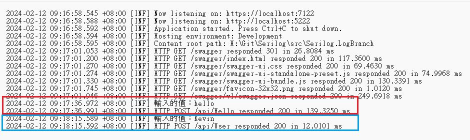
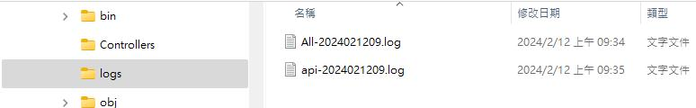
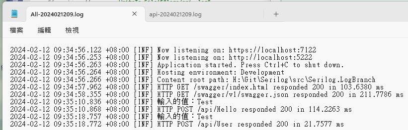
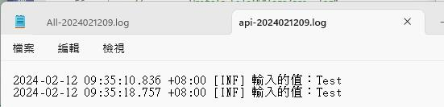
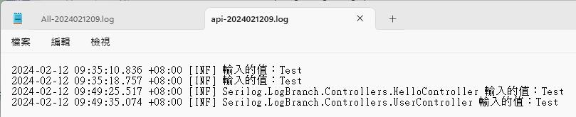
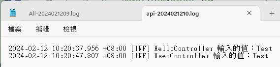
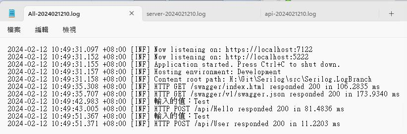
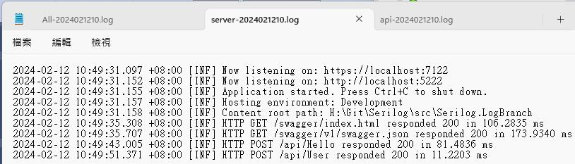
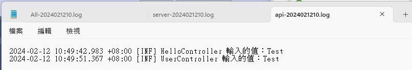

延續上一篇 基本使用方式  
這一篇文章希望達到的目的有幾個

* 將Controller中的Log獨立檔案﹐方便查詢
* 獨立的Controller的Log檔中必須標註是由那一個Controller產出的﹐避免混淆

**一﹑準備專案**

現在新增一個專案Serilog.LogBranch﹐依之前的文章安裝Serilog.AspNetCore套件﹐並修改 Program.cs和appsettings.json

Program.cs

```csharp
using Serilog.Events;
using Serilog;

Log.Logger = new LoggerConfiguration()
    .MinimumLevel.Information()
    .MinimumLevel.Override("Microsoft.AspNetCore", LogEventLevel.Information)
    .Enrich.FromLogContext()
    .WriteTo.Console()
    .CreateBootstrapLogger();

try {
    var builder = WebApplication.CreateBuilder(args);
    // Add services to the container.
    builder.Services.AddControllers();
    // Learn more about configuring Swagger/OpenAPI at https://aka.ms/aspnetcore/swashbuckle
    builder.Services.AddEndpointsApiExplorer();
    builder.Services.AddSwaggerGen();
    builder.Host.UseSerilog((context, services, configuration) => configuration
        .ReadFrom.Configuration(context.Configuration)  //從設定檔中讀取
        .ReadFrom.Services(services)
        .Enrich.FromLogContext()
        .WriteTo.Console()
        .WriteTo.File("logs/All-.log",
            rollingInterval: RollingInterval.Hour,
            retainedFileCountLimit: 720)
    );

    var app = builder.Build();
    app.UseSerilogRequestLogging();

    // Configure the HTTP request pipeline.
    if (app.Environment.IsDevelopment()) {
        app.UseSwagger();
        app.UseSwaggerUI();
    }
    app.UseHttpsRedirection();
    app.UseAuthorization();
    app.MapControllers();
    app.Run();
} catch (Exception er) {
    Log.Fatal(er, "Application terminated unexpectedly");
} finally {
    Log.CloseAndFlush();
}
```

appsetting.json

```jsonc
{
  //"Logging": {
  //  "LogLevel": {
  //    "Default": "Information",
  //    "Microsoft.AspNetCore": "Warning"
  //  }
  //}
  "Serilog": {
    "MinimumLevel": {
      "Default": "Information",
      "Override": {
        "Microsoft.AspNetCore": "Warning"
      }
    }
  }
}
```

然後新增二支Controller﹐裏面各有一個相同名稱的方法﹐這是為了等一下觀察Log要用的

UserController.cs

```csharp
namespace Serilog.LogBranch.Controllers {
    [Route("api/[controller]")]
    [ApiController]
    public class UserController : ControllerBase {
        private readonly ILogger<UserController> _logger;
        public UserController(ILogger<UserController> logger) {
            _logger = logger;
        }

        [HttpPost]
        public IActionResult Say(string value) {
            _logger.LogInformation($"輸入的值：{value}");
            return Ok(new { Id = 1, Value = value });
        }
    }
}
```

HelloController.cs

```csharp
namespace Serilog.LogBranch.Controllers {
    [Route("api/[controller]")]
    [ApiController]
    public class HelloController : ControllerBase {
        private readonly ILogger<HelloController> _logger;
        public HelloController(ILogger<HelloController> logger) {
            _logger = logger;
        }

        [HttpPost]
        public IActionResult Say(string value) {
            _logger.LogInformation($"輸入的值：{value}");
            return Ok(new { Id = 1, Value = value });
        }
    }
}
```

前置工作已準備好﹐如果現在執行不意外的話﹐應該可以看到和之前一樣只有一個Log檔﹐並且是Log 資料混雜在一起。畫面中紅框和藍框分別是上述兩個Controller執行的結果﹐雖然在下一行都可以看到是由那個Response回應來判斷是那一個Controller執行﹐這還是因為有加了app.UseSerilogRequestLogging();這一行的效果﹐而現在希望能更直覺的判斷﹐所以要將Controller中執行產出的Log獨立。



**二﹑Controller Log 拆分到另一個檔案**

為了讓Controller的Log不要Asp.Net Core 伺服器的資料混雜﹐修改第二階段初始化的代碼

```csharp
builder.Host.UseSerilog((context, services, configuration) => configuration
    .ReadFrom.Configuration(context.Configuration)  //從設定檔中讀取
    .ReadFrom.Services(services)
    .Enrich.FromLogContext()
    .WriteTo.Console()
    .WriteTo.File("logs/All-.log",
        rollingInterval: RollingInterval.Hour,
        retainedFileCountLimit: 720)
    .WriteTo.Logger(lc => lc.Filter.ByIncludingOnly(e =>
        e.Properties["SourceContext"].ToString().Contains("Controller"))
        .WriteTo.File("logs/api-.log",
        rollingInterval: RollingInterval.Hour,
        retainedFileCountLimit: 720)
    )
);
```

上述代碼中新增了一段﹐這將會產生一個以api- 開頭的 log 檔﹐這時會是什麼效果呢？將程式執行後並分別對二個Controller的方法執行﹐這時可以看到確實產生了二個檔案



對於 All- 的Log 和之前一樣﹐因為這一部分沒有做任何調整



而另一個 api- 的檔案內容是剛剛分別執行兩個Controller的方法﹐可是這樣看不出來到底是那一個Controller執行的﹐這和預期的不同



這時可利用outputTemplate來達到要求﹐將剛剛加入的那一段代碼如下方加上outputTemplate定義輸出的樣版

```csharp
.WriteTo.Logger(lc => lc.Filter.ByIncludingOnly(e =>
    e.Properties["SourceContext"].ToString().Contains("Controller"))
    .WriteTo.File("logs/api-.log",
    rollingInterval: RollingInterval.Hour,
    retainedFileCountLimit: 720,
    outputTemplate: "{Timestamp:yyyy-MM-dd HH:mm:ss.fff zzz} [{Level:u3}] {SourceContext} {Message:lj}{NewLine}{Exception}")
)
```

重新執行程式後﹐再開啟api- Log 檔來比較看看﹐現在Controller 的名稱顯示了﹐這樣應該好理解多了﹐可是仍然有些不滿意﹐名稱太長了﹐能不能只要Controller Name而不要 Namespace 呢？



* **Log中只留 Controller Name 不要 Namespace**

新增一支LogEnricher.cs

```csharp
using Serilog.Core;
using Serilog.Events;

namespace Serilog.LogBranch.Extensions {
    public class LogEnricher : ILogEventEnricher {
        public void Enrich(LogEvent logEvent, ILogEventPropertyFactory propertyFactory) {
            if (logEvent.Properties.TryGetValue("SourceContext", out LogEventPropertyValue sourceContext)) {
                var controllerName = sourceContext.ToString().Replace("\"", "").Split('.').Last().Replace("Controllers", "");
                logEvent.AddPropertyIfAbsent(new LogEventProperty("ControllerName", new ScalarValue(controllerName)));
            }
        }
    }
}
```

回到Program.cs 中﹐修改原本的代碼﹐注意這原本的SourceContext要替換成ControllerName﹐這是在LogEnricher代碼中定義的

```csharp
builder.Host.UseSerilog((context, services, configuration) => configuration
    .ReadFrom.Configuration(context.Configuration)  //從設定檔中讀取
    .ReadFrom.Services(services)
    .Enrich.FromLogContext()
    .Enrich.With(new LogEnricher())
    .WriteTo.Console()
    .WriteTo.File("logs/All-.log",
        rollingInterval: RollingInterval.Hour,
        retainedFileCountLimit: 720)
    .WriteTo.Logger(lc => lc.Filter.ByIncludingOnly(e =>
        e.Properties["ControllerName"].ToString().Contains("Controller"))
        .WriteTo.File("logs/api-.log",
        rollingInterval: RollingInterval.Hour,
        retainedFileCountLimit: 720,
        outputTemplate: "{Timestamp:yyyy-MM-dd HH:mm:ss.fff zzz} [{Level:u3}] {ControllerName} {Message:lj}{NewLine}{Exception}")
    )
);
```

現在再試試效果﹐看起來簡潔些了



現在執行過程應該會產生至少二個檔案﹐一個是所有混雜在一起的Log﹐一個是Controller Action執行時產出的Log﹐那麼可不可以原本混雜在一起的 Log 只留Asp.Net Core 伺服器相關的 Log而不要Controller Action執行的Log呢？當然也是可以﹐再修改一下代碼

```csharp
builder.Host.UseSerilog((context, services, configuration) => configuration
    .ReadFrom.Configuration(context.Configuration)  //從設定檔中讀取
    .ReadFrom.Services(services)
    .Enrich.FromLogContext()
    .Enrich.With(new LogEnricher())
    .WriteTo.Console()
    .WriteTo.File("logs/All-.log",
        rollingInterval: RollingInterval.Hour,
        retainedFileCountLimit: 720)
    .WriteTo.Logger(lc => lc.Filter.ByIncludingOnly(e =>
        e.Properties["ControllerName"].ToString().Contains("Controller"))
        .WriteTo.File("logs/api-.log",
        rollingInterval: RollingInterval.Hour,
        retainedFileCountLimit: 720,
        outputTemplate: "{Timestamp:yyyy-MM-dd HH:mm:ss.fff zzz} [{Level:u3}] {ControllerName} {Message:lj}{NewLine}{Exception}"))
    .WriteTo.Logger(lc => lc.Filter.ByExcluding(e =>
        e.Properties["SourceContext"].ToString().Contains("Controller"))
        .WriteTo.File("logs/server-.log",
        rollingInterval: RollingInterval.Hour,
        retainedFileCountLimit: 720))
);
```

這次又加入一段﹐其實就只是在Filter改為 ByExcluding 排除了Controller﹐現在再執行來比較結果



什麼樣的場景需要用什麼樣的 Log 就看系統的需求了。

* **將設定資料改到 appsettings.json 配置**

不過﹐既然之前提到可以將設定資料寫到appsetting.json中﹐那麼再改寫一下代碼﹐先將appsettings.json寫上要設定的資料

```jsonc
{
  //"Logging": {
  //  "LogLevel": {
  //    "Default": "Information",
  //    "Microsoft.AspNetCore": "Warning"
  //  }
  //},
  "Serilog": {
    "MinimumLevel": {
      "Default": "Information",
      "Override": {
        "Microsoft.AspNetCore": "Warning"
      }
    },
    "WriteTo": [
      { "Name": "Console" },
      {
        "Name": "File",
        "Args": {
          "Path": "logs/All-.log",
          "rollingInterval": "Hour",
          "retainedFileCountLimit": 720
        }
      },
      {
        "Name": "Logger",
        "Args": {
          "Filter": "ByIncludingOnly",
          "Contains": "Controller",
          "Path": "logs/api-.log",
          "rollingInterval": "Hour",
          "retainedFileCountLimit": 720,
          "outputTemplate": "{Timestamp:yyyy-MM-dd HH:mm:ss.fff zzz} [{Level:u3}] {ControllerName} {Message:lj}{NewLine}{Exception}"
        }
      },
      {
        "Name": "Logger",
        "Args": {
          "Filter": "ByExcluding",
          "Contains": "Controller",
          "Path": "logs/server-.log",
          "rollingInterval": "Hour",
          "retainedFileCountLimit": 720
        }
      }
    ]
  },
  "AllowedHosts": "*"
}
```

然後改寫以下程式碼﹐注意以下紅字部分﹐這要對應appsettings.json 中 WriteTo 的位置

```csharp
var setting = builder.Configuration;

builder.Host.UseSerilog((context, services, configuration) => configuration
    .ReadFrom.Configuration(context.Configuration)  //從設定檔中讀取
    .ReadFrom.Services(services)
    .Enrich.FromLogContext()
    .Enrich.With(new LogEnricher())
    .WriteTo.Logger(lc => lc.Filter.ByIncludingOnly(e =>
        e.Properties["ControllerName"].ToString().Contains("Controller"))
        .WriteTo.File(setting["Serilog:WriteTo:2:Args:Path"],
        rollingInterval: Enum.Parse<RollingInterval>(setting["Serilog:WriteTo:2:Args:rollingInterval"]),
        retainedFileCountLimit: int.Parse(setting["Serilog:WriteTo:2:Args:retainedFileCountLimit"]),
        outputTemplate: setting["Serilog:WriteTo:2:Args:outputTemplate"]))
    .WriteTo.Logger(lc => lc.Filter.ByExcluding(e =>
        e.Properties["SourceContext"].ToString().Contains("Controller"))
        .WriteTo.File(setting["Serilog:WriteTo:3:Args:Path"],
        rollingInterval: Enum.Parse<RollingInterval>(setting["Serilog:WriteTo:3:Args:rollingInterval"]),
        retainedFileCountLimit: int.Parse(setting["Serilog:WriteTo:3:Args:retainedFileCountLimit"])))
);
```

現在可以使用appsettings.json 來配置設定了

文章中的程式碼已上傳至 [Github dotnet-Serilog](https://github.com/nethawkChen/dotnet8-Serilog)

參考資料  
Bing COPILOT  
[GitHub - serilog/serilog-aspnetcore: Serilog integration for ASP.NET Core](https://github.com/serilog/serilog-aspnetcore)  
[GitHub - serilog/serilog-formatting-compact: Compact JSON event format for Serilog](https://github.com/serilog/serilog-formatting-compact)  
[最詳細 ASP.NET Core 使用 Serilog 套件寫 log 教學 (ruyut.com)](https://www.ruyut.com/2022/09/aspnet-core-serilog.html)  
[C# ASP.NET Core 6 依照功能拆分 Serilog 套件輸出的 log 檔案 (ruyut.com)](https://www.ruyut.com/2023/07/aspnet-core-serilog-filter.html)
