前兩篇對於 Serilog 的使用和設定測試的差不多﹐目前為止應該可以應付大部分場景的使用﹐但Serilog 強大的 JSON 結構化格式呢？前面也提到過使用CompactJsonFormatter可以有更豐富的資訊﹐前面為了將Controller action獨立log還大費周張特別去撰寫如何取得Controller Name﹐如果改用CompactJsonFormatter 其實不用那麼麻煩﹐只是在前面也看過結構化的資訊用人類的眼睛並不容易直接找到想要看的資訊﹐這時就必須要有工具輔助﹐本來是想要自行撰寫﹐IT人員沒工具就要自已制作工具﹐不過已經有人做好好用的工具﹐就先來試試網路高手們的創作。

為了做比較﹐並不打算覆蓋掉之前的Log﹐所以現在取出既有的程式加入產生另一組結構化的Log﹐這裏將重複一組全部混雜的Log及獨立的controller log﹐差別在於產出的是 json格式。

先在 appsettings.json中加入新的設定﹐藍字的部分就是這次加入的部分﹐在混雜所有log的檔名改為 ALL-JSON- 開頭﹐而獨立的Controller log 檔名則為api-JSON- 開頭﹐特別注意在獨立的 Controller log 中將outputTemplate註解掉﹐留著這一段註解是要強調 formatter 和 outputTemplate 不能同時存在

```jsonc
{
  //"Logging": {
  //  "LogLevel": {
  //    "Default": "Information",
  //    "Microsoft.AspNetCore": "Warning"
  //  }
  //},
  "Serilog": {
    "MinimumLevel": {
      "Default": "Information",
      "Override": {
        "Microsoft.AspNetCore": "Warning"
      }
    },
    "WriteTo": [
      { "Name": "Console" },
      {
        "Name": "File",
        "Args": {
          "Path": "logs/All-.log",
          "rollingInterval": "Hour",
          "retainedFileCountLimit": 720
        }
      },
      {
        "Name": "Logger",
        "Args": {
          "Filter": "ByIncludingOnly",
          "Contains": "Controller",
          "Path": "logs/api-.log",
          "rollingInterval": "Hour",
          "retainedFileCountLimit": 720,
          "outputTemplate": "{Timestamp:yyyy-MM-dd HH:mm:ss.fff zzz} [{Level:u3}] {ControllerName} {Message:lj}{NewLine}{Exception}"
        }
      },
      {
        "Name": "Logger",
        "Args": {
          "Filter": "ByExcluding",
          "Contains": "Controller",
          "Path": "logs/server-.log",
          "rollingInterval": "Hour",
          "retainedFileCountLimit": 720
        }
      },
      {
        "Name": "File",
        "Args": {
          "Path": "logs/All-JSON-.log",
          "rollingInterval": "Hour",
          "retainedFileCountLimit": 720,
          "formatter": "Serilog.Formatting.Compact.CompactJsonFormatter, Serilog.Formatting.Compact"
        }
      },
      {
        "Name": "Logger",
        "Args": {
          "Filter": "ByIncludingOnly",
          "Contains": "Controller",
          "Path": "logs/api-JSON-.log",
          "rollingInterval": "Hour",
          "retainedFileCountLimit": 720,
          //"outputTemplate": "{Timestamp:yyyy-MM-dd HH:mm:ss.fff zzz} [{Level:u3}] {ControllerName} {Message:lj}{NewLine}{Exception}"
        }
      }
    ]
  },
  "AllowedHosts": "*"
}
```

接著修改原本的代碼﹐說明一下在 builder.Host.UseSerilog 中對於產出所有混雜的log沒有特別力入其它的代碼﹐是因為在appsettings.json 加上就可以了﹐而獨立的Controller log 需要特別經過過濾所以在代碼中要另外撰寫﹐而且這次加入的代碼﹐可以看到是取 SourceContext 並沒有特別指定 ControllerName

```csharp
var setting = builder.Configuration;

builder.Host.UseSerilog((context, services, configuration) => configuration
    .ReadFrom.Configuration(context.Configuration)  //從設定檔中讀取
    .ReadFrom.Services(services)
    .Enrich.FromLogContext()
    .Enrich.With(new LogEnricher())
    .WriteTo.Logger(lc => lc.Filter.ByIncludingOnly(e =>
        e.Properties["ControllerName"].ToString().Contains("Controller"))
        .WriteTo.File(setting["Serilog:WriteTo:2:Args:Path"],
            rollingInterval: Enum.Parse<RollingInterval>(setting["Serilog:WriteTo:2:Args:rollingInterval"]),
            retainedFileCountLimit: int.Parse(setting["Serilog:WriteTo:2:Args:retainedFileCountLimit"]),
            outputTemplate: setting["Serilog:WriteTo:2:Args:outputTemplate"]))
    .WriteTo.Logger(lc => lc.Filter.ByExcluding(e =>
        e.Properties["SourceContext"].ToString().Contains("Controller"))
        .WriteTo.File(setting["Serilog:WriteTo:3:Args:Path"],
            rollingInterval: Enum.Parse<RollingInterval>(setting["Serilog:WriteTo:3:Args:rollingInterval"]),
            retainedFileCountLimit: int.Parse(setting["Serilog:WriteTo:3:Args:retainedFileCountLimit"])))
    .WriteTo.Logger(lc => lc.Filter.ByIncludingOnly(e =>
        e.Properties["SourceContext"].ToString().Contains("Controller"))
        .WriteTo.File(new CompactJsonFormatter(), setting["Serilog:WriteTo:5:Args:Path"],
            rollingInterval: Enum.Parse<RollingInterval>(setting["Serilog:WriteTo:5:Args:rollingInterval"]),
            retainedFileCountLimit: int.Parse(setting["Serilog:WriteTo:5:Args:retainedFileCountLimit"])))
);
```

同樣的再執行一次﹐也在兩個Controller的Action各執行一次﹐現在應該一共會有5個Log檔

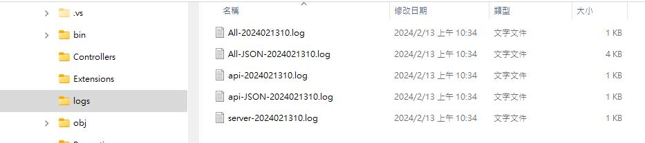

看看新產出的JSON格式資料

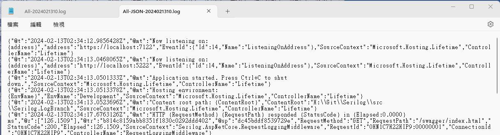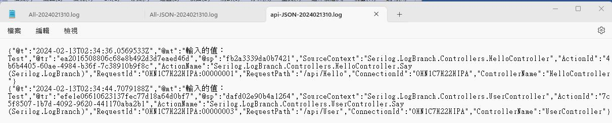

這是人眼看的東西嗎？而且全部混雜的Log中還包含了不同格式的JSON﹐所以還是找一下工具吧。

* **Compact Log Viewer**

首先介紹第一個 [Compact-Log-Format-Viewer](https://github.com/warrenbuckley/Compact-Log-Format-Viewer)﹐這可以從Windows Store直接下載﹐搜尋Compact log viewer就能找到

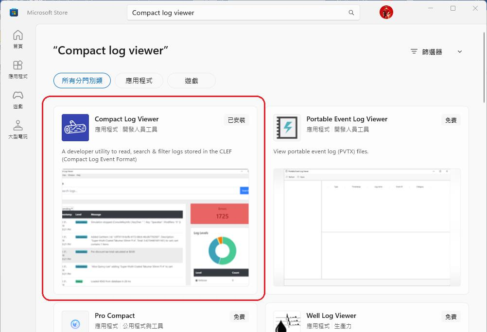

使用上非常簡單﹐執行的時候畫面像這樣﹐要求將Log 檔拖曳進來

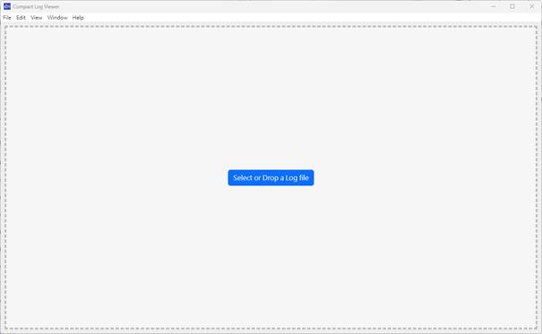

現在將第一個全部混雜的log拉進來

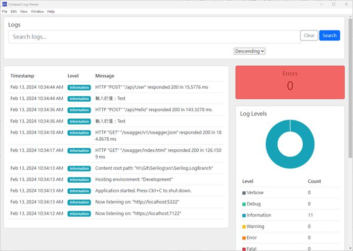

左側將每一筆紀錄列出﹐主要顯示了 TimeStamp, Level, Message 三個欄位﹐右側則依Log等級做出了統計﹐上方還可以使用關鍵字進行搜尋。  
而左側每一筆點擊後還會出現更詳細的資料﹐雖然每一筆紀錄的JSON格式不一定相同﹐點擊後可以看到不同的資料

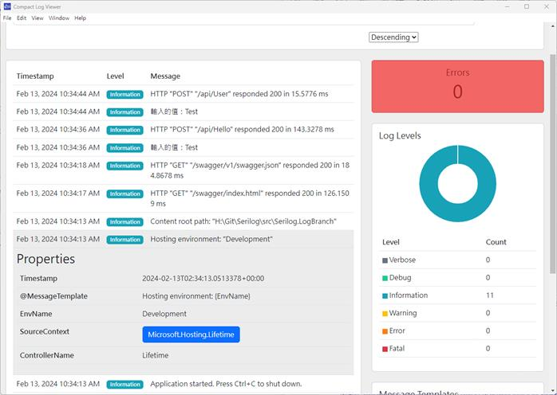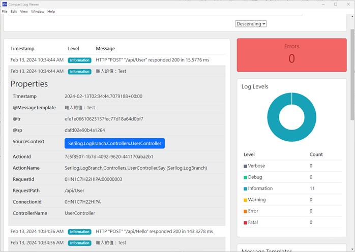

這一款簡單﹐介面簡潔不錯的軟體。

* **Analogy LogViewer Serilog**

接下再介紹一套功能更強大的軟體 [Analogy.LogViewer.Serilog](https://github.com/Analogy-LogViewer/Analogy.LogViewer.Serilog)﹐這一套提供了不同的.Net 版本﹐連最新的 .Net 8都有

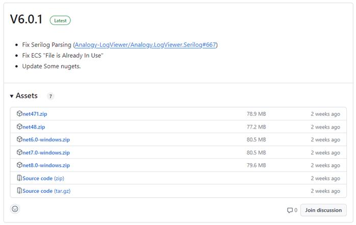

這一個軟體第一次執行會要求做一些設定﹐可以先不用做任何變更直接關閉畫面﹐就會進入主要的畫面

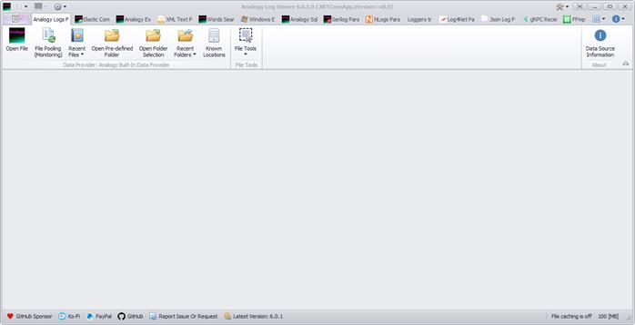

在主畫面的上方一排的頁籤這是可以檢視不同型態的Log﹐可以想像這個工具善加利用應該很不錯的。這當中有一個 Serilog Pars頁籤﹐這就是要用來檢視 Serilog 產出的 Log

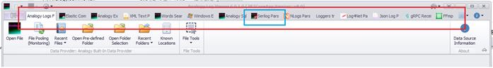

上述的頁籤要用那一些是可以設定的﹐主畫面左上角進入 Settings

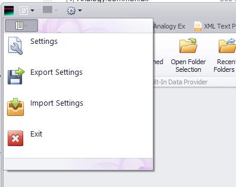

會出現最初一開始的設定畫面﹐選擇左側的 List Of Providers﹐畫面右側有打勾的項目就是出現在主畫面的頁籤﹐不需要的就可以將打勾取消﹐做完後﹐直接按setting 畫面右上角的 x 關閉畫面﹐然後再將程式整個關閉重新執行才會生效。

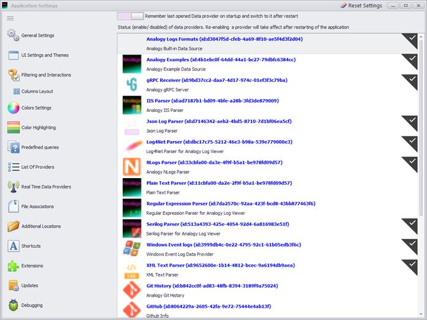

現在在主畫面切換到Serilog Pars﹐點擊最左側的Opne File

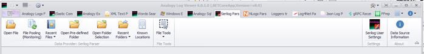

選擇要開啟的Log檔﹐先選擇混雜所有紀錄的All-JSON- 的Log 檔後﹐可以看到畫面左下方列出檔案所有目錄下所有的檔案﹐方便等一下要選擇其它檔案﹐左側上方則可以輸入關鍵字進行搜尋﹐右側上方是要過濾的條件﹐右側中間是Log檔中的每一筆紀錄﹐將捲軸往右拉可以看到每一筆紀錄的詳細欄位都有﹐如果有Warning, Debug 整筆還會有不同顏色標示

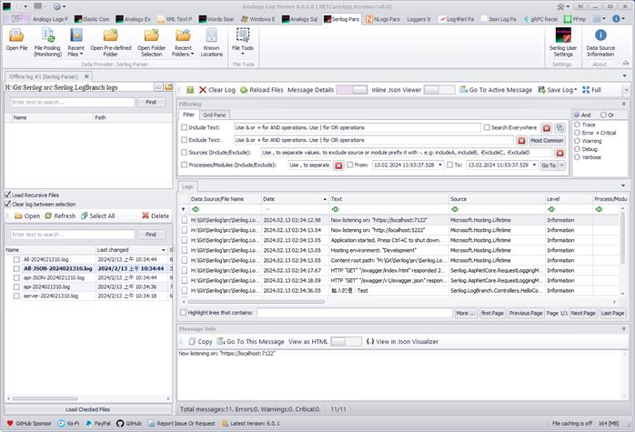

現在改開啟 api-JSON- 的log檔﹐可以看到當中的欄位有Source, RequestPath, ActionName, 不管是 ControllerName, Action Name還是執行的路由都能清楚的呈現

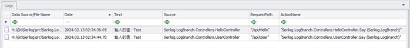

文章中的程式碼已上傳至 [Github dotnet-Serilog](https://github.com/nethawkChen/dotnet8-Serilog)

參考資料  
Bing COPILOT  
[GitHub - serilog/serilog-aspnetcore: Serilog integration for ASP.NET Core](https://github.com/serilog/serilog-aspnetcore)  
[GitHub - serilog/serilog-formatting-compact: Compact JSON event format for Serilog](https://github.com/serilog/serilog-formatting-compact)  
[最詳細 ASP.NET Core 使用 Serilog 套件寫 log 教學 (ruyut.com)](https://www.ruyut.com/2022/09/aspnet-core-serilog.html)  
[C# ASP.NET Core 6 依照功能拆分 Serilog 套件輸出的 log 檔案 (ruyut.com)](https://www.ruyut.com/2023/07/aspnet-core-serilog-filter.html)
