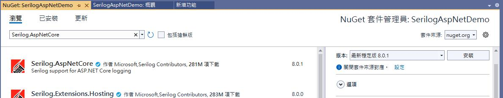

首先, 為什麼要做這樣的事。 Web Api 常使用 JWT 做為認證授權機制, 在實作上有時難免碰到某個 Web Api 是其它不同服務需要共用, 而其它的服務本身也是 Web Api, 本身也是使用 JWT 授權認證, 在其它服務已經有登入驗證發行 token, 所以對於共用的 Web Api 不想做一次額外的登入驗證, 所以有了共用 token 的做法, 但因為是其它不同的服務, 所以必須要能接收不同的 token。

為了方便說明, 先定義一下幾個專案

  * Service.A： Web Api 專案, 使用 JWT 授權認證, 具有登入/驗證/發行 token 的功能
  * Service.B： Web Api 專案, 使用 JWT 授權認證, 具有登入/驗證/發行 token 的功能, 不過和 Service.B 是不同系統, 所以 JWT 的密鑰不會相同
  * DempPublic： Web Api 專案, 使用 JWT 授權認證, 但不具有登入/發行 token 的功能, 但可以驗證 Service.A 和 Service.B 所發行的 token


上述的說明如下



要達成這樣的功能並沒什麼特別, 只要 DemoPublic 具有 Service.A 和 Service.B 相同的密鑰就可以, 只是實作上該如何做？ 且不希望同樣的事重複的作業, 所以這裏的實作主要是要將 JWT 的驗證獨立。因此

### 新增一個專案 JwtAuth.Common

這個專案將提供給 Service A﹑Service B 和 DemoPulic 生成 token 和驗證 token 的共用模組

對於生成 token 在 Services/IJwtAuthService.cs 中的 GenerateToken 負責生成

```plaintext
/// <summary>
/// JWT認證服務的介面
/// </summary>
public interface IJwtAuthService {
    /// <summary>
    /// 產生JWT Token
    /// </summary>
    /// <param name="username">使用者名稱</param>
    /// <param name="roles">使用者角色清單</param>
    /// <returns>JWT Token字串</returns>
    string GenerateToken(string username, string[] roles);
}

```

而驗證的部分則在 Extensions/JwtAuthExtensions.cs 中

```plaintext
    /// <summary>
    /// JWT 認證相關的擴展方法
    /// </summary>
    public static class JwtAuthExtensions {
        /// <summary>
        /// 單一 JWT 認証設置
        /// </summary>
        public static IServiceCollection AddJwtAuthentication(this IServiceCollection services, IConfiguration configuration) {
            var jwtSettings = configuration.GetSection("JwtSettings").Get<JwtSettings>();  // 取得 JWT 設定(Service.A 或 Service.B 的 appsettings.json 中的 JwtSettings)
            if (jwtSettings == null) {
                throw new InvalidOperationException("JwtSettings 未設定");
            }
            services.AddAuthentication(options => {
                options.DefaultAuthenticateScheme = JwtBearerDefaults.AuthenticationScheme;
                options.DefaultChallengeScheme = JwtBearerDefaults.AuthenticationScheme;
            })
            .AddJwtBearer(options => {
                options.TokenValidationParameters = new TokenValidationParameters {
                    ValidateIssuer = true,
                    ValidateAudience = true,
                    ValidateLifetime = true,
                    ValidateIssuerSigningKey = true,
                    ValidIssuer = jwtSettings.ValidIssuer,
                    ValidAudience = jwtSettings.ValidAudience,
                    IssuerSigningKey = new SymmetricSecurityKey(
                        Encoding.UTF8.GetBytes(jwtSettings.SecurityKey)
                    )
                };
            });
            return services;
        }
        /// <summary>
        /// JWT 相關服務, 生命週期控制由 Service A 和 B 控制, 預設為 Scoped
        /// </summary>
        public static IServiceCollection AddJwtServices(this IServiceCollection services, IConfiguration configuration, ServiceLifetime lifetime = ServiceLifetime.Scoped) {
            // 註冊 JwtSettings
            services.Configure<JwtSettings>(configuration.GetSection("JwtSettings"));
            // 依指定的生命周期註冊 JwtAuthService
            switch (lifetime) {
                case ServiceLifetime.Singleton:
                    services.AddSingleton<IJwtAuthService, JwtAuthService>();
                    break;
                case ServiceLifetime.Scoped:
                    services.AddScoped<IJwtAuthService, JwtAuthService>();
                    break;
                case ServiceLifetime.Transient:
                    services.AddTransient<IJwtAuthService, JwtAuthService>();
                    break;
                default:
                    throw new ArgumentException($"Unsupported lifetime: {lifetime}");
            }
            return services;
        }
        /// <summary>
        /// 多重JWT認證服務設置
        /// </summary>
        /// <param name="services">服務集合</param>
        /// <param name="serviceASettings">Service A 的JWT設定</param>
        /// <param name="serviceBSettings">Service B 的JWT設定</param>
        public static void AddMultipleJwtAuthentication(this IServiceCollection services, JwtSettings serviceASettings, JwtSettings serviceBSettings) {
            services.AddAuthentication(options => {
                options.DefaultAuthenticateScheme = JwtBearerDefaults.AuthenticationScheme;
                options.DefaultChallengeScheme = JwtBearerDefaults.AuthenticationScheme;
            })
            .AddJwtBearer("ServiceAScheme", options => {
                options.TokenValidationParameters = new TokenValidationParameters {
                    ValidateIssuer = true,
                    ValidateAudience = true,
                    ValidateLifetime = true,
                    ValidateIssuerSigningKey = true,
                    ValidIssuer = serviceASettings.ValidIssuer,
                    ValidAudience = serviceASettings.ValidAudience,
                    IssuerSigningKey = new SymmetricSecurityKey(
                        Encoding.UTF8.GetBytes(serviceASettings.SecurityKey)
                    )
                };
            })
            .AddJwtBearer("ServiceBScheme", options => {
                options.TokenValidationParameters = new TokenValidationParameters {
                    ValidateIssuer = true,
                    ValidateAudience = true,
                    ValidateLifetime = true,
                    ValidateIssuerSigningKey = true,
                    ValidIssuer = serviceBSettings.ValidIssuer,
                    ValidAudience = serviceBSettings.ValidAudience,
                    IssuerSigningKey = new SymmetricSecurityKey(
                        Encoding.UTF8.GetBytes(serviceBSettings.SecurityKey)
                    )
                };
            });
        }
    }

```

這裏面有兩個方法 AddJwtAuthentication(單一 JWT 認證服務)及 AddMultipleJwtAuthentication(多重 JWT 認證服務), 這兩個的差別在於對 Service A 或 Servcie B 適用於單一 JWT 的認證, 但對 DempPublic 要能接受 Service A 和 Service B 的 token 就可以使用多重 JWT 認證。

另外在單一 JWT 認證會讀取 appsetting.json 中的 JwtSettings 節段的設定, 所以在 Service A 和 Service B 的 appsettings.json 中都必須要有 JwtSettings 的設置。

### Service A 和 Service B 分別設定各自的 JWT 的配置

#### appsettings.json JWT 設定

Service A

```plaintext
  "JwtSettings": {
    "SecurityKey": "ServiceA_0FE5EA44-232D-4B7F-8A2A-CD4D4480463F",
    "ValidIssuer": "ServiceA",
    "ValidAudience": "ServiceAClients",
    "ExpiryInMinutes": 60
  }

```

Service B

```plaintext
  "JwtSettings": {
    "SecurityKey": "ServiceB_482FB57D-F73B-4390-930C-A22764EAABD7",
    "ValidIssuer": "ServiceB",
    "ValidAudience": "ServiceBClients",
    "ExpiryInMinutes": 60
  }

```

兩個不同的服務密鑰﹑發行者都不同

#### 註冊 JWT 認證的配置

Service A 參考了 JwtAuth.Common 專案, 在 Program.cs 中加入以下的註冊

```plaintext
// 加入 JWT 認證配置
builder.Services.AddJwtAuthentication(builder.Configuration);
// 加入 JWT 相關服務(可指定生命週期)
builder.Services.AddJwtServices(builder.Configuration, ServiceLifetime.Scoped);

```

這裏用了 JwtAuth.Common 提供的單一 JWT 認證配置

#### 帳號驗證

取得 JWT token 需要登入驗證, 各系統可能有各自的帳號驗證邏輯, 為了保持靈活帳號的登入驗證仍是由各系統負責, 以 Service A 為例, Services/IUserService.cs 這裏提供了 ValidateCredentials 驗證的方法

```plaintext
namespace Service.A.Api.Services {
    public interface IUserService {
        /// <summary>
        /// 驗證使用者
        /// </summary>
        /// <param name="username">帳號</param>
        /// <param name="password">密碼</param>
        /// <returns></returns>
        bool ValidateCredentials(string username, string password);
    }
}

```

現在建置二個 Controller, 一個是用來登入驗證帳號並取得 token, 另一個是測試用的 Controller

AuthController

```plaintext
/// <summary>
/// 登入帳密驗證
/// </summary>
/// <param name="request">使用者帳密</param>
/// <returns></returns>
[HttpPost("login")]
public IActionResult Login([FromBody] LoginRequest request) {
    if (_userService.ValidateCredentials(request.Username, request.Password)) {
        var token = _jwtAuthService.GenerateToken(request.Username, new[] { "ServiceAUser" });
        return Ok(new { token });
    }
    return Unauthorized();
}

```

這裏可以看到用 IUserService 的 ValidateCredentials 驗證帳號, 驗證通過後就利用 JwtAuth.Common 提供的 GenerateToken 生成 token。

### DemoPublic 設定 Service A 和 Service B JWT 的配置

#### appsettings.json

這裏要能接受驗證 Service A 和 Service B 的 token, 所以需要設定兩組不同的 JWT 配置

```plaintext
"JwtSettings": {
  "ServiceA": {
    "SecurityKey": "ServiceA_0FE5EA44-232D-4B7F-8A2A-CD4D4480463F",
    "ValidIssuer": "ServiceA",
    "ValidAudience": "ServiceAClients"
  },
  "ServiceB": {
    "SecurityKey": "ServiceB_482FB57D-F73B-4390-930C-A22764EAABD7",
    "ValidIssuer": "ServiceB",
    "ValidAudience": "ServiceBClients"
  }
}

```

#### 註冊 JWT 配置

Program.cs

```plaintext
var serviceASettings = builder.Configuration.GetSection("JwtSettings:ServiceA").Get<JwtSettings>();
var serviceBSettings = builder.Configuration.GetSection("JwtSettings:ServiceB").Get<JwtSettings>();
builder.Services.AddMultipleJwtAuthentication(serviceASettings!, serviceBSettings!);  // DemoPublic.Api 可接受 Service.A 和 Service.B 的 JWT 認證設定

```

這裏使用了 JwtAuth.Common 提供的 AddMultipleJwtAuthentication 多重 JWT 認證服務

來看看提供的 TestController 是如何提供給 Service A 和 Service B 發行的 token 呼叫 API  
這個 API 是讓 Service A 和 Service B 都可以呼叫, 所以在 Authorize 標籤上的 AuthenticationSchemes 加上了註冊的兩個 Scheme

```plaintext
/// <summary>
/// 可接受來自Service A 和 B 的 Token 的端點
/// </summary>
/// <returns>測試訊息</returns>
[HttpGet("both")]
[Authorize(AuthenticationSchemes = "ServiceAScheme,ServiceBScheme")]
public IActionResult GetForBoth() {
    return Ok(new { message = "This endpoint accepts tokens from both Service A and B", user = User.Identity?.Name });
}

```

如果只是提供給 Service A, 不提供給 Service B , 當然在 Authorize 的標籤上只要允許 ServiceAScheme 就行

```plaintext
/// <summary>
/// 只接受來自Service A 的 Token 的端點
/// </summary>
/// <returns>測試訊息</returns>
[HttpGet("serviceA")]
[Authorize(AuthenticationSchemes = "ServiceAScheme")]
public IActionResult GetForServiceA() {
    return Ok(new { message = "This endpoint only accepts tokens from Service A", user = User.Identity?.Name });
}

```

### 後記

這個 JWT token 共用場景當然看的出這些不同的專案應該是在同一個相關的開發中, 不然一個突然外來的系統又怎麼能夠參考 JwtAuth.Common 這個共用的專案呢, 實務上的很多開發會有許多不同的解決方案, 適當的評估找出一個高維護性的方案對於未來有幫助。

相關原始碼己放置於 [Github](<https://github.com/nethawkChen/JWT-Share>)