從 2009 年開始在 [點部落 DotBlogs](https://www.dotblogs.com.tw/nethawk) 利用工作之餘偶爾寫寫一些筆記, 但因平時研究技術﹑工作繁忙, 加上自己不夠積極, 到 2024 年也只寫了 51 篇, 數量真是少的可憐。 最近又想寫些心得, 但這幾年因為 AI 的緣故習慣寫 markdown 文件, 所以想重新找個免費﹑支援 md 又不要太複雜的 blog 框架。參考了許多的介紹後決定採用 GitHub Pages 並加上 Astro 來搭建自己的 blog。 這篇文章主要是將整個過程做個記錄, 避免日後要重建或者遇到問題時能參考。

GitHub Pages 是一個免費的靜態網頁託管服務, 可以直接將靜態網頁部署到 GitHub 上, 還能透過 Git 的版本控制進行文章發佈。Astro 則是一個基於 React 的靜態網頁框架, 可以用來快速搭建靜態網頁。 這或許對於寫代碼的人來說是最親近的。 如果沒使用過的人需要有一些 git 的概念, 並且也要弄清楚 git 和 GitHub 的區別和關係。

## 1. 先到 GitHub 註冊一個帳號
如果還沒有使用過 GitHub, 那麼先到 [github](https://github.com/) 註冊一個帳號

## 2. 建立一個 Repository
登入 github 後 create new repository, 要當做 blog 這個 **repository** 的名稱必須是 **<使用者帳號>.github.io**, 另外, 若要做為 blog 必須將此 repository 要設定為 `public`。
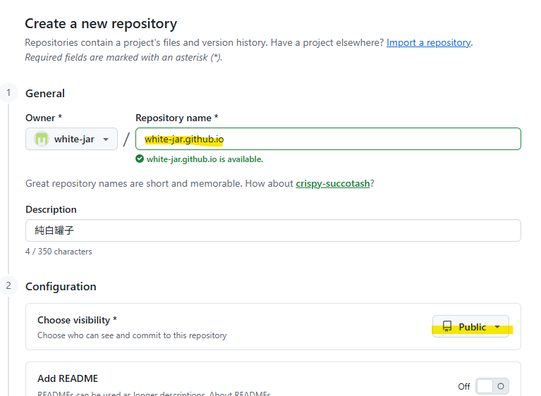 

## 3. Settings/Pages
建立好 Repository 後, 點擊畫面右側上方的 `Settings`, 進入設定  
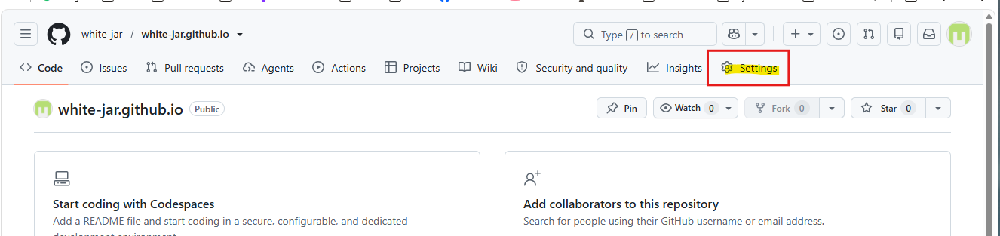  

進入 Settings 後接著點擊畫面左側的 `Pages`  
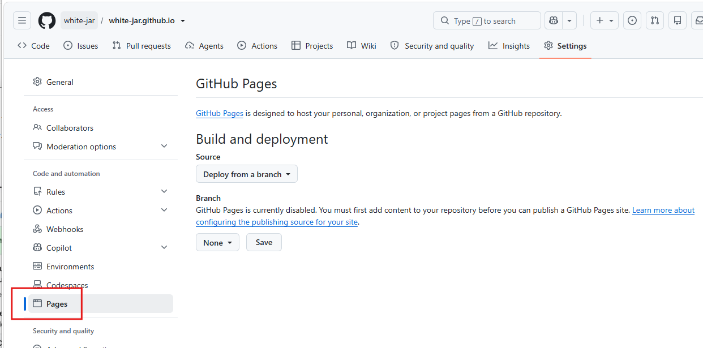

這時看到頁面上的 **Build and deployment** 這裏寫著 Source, 下方的下拉 bar 目前預設在 `Deploy from a branch`, 下拉可以看到另一個是 `GitHub Actions`。  

選擇 `GitHub Actions` 後畫面會變化, 再切換回 `Deploy from a branch` 也不是原來的畫面了, 但不管那一個畫面, 可以看到畫面上方描述我們這個 blog 的網址, 在右方還有一個 `Visit site` 的按鍵, 按下後就可以瀏覽頁面  

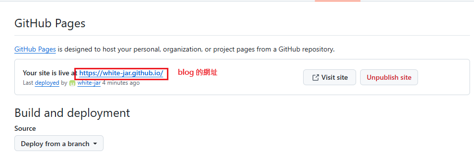

點擊 `Visit site` 按鍵, 沒什麼意外的話, 就會開啟畫面
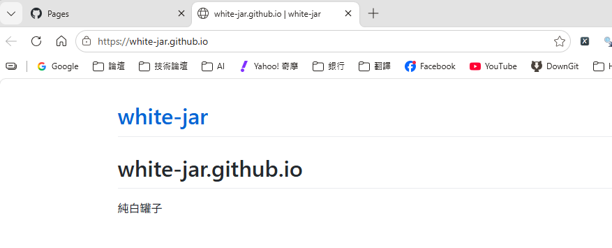

### 3.1 Build and deployment 的選項
**Deploy from a branch：**
這是 GitHub Pages 最早期﹑也是簡單的部署方式, 概念是
> GitHub 不幫你建置(Build)，只幫你把某個 Branch(分支) 的內容當成網站。
例如：
```
Repository
│
├── main (分支)
│   ├── index.html
│   ├── css
│   └── images
│
└── gh-pages (分支)
    ├── index.html
    ├── assets
    └── favicon.ico
```
這時如原本的預設
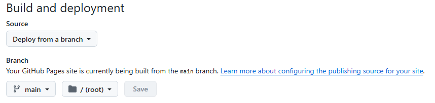
那麼 GitHub 就會直接把 `main/` 分支內容當成是網站發佈出去, 完全沒有 build 過程。  

如果熟悉前端框架(例如 Vue/React), 想使用前端框架來撰寫, 完全沒問題, 但這類需要先在本機 npm run build 得到 dist/, 再把 `dist/` 內容放進 `main` 分支, GitHub 只是拿 `main` 分支發佈。

優點：簡單﹑沒有 workflow﹑沒有 Actions﹑不用寫 yaml  
缺點：所有 build 要自己做, 須要自己完成  

**GitHub Actions：**
目前 GitHub 官方最推薦的方法, 概念是
> GitHub 幫你 build 再部署

流程：
```
git push → GitHub Actions → npm install → npm run build → 產生 dist → deploy 到 Pages
# push 之後都是在 GitHub Server 完成
```

**Deploy from a branch：** 和 **GitHub Actions** 比較  
| 項目                         | Deploy from a branch | GitHub Actions |
| -------------------------- | -------------------- | -------------- |
| 自動 Build                   | ❌                    | ✅              |
| 支援 npm install             | ❌                    | ✅              |
| 支援 npm run build           | ❌                    | ✅              |
| 支援 Hugo/MkDocs/Jekyll/Vite | 必須自己 Build           | 自動 Build       |
| 是否需要 Workflow              | ❌                    | ✅              |
| 是否需要 gh-pages Branch       | 通常需要（也可直接使用 `main`）  | 不需要            |
| GitHub 官方目前推薦              | 舊方式，仍支援              | ✅ 推薦           |

---
基本上到這裏, 使用 github 建立 blog 的基本設定已完成(前面點擊過 `Visit site` 已能看到網頁), 但 blog 當然不能這麼單調, 要有主題, 要有風格, 在目前 github pages 官方提供了 Jekyll, 但接下來我打算使用的是 [Astro](https://docs.astro.build/zh-tw/getting-started/)。

## 4. Astro 如何部署
Astro 提供了許多網站佈署方式, 當然在官方網站也提供了 [GitHub Pages 部署方式](https://docs.astro.build/zh-cn/guides/deploy/github/), 這裏就把步驟做一個整理

### 步驟一：切換 GitHub Actions
在 GitHub Pages 頁面 Build and deployment 的 Source 選擇 **GitHub Actions**

### 步驟二：建立 workflow
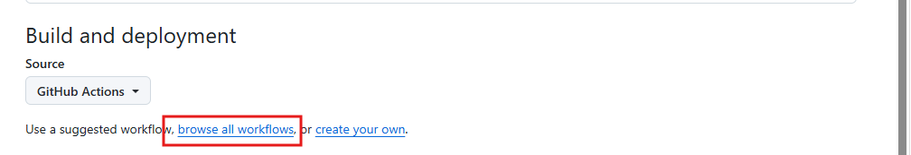
在還沒建立 workflow 前, 畫面這個位置 `browse all workflows` 的連結點擊後會開啟一頁 `Choose a workflow` (ps.這個連結在建立 workflow 之後不會出現在這裏, 但這個頁面其實是在上方 `Actions` 點擊 `New workflow` 是相同的)
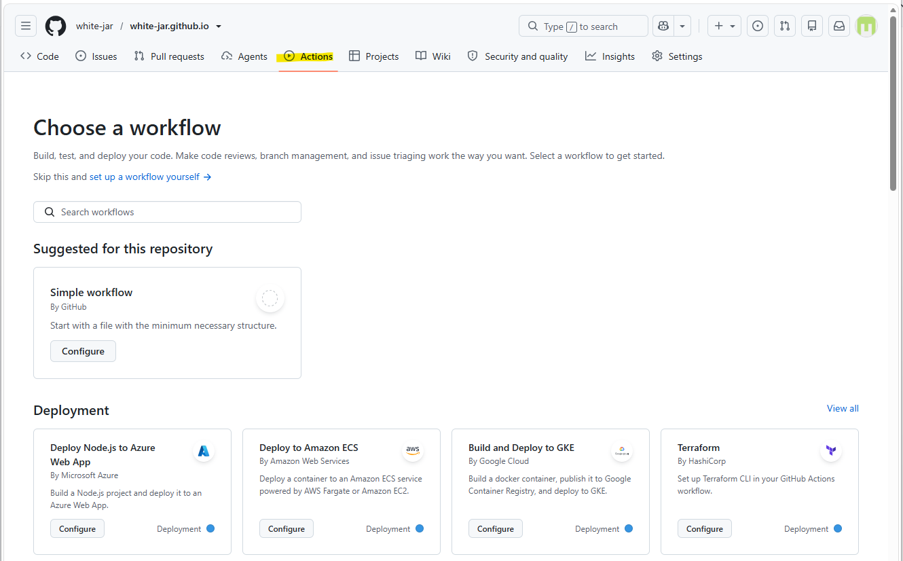

可以在這裏輸入 `astro` 找到官方提供 Astor workflow
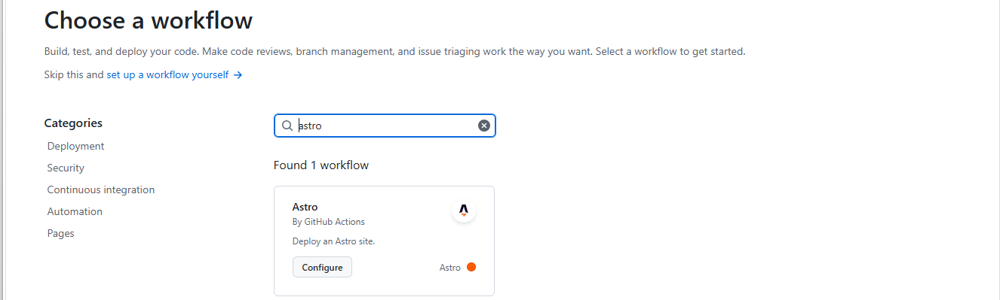
點擊 `configure` 會自動在 .github 之下產生 `workflow` 目錄及 `astro.yml`, 我們先不改任何東西, 先直接 `commit changes`
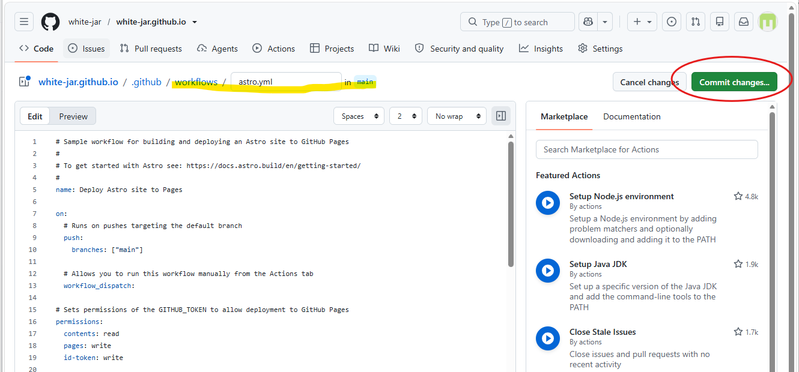

### 步驟三：搭建 Astro blog
不知道 Astro 如何使用可以先參考 [Astro 官網提供的教學](https://docs.astro.build/zh-cn/tutorial/0-introduction/), 跟著教程 step by step 一次, 很快就能上手。

在本機開啟 powershell 或命例列模式(我個人喜歡用 Cmder), 切換到想要建立這個 blog 的目錄位置, 以 `npm create astro` 指令安裝創建一個新的 Astro 項目。 注意, 執行後會詢問專案名稱並<span style="background-color:yellow">建立專案資料夾</span>, 因此<span style="background-color:yellow">不能先將 GitHub 的 Repository 同步下來</span>, 為了後續要和 GitHub repository 名稱一致, 我會命名為相同的名稱

```
md white-jar.github.io
cd white-jar.github.io

# 在專案目錄執行
npm create astro@latest
```
一開始詢問專案名稱, 這裏填上專案名稱, 會建立一個以此<專案名稱>的資料夾
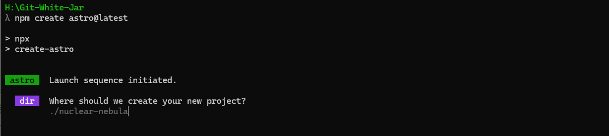

接著詢問這個專案的用途, 會先給一個 template(有興趣的人可以每一個試試看)  
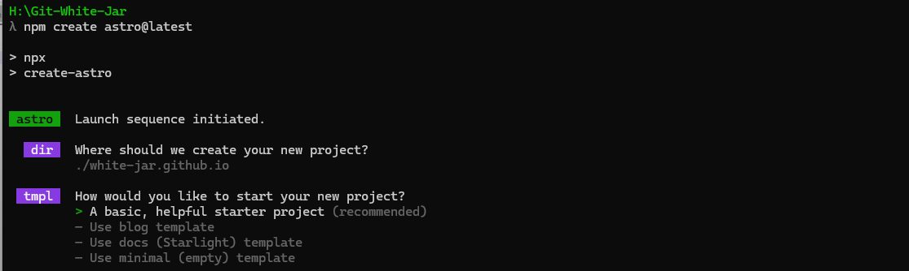

然後詢問要不要安裝依賴項目, 當然是回答 `Yes` 安裝, 免得日後手動安裝的麻煩
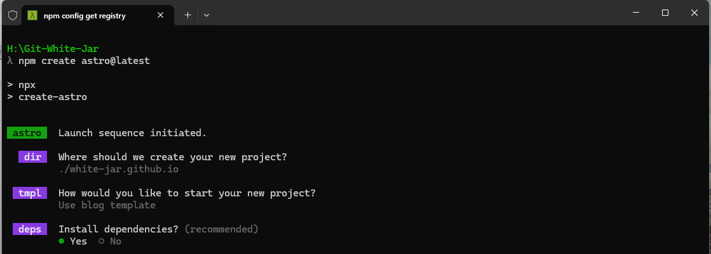

下一步詢問要不要初始化 git repository, 這裏回答**Yes**
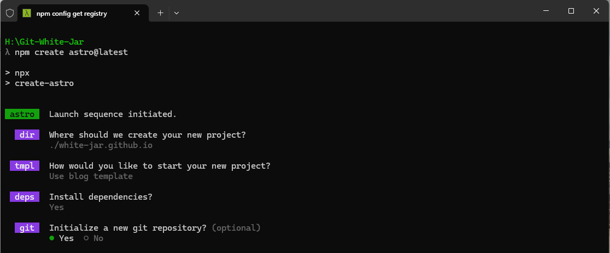

接下來開始進行安裝, 稍微等待一下
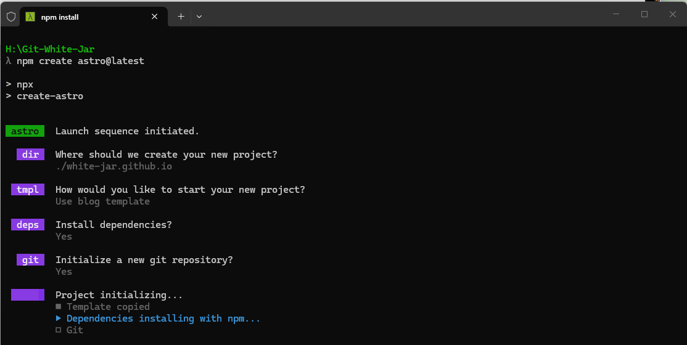

安裝完畢後可以進入專案目錄, 然後執行 npm run dev , 看到以下的畫面代表執行成功
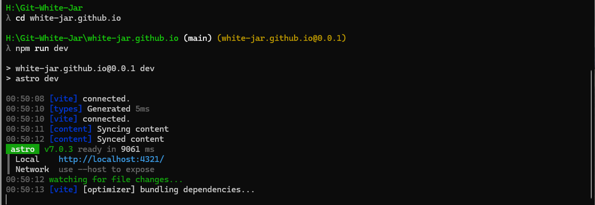

開瀏覽器執行 http://localhost:4321/ 試試, 應該能看到以下的畫面, 表示 astro 安裝成功(這個畫面是前面詢問專案用途時, 選擇了`Use blog template`, 介面上就有基本的 blog 的樣式)
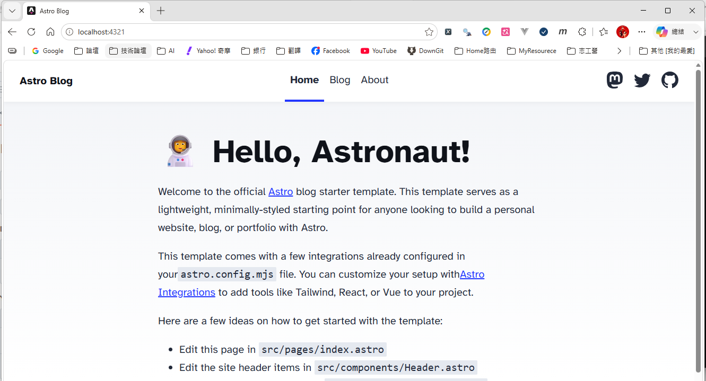
現在可以 Ctrl+c 結束 npm run dev 執行

### 步驟四：跟 GitHub Repository 連結, 並上傳
在本機首先確認在專案目錄之下, 在前面 create astro 過程中有一個選項詢問是否要初始化 git repository (Initialize a new respository?) 
- 如果回答的是 **N** , 那麼現在要先執行 **git init**
- 如果回答的是**Y**, 則跳過 git init 這個指令, 直接從 `git remote add origin <repo 網址>` 指令執行
```bash
git init
# 網址要改為自己的 GitHub 的網址
git remote add origin https://github.com/<GitHub帳號>/<GitHub帳號>.github.io.git
# 把遠端的資訊抓下來
git fetch origin
# 遠端GitHub repository 拉回本地端, 強制合併兩個不同的 history
# 如果只有 git pull, 會因為遠端與本機兩邊的歷史完全不相關(unrelated histories)而拒絕合併, 需要加上 `--allow-unrelated-histories` 強制合併
git config pull.rebase false
git pull origin main --allow-unrelated-histories
# 解決衝突
# 由於在建立遠端 GitHub repository 已建立了 README.md, 而本地端的 create astro 也會產生一個 README.md, 因此上一步的強制合併會導致衝突, 所以打開 README.md 檔案內容會有衝突的區段
# 將 README.md 內容改成需要的內容後, 並刪除 `<<<<`, `====`, `>>>>` 這些符號後存檔。

# 最後提交推回遠端的 GitHub
git add .
git commit -m "初始建置 Astro"
git push origin main
```
推回 GitHub 後, 打開 GitHub 檢視,確實已經推成功
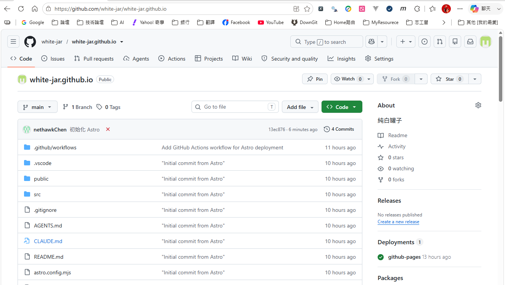

不過這時去開啟 https://white-jar.github.io/ 並不是剛剛在本地端執行 npm run dev 時看到的畫面, 也就是**現在還沒套用 astro**, 其實這時切換到 Actions 畫面是可以看到 deploy 是失敗的(因為在之前的 `Build and deployment` 已選擇了 `GitHub Actions`, 所以一旦推到 main 分支, GitHub 就會進行 workflow, 依前面產生的 yml 進行 deploy, 每一次 main 分支的推送都會執行 workflow, 成功或失敗都可以到 `Actions`看結果和訊息)
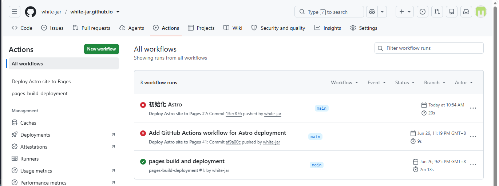

點進去還可以看到更 detail 的訊息
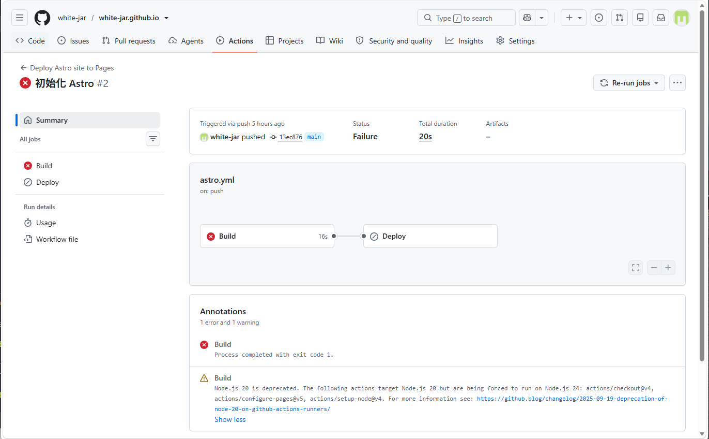
在這裏看到有一個警告

>> Node.js 20 is deprecated. The following actions target Node.js 20 but are being forced to run on Node.js 24: actions/checkout@v4, actions/configure-pages@v5, actions/setup-node@v4. For more information see: https://github.blog/changelog/2025-09-19-deprecation-of-node-20-on-github-actions-runners/

根據告警的網址資料可以知道 Node.js 20 在 2026年4月已經 EOL, GitHub 在 2026/6/16 起預設跑 Node 24, 現在文章撰寫時是 2026年 6 月 27 日, 剛好過期了。

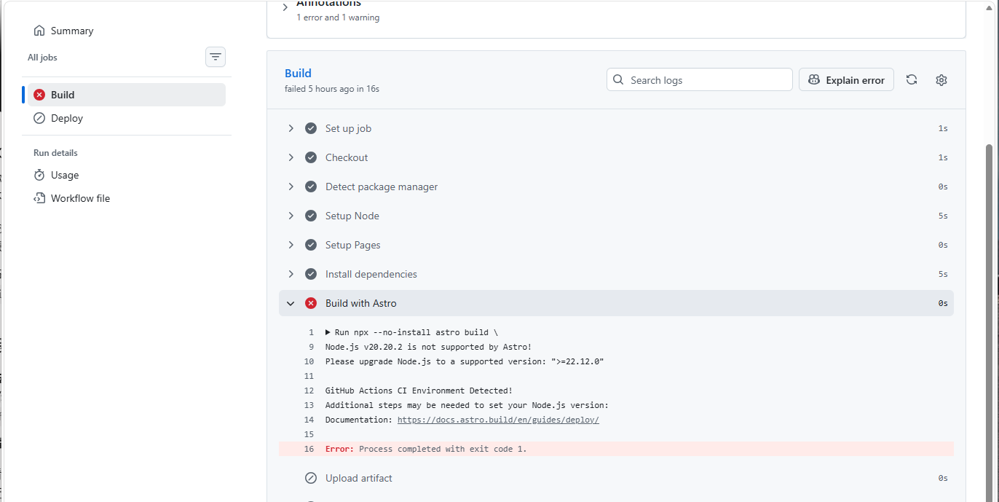
點進去看可以看到更底層的資訊, 可以看到訊息的提示, 至少要 >= 22.12.0 的版本

要解決這個錯誤, 現在需要開啟 `.github/workflows/astro.yml` 做修改
找到以下的節段
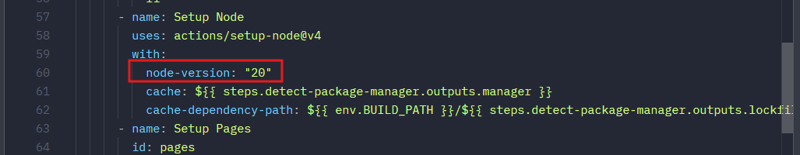
將
```
node-version: "20"
改為
node-version: "24"
```
再重新推一次到 GitHub 並且 merge 到 main 分支後, 先看 Actions 是不是還有錯誤, 這次看來不錯, 推成功了。
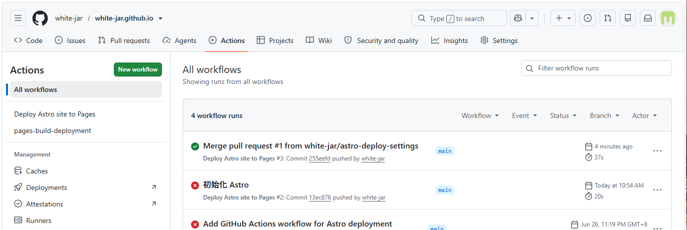


這時再去開啟 https://white-jar.github.io/ 可以看到內容正確了。

不過其實有一個重要的設定還沒修改, 打開 `astro.config.mjs`
```
# site 的內容要改為已部署站點的 GitHub URL
export default defineConfig({
    site: 'https://<username>.github.io',
})
```
為什麼需要這個設定, 可以到 [GitHub Pages 部署方式](https://docs.astro.build/zh-cn/guides/deploy/github/) 官網上看說明, 包含若設定了 `base` 之後的相關修改, 不過我沒有做 base 的設定, 也就不多說了。

## 後記
Astro 是一個靜態網頁生成器, 可以將 Markdown 轉換成靜態網頁, 除了一開始建置專案時可選擇的樣式之外, Astro 官網也有提供其它主題 [Astro 主題](https://astro.build/themes) , 在網路上也有許多人建置了其它主題供人套用, 如果不想花時間和精神可以考慮看看, 不過有些是要付費的, 不過既然自已都寫 code 那麼多年了, 加上現在 AI 的便利, 之前寫過 Vue 然後看看 Astro 官網的教學後, 用 AI 就可以根據自己的想法建了自己喜歡的主題, 現在這個頁面就是自行結合 web-design-engineer skill 及 openspce 框架 vibe coding 出來的, 有幾個區塊功能重複, 因為還還沒想好要放什麼, 就先用 tag 頂著, 畫面比較好看些。
