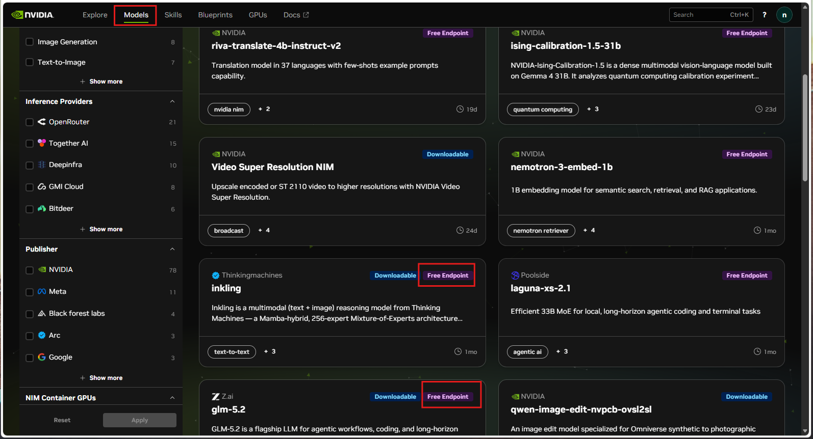
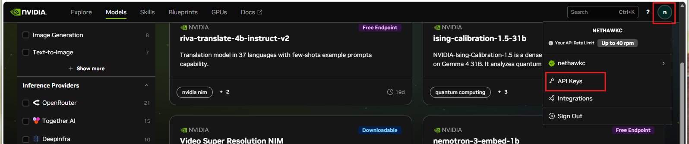
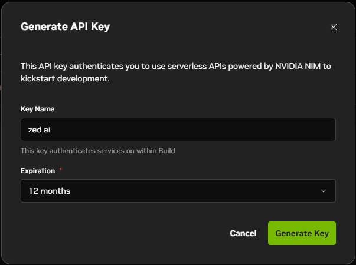
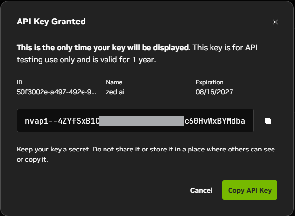
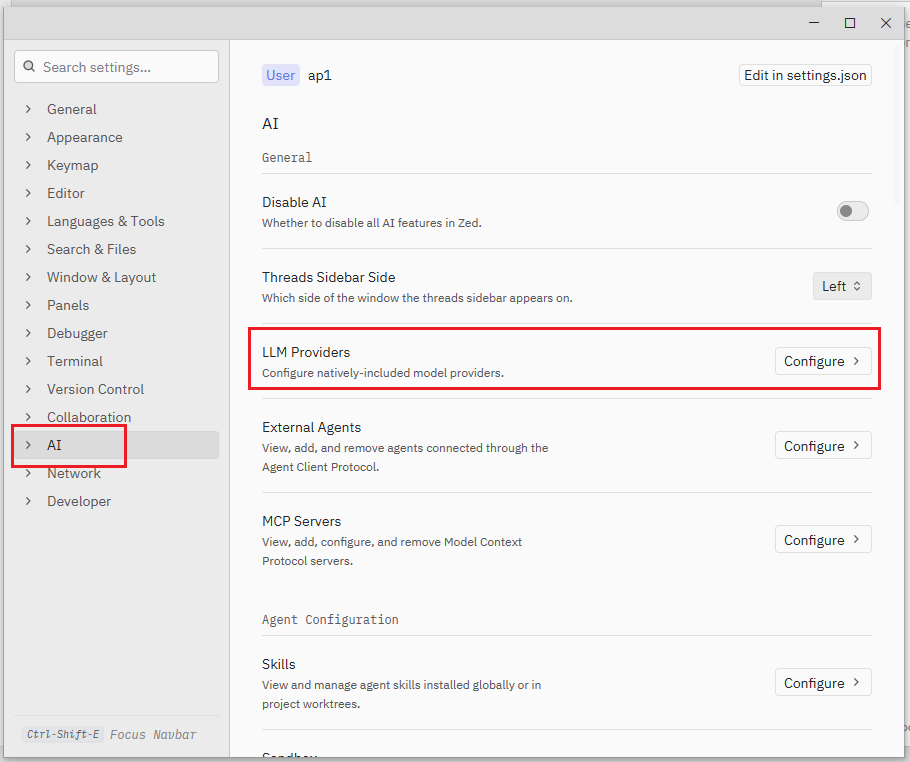
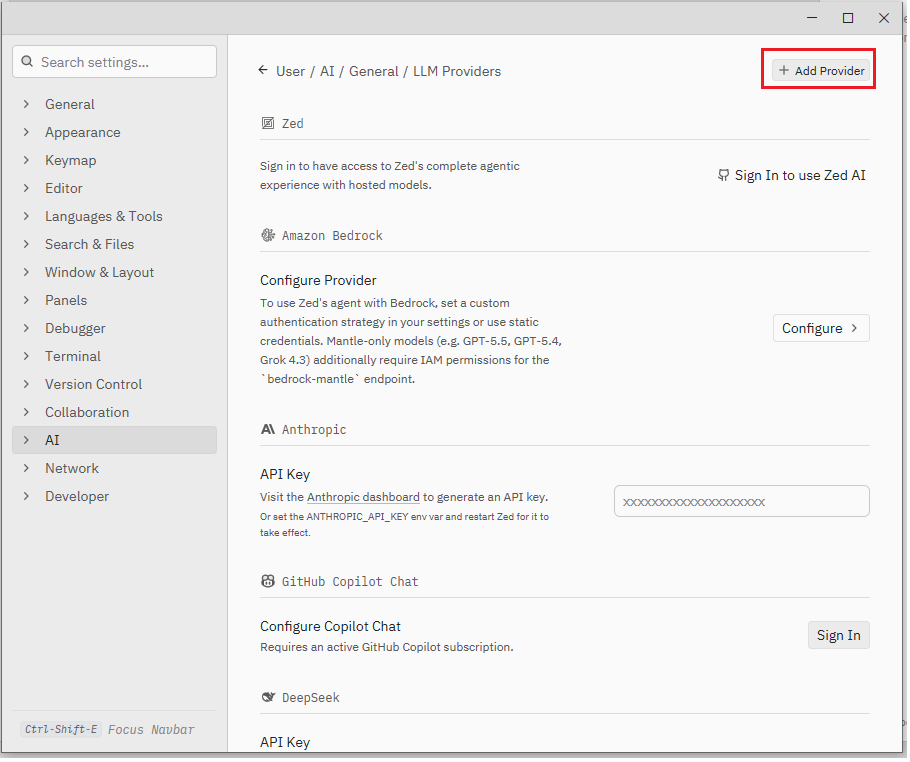
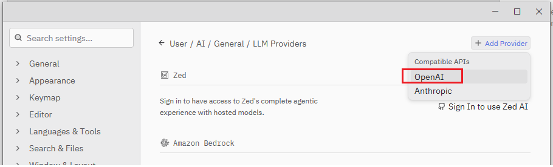
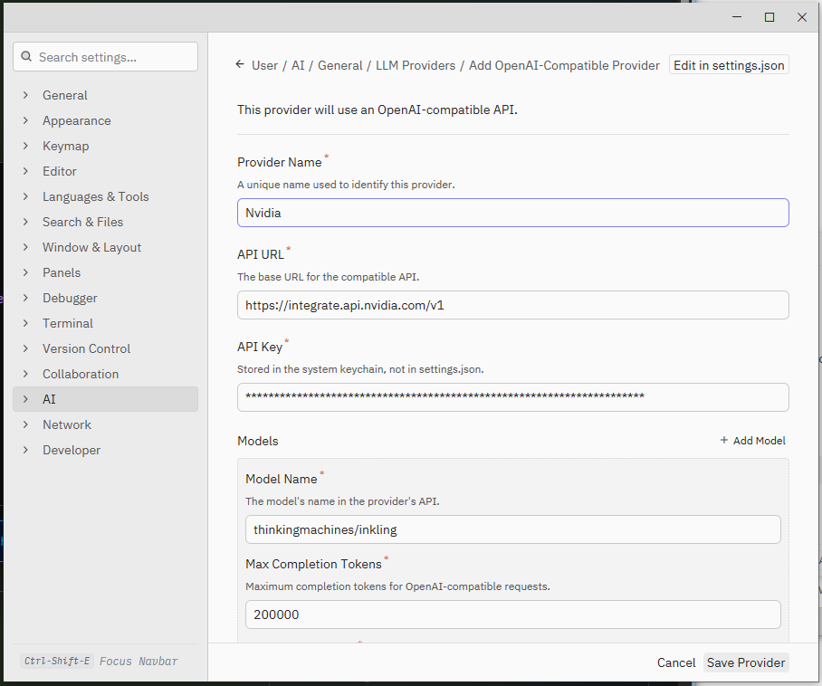
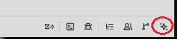
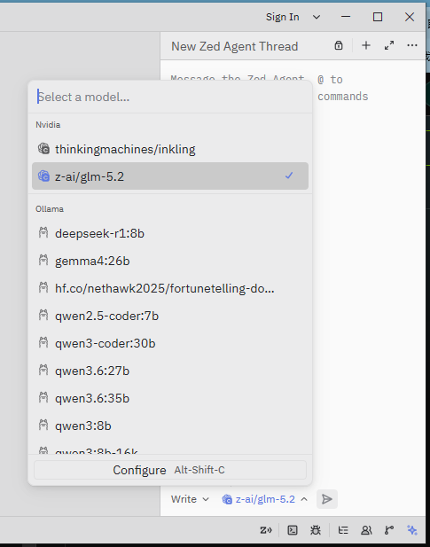

Nvidia 在官網提供一些免費的模型, 例如 Z.ai(智譜)的 GLM-5.2。[智譜 GLM-5.2](https://docs.bigmodel.cn/cn/guide/models/text/glm-5.2) 官方介紹
> 是面向長任務時代的旗艦模型。支持真正可用的 1M 上下文，實測可承載專案級工程上下文，長程任務執行更穩定、工程規範遵循更可靠，開發場景成功率進一步提升。一次任務即可完成「從需求到多端可部署產物」的完整開發鏈路。  

## 申請 Nvidia API

### 步驟 1: 申請 Nvidia API 金鑰

1. 首先要有一個 Nvidia 的帳號, 前往 [Nvidia API 網站](https://build.nvidia.com/) 註冊一個帳號, 註冊免費。
2. 可以先看一下 Nvidia 提供了哪些模型, 在官網上方的標籤點擊 `Models`, 這裏可以看到 Nvidia 提供的模型, 有一些有標 `Free Endpoint` 的是免費提供的模型, 像是 inkling﹑glm-5.2, 還有其它不同能力的模型都可以嚐試看看

3. 現在先建立金鑰, 右上角帳號的圖示, 點擊後的下拉選單中選擇 `API Keys`

4. 在 API Keys 介面點擊 `Generate API Key`, 在開啟的視窗輸入 `Key Name`(自行命名), `Expiration` API Key 的期限。 

    然後按下右下角的 `Generate Key` 的按鈕建立一個新的 API Key, 這個 Key 只有在這時候可以完整看到，所以這時要將產生的 Key 複製並保存下來，介面關閉後就看不到完整的 API Key。
    

### 步驟 2: 在 Zed 中設定 API 金鑰

1. 打開 Zed, 按下快捷鍵 `Ctrl+,` 或者從左上角點擊選單選擇 `Open Settings` 打開。

2. 點擊 settings 畫面左側 `AI`, 接著點擊右側 `LLM Providers` 的右側的 `Configure`, 這裏有各種的 AI Provider 可以選擇, 但並沒有 Nvidia

    現在點擊右上角的 `+ Add Provider`, 並選擇 `OpenAI`
    
    
    根據畫面的資訊輸入各欄位的值
    - **Provider Name:** 自訂 Provider 的名稱, 為了識別我用了 Nvidia  
    - **API URL:** `https://integrate.api.nvidia.com/v1`  
    - **API Key:** 前面建立的金鑰  
    - **Models:** 這裏輸入要使用的模型, 在 Model Name 輸入要使用的模型和其它相關的資訊, 如果有多個模型, 在右側有個`+ Add Model`, 點擊後會再下方多一組輸入模型的資料。  
    確定的資料都輸入好後按下右下方的 `Save Provider` 即可。
    

## 使用方式
1. 打開 `Agent Panel`
使用快捷鍵 `Ctrl+Shift+ /` 或者點擊 Zed 最下方的圖示(預設應該在右下方, 一個像飛鏢的圖示)

2. 在開啟的 `New Zed Agent Thread` 的最下方, 可以看到剛剛建立的 Nvidia Provider, 因為我剛建立了兩個模型, 所以這裏有二個模型(`thinkingmachines/inkling` 和 `glm-5.2`)可以選擇。

3. 實測
現在我選擇 `thinkingmachines/inkling` , 輸入簡單的 prompt `hi, 介紹一下你自己`, 可以看到畫面有了回應, 模型回應了自我介紹, 表示前面的設定已經生效。

    從 Nvidia 網頁上的介紹, 知道 `thinkingmachines/inkling` 這個模型還可以分析圖片, 所以我想試試這個解讀圖片的能力如何, 我拿了一張手機隨手拍的照片
    
    以下是測試的結果, 除了溜冰鞋識別錯誤外, 其它的識別還不錯, 顏色色調基本都沒錯, 我猜測是這種四輪溜冰鞋可能在過去的訓練資料比較少,加上拍攝角度的問題, 造成解讀上有錯誤。
    

---
總之在 Zed 編輯器上設定還蠻簡單的, 多加利用一些免費的模型可以做一些練習, 可以試試。 實測時本來要使用 glm-5.2, 但不知道是不是 Nvidia 上的 glm-5.2 有什麼問題, 很容易出現 `Nvidia API rate limit exceeded` 錯誤, 可能太熱門, 使用的人太多了, 改為 `thinkingmachines/inkling` 就沒有這樣的問題。
